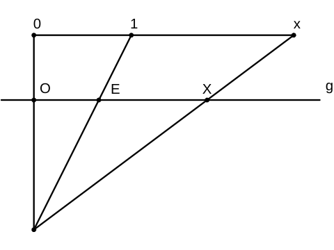

<!--
author:   Marco Hamann

email:    marco.hamann@htw-dresden.de

version:  0.0.1

language: de

script:   https://cdn.rawgit.com/davidedc/Algebrite/master/dist/algebrite.bundle-for-browser.js
@Algebrite.eval: <script> Algebrite.run(`@input`)</script>
-->

# Konstruktive Geometrie (I381)

Dieser Kurs richtet sich an Studierende der Medieninformatik im 2. Semester.

Sie können diesen Kurs auf [LiaScript](https://liascript.github.io/course/?https://github.com/marco-hamann/Geometrie/blob/main/README.md) oder [Opal](https://bildungsportal.sachsen.de/opal/auth/RepositoryEntry/19931103237) aufrufen. Das Repository zu diesem Kurs finden Sie unter

https://github.com/marco-hamann/Geometrie

## Affine Geometrie

In diesem Kapitel werden folgende Themen behandelt:

* Grundlagen zu Vektoren und Matrizen
* Teilungsverhältnis auf Strecken und affine Koordinaten
* Affine und kartesische Koordinatensysteme
* Schwerpunkt eines Massensystems
* Konvexe Hülle einer Punktmenge
* Unterteilungskurven und Bézier-Kurven

### Vektoren und Matrizen

Vektoren
========

Addition von **Vektoren** aus $\mathbb{R}^k$ $(k\in\mathbb{N})$ und Vielfachbildung von Vektoren mit einem Skalar aus $\mathbb{R}$ sind komponentenweise erklärt.

> ~~Satz.~~ Es gelten die folgenden Rechenregeln [^1]
> * Kommutativität $x+y=y+x$
> * Assoziativität $x+(y+z)=(x+y)+z$
> * Neutrales Element $o$ mit $x+o=x$
> * Inverses Element $-{x}$ mit ${x}+(-{x})={o}$
> * Distributivität $\lambda\cdot({x}+{y})=\lambda\cdot{x}+\lambda\cdot{y}$
> * Distributivität $(\lambda+\mu)\cdot{x}=\lambda\cdot{x}+\mu\cdot{x}$
> * Assoziativität für Vielfachbildung $(\lambda\cdot\mu)\cdot{x}=\lambda\cdot(\mu\cdot{x})$
> für beliebige $\{x,y,z\}\subset\mathbb{R}^k$ und $\{\lambda,\mu\}\subset\mathbb{R}$.

``` javascript
A = [[a],[b]]
B = [[c],[d]]
A + B - (B + A)
transpose(A)
```
@Algebrite.eval

Für Vektoren $v_i\in\mathbb{R}^k$ mit $i\in\{1,2,\ldots,n\}$ und Skalare $\lambda_i\in\mathbb{R}$ heißt
$$
  \sum_{i=1}^n{\left(\lambda_i\cdot v_i\right)}\in\mathbb{R}^k
$$
eine **Linearkombination** der Vektoren $v_i$. Diese ist also wieder ein Vektor. Die Vektoren $v_i$ heißen linear unabhängig, falls
$$
  \sum_{i=0}^n{\left(\lambda_i\cdot v_i\right)}=0\;\rightarrow\;(\lambda_0,\lambda_1,\ldots,\lambda_n)=(0,0,\ldots,0)
$$
andernfalls linear abhängig.

Punkte $P$ der Ebene bzw. des dreidimensionalen Raumes werden mit ihren Ortsvektoren bezüglich eines Ortsvektorraumes identifiziert.
$$ P(x,y,z) \leftrightarrow p=\begin{pmatrix} x \\ y \\ z \end{pmatrix} $$
Bezüglich der kanonischen Basis im Ortsvektorraum stellt sich $p$ dar
$$
  p=\begin{pmatrix} x \\ y \\ z \end{pmatrix} =
  x\cdot\begin{pmatrix} 1 \\ 0 \\ 0 \end{pmatrix} +
  y\cdot\begin{pmatrix} 0 \\ 1 \\ 0 \end{pmatrix} +
  z\cdot\begin{pmatrix} 0 \\ 0 \\ 1 \end{pmatrix}
$$
Die Koordinaten von $P$ sind hierin die Koeffizienten der Linearkombination der Basisvektoren.

Matrizen
========

Die Menge der reellen Matrizen gleichen Typs bilden bezüglich der erklärten Addition und Skalarvielfachbildung einen Vektorraum, genügen also den gleichen Rechengesetzen wie Vektoren (aus $\mathbb{R}^k$).

Für das Rechnen mit **quadratischen Matrizen** benötigen wir des Weiteren *inverse Matrix*, *Determinante* etc.

``` javascript
A=[[a,b],[c,d]]
inv(A)
adj(A)
det(A)
inv(A)-adj(A)/det(A)
```
@Algebrite.eval

Sicher gewusst?
===============

Sie können Ihr Wissen gern bei der Beantwortung der nachstehenden Fragen testen.

**Frage 1:** Eine reelle quadratische Matrix $A$ heißt regulär, falls gilt:

[[ ]] $\det{A}$ ist gleich Null
[[X]] $\det{A}$ ist verschieden von Null
[[X]] Die inverse Matrix $A^{-1}$ zu $A$ existiert.
[[?]] Die inverse Matrix $A^{-1}$ existiert nicht für singuläre Matrizen.
****************************************

Eine quadratische Matrix wird regulär genannt, falls $\det{A}$ nicht den Wert Null besitzt.

Die inverse Matrix $A^{-1}$ berechnet sich mittels
$$
  A^{-1}=\frac{1}{\det{A}}\cdot\mathop{\rm adj}{A}
$$
Diese existiert somit nur zu regulären Matrizen.

****************************************

**Frage 2:** Die Funktionen $f_i:\mathbb{R}\rightarrow\mathbb{R}$ mit
$$
  f_0(x)=1\,,\quad f_1(x)=x\,,\quad f_2(x)=x^2
$$
sind linear unabhängig[^2], da für alle $x$:

[(X)] die nachstehende Implikation gilt $$\sum_{i=0}^2{\left(\lambda_i\cdot f_i(x)\right)}=0\;\rightarrow\;(\lambda_0,\lambda_1,\lambda_2)=(0,0,0)$$
[( )] die Gleichung $$\sum_{i=0}^2{\left(\lambda_i\cdot f_i(x)\right)}=0$$ die Lösung $(\lambda_0,\lambda_1,\lambda_2)=(0,0,0)$ besitzt.
[[?]] Das geordnete Dreitupel $(\lambda_0,\lambda_1,\lambda_2)=(0,0,0)$ ist unabhängig von den gewählten Funktionen immer eine Lösung.
****************************************

Die Null gesetzte Linearkombination ergibt
$$
  \lambda_0+\lambda_1\cdot x+\lambda_2\cdot x^2=0
$$
und ist für alle $x$ genau dann gleich Null, wenn für alle Koeffizienten $\lambda_i=0$ gilt.

****************************************

---
[^1] Die Rechenregeln werden zur axiomatischen Festlegung eines Vektorraumes genutzt. Hier ist zusätzlich $1\cdot x=x$ zu fordern.

[^2] Die Funktionen bilden sogar die Monombasis im Vektorraum aller reellen Polynomfunktionen vom Grad $n\leq 2$.

### Affine Koordinatensysteme

Ziel ist es, die Lage eines Punktes auf einer Geraden / in der Ebene / im Raum in einem geeigneten Koordinatensystem zu beschreiben.

Koordinatensystem auf einer Geraden
===================================

Gegeben sind zwei Punkte $O$ ('Ursprung') sowie $E$ ('Einheitspunkt') auf einer Geraden $g$. Die Strecke $[O,E]$ besitzt die Länge $\overline{OE}=e>0$ ('Einheitslänge').



Für einen weiteren Punkt $X\in g$ gilt nach dem Strahlensatz
$$
  \frac{|x|}{1}=\frac{\overline{OX}}{\overline{OE}}\geq 0
$$
worin $|x|$ den Absolutbetrag des reellen Skalenwertes $x$ bezeichnet. Um eine eineindeutige Zuordnung zwischen den Werten $x$ und den Lagen des Punktes $X\in g$ bezüglich der Punkte $O\in g$ und $E\in g$ zu erhalten, wird vereinbart:

| $x>0$ | $x<0$ |
| $O$ trennt die Punkte $E$ und $X$ ~~nicht~~ | $O$ trennt die Punkte $E$ und $X$ |

Des Weiteren wird $x=0$ genau für die Lage $X=O$ vereinbart.

> ~~Definition.~~ Das Teilungsverhältnis eines Punktes $X$ auf der Geraden $AB$ ist das vorzeichenbehaftete Verhältnis
> $$
  \lambda=TV(X,B,A)=\epsilon\cdot\frac{\overline{AX}}{\overline{AB}},
  \quad\epsilon=\pm1
$$
> je nachdem $A$ die Punkte $B$ und $X$ trennt oder nicht.
>
> $\lambda$ wird affine Koordinate von $X$ bezüglich $(A,B)$, das Paar $(A,B)$ ein **affines Koordinatensystem** auf $g$ genannt.

> ~~Satz.~~ Ein affines Koordinatensystem auf einer Geraden $g$ ist durch zwei verschiedene Punkte $O\in g$ und $E\in g$ bestimmt. Jedem Punkt $X$ der Geraden wird in eineindeutiger Weise als affine Koordinate
> $$
  x=TV(X,E,O)
$$
> zugewiesen.

Koordinatensystem in einer Ebene
================================

Ein affines Koordinatensystem in einer Ebene lässt sich durch drei Punkte dieser Ebene festlegen, die ein echtes Dreieck bilden. Einer der Punkte sei mit $O$ ('Ursprung'), die beiden anderen mit $E_1$ bzw. $E_2$ ('Einheitspunkte') bezeichnet.

Die Paare $(O,E_1)$ bzw. $(O,E_2)$ bilden jeweils ein affines Koordinatensystem auf
$$
  g_i=O\vee E_i\,,\quad i\in\{1,2\}
$$
die Koordinatenachsen genannt werden. Die Strecken $[O,E_1]$ bzw. $[O,E_2]$ besitzen die Längen $\overline{OE_1}=e_1$ bzw. $\overline{OE_2}=e_2$ ('Einheitslängen').

Jeder Punkt $X$ der Ebene legt vermöge der Geraden $\bar{g}_i$ mit
$$
  \bar{g}_i\parallel g_i \;\wedge\; \bar{g}_i\ni X
$$
ein Punktepaar $(X_1,X_2)$ mit
$$
  X_1 = \bar{g}_2\cap g_1\,,\quad X_2 = \bar{g}_1\cap g_2
$$
fest.

$: Ein Punkt $X$ wird durch die Teilungsverhältnisse der beiden Koordinatenprojektionen $X_i$ zur Strecke $[O,E_i]$, $i\in\{1,2\}$, umkehrbar eindeutig beschrieben.")

Für $X\not\in g_i$, $i\in\{1,2\}$, bilden $O$ und $X$ die gegenüberliegenden Punkte eines achsenparallelen Parallelogramms mit den Seitenlängen $e_1$ und $e_2$.

> ~~Satz.~~ Ein affines Koordinatensystem in einer Ebene $\mathcal{A}^2$ ist durch ein in $\mathcal{A}^2$ liegendes echtes Dreieck mit Eckpunkten $O$, $E_1$ und $E_2$ bestimmt. Jeder Punkt $X\in\mathcal{A}^2$ ist in in umkehrbar eindeutiger Weise durch seine affinen Koordinaten
> $$
  x_1=TV(X_1,E_1,O)\,,\quad x_2=TV(X_2,E_2,O)
$$
> festgelegt.[^1]

Jeder Kantenzug des Parallelogramms von $O$ nach $X$, in dem jede Strecke parallel zu $g_i$ genau einmal vorkommt, heißt dabei ein **Koordinatenweg** von $X$ bezüglich des affinen Koordinatensystems $(O,E_1,E_2)$.

~~Bemerkung.~~ Zur Berechnung des Teilungsverhältnis von drei Punkten auf einer Geraden $g$ können zweireihige Determinanten zu den Koordinatenvektoren der Punkte verwendet werden.
$$
  TV(C,B,A)=\frac{\det{\begin{pmatrix} x_A & x_C \\ y_A & y_C  \end{pmatrix}}}{\det{\begin{pmatrix} x_A & x_B \\ y_A & y_B \end{pmatrix}}}
$$
Überlegen Sie, in welchen Fällen sich diese Formel verwenden lässt, und in welchen Fällen nicht. Warum beschreibt diese das Teilungsverhältnis?

``` javascript
A=[xa,ya]
B=[xb,yb]
C=[xc,yc]
zaehler=[[C[1],A[1]],[C[2],A[2]]]
nenner=[[B[1],A[1]],[B[2],A[2]]]
det(zaehler)/det(nenner)
```
@Algebrite.eval

Koordinatensystem im dreidimensionalen Raum
===========================================

Ein affines Koordinatensystem im dreidimensionalen Raum $\mathcal{A}^3$ lässt sich durch vier Punkte dieser Ebene festlegen, die ein echtes Tetraeder bilden. Einer der Punkte sei mit $O$ ('Ursprung'), die anderen mit $E_1$ bzw. $E_2$ bzw. $E_3$ ('Einheitspunkte') bezeichnet.

Die Paare $(O,E_1)$ bzw. $(O,E_2)$ bzw. $(O,E_3)$ bilden jeweils ein affines Koordinatensystem auf
$$
  g_i=O\vee E_i\,,\quad i\in\{1,2,3\}
$$
die Koordinatenachsen genannt werden. Die Strecken $[O,E_1]$ bzw. $[O,E_2]$ bzw. $[O,E_3]$ besitzen die Längen $\overline{OE_1}=e_1$ bzw. $\overline{OE_2}=e_2$ bzw. $\overline{OE_3}=e_3$ ('Einheitslängen').

Jeder Punkt $X$ der Ebene legt vermöge der Ebenen $\epsilon_i$ mit
$$
  \epsilon_i\parallel g_{j}\;\wedge\;\epsilon_i\parallel g_{k}\;\wedge\;\epsilon_i\ni X
$$
und $j\in\{1,2,3\}$, $k\in\{1,2,3\}$ sowie $i\not=j\not=k\not=i$ auf ein Punktetripel $(X_1,X_2,X_3)$ mit
$$
  X_i = \epsilon_i\cap g_i\,,\quad i\in\{1,2,3\}
$$
fest.
Für $X\not\in g_i$, $i\in\{1,2,3\}$, bilden $O$ und $X$ die gegenüberliegenden Punkte eines achsenparallelen [Parallelepipeds](https://de.wikipedia.org/wiki/Parallelepiped "Wikipedia") mit den Kantenlängen $e_1$, $e_2$ und $e_3$.

> ~~Satz.~~ Ein affines Koordinatensystem im dreidimensionalen Raum $\mathcal{A}^3$ ist durch ein in $\mathcal{A}^3$ liegendes echtes Tetraeder mit Eckpunkten $O$, $E_1$, $E_2$ und $E_2$ bestimmt. Jeder Punkt $X\in\mathcal{A}^3$ ist in in umkehrbar eindeutiger Weise durch seine affinen Koordinaten
> $$
  x_1=TV(X_1,E_1,O)\,,\quad x_2=TV(X_2,E_2,O)\,,\quad x_3=TV(X_3,E_3,O)
$$
> festgelegt.[^1]

Jeder Kantenzug des Parallelepipeds von $O$ nach $X$, in dem jede Strecke parallel zu $g_i$ genau einmal vorkommt, heißt dabei ein **Koordinatenweg** von $X$ bezüglich des affinen Koordinatensystems $(O,E_1,E_2,E_3)$.

> ~~Definition.~~ Ein affines Koordinatensystem heißt **kartesisch**, wenn die Koordinatenachsen paarweise orthogonal sind und die Längen der Einheitsstrecken übereinstimmen.[^2]

~~Beispiel 1.~~ Das natürliche Koordinatensystem in $\mathbb{R}^3$ mit Ursprung und den Einheitspunkten
$$
  O(0,0,0)\,,\quad E_1(1,0,0)\,,\quad E_2(0,1,0)\,,\quad E_3(0,0,1)
$$
ist kartesisch, da die Einheitslängen gleich sind
$$
  \overline{OE_j}=(e_j)^2=1\quad\leftrightarrow\quad \overrightarrow{OE_j}\cdot\overrightarrow{OE_j}=1
$$
für beliebige $j\in\{1,2,3\}$ und die Koordinatenachsen paarweise orthogonal sind
$$
  OE_j\perp OE_k\quad\leftrightarrow\quad \overrightarrow{OE_j}\cdot\overrightarrow{OE_k}=0
$$
für beliebige $(j,k)\in\{1,2,3\}^2$ mit $j\not=k$.

~~Beispiel 2.~~ Der Abstand zweier Punkte $X$ und $Y$ in der Ebene $\mathcal{A}^2$ berechnet sich bezüglich eines affinen Koordinatensystems $(O,E_1,E_2)$ mithilfe des Kosinus\-satzes in einem allgemeinen Dreieck
$$
  \overline{XY}^2=
  (y_1-x_1)^2\cdot (e_1)^2+(y_2-x_2)^2\cdot (e_2)^2 \\
  -2\cdot(y_1-x_1)\cdot(y_2-x_2)\cdot|\overrightarrow{OE_1}\cdot\overrightarrow{OE_2}|
$$
Ist das Koordinatensystem speziell kartesisch, so ergibt sich hieraus der Abstand mittels
$$
  \overline{XY}=\sqrt{(y_1-x_1)^2+(y_2-x_2)^2}
$$

Sicher gewusst?
===============

**Frage 1:** Nachstehend sind drei grundsätzlich zu unterscheidende Lagen von $X$ bezüglich des Paares $(O,E)$ angegeben. Ordnen Sie die Abbildungen den Größenangaben für
$$
  x=TV(X,E,O)
$$
zu.

<!-- style="display: block; margin-left: auto; margin-right: auto; max-width: 415px;" -->
``````````````````````````````````````````````````
O     E                     O     E     O     E
*-----*-------*     *-------*-----*     *-----*
              X     X                   X
      (a)                 (b)             (c)
``````````````````````````````````````````````````

[[(a)] [(b)] [(c)]]
[( ) ( ) (X)]  $x=0$
[(X) ( ) ( )]  $x>0$
[( ) (X) ( )]  $x<0$


**Frage 2:** Das Teilungsverhältnis des Punktes $X$ bezüglich $(A,B)$ mit $$ A(1,0)\,,\quad B(3,0)\,,\quad X(-5,0)$$ berechnet sich

[( )] $TV(X,B,A)=-5$
[( )] $TV(X,B,A)=-\frac{1}{3}$
[(X)] $TV(X,B,A)=-3$

---
[^1] Im zu $O\in\mathcal{A}^d$, $d\in\{2,3\}$, gehörigen Ortsvektorraum bilden die zu $E_1$ bis $E_d$ gehörenden Ortsvektoren eine Basis, worin sich der Ortsvektor eines jeden Punktes $X\in\mathcal{A}^d$ mit den Koeffizienten $(x_1,\ldots,x_d)$ eindeutig darstellen lässt.

[^2] Diesen Einheitsstrecken wird die Länge $1$ zugewiesen.

### Anwendungen

Teilungspunkt einer Strecke
===========================

Zu einem gegebenem Teilungsverhältnis soll der Teilungspunkt einer Strecke unter Benutzung der Ortsvektoren der Punkte dargestellt werden.

Gegeben ist eine Verbindungsgerade $g=AB$ zweier Punkte $A$ und $B$ und ein weiterer Punkt $C\in g$. Für das Teilungsverhältnis von $C$ bezüglich $[A,B]$ gelte
$$
  \lambda=TV(C,B,A)=\epsilon\cdot\frac{\overline{AC}}{\overline{AB}}\quad\leftrightarrow\quad \overrightarrow{AC}=\lambda\cdot\overrightarrow{AB}
$$
Unter Benutzung der Ortsvektoren $a=\overrightarrow{OA}$, $b=\overrightarrow{OB}$ und $c=\overrightarrow{OC}$ stellt sich $c$ dar
$$
  c-a=\lambda\cdot(b-a)\quad\leftrightarrow\quad c=(1-\lambda)\cdot a+\lambda\cdot b
$$

Werden die Argumente in $TV(\,.\,)$ permutiert, so ändert sich im Allgemeinen der Wert des Teilungsverhältnisses.

> ~~Satz 1.~~ Für das Teilungsverhältnis eines Punktes $C\in g$ auf der Verbindungsgeraden $g=AB$ zweier verschiedener Punkte $A$ und $B$ gelte
> $$
  \lambda=TV(C,B,A) \in\mathbb{R}
$$
> Durch Permutation der Argumente nimmt das Teilungsverhältnis - soweit erklärt - einen der Werte
> $$ \lambda\,,\quad 1-\lambda\,,\quad \frac{1}{\lambda}\,,\quad \frac{1}{1-\lambda}\,,\quad 1-\frac{1}{\lambda}\,,\quad \frac{\lambda}{\lambda-1}
$$
> an. Insbesondere gelten:
>
> 1. Für  $C\not=A$ gilt: $\;TV({\color{blue}B},{\color{red}C},A)=TV({\color{red}C},{\color{blue}B},A)^{-1}=\frac{1}{\lambda}$
> 2. Es gilt: $\;TV(C,{\color{blue}A},{\color{red}B})=1-TV(C,{\color{red}B},{\color{blue}A})=1-\lambda$

~~Beweis.~~ Zum Beweis der beiden letzten Aussagen kann ein Koeffizientenvergleich zwischen den Linearkombinationen von linker und rechter Seite angestrebt werden.

Für $\lambda\not=0$ ergibt sich schrittweise aus $\lambda=TV(C,B,A)$
$$
  c=(1-\lambda)\cdot a+\lambda\cdot b\quad\leftrightarrow\quad b=\frac{\lambda-1}{\lambda}\cdot a+\frac{1}{\lambda}\cdot c
$$
Andererseits gilt:
$$
  \mu=TV(B,C,A)\quad\leftrightarrow\quad b=(1-\mu)\cdot a+\mu\cdot c
$$
Aus dem Koeffizientenvergleich der rechten Seiten ergibt sich unmittelbar $\mu=\frac{1}{\lambda}$.

Des Weiteren gilt offensichtlich
$$
  \nu=TV(C,A,B)\quad\leftrightarrow\quad
  c=\nu\cdot a+(1-\nu)\cdot b\quad\leftrightarrow\quad
  \lambda=1-\nu
$$

Die beiden Permutationen
$$
  p=\begin{pmatrix} {\color{red}C} & {\color{blue}B} & A \\ {\color{blue}B} & {\color{red}C} & A \end{pmatrix}\,,\quad
  q=\begin{pmatrix} C & {\color{red}B} & {\color{blue}A} \\ C & {\color{blue}A} & {\color{red}B} \end{pmatrix}
$$
stellen eine Transposition (Tauschung) der ersten bzw. letzten beiden Elemente dar. Mit Hilfe der Hintereinanderausführung dieser lassen sich alle Permutationen von $(A,B,C)$ darstellen, woraus sich die genannten Werte des Teilungsverhältnisses ergeben.
$$
  \lambda\;\stackrel{p}{\longleftrightarrow}\;
  \frac{1}{\lambda}\;\stackrel{q}{\longleftrightarrow}\;
  1-\frac{1}{\lambda}\;\stackrel{p}{\longleftrightarrow}\;
  \frac{\lambda}{\lambda-1}\;\stackrel{q}{\longleftrightarrow}\;
  \frac{1}{1-\lambda}\;\stackrel{p}{\longleftrightarrow}\;
  1-\lambda\;\stackrel{q}{\longleftrightarrow}\;\lambda
$$

$\square$

~~Beispiel 1.~~ Für den Mittelpunkt $M$ einer Strecke $[A,B]$ ergeben sich einsichtig die Teilungsverhältnisse

| $(\,.\,,\,.\,,\,.\,)$   | $TV(\,.\,)$   |
| :--------- | :--------- |
| $(M,B,A)$ | $\frac{1}{2}$ |
| $(B,M,A)$ | $2$           |
| $(B,A,M)$ | $-1$          |
| $(A,B,M)$ | $-1$          |
| $(A,M,B)$ | $2$           |
| $(M,A,B)$ | $\frac{1}{2}$ |

Interessant scheint, dass in diesem Beispiel von den sechs verschiedenen Teilungsverhältnis-Werten lediglich drei voneinander verschieden sind.

Für den Teilungspunkt $T$ einer Strecke $[P,Q]$ mit gegebenem Teilungsverhältnis $TV(P,Q,T)=\lambda$ ergibt sich unter Verwendung der Ortsvektoren
$$
  t=\frac{1}{1-\lambda}\cdot p-\frac{\lambda}{1-\lambda}\cdot q
$$
Teilt $T$ die Strecke $[P,Q]$ innen im Verhältnis $\alpha:\beta$, so ergeben sich $\lambda=-\frac{\alpha}{\beta}$ und somit die Koeffizienten
$$
  \frac{1}{1-\lambda}=\frac{\beta}{\alpha+\beta}\,,\quad
  -\frac{\lambda}{1-\lambda}=\frac{\alpha}{\alpha+\beta}
$$
Der innere Teilungspunkt $T$ auf $[P,Q]$ stellt sich somit dar
$$
  t=\frac{1}{\alpha+\beta}\cdot\left(\beta\cdot p+\alpha\cdot q\right)
$$
$T$ lässt sich physikalisch als **Schwerpunkt** des Massesystems $\{P,Q\}$ deuten, wenn
* $P$ das Gewicht $\beta$
* $Q$ das Gewicht $\alpha$
* und somit dem Massesystem $\{P,Q\}$ das Gesamtgewicht $\alpha+\beta$
zugewiesen wird.

Massenschwerpunkt
=================

> ~~Satz 2.~~ Zu einem gegebenen System von Punkten $P$ mit den Ortsvektoren $p_i$ und den Gewichten $\gamma_i>0$ ergibt
> $$
  s=\frac{1}{\sum_{i=1}^n{\gamma_i}}\cdot\sum_{j=1}^n{\left(\gamma_j\cdot p_j\right)}
$$
> den Massenschwerpunkt $S$ dieses Systems, worin $n\in\mathbb{N}$.

~~Beweis.~~ Die Schwerpunktformel kann unter Benutzung des Verfahrens der vollständigen Induktion bewiesen werden.

1.*Induktionsanfang*. Die Formel ist für $n=1$ offensichtlich wahr, ebenso für $n=2 nach dem voranstehenden Abschnitt.
2.*Induktionsschluss*. Die Schwerpunktformel gelte für $n=k$. Dann folgt für $n=k+1$
$$
  s_{k+1}=\frac{1}{{\color{red}\gamma_{k+1}+}\sum_{i=1}^k{\gamma_i}}\cdot
  \left({\color{red}\gamma_{k+1}\cdot p_{k+1}+}\sum_{j=1}^k{\left(\gamma_j\cdot p_j\right)}\right)=
  \frac{1}{\sum_{i=1}^{k+1}{\gamma_i}}\cdot\sum_{j=1}^{k+1}{\left(\gamma_j\cdot p_j\right)}
$$
$\square$

~~Beispiel 1.~~ Zur Berechnung des Schwerpunktes dreier Massenpunkte
$$
  X(x,y)\,,\;\gamma_X>0\quad\longleftrightarrow\quad(x,y,\gamma_X)
$$
stellt sich die Formel wie folgt dar. Beachten Sie, dass im dargestellten Minimalcode keine Spezifikation der Variablen der Gewichte $\gamma$ vorgenommen

``` javascript
A=[xA,yA,gammaA]
B=[xB,yB,gammaB]
C=[xC,yC,gammaC]
m=A[3]+B[3]+C[3]
1/m*(A[1]*A[3]+B[1]*B[3]+C[1]*C[3])
1/m*(A[2]*A[3]+B[2]*B[3]+C[2]*C[3])
```
@Algebrite.eval
