<!--
author:   Marco Hamann

email:    marco.hamann@htw-dresden.de

version:  0.0.1

language: de

comment:  Dieser Kurs richtet sich an Studierende der Hochschule für Technik und Wirtschaft Dresden im Studiengang Bachelor Medieninformatik im 2. Semester.

import: https://raw.githubusercontent.com/LiaTemplates/tiny-turtle/master/README.md

import: https://raw.githubusercontent.com/liaTemplates/algebrite/master/README.md

import: https://raw.githubusercontent.com/LiaTemplates/PyScript/0.0.4/README.md

persistent: true

-->

# Geometrie (I383)

 Dieser Kurs richtet sich an Studierende der Hochschule für Technik und Wirtschaft Dresden im Studiengang Bachelor Medieninformatik im 2. Semester.

Sie können diesen Kurs auf [LiaScript](https://liascript.github.io/course/?https://github.com/marco-hamann/Geometrie/blob/main/README.md) oder [Opal](https://bildungsportal.sachsen.de/opal/auth/RepositoryEntry/19931103237) aufrufen. Das Repository zu diesem Kurs finden Sie unter

https://github.com/marco-hamann/Geometrie


## Algebraische Strukturen


Überblick
-----


In diesem Kapitel sollen einige algebraische Strukturen eingeführt und im Kontext geometrischer Fragestellungen betrachtet werden. Dazu zählen u. a.

* Vektoren und Matrizen
* Gruppen und Halbgruppen
* Ringe und Körper
* Komplexe Zahlen und ebene Geometrie
* Hamiltonsche Quaternionen und räumliche Geometrie

Für einen Überblick über die Themen dieses Kapitels sehen Sie in der nachstehenden Graphik einige zentrale Begriffe. Schlagen Sie diese in diesem Abschnitt nach.

..

Lernziele
-----


* ..


### Operationen auf Mengen


Das grundlegende Merkmal einer algebraischen Struktur einer Menge $M$ ist die Existenz einer Abbildung, die zwei Elementen aus $M$ eindeutig ein Element aus $M$ zuordnet. Beispiele sind Addition reeller Zahlen oder die Bildung des größten gemeinsamen Teilers zweier natürlicher Zahlen.

>**Definition 1.** Eine Abbildung $M\times M\to M$ mit $(a,b)\mapsto c$ nennt man eine [zweistellige Operation](https://de.wikipedia.org/wiki/Zweistellige_Verkn%C3%BCpfung) auf $M$. Die Argumente $(a,b)$ dieser Operation heißen Operanten. Analog lassen sich $k$-stellige Operationen definieren vermöge $$
  \underbrace{M\times M\times ... \times M}_{k-{\text{mal}}}\to M\quad\text{mit}\quad (a_1,a_2,...,a_k)\mapsto b
$$ Ist speziell $k=1$, so heißt die Operation **einstellig**.

**Beispiel 1.** Addition und Multiplikation natürlicher, ganzer bzw. reeller Zahlen ergeben eindeutig bestimmte Zahlen aus dem jeweiligen Zahlbereich. Sie bilden Operationen. Dagegen stellt die Subtraktion natürlicher Zahlen auf $\mathbb{N}$ keine Operation dar, jedoch auf dem Bereich $\mathbb{Z}$. 

**Beispiel 2.** Die Hintereinanderausführung von bijektiven Abbildungen $f:M\to M$ einer Menge $M$ auf sich $$
  g\circ f:M\to M\quad\text{mit}\quad m\mapsto n=g(f(m))
$$ bildet eine zweistellige Operation auf der Menge dieser Abbildungen. Ist speziell $M=\{1,2,3\}$, so beschreiben $$
  f=\begin{pmatrix} 1 & 2 & 3 \\ 2 & 1 & 3 \end{pmatrix}\quad\text{und}\quad g=\begin{pmatrix} 1 & 2 & 3 \\ 2 & 3 & 1 \end{pmatrix}
$$ zwei Permutationen dieser Menge, dargestellt in der so genannten [Zweizeilenform](https://de.wikipedia.org/wiki/Permutation#Zweizeilenform). Während durch $f$ die Elemente $1$ und $2$ getauscht werden und $3$ auf sich abgebildet wird, bewirkt $g$ ein zyklisches Tauschen der Elemente, d. h. $1\mapsto 2$, $2\mapsto 3$ und $3\mapsto 1$. Die Komposition ergibt $$
  g\circ f= \begin{pmatrix} 1 & 2 & 3 \\ 2 & 3 & 1 \end{pmatrix}\circ \begin{pmatrix} 1 & 2 & 3 \\ 2 & 1 & 3 \end{pmatrix}=\begin{pmatrix} 1 & 2 & 3 \\ 3 & 2 & 1 \end{pmatrix} 
$$ Für das Ergebnis sind die Permutationen elementweise "von rechts nach links" anzuwenden. 

* Die $1$ wird in der ersten ("rechten") Permutation $f$ auf $2$ abgebildet und in der zweiten ("linken") Permutation $g$ dann auf die $3$, das heißt $$
  1\stackrel{f}{\mapsto} 2\stackrel{g}{\mapsto} 3\quad\text{bzw.}\quad 1\stackrel{g\circ f}{\longmapsto} 3
  $$
* Für die Zahl $2$ gilt unter der Hintereinanderausführung entsprechend $2\mapsto 1\mapsto 2$ bzw. $(g\circ f)(2)=2$. 
* Die Zahl $3$ wird abgebildet $3\mapsto 3\mapsto 1$ bzw. $(g\circ f)(3)=1$.

Bezeichnen die Elemente der Menge $M=\{1,2,3\}$ die Eckpunkte eines gleichseitigen Dreiecks, so lässt sich $f$ als Spiegelung des Dreiecks auf sich an der Seitenhalbierenden der Seite $[12]$ interpretieren, während $g$ eine Abbildung des Dreieck auf sich bei Drehung um den Mittelpunkt des Dreiecks mit Drehwinkel $|\varphi|=\frac{2}{3}\pi$ beschreibt. Die Hintereinanderausführung $g\circ f$ ist wieder eine Geradenspiegelung des Dreiecks auf sich an der Seitenhalbierenden der Seite $[13]$.

**Bemerkung 1.** Für spezielle Operationen wie Addition ($+$), Multiplikation ($\cdot$) oder die Hintereinanderausführung von Abbildungen ($\circ$) werden die jeweils üblichen Operationszeichen verwendet. Für allgemeine Aussagen über Operationen wird hingegen das Symbol $\ast$ verwendet. 


Eigenschaften von Operationen
===


Eine algebraische Struktur $A$ besteht hier aus einer Menge $M$ und einer zweistelligen Operation $\ast:M\times M\to M$. Für die Operation $\ast$ werden die nachstehenden Begriffsbildungen betrachtet.

>**Definition 2.** Gilt für alle Elemente $a\in M$, $b\in M$ und $c\in M$ die Gleichheit $$
  a\ast (b\ast c)= (a\ast b)\ast c
$$ dann heißt die algebraische Struktur $A=(M,\ast)$ [assoziativ](https://de.wikipedia.org/wiki/Assoziative_Algebra).

>**Definition 3.** Gilt für alle Elemente $a\in M$ und $b\in M$ die Gleichheit $$
  a\ast b= b\ast a
$$ dann heißt die algebraische Struktur $A=(M,\ast)$ [kommutativ](https://de.wikipedia.org/wiki/Kommutativgesetz).


**Beispiel 3.** 

1. Die im Beispiel 2 aufgeführten Operationen 'Addition' und 'Multiplikation' ergeben assoziative und kommutative algebraische Strukturen $(\mathbb{R},+)$ und $(\mathbb{R},\cdot)$. 
2. Auf der Menge $\mathbb{R}^{n,n}$ der reellen quadratischen, $n$-reihigen Matrizen sind 'Addition' und 'Multiplikation' erklärt. Die algebraische Struktur $(\mathbb{R}^{n,n},+)$ ist assoziativ und ebenso kommutativ, jedoch ist $(\mathbb{R}^{n,n},\cdot)$ zwar assoziativ, jedoch nicht kommutativ.

**Bemerkung 2.** Gilt in einer algeraischen Struktur $A=(M,\ast)$ das Assoziativgesetz, so lässt sich der Ausdruck $$
  a_1\ast a_2\ast ...\ast a_n\ast \in M
$$ schrittweise berechnen, ohne dass die Reihenfolge der Auswertung angegeben werden muss. Entsprechend kann $$
  a^n=\underbrace{a\ast a\ast ...\ast a}_{n\text{-mal}}
$$ für $n\in\mathbb{N}$ mit $n\geq 2$ verwendet werden.

>**Definition 4.** Gilt für ein Element $e\in M$ der algebraischen Struktur $A=(M,\ast)$ die Gleichheit $$
  e\ast a= a\ast e= a
$$ für alle und $a\in M$, dann heißt [neutrales Element](https://de.wikipedia.org/wiki/Neutrales_Element) von $A$.

**Beispiel 4.** Die in der nachstehenden Tabelle aufgeführten Beispiele algebraischer Strukturen besitzen jeweils ein Einselement

| Menge | Operation | neutrales Element |
| :----- | :----- | :----- |
| $\mathbb{R}$ | Addition | $e=0$ |
| $\mathbb{R}$ | Multiplikation | $e=1$ |
| $f:M\to M$ bijektiv | Komposition | identische Abbildug $e:x\mapsto x$ für alle $x\in M$ |

Der 'größte gemeinsame Teiler' zweier natürlicher Zahlen ist eine zweistellige Operation auf der Menge $\mathbb{N}^\times:=\mathbb{N}\setminus\{0\}$. Die hierdurch erzeugte, algebraische Struktur besitzt kein neutrales Element $e\in\mathbb{N}$, da unter Benutzung der Implikation $$
  \operatorname{ggT}(n,e)=n\;\;\rightarrow\;\; n|e\;(\text{sprich:}\, "n\,\text{teilt}\, e")
$$ hieraus folgte, dass die natürliche Zahl $e$ alle natürlichen Zahlen $n$ als Teiler enthielte.

>**Definition 5.** Existiert für beliebige Elemente $a\in M$ einer algebraischen Struktur $A=(M,\ast)$ ein Element $b\in M$ mit $$
  a\ast b= b\ast a = e
$$ worin $e$ das Einselement in $A$ bezeichnet, so heißt $b$ das zu $a$ [inverse Element](https://de.wikipedia.org/wiki/Inverses_Element) in $A$. Oft schreibt man hierfür $b=a^{-1}$.

**Beispiel 5.** Für die in der Tabelle aufgeführten Beispiele algebraischer Strukturen werden die inversen Elemente wie nachstehend gebildet.

| Menge | Operation | Element | inverses Element |
| :----- | :----- | :----- | :----- |
| $\mathbb{R}$ | Addition | $a$ | $a^{-1}=-a$ |
| $\mathbb{R}\setminus\{0\}$ | Multiplikation | $a$ | $a^{-1}=\frac{1}{a}$ |
| $f:M\to M$ bijektiv | Komposition | $f(x)=y$ | $f^{-1}(y)=x$ |

**Folgerung 1.** Mit der vorstehenden Definition ist auch $a$ invers zu $a^{-1}$ und es gilt $$
  \left(a^{-1}\right)^{-1}=a
$$ 

**Beispiel 6.** Für die im Beispiel 2 genannten Permutationen $$
  f=\begin{pmatrix} 1 & 2 & 3 \\ 2 & 1 & 3 \end{pmatrix}\quad\text{und}\quad g=\begin{pmatrix} 1 & 2 & 3 \\ 2 & 3 & 1 \end{pmatrix}
$$ ergeben sich die inversen Permutationen zu $$
  f^{-1}=f=\begin{pmatrix} 1 & 2 & 3 \\ 2 & 1 & 3 \end{pmatrix}\quad\text{bzw.}\quad g^{-1}=\begin{pmatrix} 1 & 2 & 3 \\ 3 & 1 & 2 \end{pmatrix}
$$ denn es gelten $$
  f\circ f= \begin{pmatrix} 1 & 2 & 3 \\ 2 & 1 & 3 \end{pmatrix}\circ \begin{pmatrix} 1 & 2 & 3 \\ 2 & 1 & 3 \end{pmatrix}=\begin{pmatrix} 1 & 2 & 3 \\ 1 & 2 & 3 \end{pmatrix} 
$$ sowie $$
  g\circ g^{-1}= \begin{pmatrix} 1 & 2 & 3 \\ 2 & 3 & 1 \end{pmatrix}\circ \begin{pmatrix} 1 & 2 & 3 \\ 3 & 1 & 2 \end{pmatrix}=\begin{pmatrix} 1 & 2 & 3 \\ 1 & 2 & 3 \end{pmatrix}
$$


Sicher gewusst
===


Testen Sie Ihr Wissen aus diesem Abschnitt bei der Beantwortung der folgenden Fragen.

**Frage 1.** Gegeben ist die algebraische Struktur $A=(F,\circ)$, die auf der Menge der bijektiven Abbildungen $f:M\to M$ der Menge $M=\{1,2,3\}$ und der Hintereinanderausführung zweier Abbildungen dieser Menge als Operation $$
  f\circ g:M\to M\quad\text{mit}\quad m\mapsto n=f(g(m))
$$ erzeugt wird. Berechnen Sie inverse Abbildung zu $f\circ g$ mit $$
  f=\begin{pmatrix} 1 & 2 & 3 \\ 1 & 3 & 2 \end{pmatrix}\quad\text{und}\quad g=\begin{pmatrix} 1 & 2 & 3 \\ 2 & 1 & 3 \end{pmatrix}
$$

[( )] $(f\circ g)^{-1}=\begin{pmatrix} 1 & 2 & 3 \\ 3 & 1 & 2 \end{pmatrix}$
[( )] $(g\circ f)^{-1}=\begin{pmatrix} 1 & 2 & 3 \\ 3 & 1 & 2 \end{pmatrix}$
[( )] $(g\circ f)^{-1}=\begin{pmatrix} 1 & 2 & 3 \\ 2 & 3 & 1 \end{pmatrix}$
[(X)] $(f\circ g)^{-1}=\begin{pmatrix} 1 & 2 & 3 \\ 2 & 3 & 1 \end{pmatrix}$
[[?]] Für die Hintereinanderausführung $f\circ g:M\to M\quad\text{mit}\quad m\mapsto n=f(g(m))$ zweier bijektiver Abbildungen gilt $(f\circ g)^{-1}=g^{-1}\circ f^{-1}$.
****************************************

Für die Hintereinanderausführung gilt $$
  (f\circ g)=\begin{pmatrix} 1 & 2 & 3 \\ 1 & 3 & 2 \end{pmatrix}\circ\begin{pmatrix} 1 & 2 & 3 \\ 2 & 1 & 3 \end{pmatrix}=\begin{pmatrix} 1 & 2 & 3 \\ 3 & 1 & 2 \end{pmatrix}
$$ Entsprechend ergibt sich die inverse Abbildung / Umkehrabbildung gemäß $$
  (f\circ g)^{-1}=\begin{pmatrix} 1 & 2 & 3 \\ 2 & 3 & 1 \end{pmatrix}
$$ beziehungsweise unter Benutzung $(f\circ g)^{-1}=g^{-1}\circ f^{-1}$ $$
  (f\circ g)^{-1}=\begin{pmatrix} 1 & 2 & 3 \\ 2 & 1 & 3 \end{pmatrix}\circ\begin{pmatrix} 1 & 2 & 3 \\ 1 & 3 & 2 \end{pmatrix}=\begin{pmatrix} 1 & 2 & 3 \\ 2 & 3 & 1 \end{pmatrix}
$$

****************************************

**Frage 2.** Bezeichnen die Elemente der Menge $M=\{1,2,3\}$ die Eckpunkte eines gleichseitigen Dreiecks, so lassen sich die Permutationen $$ 
  \sigma_{1}=\begin{pmatrix} 1 & 2 & 3 \\ 1 & 3 & 2 \end{pmatrix}\,,\quad
  \sigma_{2}=\begin{pmatrix} 1 & 2 & 3 \\ 3 & 2 & 1 \end{pmatrix}\quad\text{bzw.}\quad
  \sigma_{3}=\begin{pmatrix} 1 & 2 & 3 \\ 2 & 1 & 3 \end{pmatrix}
$$ als Spiegelungen des Dreiecks auf sich an den Seitenhalbierenden der Seite $s_1=[23]$, $s_2=[13]$ bzw. $s_3=[12]$ interpretieren. Siehe Abbildung. Bilden Sie die Hintereinanderausführung dieser Geradenspiegelungen und geben Sie deren Interpretation als Symmetrieabbildung des gleichseitigen Dreiecks an.

[[Drehung um $\bf 120^\circ$] [Drehung um $\bf 240^\circ$] [identische Abbildung]]
[( ) ( ) (X)] $\sigma_1\circ\sigma_1$
[(X) ( ) ( )] $\sigma_1\circ\sigma_2$
[( ) (X) ( )] $\sigma_1\circ\sigma_3$
[( ) (X) ( )] $\sigma_2\circ\sigma_1$
[( ) ( ) (X)] $\sigma_2\circ\sigma_2$
[(X) ( ) ( )] $\sigma_2\circ\sigma_3$
[(X) ( ) ( )] $\sigma_3\circ\sigma_1$
[( ) (X) ( )] $\sigma_3\circ\sigma_2$
[( ) ( ) (X)] $\sigma_3\circ\sigma_3$
[[?]] Für die Hintereinanderausführung zweier Geradenspiegelungen an den Geraden $s_1$, $s_2$ bzw. $s_3$ ergibt sich entweder die identische Abbildung oder eine Drehung um den gemeinsamen Punkt beider Spiegelachsen.
***

Für die neun zu betrachtenden Kompositionen der Permutationen ergeben sich $$
  \sigma_1\circ\sigma_1=\sigma_2\circ\sigma_2=\sigma_3\circ\sigma_3=\begin{pmatrix} 1 & 2 & 3 \\ 1 & 2 & 3 \end{pmatrix}
$$ was der identischen Abbildung des Dreiecks auf sich entspricht (das Dreieck wird punktweise auf sich abbgebildet) beziehungsweise $$
  \sigma_1\circ\sigma_2=\begin{pmatrix} 1 & 2 & 3 \\ 1 & 3 & 2 \end{pmatrix}\circ\begin{pmatrix} 1 & 2 & 3 \\ 3 & 2 & 1 \end{pmatrix}=\begin{pmatrix} 1 & 2 & 3 \\ 2 & 3 & 1 \end{pmatrix}=\sigma_2\circ\sigma_3=\sigma_3\circ\sigma_1
$$ beziehungsweise $$
  \sigma_1\circ\sigma_3=\begin{pmatrix} 1 & 2 & 3 \\ 1 & 3 & 2 \end{pmatrix}\circ\begin{pmatrix} 1 & 2 & 3 \\ 2 & 1 & 3 \end{pmatrix}=\begin{pmatrix} 1 & 2 & 3 \\ 3 & 1 & 2 \end{pmatrix}=\sigma_2\circ\sigma_1=\sigma_3\circ\sigma_2
$$ Dies sind Drehungen um die Winkel $120^\circ$ beziehungsweise $240^\circ$ um den gemeinsamen Punkt der drei Spiegelachsen.

***

**Frage 3.** Gegeben ist die zweielementige Menge $M=\{a,b\}$ sowie deren Potenzmenge $$
  P(M)=\{\emptyset,\{a\},\{b\},M\}
$$ Geben Sie bezogen auf die Schnittoperation $\cap$ das neutrale Element der algebraischen Struktur $(P(M),\cap)$ an.

[( )] $\emptyset$
[( )] $a$
[( )] $\{a\}$
[(X)] $M$
[[?]] Der Schnitt zweier Mengen ist die Menge aller Elemente, die in beiden Mengen enthalten sind. Insofern liefert $\cap$ eine Operation auf $(P(M),\cap)$.
***

Die Bildung der Schnittmengen von Elementen aus $P(M)$ ist in nachstehender Tabelle aufgeführt.

<!-- data-type="none" -->
| $\cap$ | $\emptyset$ | $\{a\}$ | $\{b\}$ | $M$ |
| :----- | :----- | :----- | :----- | :----- |
| $\emptyset$ | $\emptyset$ | $\emptyset$ | $\emptyset$ | $\emptyset$ |
| $\{a\}$ | $\emptyset$ | $\{a\}$ | $\emptyset$ | $\{a\}$ |
| $\{b\}$ | $\emptyset$ | $\emptyset$ | $\{b\}$ | $\{b\}$ |
| $M$ | $\emptyset$ | $\{a\}$ | $\{b\}$ | $M$ |

Aus der Verknüpfungstabelle ist ersichtlich $$
  U\cap M=U\quad\forall\;U\subset P(M)
$$ d. h. die (Teil-) Menge $M$ ist das neutrale Element der algebraischen Struktur $(P(M),\cap)$.

***


### Gruppen und Halbgruppen


### Vektoren und Matrizen


Vektoren
========

In der Definition eines Vektorraums $V$ wird auf zwei Operationen Bezug genommen: der Addition von zwei (oder auch endlich vielen) Vektoren bzw. der Multiplikation eines Vektors mit einer Zahl aus dem Skalarbereich $K$. 
Die Addition von Vektoren aus $V=\mathbb{R}^k$ $(k\in\mathbb{N})$ und Vielfachbildung von Vektoren mit einem Skalar aus $K=\mathbb{R}$ sind komponentenweise erklärt.

> **Satz.** Es gelten die folgenden Rechenregeln [^1]
>
> * Kommutativität $x+y=y+x$
> * Assoziativität $x+(y+z)=(x+y)+z$
> * Neutrales Element $o$ mit $x+o=x$
> * Inverses Element $-{x}$ mit ${x}+(-{x})={o}$
> * Distributivität $\lambda\cdot({x}+{y})=\lambda\cdot{x}+\lambda\cdot{y}$
> * Distributivität $(\lambda+\mu)\cdot{x}=\lambda\cdot{x}+\mu\cdot{x}$
> * Assoziativität für Vielfachbildung $(\lambda\cdot\mu)\cdot{x}=\lambda\cdot(\mu\cdot{x})$
>
> für beliebige $\{x,y,z\}\subset\mathbb{R}^k$ und $\{\lambda,\mu\}\subset\mathbb{R}$.

Mit Hilfe der Javascript Bibliothek [Algebrite](http://algebrite.org/) können die Axiome für Vektoren nachgerechnet werden. Mit der in eingeführten Addition bildet $(V,+)$ eine kommutative Gruppe.

``` javascript
A = [[a],[b]]
B = [[c],[d]]
A + B - (B + A)
transpose(A)
```
@Algebrite.eval

**Bemerkung 1.** Ist der Skalarbereich $K$ ein beliebiger [Körper](#Ringe-und-Körper), so besitzen die Rechenregeln im vorstehenden Satz die Bedeutung von Axiomen. Eine Menge $V$, auf der zwei Operationen $$
  +:V\times V\to V\quad\text{und}\quad \cdot:V\times K\to V
$$ erklärt sind, die den genannten Axiomen genügen, wird **Vektorraum über K** genannt: Man rechnet mit Vektoren $v\in V$ und Skalaren $\lambda\in K$ nach den vorstehenden Rechenregeln, ohne auf die geometrische Darstellung der Vektoren Bezug zu nehmen.

Für Vektoren $v_i\in\mathbb{R}^k$ mit $i\in\{1,2,\ldots,n\}$ und Skalare $\lambda_i\in\mathbb{R}$ heißt
$$
  \sum_{i=1}^n{\left(\lambda_i\cdot v_i\right)}\in\mathbb{R}^k
$$
eine **Linearkombination** der Vektoren $v_i$. Diese ist also wieder ein Vektor.

Ein zentraler Begriff im Kontext der Vektorräume ist der der linearen Unabhängigkeit von Vektoren.

>**Definition.** Die Vektoren $v_i\in \mathbb{R}^k$ mit $i\in\{1,2,\ldots,n\}$ heißen **linear unabhängig**, falls
>$$
  \sum_{i=0}^n{\left(\lambda_i\cdot v_i\right)}=o\;\rightarrow\;(\lambda_0,\lambda_1,\ldots,\lambda_n)=(0,0,\ldots,0)
$$ worin $o$ den Nullvektor in $V$ bezeichnet. Andernfalls wird die Menge $\{v_1,...,v_n\}$ linear abhängig genannt.

**Bemerkung 2.** Die vorstehende Definition besteht aus einer Implikation: Der Vordersatz ist eine vektorwertige, lineare Gleichung in den unbekannten Koeffizienten $\lambda_i$, deren rechte Seite der Nullvektor in $\mathbb{R}^k$ ist. Der Nachsatz umfasst die Aussage, dass alle Koeffizienten als Lösungen dieser Gleichung 'Null' sind.

Das heißt, die lineare Unabhängigkeit der Vektoren $v_i$ ist daran gekoppelt, dass die vektorvertige, lineare Gleichung in Definition ~~nur~~ für das Nulltupel $$
  (\lambda_0,\lambda_1,\ldots,\lambda_n)=(0,0,\ldots,0)
$$ lösbar ist. Diese wird auch *triviale Lösung* genannt. Existiert andernfalls ~~daneben~~ ein $$
  (\lambda_0,\lambda_1,\ldots,\lambda_n)\not=(0,0,\ldots,0)
$$ als Lösungstupel dieser Gleichung, so heißt die Menge der Vektoren $\left\{v_i|\, i\in\{1,2,...,n\}\right\}$ linear abhängig.

**Beispiel 1.** Es wird der Vektorraum $V=\mathbb{R}^2$ betrachtet.

1. Für die Vektoren $$
  v_1=\begin{pmatrix} 2 \\ 1 \end{pmatrix}\quad\text{und}\quad
  v_2=\begin{pmatrix} 1 \\ -1 \end{pmatrix}
$$ ist die Menge $\{v_1,v_2\}$ linear unabhängig, da gilt $$
  \lambda_1\cdot v_1+\lambda_2\cdot v_2=
  \lambda_1\cdot\begin{pmatrix} 2 \\ 1 \end{pmatrix}+\lambda_2\cdot\begin{pmatrix} 1 \\ -1 \end{pmatrix}=
  \begin{pmatrix} 2\cdot\lambda_1+\lambda_2 \\ \lambda_1-\lambda_2 \end{pmatrix}=
  \begin{pmatrix} 0 \\ 0 \end{pmatrix}=o\quad\leftrightarrow\quad (\lambda_1,\lambda_2)=(0,0)
$$ Es existiert nur das Paar von Koeffizienten $(\lambda_1,\lambda_2)=(0,0)$ als Lösung der linearen Gleichung.
2. Für die Vektoren $$
  u_1=\begin{pmatrix} 2 \\ 1 \end{pmatrix}\quad\text{und}\quad
  u_2=\begin{pmatrix} 0 \\ 0 \end{pmatrix}
$$ ist die Menge $\{u_1,u_2\}$ linear abhängig, da zum Beispiel gilt $$
  0\cdot u_1+7\cdot u_2=
  0\cdot\begin{pmatrix} 2 \\ 1 \end{pmatrix}+7\cdot\begin{pmatrix} 0 \\ 0 \end{pmatrix}=
  \begin{pmatrix} 0 \\ 0 \end{pmatrix}=o
$$ Es existiert ein Paar von Koeffizienten $(\lambda_1,\lambda_2)=(0,7)\not=(0,0)$ als Lösung dieser linearen Gleichung. Mit selbigem Ansatz folgt, dass die einelementige Menge $\{u_1\}$ linear unabhängig ist, währenddessen $\{u_2\}$ linear abhängig ist.[^4]
3. Für die Vektoren $$
  w_1=\begin{pmatrix} 2 \\ 1 \end{pmatrix}\,,\quad
  w_2=\begin{pmatrix} 1 \\ 1 \end{pmatrix}\quad\text{und}\quad
  w_3=\begin{pmatrix} -1 \\ 2 \end{pmatrix}
$$ besteht die Menge $\{w_1,w_2,w_3\}$ aus linear abhängigen Vektoren, da gilt $$
  -3\cdot w_1+5\cdot w_2-w_3=o
$$ Bitte nachrechnen!

**Beispiel 2.** Mit Hilfe der linearen Unabhängigkeit von Vektoren lässt sich etwa nachweisen, dass sich die Diagonalen in einem Parallelogramm halbieren. Gegeben ist hierfür ein Parallelogramm mit den Eckpunkten $A$, $B$, $C$ und $D$, die Seiten $[A,B]$ bzw. $[A,D]$ werden durch die Vektoren $a$ bzw. $b$ aufgespannt. Es wird vorausgesetzt, dass die Vektoren $a$ und $b$ linear unabhängig sind. Siehe nachstehende Abbildung.

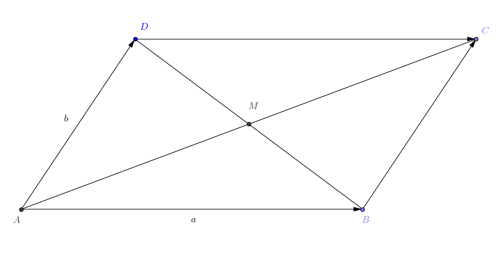<!-- style="display: block; margin-left: auto; margin-right: auto; max-width: 615px;" -->

Für den Nachweis wird das Dreieck mit den Eckpunkten $A$, $B$ und $M$ betrachtet, worin $M$ den gemeinsamen Punkt der Diagonalen bezeichnet. Es gilt offensichtlich die Vektorgleichheit $$
  \overrightarrow{AM}+\overrightarrow{MB}+\overrightarrow{BA}=o
$$ mit dem Nullvektor $o$. Unter Benutzung der Vektoren $a$ und $b$ schreibt sich diese Identität $$
  t\cdot(a+b)+s\cdot(a-b)-a=o\quad\leftrightarrow\quad a\cdot(t+s-1)+b\cdot(t-s)=o
$$ worin $t$ und $s$ zu bestimmende reelle parameter bezeichnen. Da $a$ und $b$ linear unabhängig vorausgesetzt werden, ist diese Gleichung genau dann $o$, wenn beide Koeffizienten verschwinden, d. h. $$
  t+s-1=0\quad\wedge\quad t-s=0
$$ Das ist ein System aus zwei linearen Gleichungen in den zu bestimmenden Parametern $t$ und $s$ mit den Lösungen $t=s=\frac{1}{2}$. Damit ergeben sich die Vektoren $$
  \overrightarrow{AM}=\frac{1}{2}\cdot\overrightarrow{AC}=\frac{1}{2}\cdot(a+b)\quad\text{und}\quad
  \overrightarrow{MB}=\frac{1}{2}\cdot\overrightarrow{DB}
$$

$\square$

Im nachstehenden Video ist der Beweis anhand der Figur $ABCD$ ausgeführt.

!?[Diagonalen](https://www.youtube.com/watch?v=1SGRLDFTaFE&t=169s)

Punkte $P$ der Ebene bzw. des dreidimensionalen Raumes werden mit ihren Ortsvektoren bezüglich eines Ortsvektorraumes identifiziert.
$$ P(x,y,z) \leftrightarrow p=\begin{pmatrix} x \\ y \\ z \end{pmatrix} $$
Bezüglich der kanonischen Basis im Ortsvektorraum stellt sich $p$ dar
$$
  p=\begin{pmatrix} x \\ y \\ z \end{pmatrix} =
  x\cdot\begin{pmatrix} 1 \\ 0 \\ 0 \end{pmatrix} +
  y\cdot\begin{pmatrix} 0 \\ 1 \\ 0 \end{pmatrix} +
  z\cdot\begin{pmatrix} 0 \\ 0 \\ 1 \end{pmatrix}
$$
Die Koordinaten von $P$ sind hierin die Koeffizienten der Linearkombination der Basisvektoren.

Matrizen
========

Die Menge der reellen Matrizen gleichen Typs bilden bezüglich der erklärten Addition und Skalarvielfachbildung einen reellen Vektorraum, genügen also den gleichen Rechengesetzen / Axiomen wie Vektoren (aus $\mathbb{R}^k$). Vergleiche Bemerkung 1 in diesem Abschnitt.

Für das Rechnen mit **quadratischen Matrizen** benötigen wir des Weiteren *inverse Matrix*, *Determinante* etc.

Mit Hilfe der Javascript Bibliothek [Algebrite](http://algebrite.org/) ist nachfolgend die Berechnung der Inversen -, der Adjunkten - und der Determinante einer quadratischen Matrix ausgeführt.

``` javascript
A=[[a,b],[c,d]]
inv(A)
adj(A)
det(A)
inv(A)-adj(A)/det(A)
```
@Algebrite.eval

Sicher gewusst?
===============

Sie können Ihr Wissen gern bei der Beantwortung der nachstehenden Fragen testen.

**Frage 1.** Eine reelle quadratische Matrix $A$ heißt regulär, falls gilt:

[[ ]] $\det{A}$ ist gleich Null
[[X]] $\det{A}$ ist verschieden von Null
[[X]] Die inverse Matrix $A^{-1}$ zu $A$ existiert.
[[?]] Die inverse Matrix $A^{-1}$ existiert nicht für singuläre Matrizen.
****************************************

Eine quadratische Matrix wird regulär genannt, falls $\det{A}$ nicht den Wert Null besitzt.

Die inverse Matrix $A^{-1}$ berechnet sich mittels
$$
  A^{-1}=\frac{1}{\det{A}}\cdot\mathop{\rm adj}{A}
$$
Diese existiert somit nur zu regulären Matrizen.

****************************************

**Frage 2.** Die Funktionen $f_i:\mathbb{R}\rightarrow\mathbb{R}$ mit
$$
  f_0(x)=1\,,\quad f_1(x)=x\,,\quad f_2(x)=x^2
$$
sind linear unabhängig[^2], da für alle $x$:

[(X)] die nachstehende Implikation gilt $$\sum_{i=0}^2{\left(\lambda_i\cdot f_i(x)\right)}=0\;\rightarrow\;(\lambda_0,\lambda_1,\lambda_2)=(0,0,0)$$
[( )] die Gleichung $$\sum_{i=0}^2{\left(\lambda_i\cdot f_i(x)\right)}=0$$ die Lösung $(\lambda_0,\lambda_1,\lambda_2)=(0,0,0)$ besitzt.
[[?]] Das geordnete Dreitupel $(\lambda_0,\lambda_1,\lambda_2)=(0,0,0)$ ist unabhängig von den gewählten Funktionen immer eine Lösung.
****************************************

Die Null gesetzte Linearkombination ergibt
$$
  \lambda_0+\lambda_1\cdot x+\lambda_2\cdot x^2=0
$$
und ist für alle $x$ genau dann gleich Null, wenn für alle Koeffizienten $\lambda_i=0$ gilt.

****************************************

[^1]: Die Rechenregeln werden zur axiomatischen Festlegung eines Vektorraumes genutzt. Hier ist zusätzlich $1\cdot x=x$ zu fordern.

[^2]: Die Funktionen bilden sogar die Monombasis im Vektorraum aller reellen Polynomfunktionen vom Grad $n\leq 2$.


### Ringe und Körper


..


### Komplexe Zahlen


Motivation
===


**Beispiel 1.** Quadratische Gleichungen in der reellen Variablen $x$ besitzen maximal zwei Lösungen: zum Beispiel $$
  x^2-1=(x+1)\cdot(x-1)=0\quad\leftrightarrow\quad x_1=1\;\vee\;x_2=-1
$$ andererseits $$
  x^2-2\cdot x+1=(x-1)^2=0\quad\leftrightarrow\quad x=1
$$ oder $$
  x^2+1=0\quad\rightarrow\quad L=\emptyset
$$ Die letztere Gleichung besitzt keine reelle Lösung, denn es gilt genau einer der folgenden Fälle:

1. Für beliebige Werte $x\geq0$ gilt, dass $x^2\geq0$ und somit $x^2+1>0$ folgt.
2. Für beliebige Werte $x<0$ folgt in gleicher Weise, dass mit $-x>0$ und $$
  (-x)\cdot(-x)=(-1)^2\cdot x^2=x^2>0
$$ schließlich $x^2+1>0$ folgt.

Demnach gibt es kein $x\in\mathbb{R}$, dass die Gleichung $x^2+1=0$ löst.

**Bemerkung 1.** Die Formel zur Lösung quadratischer Gleichungen $$
  x^2+p\cdot x+q=0\quad\leftrightarrow\quad x_{1,2}=-\frac{p}{2}\pm\sqrt{\frac{p^2}{4}-q}
$$ gestattet eine Fallunterscheidung zur Anzahl der reellen Lösungen in Abhängigkeit der reellen Koeffizienten der Gleichung.

Für die Lösungen $x_1$ und $x_2$ gelten mit dem Radikanten[^2] $\frac{p^2}{4}-q=\frac{1}{4}\cdot(p^2-4\cdot q)$ der Wurzel $$
 \left\{\begin{array}{lcl}
         x_1\in\mathbb{R},\;x_2\in\mathbb{R}\;\text{mit}\; x_1\neq x_2 & \text{falls} & p^2-4\cdot q>0 \\
         x_1\in\mathbb{R},\;x_2\in\mathbb{R}\;\text{mit}\; x_1= x_2 & \text{falls} & p^2-4\cdot q=0 \\
         \not\exists\, x_{1,2}\in\mathbb{R} & \text{falls} & p^2-4\cdot q<0
        \end{array}
 \right.
$$

Unter Benutzung der Javascript-Bibliothek [Algebrite](http://algebrite.org/) lassen sich die Lösungen obiger Gleichungen interaktiv berechnen. Ausgaben, welche den Ausdruck $i$ enthalten, bezeichnen keine reelle Lösung.

```javascript
a=x^2-1
b=x^2+1
c=x^2+p*x+q
roots(a)
roots(b)
roots(c)
```
@Algebrite.eval


Konstruktion der komplexen Zahlen
===


>**Definition 1.** Die Zahl $i$ mit $i^2=-1$ heißt [imaginäre Einheit](https://de.wikipedia.org/wiki/Imagin%C3%A4re_Zahl).[^1]

Die in Beispiel 1 betrachtete Gleichung $x^2+1$ ergibt mit dieser Definition $$
  i^2+1=-1+1=0\quad\text{und}\quad
  (-i)^2+1=(-1\cdot i)^2=(-1)^2\cdot i^2=1\cdot(-1)+1=0
$$ nach Annahme der Gültigkeit der Potenzgesetze für die in Definition 1 erklärte imaginäre Einheit. Damit besitzt die Gleichung $x^2+1$ die beiden Lösungen $x_{1,2}=\pm i$.

>**Definition 2.** Eine Zahl $b\cdot i=bi$ mit $b\in\mathbb{R}$ und $i^2=-1$ heißt *imaginäre Zahl*.

Das Rechnen mit reellen Zahlen lässt sich auf imaginäre Zahlen übertragen.

**Beispiel 2.** Es berechnen sich

1. $3i+2i+ci=(5+c)\cdot i\;\text{für}\; c\in\mathbb{R}$
2. $pi\cdot qi=pq\cdot i^2=-pq\;\text{für}\; p\in\mathbb{R},\; q\in\mathbb{R}$
3. $i^5=i^{2+2+1}=i^2\cdot i^2\cdot i=(-1)\cdot(-1)\cdot i=i$
4. $i^{4n+1}=i^{4n}\cdot i^3=(i^2\cdot i^2)^n\cdot i^2\cdot i=1^n\cdot(-1)\cdot i=-1 \;\forall n\in\mathbb{N}$
5. $$\frac{1}{i^3}=\frac{1}{i^2\cdot i}=-\frac{1}{i}=-\frac{i}{i^2}=-\frac{i}{(-1)}=i$$

Unter Benutzung der Javascript-Bibliothek [Algebrite](http://algebrite.org/) können unter Verwendung des Bezeichners $i$ interaktiv reelle und imaginäre Zahlen verknüpft werden.

```javascript
i^2
simplify(2*i+a*i)
1/(i^3)
```
@Algebrite.eval

Die uneingeschränkte Anwendung der Rechengesetze für reelle Zahlen auf imaginäre Zahlen führt auf die Definition einer komplexen Zahl.

>**Definition 3.** Eine [komplexe Zahl](https://de.wikipedia.org/wiki/Komplexe_Zahl) ist ein Ausdruck der Form $$
  z=a+ib\quad\text{mit}\quad a\in\mathbb{R},\; b\in\mathbb{R},\; i^2=-1
$$ Die darin auftretende Zahl $a$ wird *Realteil* von $z$ genannt, während der Koeffizient $b$ von $i$ den *Imaginärteil* von $z$ bezeichnet. Man schreibt $$
  a=\operatorname{Re}{z}\,,\quad b=\operatorname{Im}{z}
$$ Die Menge aller komplexen Zahlen wird angegeben mit $$
  \mathbb{C}=\left\{z=a+ib\,|\, (a\in\mathbb{R})\,\wedge\, (b\in\mathbb{R})\,\wedge\,(i^2=-1)\right\}
$$ (engl.: ~~c~~omplex numbers).

Die in der Javascript-Bibliothek [Algebrite](http://algebrite.org/) zur Verfügung stehenden Befehle `real(.)` beziehungsweise `imag(.)` geben den Real- beziehungsweise Imaginärteil einer komplexen Zahl zurück.

```javascript
z=2+5*i
real(z)
imag(z)
```
@Algebrite.eval

Die reellen Zahlen sind in den komplexen Zahlen enthalten, d. h. es gilt $\mathbb{R}\subset \mathbb{C}$, da $$
  (bi-bi=(b-b)\cdot i=0\cdot i=0)\quad\Rightarrow\quad (z=a+0i=a\,(\in\mathbb{R}))
$$ Speziell ist $z=0+0i=0$. Damit folgt auch $\mathbb{N}\subset\mathbb{Z}\subset\mathbb{Q}\subset\mathbb{R}\subset\mathbb{C}$. Wie im Abschnitt [Mengen](#Mengen) vereinbaren wir $\mathbb{C}^\times=\mathbb{C}\setminus\{0\}$.

Die Begriffe 'imaginäre Einheit', 'imaginäre Zahl' und 'komplexe Zahl' werden im nachstehenden Video im Kontext der Lösung quadratischer Gleichungen an einem Beispiel erläutert.

!?[komplexe Zahl](https://www.youtube.com/watch?v=XQblFqzoMYo&list=PLLTAHuUj-zHgrAfietLRb01pO1mtji8qn&index=2 "Daniel Jung, Komplexe Zahlen, Einführung, imaginäre Einheit")

>**Definition 4.** Es sind $z_1\in\mathbb{C}$ und $z_2\in\mathbb{C}$ mit $$
  z_j=a_j+i\cdot b_j\,,\quad a_j=\operatorname{Re}{z_j}\,,\quad  b_j=\operatorname{Im}{z_j}\,,\quad i^2=-1
$$ zwei beliebige komplexe Zahlen. Die Zahlen $z_1$ und $z_2$ heißen **gleich**, kurz $z_1=z_2$, falls $$ a_1=a_2\quad\text{und}\quad b_1=b_2
$$ für die Real- und Imaginärteile gelten.

**Beispiel 3.** Gegeben sind zwei von Parametern $a\in\mathbb{R}$ und $b\in\mathbb{R}$ abhängige komplexe Zahlen $$
  z_1=a^2+1-2a\cdot i\,,\quad z_2=-2a+i\cdot(b+a)\,,\quad i^2=-1
$$ Es gilt $$
  z_1=z_2\quad\leftrightarrow\quad \operatorname{Re}{z_1}=\operatorname{Re}{z_2}\;\wedge\;\operatorname{Im}{z_1}=\operatorname{Im}{z_2}
$$ Hieraus ergibt sich das System von zwei Gleichungen in den Parametern $a$ und $b$ $$
  \left.\begin{array}{ccc} a^2+1 & = & -2a \\ -2a & = & b+a \end{array}\right\}=
  \left\{\begin{array}{ccc} (a+1)^2 & = & 0 \\ b & = & -3a \end{array}\right.
$$ mit den Lösungen $a_1=a_2=-1$ und $b=3$. Es ergibt sich nach Einsetzen $z_1=z_2=2+2i$.

>**Definition 5.** Zu einer Zahl $z\in\mathbb{C}$ mit $$
  z=a+i\cdot b\,,\quad a=\operatorname{Re}{z}\,,\quad  b=\operatorname{Im}{z}\,,\quad i^2=-1
$$ heißt $\bar{z}=a+(-1)\cdot b\cdot i$ die zu $z$ [komplex konjugierte Zahl](https://de.wikipedia.org/wiki/Konjugation).

**Beispiel 4.** Zu bestimmen sind jeweils die komplex konjugierten Zahlen. Es gilt wie zuvor $i^2=-1$.

1. $z_1=3+2i$. Hieraus lassen sich $\operatorname{Re}{z_1}=3$ und $\operatorname{Im}{z_1}=2$ ablesen. Für die komplex konjugierte Zahl folgt nach obiger Definition $\bar{z}_1=3+(-1)\cdot 2i=3-2i$.
2. $z_2=-i$. Es sind $\operatorname{Re}{z_2}=0$ und $\operatorname{Im}{z_2}=-1$ und somit $\bar{z}_2=0+(-1)\cdot (-i)=i$.
3. $z_3=7.1$ Es sind $\operatorname{Re}{z_3}=7.1$ und $\operatorname{Im}{z_2}=0$ und somit $\bar{z}_3=z_3=7.1$.
4. $z_4=a^2+1-2a\cdot i$ mit $a\in\mathbb{R}$. Hier sind in Abhängigkeit des Parameters $\operatorname{Re}{z_4}=a^2+1$ und $\operatorname{Im}{z_4}=-2a$, woraus sich die komplex konjugierte Zahl $\bar{z}_4=a^2+1+2a\cdot i$ ergibt.

In der Javascript-Bibliothek [Algebrite](http://algebrite.org/) steht zur Bildung der komplex konjugierten Zahl der Befehl `conj(.)` zur Verfügung. Testen Sie diesen Befehl an den Zahlen aus Beispiel 4.

```javascript
z=3+2*i
zc=conj(z)
zc
x=real(z)
y=imag(z)
w=x-y*i
test(zc=w,wahr,falsch)
```
@Algebrite.eval

**Bemerkung 2.** Aus dem vorstehenden Beispiel lassen sich unmittelbar für beliebige komplexe Zahlen $z\in\mathbb{C}$ ableiten:

1. Für Zahlen $z\in\mathbb{C}$ mit $\operatorname{Im}{z}=0$ folgt $\bar{z}=z$ und umgekehrt.
2. Für Zahlen $z\in\mathbb{C}$ mit $\operatorname{Re}{z}=0$ folgt $\bar{z}=-z$ und umgekehrt.
3. Der Realteil einer komplexen Zahl $z$ lässt sich bestimmen über $$
  \operatorname{Re}{z}=\frac{1}{2}\cdot\left(z+\bar{z}\right)
$$
4. Der Imaginärteil einer komplexen Zahl $z$ lässt sich bestimmen über $$
  \operatorname{Re}{z}=\frac{1}{2}\cdot\left(z-\bar{z}\right)
$$

Der Nachweis dieser Aussagen ist eine Übungsaufgabe.


Darstellungen komplexer Zahlen
===


Komplexe Zahlen $z\in\mathbb{C}$ mit der Darstellung $$
  z=a+b\cdot i\,,\quad \operatorname{Re}{z}=a\,,\quad \operatorname{Im}{z}=b\,,\quad i^2=-1
$$ stellen geordnete Paare reeller Zahlen dar, d. h. $$
  z=a+b\cdot i\quad\leftrightarrow\quad (a,b)\in\mathbb{R}^2
$$ Sie lassen sich somit als kartesische Koordinaten von Punkten in einer Ebene umkehrbar eindeutig identifizieren. In dieser Zuordnung entsprechen

1. die erste Koordinatenachse der reellen Zahlgeraden. Diese wird nachfolgend **reelle Achse** genannt. An dieser werden die Realteile komplexer Zahl (als Koordinaten) abgetragen.
2. die Punkte auf der zweiten Koordinatenachse den imaginären Zahlen. Diese Achse wird daher als **imaginäre Achse** bezeichnet. An dieser werden die Imaginärteile komplexer Zahl (als Koordinaten) abgetragen.

Die Darstellung komplexer Zahlen als Punkte in beschriebenen Koordinatensystem wird [Gaußsche Zahlenebene](https://mathepedia.de/Gauszsche_Zahlenebene.html) genannt. Die reelle Zahlengerade wird geometrisch durch eine zusätzliche Dimension zur "komplexen Zahlgerade" erweitert.

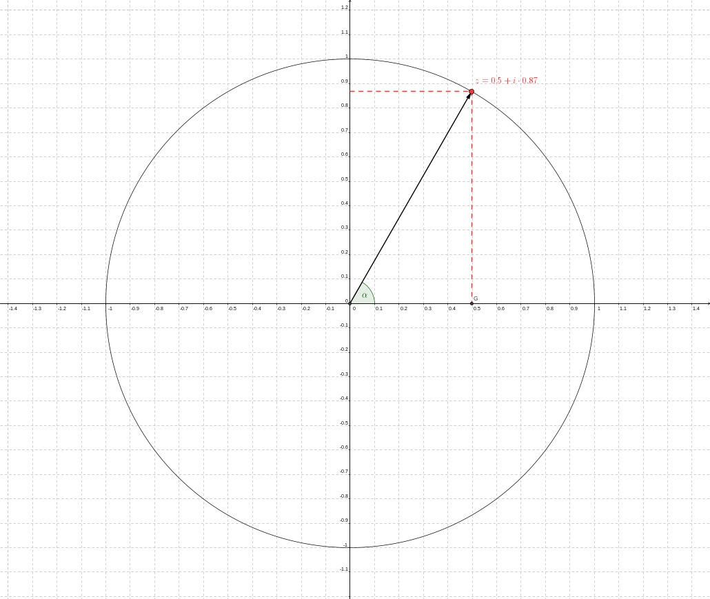<!-- style="display: block; margin-left: auto; margin-right: auto; max-width: 900px;" -->

**Beispiel 5.** In der Gaußschen Zahlenebene ist ein regelmäßiges Sechseck ('Zirkelmuster') mit Eckpunkten auf dem Umkreis mit Mittelpunkt $O(0,0)$ und Radius $r=4$ gegeben. Ein Eckpunkt liegt auf der reellen Achse.

Zu bestimmen ist die kartesische Form der zu den Eckpunkten gehörenden komplexen Zahlen.

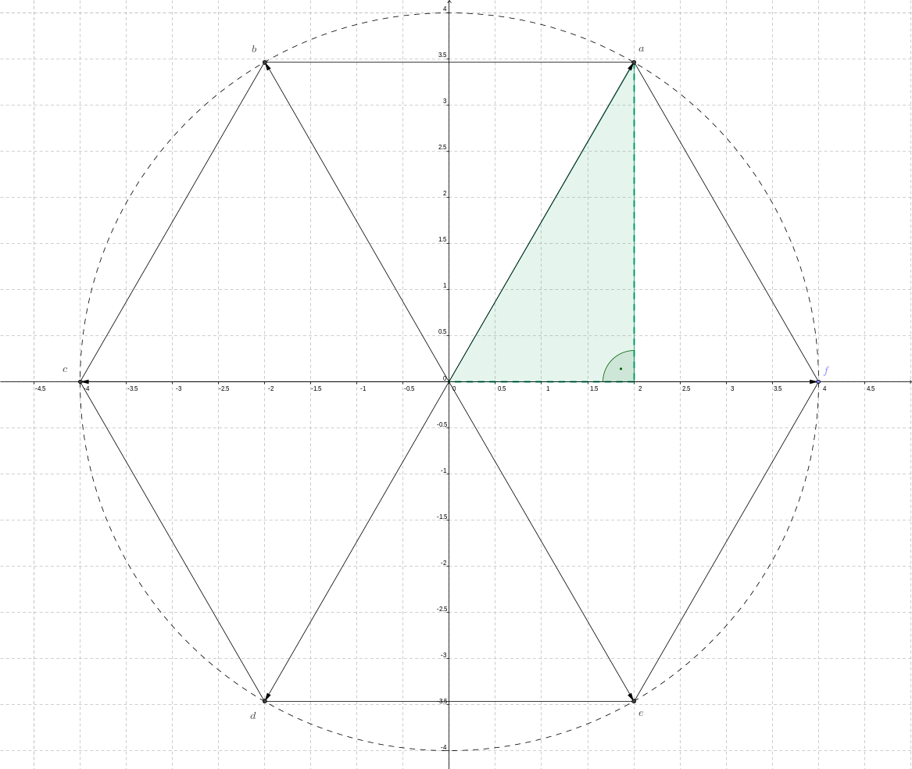<!-- style="display: block; margin-left: auto; margin-right: auto; max-width: 900px;" -->

Die Zeiger durch die Eckpunkte schließen mit der positiv orientierten reellen Achse Winkel der Größen $$
  \alpha\in\{0^\circ,60^\circ,120^\circ,180^\circ,240^\circ,300^\circ\}
$$ ein. Aus dem eingetragenen rechtwinkligen Dreieck lassen sich hiermit die kartesischen Koordinaten $(4\cdot\cos{\alpha},4\cdot\sin{\alpha})$ der Eckpunkte bestimmen. Zu diesen gehören somit die komplexen Zahlen

* $z_1=4\cdot\cos{0^\circ}+4\cdot\sin{0^\circ}\cdot i=4$
* $z_2=4\cdot\cos{60^\circ}+4\cdot\sin{60^\circ}\cdot i=2+2\sqrt{3}\cdot i$
* $z_3=4\cdot\cos{120^\circ}+4\cdot\sin{120^\circ}\cdot i=-2+2\sqrt{3}\cdot i$
* $z_4=4\cdot\cos{180^\circ}+4\cdot\sin{180^\circ}\cdot i=-4$
* $z_5=4\cdot\cos{240^\circ}+4\cdot\sin{240^\circ}\cdot i=-2-2\sqrt{3}\cdot i$
* $z_6=4\cdot\cos{300^\circ}+4\cdot\sin{300^\circ}\cdot i=2-2\sqrt{3}\cdot i$

**Bemerkung 3.** Die Ordnungsrelationen 'kleiner als', 'größer als' in der Menge der reellen Zahlen lassen sich nicht auf $\mathbb{C}$ übertragen. Insbesondere gibt es keine positiven oder negativen komplexen Zahlen.

Mit den vorstehenden Abbildungen lässt sich jedem Punkt / jeder Zahl $z\in\mathbb{C}^\times$ in der Gaußschen Zahlenebene umkehrbar eindeutig zuordnen:

1. das geordnete Paar kartesischer Koordinaten $(a,b)\in\mathbb{R}^2$ mit $a=\operatorname{Re}{z}$ und $b=\operatorname{Im}{z}$. Die Darstellung $z=a+i\cdot b$ aus Definition 3 wird **kartesische Form** der komplexen Zahl genannt.
2. das Paar $(r,\varphi)\in(0,\infty)\times (-\pi,\pi]$ mit Abstand $r$ von $z$ zum Koordinatenursprung sowie dem Winkel $\varphi$, den der Zeiger zu $z$ mit der positiv orientierten reellen Achse im Grundintervall einschließt.
3. Der Zahl $z=0$ entsprechen umkehrbar eindeutig die kartesischen Koordinaten $(a,b)=(0,0)$, jedoch ist für $r=0$ der Winkel $\varphi$ in der Polarform nicht eindeutig bestimmt.

>**Definition 6.** Die Koordinaten $(r,\varphi)$ eines vom Koordinatenursprung verschiedenen Punktes in der Gaußschen Zahlenebene werden [Polarkoordinaten](https://de.wikipedia.org/wiki/Polarkoordinaten) genannt. Die Darstellung $$
  z=r\cdot(\cos{\varphi}+i\cdot\sin{\varphi})\,,\quad r\in(0,\infty)\,,\quad \varphi\in(-\pi,\pi]\,,\quad i^2=-1
$$ wird als trigonometrische beziehungsweise **Polarfom** von $z\in\mathbb{C}^\times$ bezeichnet. Darin heißt $r$ **Betrag** und $\varphi$ **Argument** von $z$.

Für die Umrechnung zwischen kartesischen und Polarkoordinaten nutzt man das in den vorstehenden Abbildungen eingetragene Koordinatendreieck.

1. Es sei $z$ in der kartesischen Form gegeben, d. h. $z=a+i\cdot b$ gemäß Definition 3. Des Weiteren wird $a^2+b^2\not=0$ vorausgesetzt. Dann berechnen sich dessen Polarkoorinaten vermöge $$
  |z|=r=\sqrt{a^2+b^2}\quad\text{und weiter}\quad
  \varphi=\left\{\begin{array}{rcc} \arccos{\left(\frac{a}{r}\right)} & \text{für} & b\geq0 \\ -\arccos{\left(\frac{a}{r}\right)} & \text{für} & b<0\end{array}\right.
$$ woraus sich die Polarform von $z$ ableiten lässt.
2. Es sei umgekehrt $z$ in Polarform gegeben, d. h. $z=r\cdot(\cos{\varphi}+i\cdot\sin{\varphi})$ gemäß Definition 6. Hieraus folgen durch Ausmultiplizieren $$
  a=r\cdot\cos{\varphi}\quad\text{und}\quad b=r\cdot\sin{\varphi}
$$ für den Real- bzw. Imaginärteil in der kartesischen Form von $z$.

In der Javascript-Bibliothek [Algebrite](http://algebrite.org/) kann die kartesische Darstellungsform einer komplexen Zahl $z$ mit dem Befehl `rect(z)` berechnet werden. Zur Berechnung des Betrages und des Argumentes von $z$ werden die Befehle `abs(z)` bzw. `arg(z)` zur Verfügung gestellt. Letzterer verwendet zur Berechnung des Argumentes in $\varphi\in(-\pi,\pi]$ anstelle des 'Arcuskosinus' den 'Arcustangens' mit $$
  \varphi=\left\{
    \begin{array}{lclclcl}
    \arctan{\left(\frac{b}{a}\right)} & \text{für} & a>0 \\
    \arctan{\left(\frac{b}{a}\right)}+\pi & \text{für} & a<0 & \text{und} & b\geq 0 \\
    \arctan{\left(\frac{b}{a}\right)}-\pi & \text{für} & a<0 & \text{und} & b<0 \\
    \frac{\pi}{2} & \text{für} & a=0 & \text{und} & b>0 \\
    -\frac{\pi}{2} & \text{für} & a=0 & \text{und} & b<0 \\
    n. d. & \text{für} & a=0 & \text{und} & b=0
    \end{array}\right.
$$ für jedes $z\in\mathbb{C}$ mit $a\not=0$.

```javascript
z=3/2*(cos(pi/6)+i*sin(pi/6))
rect(z)
w=-3-2*i
abs(w)
arg(w)
```
@Algebrite.eval

**Bemerkung 4.** Das Argument ist zumeist im *Bogenmaß* anzugeben oder wird im Bogenmaß berechnet. Dies ist eine reelle Zahl. Hierbei gilt die folgende Umrechnung zwischen Bogen- und Gradmaß: $$
  \frac{b_\varphi}{2\pi}=\frac{\varphi}{360^\circ}\quad\leftrightarrow\quad
  b_\varphi==\frac{\varphi}{360^\circ}\cdot 2\pi\quad\leftrightarrow\quad
  \varphi=\frac{b_\varphi}{2\pi}\cdot 360^\circ
$$ wenn $b_\varphi$ den Winkel im Boden- und $\varphi$ den Winkel im Gradmaß bezeichnen.

Werden im Gegensatz zu Definition 6 Winkel $\varphi\in\mathbb{R}$ zugelassen, so legen $(r,\varphi)$ und $(r,\varphi+2k\pi)$ mit $k\in\mathbb{Z}$ dieselbe komplexe zahl $z$ fest, da nach [Additionstheoremen](https://de.wikipedia.org/wiki/Formelsammlung_Trigonometrie#Additionstheoreme) für Sinus und Kosinus $$
  \sin{(\varphi+2k\pi)}=\cos{\varphi}\cdot\sin{(2k\pi)}+\sin{\varphi}\cdot\cos{(2k\pi)}=\sin{\varphi}\quad\text{und}\quad
  \cos{(\varphi+2k\pi)}=\cos{\varphi}\cdot\cos{(2k\pi)}-\sin{\varphi}\cdot\sin{(2k\pi)}=\cos{\varphi}
$$ Der Winkel $\varphi$ mit $\varphi\in(-\pi,\pi]$ wird *Hauptwert* des Arguments von $z$ genannt.

**Beispiel 6.** Umzurechnen sind kartesische - und Polardarstellung einer komplexen Zahl.

1. Gegeben ist die Zahl $z_1=3+i\cdot \sqrt{3}$, d. h. in kartesischer Form. Es lassen sich aus dieser Real- und Imaginärteil der komplexen Zahl ablesen $$
  a_1=3\quad\text{und}\quad b_1=\sqrt{3}
$$ Hieraus berechnen sich schrittweise deren Betrag $$
  |z_1|=\sqrt{a_1^2+b_1^2}=\sqrt{3^2+\sqrt{3}^2}=\sqrt{12}=2\cdot\sqrt{3}
$$ und das (Haupt-) Argument $$
  \varphi_1=\arccos{\left(\frac{3}{2\cdot\sqrt{3}}\right)}=\arccos{\left(\frac{1}{2}\cdot\sqrt{3}\right)}=\frac{1}{6}\cdot\pi
$$ Hieraus ergibt sich die Polardarstellung von $z_1$ $$
  z_1=2\cdot\sqrt{3}\cdot\left(\cos{\left(\frac{\pi}{6}\right)}+i\cdot\sin{\left(\frac{\pi}{6}\right)}\right)
$$
2. Seien nun umgekehrt die Polarkoordinaten einer komplexen Zahl $z_2$ gegeben $$
  \varphi_2=\frac{\pi}{4}\quad\text{und}\quad r_2=|z_2|=\frac{1}{4}
$$ Hieraus lassen sich unmittelbar Rel- und Imaginärteil der komplexen Zahl berechnen $$
  a_2=\operatorname{Re}{z_2}=r_2\cdot\cos{\varphi_2}=\frac{1}{8}\cdot\sqrt{2}\,,\quad
  b_2=\operatorname{Im}{z_2}=r_2\cdot\sin{\varphi_2}=\frac{1}{8}\cdot\sqrt{2}
$$ woraus sich $z_2$ in kartesischer Form ergibt $$
  z_2=\frac{1}{8}\cdot\sqrt{2}+i\cdot\frac{1}{8}\cdot\sqrt{2}
$$

Im nachstehendem Video wird die Darstellung der komplex konjugierten Zahl in der Polarform hergeleitet.

!?[Darstellung-komplex](https://www.youtube.com/watch?v=ZPh2ZFVAZ_w&list=PLLTAHuUj-zHgrAfietLRb01pO1mtji8qn&index=10 "Daniel Jung, Polarform der komplex konjugierten Zahl")


Grundrechenoperationen
===

Auf der Menge der komplexen Zahlen lassen sich die Grundrechenoperationen definieren. Dies erfolgt mit der Maßgabe, dass die für das Rechnen in $\mathbb{R}$ bekannten Rechengesetze auch für das Rechnen mit komplexen Zahlen gelten.

>**Definition 7.**  Gegeben seien zwei beliebige komplexe Zahlen $z_k=a_k+{i} b_k$ mit $a_k=\operatorname{Re}{z_k}$, $b_k=\operatorname{Im}{z_k}$, $i^2=-1$ und $k\in\{1,2\}$. Es sind die Grundrechenoperationen erklärt:
>
>1. *Addition* $$
  z_1\oplus z_2=(a_1+i\cdot b_1)\oplus(a_2+i\cdot b_2):=(a_1+a_2)+i\cdot(b_1+b_2) $$
>2. *Subtraktion* $$
  z_1\ominus z_2=(a_1+i\cdot b_1)\ominus(a_2+i\cdot b_2):=(a_1-a_2)+i\cdot (b_1-b_2) $$
>3. *Multiplikation* $$
  z_1\odot z_2=(a_1+i\cdot b_1)\odot(a_2+i\cdot b_2):=(a_1\cdot a_2-b_1\cdot b_2)+i\cdot (a_1\cdot b_2+b_1\cdot a_2) $$
>4. *Division* (vorausgesetzt $z_2\not=0$) $$
  z_1\oslash z_2=(a_1+i\cdot b_1)\oslash(a_2+i\cdot b_2):=\frac{a_1\cdot a_2+b_1\cdot b_2}{a_2^2+b_2^2}+i\cdot \frac{b_1\cdot a_2-a_1\cdot b_2}{a_2^2+b_2^2} $$
>
> Besteht nicht die Gefahr einer Verwechslung, sollen im Folgenden die für $\mathbb{R}$ gebräuchlichen Rechenzeichen auch für das Rechnen in $\mathbb{C}$ verwendet werden.

**Bemerkung 5.** Die Grundrechenoperationen in $\mathbb{C}$ werden auf das Rechnen in $\mathbb{R}$ zurückgeführt. Dort geltende Rechenregeln wie Kommutativität, Assoziativität und Distributivität lassen sich auf das Rechnen in $\mathbb{C}$ übertragen und lassen sich forthin nutzen.

In den nachstehenden Videos werden die Grundrechenoperationen an Beispielen erläutert.

!?[Rechnen-komplex](https://www.youtube.com/watch?v=Ea4BjgzMIno&list=PLLTAHuUj-zHgrAfietLRb01pO1mtji8qn&index=5 "Daniel Jung, Rechnen mit komplexen Zahlen, Summe, Differenz, Produkt")

!?[Division-komplex](https://www.youtube.com/watch?v=knJiK08sWf0&list=PLLTAHuUj-zHgrAfietLRb01pO1mtji8qn&index=4 "Daniel Jung, Rechnen mit komplexen Zahlen, Quotient, Teilen mit Reellmachen des Nenners")

>**Proposition 1.** Für jede Zahl $z\in\mathbb{C}^\times$ mit $z=a+i\cdot b$ gemäß obiger Definition existiert jeweils genau eine komplexe Zahl, für die gilt:
>
>1. $(-z)+z=0$. Die Zahl $-z$ wird zu $z$ invers bezüglich der Addition genannt und berechnet sich $$
  -z=-a-i\cdot b
$$
>2. $z^{-1}\cdot z=1$. Die Zahl $z^{-1}$ heißt zu $z$ invers bezüglich der Multiplikation und berechnet sich $$
  z^{-1}=\frac{1}{z}=\frac{a}{a^2+b^2}-i\cdot\frac{b}{a^2+b^2}
$$

**Beweis.** Mit den Eingeführten Operationen folgt unmittelbar:

1. $z+(-z)=(a+i\cdot b)+(-a-i\cdot b)=(a+(-a))+i\cdot(b+(-b))=0+i\cdot 0=0$
2. Analog folgt für das Produkt $$
  z\cdot z^{-1}=(a+i\cdot b)\cdot \left(\frac{a}{a^2+b^2}-i\cdot\frac{b}{a^2+b^2}\right)
  =\left(\frac{a\cdot a}{a^2+b^2}-\frac{-b\cdot b}{a^2+b^2}\right)+i\cdot\left(\frac{a\cdot b}{a^2+b^2}+\frac{a\cdot (-b)}{a^2+b^2}\right)
  =1+i\cdot 0
  =1
$$

$\square$

Addition und Multiplikation komplexer Zahlen lassen sich in der Gaußschen Zahlenebene geometrisch interpretieren.

1. Der **Summe** $z_1+z_2$ entspricht die dem Ursprung des Koordinatensystems gegenüberliegende Ecke im von $0$, $z_1$ und $z_2$ aufgespannten Parallelogramm. Für die Bildung der Summe ist das Rechnen in der kartesischen Form sinnvoll.
2. Für die Polardarstellung des **Produktes** $z_1\cdot z_2$ erhält man $$
  |z_1\cdot z_2|=|z_1|\cdot |z_2|\quad\text{und}\quad
  \varphi_{z_1\cdot z_2}=\varphi_{z_1}+\varphi_{z_2}
$$ d. h. es sind "Beträge zu multiplizieren und Argumente zu addieren." Denn es gilt mit $$
  z_1=r_1\cdot(\cos{\varphi_1}+i\cdot\sin{\varphi_1})\,,\quad
  z_2=r_2\cdot(\cos{\varphi_2}+i\cdot\sin{\varphi_2})
$$ für das Produkt unter Nutzung der [Additionstheoreme](https://de.wikipedia.org/wiki/Formelsammlung_Trigonometrie#Additionstheoreme) für Sinus und Kosinus $$
  \begin{split}
    z_1\cdot z_2 & = (r_1\cdot r_2)\cdot(\cos{\varphi_1}+i\cdot\sin{\varphi_1})\cdot(\cos{\varphi_2}+i\cdot\sin{\varphi_2}) \\
    & = (r_1\cdot r_2)\cdot(\cos{\varphi_1}\cdot\cos{\varphi_2}+i^2\cdot\sin{\varphi_1}\cdot\sin{\varphi_2}+i\cdot\sin{\varphi_1}\cdot\cos{\varphi_2}+i\cdot\cos{\varphi_1}\cdot\sin{\varphi_2}) \\
    & = (r_1\cdot r_2)\cdot(\cos{(\varphi_1+\varphi_2)}+i\cdot\sin{(\varphi_1+\varphi_2)})
  \end{split}
$$ Hierfür erweist sich die Darstellung in Polarform als günstig.

In den nachstehenden Abbildungen sind beide Operationen dargestellt.

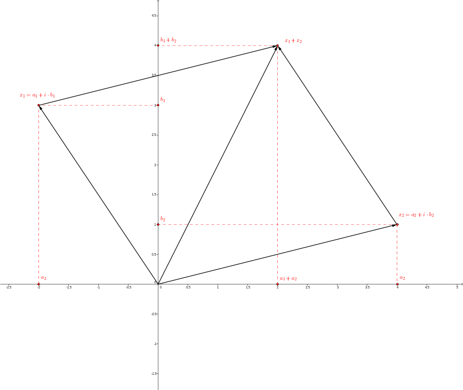


**Beispiel 7.** Gegeben sind die beiden Zahlen $$
  z_1=\frac{3}{2}\cdot\left(\cos{\left(\frac{\pi}{3}\right)}+i\cdot\sin{\left(\frac{\pi}{3}\right)}\right)\quad\text{und}\quad
  z_2=2\cdot\left(\cos{\left(\frac{\pi}{6}\right)}+i\cdot\sin{\left(\frac{\pi}{6}\right)}\right)
$$ Das Produkt der Beträge von $z_1$ und $z_2$ ergibt $|z_1|\cdot|z_2|=\frac{3}{2}\cdot 2=3$, die Argumente addieren sich zu $$
  \frac{\pi}{3}+\frac{\pi}{6}=\frac{\pi}{2}
$$ Hieraus ergibt sich das Produkt $$
  z_1\cdot z_2=2\cdot\left(\cos{\left(\frac{\pi}{2}\right)}+i\cdot\sin{\left(\frac{\pi}{2}\right)}\right)
$$

Mit Hilfe der Javascript-Bibliothek [Algebrite](http://algebrite.org/) lässt sich das Verfahren zur Bildung des Produktes zweier komplexer Zahlen interaktiv prüfen. Der Befehl `float(x)` gibt einen rationalen Näherungswert (Gleitkommazahl) einer reellen Zahl $x$ zurück.

```javascript
z=3/2*(cos(pi/3)+i*sin(pi/3))
w=2*(cos(pi/6)+i*sin(pi/6))
abs(z*w)
float(arg(z*w))
```
@Algebrite.eval

**Bemerkung 6.** Durch Bilden der Summe sind Argumente $\varphi=\varphi_1+\varphi_2$ mit $\varphi\in\mathbb{R}$ außerhalb des Grundintervalls möglich. Für das Hauptargument gilt $\varphi+2k\cdot\pi\in(-\pi,\pi]$ für ein $k\in\mathbb{Z}$.

Die geometrischen Interpretationen von Summe und Produkt lassen sich zur Beschreibung von Bewegungen der Ebene anwenden.

1. Ebene *Translationen* (Schiebungen) lassen sich durch Addition komplexer Zahlen beschreiben: Bezeichnet $P(a,b)\leftrightarrow z=a+i\cdot b$ einen Punkt der Ebene in allgemeiner Lage sowie $v=(x,y)\in\mathbb{R}^2\leftrightarrow z_v=x+i\cdot y$ eine beliebige, aber feste Richtung, so beschreibt $$
  z\mapsto z^\prime=z+z_v
$$ die Translation von $z$ (in Richtung $z_v$) nach $z^\prime$. Soll $z$ stetig in die feste Richtung $v$ verschoben werden, so kann beispielsweise $$
  t\in[0,1]\mapsto z_v(t)=t\cdot (x+i\cdot y)
$$ verwendet werden.
2. Ebene *Drehungen* um den Koordinatenursprung $O(0,0)$ mit Winkel $\varphi$ lassen sich durch Multiplikation mit einer komplexen Zahl darstellen. Bezeichnet $P(r,\alpha)\leftrightarrow z=r\cdot(\cos{\alpha}+i\cdot\sin{\alpha})$ wie zuvor einen Punkt der Ebene in allgemeiner Lage sowie $z_\varphi=\cos{\varphi}+i\cdot\sin{\varphi}$ eine zum Drehwinkel $\varphi$ gebildete komplexe Zahl, so beschreibt $$
  z\mapsto z^\prime=z\cdot z_\varphi=r\cdot 1\cdot(\cos{(\alpha+\varphi)}+i\cdot\sin{(\alpha+\varphi)})
$$ die Drehung von $z$ um $0$ nach $z^\prime$. Für ein kontinuierliches Drehen ist der Drehwinkel $$
  \phi\in[0,\varphi]\mapsto z_\phi=\cos{\phi}+i\cdot\sin{\phi}
$$ zu verwenden.

**Beispiel 8.** Ebene Rollkurven lassen sich als Ortskurven $c$ von Punkten $P$ erzeugen, die fest mit einer entlang einer Kurve $k_0$ abrollenden Kreisscheibe $k$ verbunden sind.

Ein interaktives Beispiel von Rollkurven, die durch Abrollen eines Kreises entlang einer Geraden entstehen, findet sich unter [Zykloiden](https://www.geogebra.org/m/Vjp9xEKc). Eine Parametrisierung dieser Ortkurven kann unter Benutzung komplexer Zahlen erfolgen. Im Beispiel gelten:

1. Der Punkt $P$ sei auf der Kreisscheibe fest vorgegeben. Liegt $k$ zu Beginn des Bewegungsvorgangs mit $M$ im Koordinatenursprung in der Gaußschen Ebene, so sind $$
  M=O\;\leftrightarrow\; z_M=0\quad \text{sowie}\quad z_P=\lambda\cdot i
$$ mit festem $\lambda<0$ und $|\lambda|=\overline{PM}$.
2. Das kontinuierliche Drehen von $k$ um den Mittelpunkt $M$ lässt sich durch Multiplikation von $z_P$ mit $$
  \varphi\in[0,\infty)\mapsto z_\varphi=\cos{(-\varphi)}+i\cdot\sin{(-\varphi)}
$$ modellieren. (Das Drehen erfolgt hier im Uhrzeigersinn.) Hieraus ergibt sich $$
  \varphi\mapsto z^\prime(\varphi)=z_P\cdot z_\varphi=\lambda\cdot i\cdot\left(\cos{(-\varphi)}+i\cdot\sin{(-\varphi)}\right)=
  \lambda\cdot\sin{\varphi}+i\cdot \lambda\cdot\cos{\varphi}
$$
3. Der Kreis $k$ soll kontinuierlich entlang einer Geraden $k_0$ rollen. Hierdurch bewegt sich $M$ im Abstand $r>0$ zu $k_0$. Seine Bewegung ist beschrieben durch $z_M=\varphi\cdot r$ und somit $$
  \varphi\in[0,\infty)\mapsto z^{\prime\prime}(\varphi)=z^\prime+z_M=
  (\lambda\cdot\sin{\varphi}+\varphi\cdot r)+i\cdot \lambda\cdot\cos{\varphi}
$$ Beide Teilbewegungen überlagern sich ungestört.[^3]


Betrag einer komplexen Zahl
===


>**Proposition 2.** Für den Betrag beliebiger komplexer Zahlen $z$, beziehungsweise $z_1$ beziehungsweise $z_2$ gelten:
>
>1. $|z|\in\mathbb{R}$ mit $|z|\geq0$. Speziell ist $|z|=0\leftrightarrow z=0$
>2. $|z|^2=z\cdot\bar{z}$
>3. $|z_1\cdot z_2|=|z_1|\cdot|z_2|$
>4. Dreiecksungleichung $|z_1+z_2|\leq|z_1|+|z_2|$

**Beweis.** Für den Nachweis der Eigenschaften wird die komplexe Zahl $z=a+i\cdot b$ mit $a=\operatorname{Re}{z}$, $b=\operatorname{Im}{z}$ und $i^2=-1$ betrachtet. Entsprechende Bezeichnungen werden für $z_1$ und $z_2$ verwendet.

1. Die erste Eigenschaft folgt unmittelbar aus der Definition des Betrages $$
  |z|=\sqrt{a^2+b^2}\geq0\quad\text{und}\quad \sqrt{a^2+b^2}=0\;\leftrightarrow\; a=b=0
$$
2. Für das Produkt $z\cdot \bar{z}$ einer Zahl mit ihrer komplexkonjugierten Zahl ergibt sich $$
  z\cdot \bar{z}=(a+i\cdot b)\cdot (a-i\cdot b)=a^2+b^2+i\cdot(ab-ba)=a^2+b^2=|z|^2
$$
3. Mit der Eigenschaft 2 folgt für das Produkt schrittweise $$
  |z_1\cdot z_2|^2=(z_1\cdot z_2)\cdot\overline{(z_1\cdot z_2)}=
  (z_1\cdot z_2)\cdot(\bar{z}_1\cdot \bar{z}_2)=
  z_1\cdot \bar{z}_1\cdot z_2\cdot\bar{z}_2=
  |z_1|^2\cdot|z_2|^2
$$ Die hierin verwendete Eigenschaft $\overline{z_1\cdot z_2}=\bar{z}_1\cdot\bar{z}_2$ lässt sich direkt aus der Definition des Produktes komplexer Zahlen ableiten. Ihr Nachweis ist eine Übungsaufgabe. Unter Benutzung von Eigenschaft 1 lässt sich hieraus Eigenschaft 3 ableiten.
4. Mit der Eigenschaft 2 folgt ebenso für die Summe $$
  \begin{split}
    |z_1+z_2|^2 & = (z_1+z_2)\cdot\overline{(z_1+z_2)} = (z_1+z_2)\cdot{(\bar{z}_1+\bar{z}_2)} \\
    & = z_1\cdot\bar{z}_1+z_2\cdot\bar{z}_2+z_1\cdot\bar{z}_2+z_2\cdot\bar{z}_1=
    |z_1|^2+|z_2|^2+z_1\cdot\bar{z}_2+\overline{z_1\cdot\bar{z}_2}
  \end{split}
$$ Hierin ist die Teilsumme $z_1\cdot\bar{z}_2+\overline{z_1\cdot\bar{z}_2}$ reell und es gilt unter Verwendung von Eigenschaft 3 $$
  z_1\cdot\bar{z}_2+\overline{z_1\cdot\bar{z}_2}=2\cdot\operatorname{Re}{(z_1\cdot \bar{z}_2)}\leq 2\cdot|z_1\cdot \bar{z}_2|=2\cdot|z_1|\cdot|\bar{z}_2|=2\cdot|z_1|\cdot|z_2|
$$ Die hierin verwendete Eigenschaft $\overline{z_1+ z_2}=\bar{z}_1+\bar{z}_2$ lässt sich direkt aus der Definition der Summe komplexer Zahlen ableiten. Ihr Nachweis ist eine Übungsaufgabe. Damit folgt unter Benutzung von 1. und der strengen Monotonie der reellen Quadtratwurzelfunktion $$
  |z_1+z_2|^2\leq |z_1|^2+|z_2|^2+2\cdot|z_1|\cdot|z_2|=\left(|z_1|+|z_2|\right)^2\quad\leftrightarrow\quad
  |z_1+z_2|\leq |z_1|+|z_2|
$$

$\square$

Im nachstehenden Video wird die Eigenschaft 2 aus Proposition 2 erläutert.

!?[Betrag-komplex](https://www.youtube.com/watch?v=stftUv1NZp4&list=PLLTAHuUj-zHgrAfietLRb01pO1mtji8qn&index=11 "Daniel Jung, Quadrat des Betrages einer komplexen Zahl $z$ als Produkt von $z$ mit deren komplex konjugierter Zahl.")

**Beispiel 9.** Die Teilmenge komplexer Zahlen $$
  M=\left\{z\in\mathbb{C}\,||z-z_1|<\epsilon\,,\epsilon>0\,,z_1\in\mathbb{C}\right\}
$$ ist das Innere einer Kreisscheibe in der Gaußschen Zahlenebene um den Punkt $z_1$ mit Radius $\epsilon>0$, die $\epsilon$_Umgebung von $z_1$ genannt wird.


Potenzieren und Radizieren komplexer Zahlen
===


Das Potenzieren komplexer Zahlen mit natürlichen Exponenten lässt sich mithilfe der Multiplikation erklären. Seien $n\in\mathbb{N}^\times$ und $z=a+i\cdot b$ wie in Definition 3. Dann ist $$
  z^n:=z\cdot z\cdot z\cdot ...\cdot z
$$ wobei das Produkt auf der rechten Seite $n$-mal den Faktor $n$ enthält.

**Beispiel 10.** Für $z=i$ mit $i^2=-1$ gelten $i^3=-i$, $i^4=1$, $i^5=i$ usw.

Allgemein gilt: $$
  i^n=\left\{\begin{array}{rcl}
  1 & \text{für} & n=4\cdot k,\; k\in\mathbb{N}^\times \\
  i & \text{für} & n=4\cdot k+1,\; k\in\mathbb{N} \\
  -1 & \text{für} & n=4\cdot k+2,\; k\in\mathbb{N} \\
  -i & \text{für} & n=4\cdot k+3,\; k\in\mathbb{N}
  \end{array}\right.
$$ Die Allgemeingültigkeit der Aussage erfolgt in zwei Schritten:

1. Für den Fall $n=4\cdot k$ mit vollständiger Induktion.
* *Induktionsanfang.* Für $k=1$ ist $n=4\cdot 1=4$ und $i^4=1$ (wahr).
* *Induktionsschluss.* Für $k\in\mathbb{N}^\times$ gelte $i^{4\cdot k}=1$. Dann gilt für den Nachfolger $k+1$ $$
  i^{4\cdot (k+1)}=i^{4\cdot k+4}=i^{4\cdot k}\cdot i^4=i^{4\cdot k}=1
$$ (wahre Aussage) Damit ist $i^{4\cdot k}=1$ für alle $k\in\mathbb{N}^\times$.
2. Unter Verwendung der Nachfolgerfunktion $S:n\mapsto S(n)=n+1$ folgt außerdem $$
  i^{4\cdot k+1}=i^{4\cdot k}\cdot i^1=i\,,\quad
  i^{4\cdot k+2}=i^{4\cdot k}\cdot i^2=-1\quad\text{sowie}\quad
  i^{4\cdot k+3}=i^{4\cdot k}\cdot i^3=-i
$$ für alle $k\in\mathbb{N}^\times$.

$\square$

Die vorstehende Aussage zu Potenzen von $i$ mit natürlichem Exponenten ist im folgenden Video von erläutert. Hierbei wird Polardarstellung $$
  i=1\cdot(\cos{90^\circ}+i\cdot\sin{90^\circ})
$$ benutzt, wonach die (wiederholte) Multiplikation mit $i$ eine Drehung um den Ursprung des Koordinatensystems mit Drehwinkel $90^\circ$ bewirkt.

!?[Potenz-komplex](https://www.youtube.com/watch?v=UbhXdiUwaP8&list=PLLTAHuUj-zHgrAfietLRb01pO1mtji8qn&index=6 "Daniel Jung, Komplexe Zahlen, Potenzen von $i$ verdeutlicht am Einheitskreis")

>**Satz 3.** Es ist $z\in\mathbb{C}$ mit $z=r\cdot(\cos{\varphi}+i\cdot\sin{\varphi})$ beliebig gegeben. Für die $n$-te Potenz gilt $$
  z^n=r^n\cdot(\cos{(n\cdot\varphi)}+i\cdot\sin{(n\cdot\varphi)})
$$ mit $n\in\mathbb{N}^\times$.

**Beweis.** Der Nachweis lässt sich unmittelbar unter Nutzung der Rechenregeln für die Multiplikation komplexer Zahlen sowie der Potenzgesetze führen und wird als Übungsaufgabe gegeben.

**Beispiel 11.** Gegeben ist die komplexe Zahl $z=-\frac{3}{2}+\frac{1}{2}\cdot\sqrt{3}\cdot i$, worin $i^2=-1$. Gesucht ist die Potenz $z^6$.

1. Zunächst wird $z$ in Polarform dargestellt. Für den Betrag von $z$ ergibt sich $$
  r=|z|=\sqrt{\left(-\frac{3}{2}\right)^2+\left(\frac{1}{2}\cdot\sqrt{3}\right)^2}=\sqrt{3}
$$ woraus sich das Argument von $z$ unter Beachtung $\operatorname{Im}{z}>0$ berechnet $$
  \varphi=\arccos{\left(\frac{-\frac{3}{2}}{\sqrt{3}}\right)}=\arccos{\left(-\frac{\sqrt{3}}{2}\right)}=\frac{5}{6}\cdot\pi
$$  $z$ besitzt damit die Polarform $$
  z=\sqrt{3}\cdot\left(\cos{\left(\frac{5}{6}\cdot\pi\right)}+i\cdot\sin{\left(\frac{5}{6}\cdot\pi\right)}\right)
$$
2. Nach dem vorstehenden Satz folgt für die zu berechnende Potenz $$
  z^6=\left(\sqrt{3}\cdot\left(\cos{\left(\frac{5}{6}\cdot\pi\right)}+i\cdot\sin{\left(\frac{5}{6}\cdot\pi\right)}\right)\right)^6=
  \sqrt{3}^6\cdot\left(\cos{\left(6\cdot\frac{5}{6}\cdot\pi\right)}+i\cdot\sin{\left(6\cdot\frac{5}{6}\cdot\pi\right)}\right)=
  27\cdot\left(\cos{\pi}+i\cdot\sin{\pi}\right)=-27
$$ Beim vorletzten Schritt wurde die Periodizität von Sinus und Kosinus genutzt, um in das Hauptargument $\phi\in(-\pi,\pi]$ umzurechnen. Vergleiche Bemerkung 6.

Aus dem vorstehenden Satz ergibt sich durch Spezifikation von $r=|z|=1$ die nachstehende Formel.

>**Satz 4.** Für $\varphi\in\mathbb{R}$ und $n\in\mathbb{N}^\times$ gilt $$
  \left(\cos{\varphi}+i\cdot\sin{\varphi}\right)^n=\cos{(n\cdot\varphi)}+i\cdot\sin{(n\cdot\varphi)}
$$ (*Moivre*sche Formel)

Eine Umkehrung des Potenzierens ist das Radizieren: In einer Gleichung $w^n=z$ ist dabei bei gegebenem Exponenten $n$ und gegebenem Potenzwert $z$ die Basis $w$ der Potenz gesucht.

>**Definition 8.** Es seien $z\in\mathbb{C}$ und $n\in\mathbb{N}$ mit $n\geq 2$ beliebig gegeben. Jede komplexe Zahl $w$ mit $w^n=z$ heißt eine [komplexe n-te Wurzel](https://de.wikipedia.org/wiki/Wurzel_%28Mathematik%29#Wurzeln_aus_komplexen_Zahlen) der Zahl $z$.[^4]

>**Satz 5.** Es seien $z\in\mathbb{C}$ mit der Polardarstellung $$
  z=r\cdot(\cos{\varphi}+i\cdot\sin{\varphi})\,,\quad r\in(0,\infty),\;\varphi\in(-\pi,\pi]
$$ und $n\in\mathbb{N}$ mit $n\geq 2$ beliebig gegeben. Die komplexe Zahl $$
  w_k=\sqrt[n]{r}\cdot\left(\cos{\left(\frac{\varphi+2\cdot k\cdot\pi}{n}\right)}+i\cdot\sin{\left(\frac{\varphi+2\cdot k\cdot\pi}{n}\right)}\right)
$$ ist für jeden Indexwert $k\in\{0,1,...,n-1\}$ eine komplexe $n$-te Wurzel von $z$. Der Ausdruck $\sqrt[n]{r}$ in der vorstehenden Formel bezeichnet die eindeutig bestimmte reelle $n$-te Wurzel von $r$.

**Beweis.** Für jedes $k$ gilt nach dem Gesetz zum Potenzieren eines Produktes sowie Satz 3 $$
  \begin{split}
  (w_k)^n & =\left[\sqrt[n]{r}\cdot\left(\cos{\left(\frac{\varphi+2\cdot k\cdot\pi}{n}\right)}+i\cdot\sin{\left(\frac{\varphi+2\cdot k\cdot\pi}{n}\right)}\right)\right]^n = \left(\sqrt[n]{r}\right)^n\cdot\left(\cos{\left(\frac{\varphi+2\cdot k\cdot\pi}{n}\right)}+i\cdot\sin{\left(\frac{\varphi+2\cdot k\cdot\pi}{n}\right)}\right)^n \\
  & = r\cdot \left(\cos{\left(n\cdot\frac{\varphi+2\cdot k\cdot\pi}{n}\right)}+i\cdot\sin{\left(n\cdot\frac{\varphi+2\cdot k\cdot\pi}{n}\right)}\right) \\
  & = r\cdot \left(\cos{\left(\varphi+2\cdot k\cdot\pi\right)}+i\cdot\sin{\left(\varphi+2\cdot k\cdot\pi\right)}\right)
  \end{split}
$$ Unter Benutzung der Periodizität von Sinus und Kosinus $$
  \cos{\left(\varphi+2\cdot k\cdot\pi\right)}=\cos{\varphi}\quad\text{und}\quad \sin{\left(\varphi+2\cdot k\cdot\pi\right)}=\sin{\varphi}
$$ folgt $(w_k)^n=z$ für jede Wahl $k$.

$\square$

**Beispiel 12.** Zu berechnen sind

1. die $4$-ten komplexen Wurzeln der Zahl $z=1$, d. h. alle Lösungen der Gleichung $w^4=1$. Die rechte Seite lässt sich in Polarform darstellen $$
  z=1=\cos{0}+i\sin{0}\quad\leftrightarrow\quad (r,\varphi)=(1,0)
$$ Nach Einsetzen in die Formel für $w_k$ in Satz 5 ergeben sich unmittelbar $$
  \begin{split}
    w_0 & =\sqrt[4]{1}\cdot\left(\cos{\left(\frac{0}{4}\right)}+i\cdot\sin{\left(\frac{0}{4}\right)}\right)=1 \\
    w_1 & =\sqrt[4]{1}\cdot\left(\cos{\left(\frac{0+2\cdot\pi}{4}\right)}+i\cdot\sin{\left(\frac{0+2\cdot\pi}{4}\right)}\right)=i \\
    w_2 & =\sqrt[4]{1}\cdot\left(\cos{\left(\frac{0+2\cdot 2\cdot\pi}{4}\right)}+i\cdot\sin{\left(\frac{0+2\cdot 2\cdot\pi}{4}\right)}\right)=-1 \\
    w_3 & =\sqrt[4]{1}\cdot\left(\cos{\left(\frac{0+2\cdot 3\cdot\pi}{4}\right)}+i\cdot\sin{\left(\frac{0+2\cdot 3\cdot\pi}{4}\right)}\right)=-i
  \end{split}
$$ Offensichtlich gelten $1^4=1$, $i^4=1$, $(-1)^4=1$ und $(-i)^4=(-1)^4\cdot i^4=1$.
2. die $2$-ten komplexen Wurzeln der Zahl $z=-1$, d. h. alle Lösungen der Gleichung $w^2=-1$. Die rechte Seite lässt sich in Polarform darstellen $$
  z=1=\cos{\pi}+i\sin{\pi}\quad\leftrightarrow\quad (r,\varphi)=(1,\pi)
$$ Nach Einsetzen in die Formel für $w_k$ in Satz 5 ergeben sich unmittelbar $$
  \begin{split}
    w_0 & =\sqrt{1}\cdot\left(\cos{\left(\frac{\pi}{2}\right)}+i\cdot\sin{\left(\frac{\pi}{2}\right)}\right)=i \\
    w_1 & =\sqrt{1}\cdot\left(\cos{\left(\frac{\pi+2\cdot\pi}{2}\right)}+i\cdot\sin{\left(\frac{\pi+2\cdot\pi}{2}\right)}\right)=-i
  \end{split}
$$ $z=-1$ besitzt demnach zwar keine reelle Quadratwurzel, jedoch die beiden komplexen Wurzeln $\pm i$. Vergleiche Definition 1.
3. die $3$-ten komplexen Wurzeln der Zahl $z=1+i$, d. h. alle Lösungen der Gleichung $w^3=1+i$. Die rechte Seite lässt sich in Polarform darstellen $$
  z=\sqrt{5}\cdot\left(\cos{\left(\frac{\pi}{4}\right)}+i\sin{\left(\frac{\pi}{4}\right)}\right)\quad\leftrightarrow\quad (r,\varphi)=\left(\sqrt{5},\frac{\pi}{4}\right)
$$ Nach Einsetzen in die Formel für $w_k$ in Satz 5 ergeben sich unmittelbar $$
  \begin{split}
    w_0 & =\sqrt[3]{\sqrt{5}}\cdot\left(\cos{\left(\frac{\frac{\pi}{4}}{3}\right)}+i\cdot\sin{\left(\frac{\frac{\pi}{4}}{3}\right)}\right)=\sqrt[6]{5}\cdot\left(\cos{\left(\frac{\pi}{12}\right)}+i\cdot\sin{\left(\frac{\pi}{12}\right)}\right) \\
    w_1 & =\sqrt[3]{\sqrt{5}}\cdot\left(\cos{\left(\frac{\frac{\pi}{4}+2\cdot\pi}{3}\right)}+i\cdot\sin{\left(\frac{\frac{\pi}{4}+2\cdot\pi}{3}\right)}\right)=\sqrt[6]{5}\cdot\left(\cos{\left(\frac{3}{4}\cdot\pi\right)}+i\cdot\sin{\left(\frac{3}{4}\cdot\pi\right)}\right) \\
    w_2 & =\sqrt[3]{\sqrt{5}}\cdot\left(\cos{\left(\frac{\frac{\pi}{4}+2\cdot 2\cdot\pi}{3}\right)}+i\cdot\sin{\left(\frac{\frac{\pi}{4}+2\cdot 2\cdot\pi}{3}\right)}\right)=\sqrt[6]{5}\cdot\left(\cos{\left(\frac{17}{12}\cdot\pi\right)}+i\cdot\sin{\left(\frac{17}{12}\cdot\pi\right)}\right)=\sqrt[6]{5}\cdot\left(\cos{\left(-\frac{7}{12}\cdot\pi\right)}+i\cdot\sin{\left(-\frac{7}{12}\cdot\pi\right)}\right)
  \end{split}
$$ Bei der Wurzel $w_2$ wurde der Hauptwert des Arguments $$
  \frac{17}{12}\cdot\pi-2\pi=-\frac{7}{12}\cdot\pi\in(-\pi,\pi]
$$ angegeben, vergleiche Bemerkung 4.

Mit Hilfe der Javascript-Bibliothek [Algebrite](http://algebrite.org/) lassen sich die komplexen $n$-ten Wurzeln einer komplexen Zahl als Lösungen einer Polynomgleichung $$
  w^n=z\quad\leftrightarrow\quad p(w):=w^n-z=0
$$ mit Hilfe des Befehls `roots(p(w),w)` beziehungsweise `nroots(p(w),w)` (numerisch) interaktiv berechnen. Das erste Argument zwischen den Klammern der Befehle gibt den Term $p(w)$ der impliziten Gleichungsdarstellung an, das zweite Argument die Variable, nach der die Gleichung gelöst werden soll.

```javascript
z=-1
n=2
roots(w^n-z,w)
nroots(w^n-z,w)
```
@Algebrite.eval

Im nachstehenden Video wird das Radizieren unter Verwendung der Exponentialdarstellung erläutert und an einem Beispiel erklärt. Den Zusammenhang zwischen der Exponentialdarstelung zur oben benutzten Polardarstellung erhält man durch den Übergang $$
  z=\textcolor{purple}{r}\cdot\exp{(\textcolor{blue}{\varphi}\cdot i)}=\textcolor{purple}{r}\cdot{(\cos{\textcolor{blue}{\varphi}}+i\cdot\sin{\textcolor{blue}{\varphi}})}
$$ mit Argument $\textcolor{blue}{\varphi}$ und Betrag $\textcolor{purple}{r}$.

!?[Wurzel-komplex](https://www.youtube.com/watch?v=BKdqTn2iO4s "MathePeter, komplexe Zahlen radizieren.")

**Bemerkung 7.** Im Gegensatz zur reellen $n$-ten Wurzel ist die komplexe $n$-te Wurzel nicht eindeutig bestimmt. Im Beispiel 12 wurden jeweils $n$ Wurzeln zum Wurzelexponenten $n$ berechnet. Wird $z$ in $(w_k)^n=z$ unter Verwendung des Hauptwertes des Argumentes $\varphi\in(-\pi,\pi]$ dargestellt, so heißt $w_0$ jeweils *Hauptwurzel* von $z$. Die Wurzelwerte $w_k$ mit $k\in\{1,2,...,n-1\}$ werden $k$-te *Nebenwurzel* von $z$ genannt.

**Satz 6.** Alle komplexen $n$-ten Wurzeln einer Zahl $z\in\mathbb{C}$ liegen in der Gaußschen Zahlenebene auf einem Kreis um den Ursprung des Koordinatensystems und bilden die Eckpunkte eines regelmäßigen $n$-Ecks.

**Beweis.** Die beiden Eigenschaften lassen sich direkt aus den Argumenten und Beträgen der Zahlen $w_k$ schließen. Nach Satz 5 und Beispiel 12 sind diese in Polarform gegeben.

1. Nach Satz des Pythagoras gilt für jede Wahl $\varphi$: $$
  |\cos{\varphi}+i\cdot\sin{\varphi}|=\sqrt{(\cos{\varphi})^2+(\sin{\varphi})^2}=1
$$ Damit folgt für den Abstand von $w_k$ zum Koordinatenursprung des Koordinatensystems $$
  |w_k|=\left|\sqrt[n]{r}\cdot\left(\cos{\left(\frac{\varphi+2\cdot k\cdot\pi}{n}\right)}+i\cdot\sin{\left(\frac{\varphi+2\cdot k\cdot\pi}{n}\right)}\right)\right|=\left|\sqrt[n]{r}\right|\cdot\left|\cos{\left(\frac{\varphi+2\cdot k\cdot\pi}{n}\right)}+i\cdot\sin{\left(\frac{\varphi+2\cdot k\cdot\pi}{n}\right)}\right|=\left|\sqrt[n]{r}\right|
$$ d. h. unabhängig von der Wahl $k\in\{0,1,...,n-1\}$.
2. Für die Argumente zweier Wurzelwerte $w_j$ und $w_{j+1}$ mit $j\in\{0,1,...,n-1\}$ und $j+1\in\{0,1,...,n-1\}$[^5] gilt: $$
  \left(\frac{\varphi+2\cdot (j+1)\cdot\pi}{n}\right)-\left(\frac{\varphi+2\cdot j\cdot\pi}{n}\right)=\frac{2\cdot\pi}{n}
$$ d. h. die Differenz der Argumente zweier 'benachbarter' Wurzeln ist unabhängig von der Wahl $k\in\{0,1,...,n-1\}$. Der Vollwinkel wird in $n$ gleichgroße Winkel geteilt.

$\square$

**Bemerkung 8.** Vergleiche Beispiel 5: Die komplexen Zahlen $z_1$ bis $z_6$ erfüllen die Gleichung $z^6=2^{12}=4^6$, sind also als komplexe $6$-te Wurzeln von $4096$ auffassbar. Sie bilden ein regelmäßiges Sechseck, dessen Umkreis den Koordinatenursprung als Mittelpunkt besitzt und den Radius $4$.


Sicher gewusst
===


Testen Sie Ihr Wissen in diesem Abschnitt und Beantworten Sie die folgenden Fragen.

**Frage 1.** Stellen Sie die folgenden komplexen Zahlen durch Punkte in der Gaußschen Zahlenebene dar.

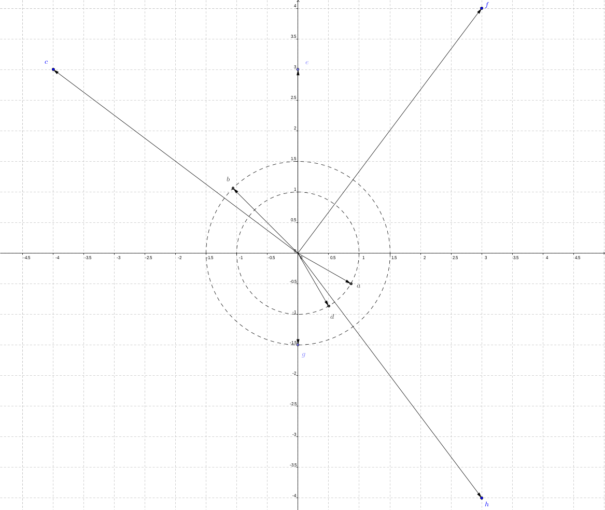<!-- style="display: block; margin-left: auto; margin-right: auto; max-width: 900px;" -->

[[$a$] [$b$] [$c$] [$d$] [$e$] [$f$] [$g$] [$h$]]
[( ) ( ) ( ) ( ) ( ) ( ) ( ) (X)] $3-4\cdot i$
[( ) ( ) (X) ( ) ( ) ( ) ( ) ( )] $-4+3\cdot i$
[( ) ( ) ( ) ( ) (X) ( ) ( ) ( )] $3\cdot i$
[( ) ( ) ( ) ( ) ( ) (X) ( ) ( )] $3+4\cdot i$
[( ) ( ) ( ) ( ) ( ) ( ) (X) ( )] $-\frac{3}{2}\cdot i$
[( ) (X) ( ) ( ) ( ) ( ) ( ) ( )] $\frac{3}{2}\left(\cos{\left(\frac{3}{4}\pi\right)}+\sin{\left(\frac{3}{4}\pi\right)}\cdot i\right)$
[( ) ( ) ( ) (X) ( ) ( ) ( ) ( )] $\cos{\left(\frac{1}{3}\pi\right)}-\sin{\left(\frac{1}{3}\pi\right)}\cdot i$
[(X) ( ) ( ) ( ) ( ) ( ) ( ) ( )] $\sin{\left(\frac{2}{3}\pi\right)}+\cos{\left(\frac{2}{3}\pi\right)}\cdot i$
[[?]] Bestimmen Sie Real- und Imaginärteil der komplexen Zahlen und interpretieren Sie diese als kartesische Koordinaten dieser Zahl in der Gaußschen Zahlenebene. Vergleichen Sie ggf. mit der Polardarstellung (trigonometrischen -) der komplexen Zahl.
****************************************

Die komplexen Zahlen sind in der vorstehenden Abbildung dargestellt.

1. Die ersten fünf komplexen Zahlen liegen in kartesischer Form vor. Es ergeben sich die nachstehenden Koordinatenpaare $$
  3-4\cdot i\;\leftrightarrow\; (3,-4)\,,\quad
  -4+3\cdot i\;\leftrightarrow\; (-4,3)\,,\quad
  3\cdot i\;\leftrightarrow\; (0,3)\,,\quad
  3+4\cdot i\;\leftrightarrow\; (3,4)\quad\text{und}\quad
  -\frac{3}{2}\cdot i\;\leftrightarrow\; \left(0,-\frac{3}{2}\right)
$$
2. Die sechste Zahl ist in Polardarstellung gegeben $$ \frac{3}{2}\left(\cos{\left(\frac{3}{4}\pi\right)}+\sin{\left(\frac{3}{4}\pi\right)}\cdot i\right) $$ Der zur komplexen Zahl gehörende Zeiger schließt mit der reellen Achse einen Winkel $3/4\cdot\pi=135^\circ$ ein und besitzt die Länge $\frac{3}{2}$.
3. Beachten Sie, dass die komplexe Zahl unter Benutzung der Symmetrie für Sinus bzw. Kosinus $$
  \cos{\left(\frac{1}{3}\pi\right)}-\sin{\left(\frac{1}{3}\pi\right)}\cdot i=\cos{\left(-\frac{1}{3}\pi\right)}+\sin{\left(-\frac{1}{3}\pi\right)}\cdot i
$$ in der Polarform angegeben werden kann: Argument und Betrag lassen sich hieraus direkt ablesen $$
  \varphi=-\frac{1}{3}\cdot \pi\,,\quad r=|z|=1
$$
4. Analog lässt sich unter Beachtung der Quadrantenbeziehungen für Sinus und Kosinus $$
  \begin{split}
  \sin{\left(\frac{2}{3}\pi\right)}+\cos{\left(\frac{2}{3}\pi\right)}\cdot i  \\
  & =\cos{\left(\frac{2}{3}\pi-\frac{1}{2}\pi\right)}-\sin{\left(\frac{2}{3}\pi-\frac{1}{2}\pi\right)}\cdot i  \\
  & =\cos{\left(\frac{1}{6}\pi\right)}-\sin{\left(\frac{1}{6}\pi\right)}\cdot i  \\
  & =\cos{\left(-\frac{1}{6}\pi\right)}+\sin{\left(-\frac{1}{6}\pi\right)}\cdot i
  \end{split}
$$ in Polardarstellung überführen. Alternativ lässt sich die letzte Zahl mit $-i$ multiplizieren, was einer Drehung dieser Zahl um den Koordinatenursprung mit Drehwinkel $-\frac{\pi}{2}$ entspricht.

****************************************

**Frage 2.** Zu berechnen sind die zu Zahlen $z\in\mathbb{C}$ bezüglich der Multiplikation inversen Zahlen $z^{-1}$. Diese sind in kartesischer Form anzugeben.

[[$1+2\cdot i$] [$2+i$] [$1-2\cdot i$]]
[( ) (X) ( )]  $\frac{2}{5}-\frac{1}{5}\cdot i$
[(X) ( ) ( )]  $\frac{1}{5}-\frac{2}{5}\cdot i$
[( ) ( ) (X)]  $\frac{1}{5}+\frac{2}{5}\cdot i$
[[?]] Berechnen Sie die multiplikativ inverse Zahl mittels der in Proposition 1 nachgewiesenen Formel.
****************************************

1. $$(1+2\cdot i)^{-1}=\frac{1}{5}-i\cdot\frac{2}{5}$$
2. $$(2+i)^{-1}=\frac{2}{5}-i\cdot\frac{1}{5}$$
3. $$(1-2\cdot i)^{-1}=\frac{1}{5}+i\cdot\frac{2}{5}$$

****************************************

[^1]: Achtung: In der Wechselstromtechnik wird der Bezeichner $i$ als Formelzeichen für die Wechselstromstärke verwendet.

[^2]: Der Ausdruck $D:=\frac{p^2}-4\cdot q$ wird [Diskriminante](https://de.wikipedia.org/wiki/Diskriminante) der quadratischen Gleichung genannt.

[^3]: Die Lage von $P$ bezüglich $k$ kann beschrieben werden mithilfe des Parameters $\mu=\overline{PM}/r$, worin $M$ den Mittelpunkt und $r$ den Radius von $k$ bezeichnen. Es werden unterschieden: Für eine Lage $P$ mit $\mu=0\;\leftrightarrow\;\overline{PM}=0$ fällt die Kurve $c$ mit der Ortskurve von $M$ zusammen, die den festen Abstand $r$ von $k_0$ besitzt. Für eine Lage $P$ mit $ \mu\in(0,1)\;\leftrightarrow\;\overline{PM}\in(0,r)$ befindet sich der Punkt $P$ im Kreisinneren von $k$ und erzeugt eine sogenannte *verkürzte* Rollkurve $c$. Für eine Lage $P$ mit $\mu=1\;\leftrightarrow\;\overline{PM}=r$ erzeugt der Punkt $P\in k$ eine sogenannte *gewöhnliche* Rollkurve $c$. Für eine Lage $P$ mit $\mu>1\;\leftrightarrow\;\overline{PM}>r$ befindet sich der Punkt $P$ außerhalb von $k$ und erzeugt eine sogenannte *verlängerte* Rollkurve $c$.

[^4]: Im Unterschied zu komplexen $n$-ten Wurzeln sind reelle $n$-ten Wurzeln nur für nichtnegative Radikanten erklärt. Die reelle $n$-te Wurzel einer Zahl ist per Definition nichtnegativ, woraus deren Eindeutigkeit folgt.

[^5]: Hier wird [modulo](https://de.wikipedia.org/wiki/Division_mit_Rest) gerechnet: Für $j=n-1\operatorname{mod} n$ ist $j+1=n\operatorname{mod}n=0$.


### Quaternionen

Definition
===


Komplexe Zahlen bilden die Grundlage zur Beschreibung ebener Bewegungsvorgänge, die beispielsweise in ebenen [Koppelgetrieben](https://de.wikipedia.org/wiki/Koppelgetriebe) entstehen und Gegenstand der ebenen Kinematik beziehungsweise Robotik sind.

Auf der Suche, Bewegungen des dreidimensionalen Raumes elegant beschreiben zu können, entdeckte [Sir William Rowan Hamilton](https://de.wikipedia.org/wiki/William_Rowan_Hamilton) im Jahre 1843 die nach ihm benannten Quaternionen. Sie entstehen aus den reellen Zahlen durch Hinzufügen dreier neuer Zahlen, in Anlehnung an die imaginäre Einheit bei den komplexen Zahlen $i$, $j$ und $k$ genannt. Vergleiche Abschnitt [Komplexe Zahlen](#Komplexe-Zahlen).

Hier soll ein kurzer - in weiten Teilen unvollständiger - Einblick in diesen Zahlbereich gegeben werden, dessen alleiniger Fokus auf der Beschreibung von Drehungen und Schiebungen des dreidimensionalen Raumes liegt.

>**Definition 1.** Eine [Quaternion](https://de.wikipedia.org/wiki/Quaternion) (engl.: quaternion) ist ein Ausdruck der Form $$
  Q=a+i\cdot b+j\cdot c+k\cdot d
$$ mit reellen Koeffizienten $a$, $b$, $c$ und $d$ und den Multiplikationsregeln
>
><!-- data-type="none" -->
> | | $i$ | $j$ | $k$ |
>| :--------- | :--------- | :--------- | :--------- |
>| $i$  | $-1$ | $k$ | $-j$ |
>| $j$  | $-k$ | $-1$ | $i$ |
>| $k$  | $j$ | $-i$ | $-1$ |
>
> Die darin auftretende Zahl $a$ wird als *Realteil* von $Q$ bezeichnet, während die anderen Koeffizienten $(b,c,d)$ den *Imaginärraum* von $Q$ bilden.
>
> Die Menge aller Quaternionen wird mit $$
  \mathbb{H}=\left\{a+i\cdot b+j\cdot c+k\cdot d\,|\, (a,b,c,d)\in\mathbb{R}^4\,\wedge\,i^2=j^2=k^2=-1\;\wedge\;i\cdot j\cdot k=-1\right\}
$$ angegeben.[^1]


Rechenoperationen
===


Die Multiplikation der quaternionalen Einheiten $i$, $j$ und $k$ ist assoziativ. Hieraus folgt z. B. $$
  i\cdot j\cdot k=-1\quad\leftrightarrow\quad \textcolor{purple}{i}\cdot(i\cdot j\cdot k)=(i^2)\cdot j\cdot k=-j\cdot k=-\textcolor{purple}{i}
$$ ebenso die restlichen Multiplikationsregeln aus Definition 1.

<!-- style="background-color: lightgray;"-->
>Es seien zwei Quaternionen $Q_m=a_m+b_m\,{i}+c_m\,{j}+d_m\,{k}\in\mathbb{H}$ mit $m\in\{1,2\}$ gemäß Definition 1 gegeben. Es sind die folgenden Operationen erklärt:
>
>1. Die **Addition** von $Q_1$ und $Q_2$ erfolgt komponentenweise mit $$
  Q_1+Q_2=(a_1+a_2)+(b_1+b_2){i}+(c_1+c_2){j}+(d_1+d_2){k}
$$
>2. Die **Multiplikation** von $Q_1$ und $Q_2$ ist erklärt durch $$
  \begin{split}
    Q_1\cdot Q_2 & =\left(a_1a_2-b_1b_2-c_1c_2-d_1d_2\right) + \left(a_1b_2+b_1a_2+c_1d_2-d_1c_2\right){i} \\
    & + \left(a_1c_2+c_1a_2+d_1b_2-b_1d_2\right){j} + \left(a_1d_2+d_1a_2+b_1c_2-c_1b_2\right){k} \\
  \end{split}
$$ Dieses Produkt erhält man durch Ausmultiplizieren der Klammern unter Benutzung der Produktregeln in Definition 1.

**Beispiel 1.** Gegeben sind die Quaternionen $Q_1=1+j$ und $Q_2=1+i$. Dann berechnen sich die Produkte $$
  Q_1\cdot Q_2=(1+j)\cdot(1+i)=1+i+j-k\quad\text{sowie}\quad
  Q_2\cdot Q_1=(1+i)\cdot(1+j)=1+i+j+k
$$

**Bemerkung 1.** Aus Definition 1 und Beispiel 1 ist erkennbar, dass zwar die Addition von Quaternionen kommutativ ist, d. h. dass die Reihenfolge der Summanden vertauschbar ist, jedoch ist die Multiplikation zweier beliebiger Quaternionen im Allgemeinen nicht kommutativ: Das Produkt zweier Quaternionen liefert je nach Reihenfolge der Faktoren unterschiedliche Ergebnisse.

Werden in Definition 1 $(c_m,d_m)=(0,0)$ beziehungsweise $(b_m,d_m)=(0,0)$ beziehungsweise $(b_m,c_m)=(0,0)$ gesetzt, so ergeben sich die Rechenregeln in $\mathbb{C}$.

>**Definition 2.** Sei $Q\in\mathbb{H}$ mit $Q=a+i\cdot b+j\cdot c+k\cdot d$ eine beliebige Quaternion gemäß Definition 1. Dann heißt $$
  \tilde{Q}=a-i\cdot b-j\cdot c-k\cdot d=a-(i\cdot b+j\cdot c+k\cdot d)
$$ die zu $Q$ **quaternional konjugierte Zahl**.

Analog zu $\mathbb{C}$ lässt sich nun bilden:

<!-- style="background-color: lightgray;"-->
> Der **Betrag** einer Quaternion $Q=a+i\cdot b+j\cdot c+k\cdot d$ mit reellen Koeffizienten $(a,b,c,d)\in\mathbb{R}^4$ ist definiert als $$
  |Q|=\sqrt{Q\cdot\tilde{Q}}=\sqrt{a^2+b^2+c^2+d^2}\;\in[0,\infty)
$$ Somit gilt $|Q|=0\;\leftrightarrow\; Q=0+0\cdot i+0\cdot j+0\cdot k=0$

**Nachweis.** Für das Produkt  $Q\cdot\tilde{Q}$ folgt unter Benutzung der Multiplikationregel $$
\begin{split}
  Q\cdot\tilde{Q} & =
  (Q=a+i\cdot b+j\cdot c+k\cdot d)\cdot (a-i\cdot b-j\cdot c-k\cdot d) \\
  & = \left(a^2+b^2+c^2+d^2\right) + \left(-a\cdot b+b\cdot a-c\cdot d+d\cdot c\right){i} + \left(-a\cdot c+c\cdot a-d\cdot b+b\cdot d\right){j} + \left(-a\cdot d+d\cdot a-b\cdot c+c\cdot b\right){k} \\
  & = \left(a^2+b^2+c^2+d^2\right)
\end{split}
$$ Der Ausdruck ist reell und für jede Wagl der Parameter $a$, $b$, $c$ und $d$ nicht negativ, wonach $|Q|$ wohldefiniert ist.

$\square$


Drehungen des dreidimensionalen Raums
===


Drehungen des dreidimensionalen Raumes um eine Gerade durch den Koordinatenursprung $O(0,0,0)$ lassen sich in Analogie zu den komplexen Zahlen unter Benutzung der Multiplikation von Quaternionen darstellen. Siehe Abschnitt [Komplexe Zahlen](#Komplexe-Zahlen).

1. Die kartesischen Koordinaten $(x,y,z)$ eines Punktes werden umkehrbar eindeutig als imaginäre Quaternion dargestellt $$
  (x,y,z)\in\mathbb{R}^3\quad\leftrightarrow\quad Q=x\cdot i+y\cdot j+z\cdot k\;(\in\mathbb{H})
$$ Der Realteil der Quaternion $Q$ ist somit Null.
2. Die Richtung und Orientierung einer Drehachse $e$ durch $O$ kann unter Verwendung "geographischer Koordinaten" $(\lambda,\mu)\in[0,2\pi)\times\left[-\frac{\pi}{2},\frac{\pi}{2}\right]$ angegeben werden. Sie berechnet sich $$
  e=\left(\begin{array}{r} b \\ c \\ d \end{array}\right)=\left(\begin{array}{r} \cos{\lambda}\cdot\cos{\mu} \\ \sin{\lambda}\cdot\cos{\mu} \\ \sin{\mu} \end{array}\right)
$$ Hierbei gilt $b^2+c^2+d^2=1$ für alle Paare $(\lambda,\mu)$, was der Länge des Richtungsvektors $e$ entspricht.
3. Wird ein beliebiger Punkt um die Drehachse mit Drehwinkel $\varphi\in[0,2\pi)$ gedreht, so berechnen sich die kartesischen Koordinaten des Bildes des Punktes vermöge $$
  (x',y',z')\quad\leftrightarrow\quad Q'=x'\cdot i+y'\cdot j+z'\cdot k
$$ mit $$
  Q'=Q_\varphi\cdot Q\cdot\tilde{Q}_\varphi\quad\text{und}\quad Q_\varphi=\cos{\left(\frac{\varphi}{2}\right)}+\sin{\left(\frac{\varphi}{2}\right)}\cdot\left(b\cdot i+c\cdot j+d\cdot k\right)
$$ Wie bei komplexen Zahlen wie $z_\varphi\in\mathbb{C}$ mit $|z_\varphi|=1$ zur Beschreibung von Drehungen der Ebene gilt auch hier $$
  |Q_\varphi|^2=Q_\varphi\cdot\tilde{Q}_\varphi=\left(\cos{\left(\frac{\varphi}{2}\right)}\right)^2+\left(\sin{\left(\frac{\varphi}{2}\right)}\right)^2\cdot\left(b^2+c^2+d^2\right)=1\quad\leftarrow\quad b^2+c^2+d^2=1
$$ Die aus der Konstruktion der Drehachsenrichtung erhaltene Eigenschaft der Länge Eins (2.) ist für die Konstruktion des Bildes $Q'$ notwendig.

**Beispiel 2.** Die Drehung des dreidimensionalen Raums um die $x$-Achse des Koordinatensystems mit einem Drehwinkel $60^\circ$ soll unter Benutzung des Quaternionenkalküls beschrieben werden.

1. Die kartesischen Koordinaten $(x,y,z)$ eines Punktes in allgemeiner Lage werden umkehrbar eindeutig als imaginäre Quaternion dargestellt $$
  (x,y,z)\in\mathbb{R}^3\quad\leftrightarrow\quad Q=x\cdot i+y\cdot j+z\cdot k\;(\in\mathbb{H})
$$
2. Für die Drehachsenrichtung ergibt sich der Vektor $$
  e=\left(\begin{array}{r} 1 \\ 0 \\ 0 \end{array}\right)=\left(\begin{array}{r} \cos{0}\cdot\cos{0} \\ \sin{0}\cdot\cos{0} \\ \sin{0} \end{array}\right)
$$ Unter Berücksichtigung des Drehwinkels $\varphi=\frac{\pi}{3}$ ergibt sich die Quaternion $Q_\varphi$ zur Bechreibung der Drehung $$
  Q_\varphi=\cos{\left(\frac{\pi}{6}\right)}+\sin{\left(\frac{\pi}{6}\right)}\cdot\left(1\cdot i+0\cdot j+0\cdot k\right)=\cos{\left(\frac{\pi}{6}\right)}+\sin{\left(\frac{\pi}{6}\right)}\cdot i=\frac{1}{2}\cdot\sqrt{3}+\frac{1}{2}\cdot i
$$
3. Für das Bild $Q'$ von $Q$ unter der Drehung ergibt sich somit unter Nutzung der Multiplikationsregeln und der Assoziativität $$
  \begin{split}
    Q' & =Q_\varphi\cdot Q\cdot\tilde{Q}_\varphi \\
    & = \left(\frac{1}{2}\cdot\sqrt{3}+\frac{1}{2}\cdot i\right)\cdot(x\cdot i+y\cdot j+z\cdot k)\cdot\left(\frac{1}{2}\cdot\sqrt{3}-\frac{1}{2}\cdot i\right) \\
    & = \left[-\frac{x}{2}+i\cdot\frac{1}{2}\cdot\sqrt{3}\cdot x+j\cdot\left(\frac{1}{2}\cdot\sqrt{3}\cdot y-\frac{z}{2}\right)+k\cdot\left(\frac{1}{2}\cdot\sqrt{3}\cdot z+\frac{y}{2}\right)\right]\cdot\left(\frac{1}{2}\cdot\sqrt{3}-\frac{1}{2}\cdot i\right) \\
    & = -\frac{1}{4}\cdot\sqrt{3}\cdot x+i\cdot\frac{3}{4}\cdot x+j\cdot\left(\frac{3}{4}\cdot y-\frac{1}{4}\cdot\sqrt{3}\cdot z\right)+k\cdot\left(\frac{3}{4}\cdot z+\frac{1}{4}\cdot\sqrt{3}\cdot y\right)+i\cdot \frac{x}{4}+\frac{1}{4}\cdot\sqrt{3}\cdot x +k\cdot\left(\frac{1}{4}\cdot\sqrt{3}\cdot\cdot y-\frac{z}{4}\right)-j\cdot\left(\frac{1}{4}\cdot\sqrt{3}\cdot z+\frac{y}{4}\right) \\
    & = i\cdot x+ j\cdot\left(\frac{1}{2}\cdot y-\frac{1}{2}\cdot\sqrt{3}\cdot z\right)+k\cdot\left(\frac{1}{2}\cdot\sqrt{3}\cdot y+\frac{1}{2}\cdot z\right)
  \end{split}
$$ Der Bildpunkt besitzt somit die kartesischen Koordinaten $$
  Q\left[x,
  \left(\frac{1}{2}\cdot y-\frac{1}{2}\cdot\sqrt{3}\cdot z\right),
  \left(\frac{1}{2}\cdot\sqrt{3}\cdot y+\frac{1}{2}\cdot z\right)
\right]
$$


Sicher gewusst
===

**Frage 1.** Gegeben sind die Quaternionen $Q_1=4j-2k$ und $Q_2=1-i$ gegeben. Berechnen Sie die nachstehenden Ausdrücke.

[[$Q_1\cdot Q_2$] [$$Q_2\cdot Q_1$$]]
[( ) (X)]  $2j-6k$
[(X) ( )]  $6j+2k$
[[?]] Nutzen Sie zur Berechnung der Produkte die Multiplikationstafel in Definition 1.
****************************************

Die Produkte berechnen sich schrittweise $$
  Q_1\cdot Q_2=(4j-2k)\cdot(1-i)=4j-4ji-2k+2ki=4j+4k-2k+2j=6j+2k
$$ sowie $$
  Q_2\cdot Q_1=(1-i)\cdot(4j-2k)=4j-2k-4ij+2ik=4j-2k-4k-2j=2j-6k\;\neq Q_1\cdot Q_2
$$

****************************************

**Frage 2.** Eine Drehung des dreidimensionalen Raumes soll um die Gerade $$
  x=0\;\wedge\; z=y
$$ erfolgen. Der Drehwinkel ist $90^\circ$ angegeben.

Berechnen Sie die Quaternion $Q_\varphi$ im Ansatz  $Q'=Q_\varphi\cdot Q\cdot \tilde{Q}_\varphi$ zur Beschreibung der Drehung.

[[ ]] $$ \frac{1}{2}\cdot\sqrt{2}\cdot j+\frac{1}{2}\cdot\sqrt{2}\cdot k $$
[[X]] $$ \frac{1}{2}\cdot\sqrt{2}+\frac{1}{2}\cdot j+\frac{1}{2}\cdot k $$
[[X]] $$ \frac{1}{2}\cdot\sqrt{2}-\frac{1}{2}\cdot j-\frac{1}{2}\cdot k $$
[[ ]] $$ \frac{1}{2}\cdot\sqrt{2}+\frac{1}{2}\cdot\sqrt{2}\cdot j+\frac{1}{2}\cdot\sqrt{2}\cdot k $$
[[?]] Bestimmen Sie die Richtung der Drehachse und normieren Sie diesen Vektor. Setzen Sie dann in den Ansatz $$
  Q_\varphi=\cos{\left(\frac{\varphi}{2}\right)}+\sin{\left(\frac{\varphi}{2}\right)}\cdot\left(b\cdot i+c\cdot j+d\cdot k\right)
$$ ein, worin $(b,c,d)$ die Drehachsenrichtung und $\varphi$ den Drehwinkel bezeichnen.
****************************************

Für den Drehwinkel gilt $\frac{\varphi}{2}=45^\circ$ und damit $$
  \cos{\left(\frac{\varphi}{2}\right)}=\sin{\left(\frac{\varphi}{2}\right)}=\frac{1}{2}\cdot\sqrt{2}
$$ Für die Drehachsenrichtung ergeben sich die 'geographischen' Koordinaten $\lambda=\frac{\pi}{2}$ und $\mu=\frac{\pi}{4}$, also $$
  e=\left(\begin{array}{r} \cos{\left(\frac{\pi}{2}\right)}\cdot\cos{\left(\frac{\pi}{4}\right)} \\ \sin{\left(\frac{\pi}{2}\right)}\cdot\cos{\left(\frac{\pi}{4}\right)} \\ \sin{\left(\frac{\pi}{4}\right)} \end{array}\right)=
  \left(\begin{array}{r} 0 \\ \frac{1}{2}\cdot\sqrt{2} \\ \frac{1}{2}\cdot\sqrt{2} \end{array}\right)
$$ Alternativ berechnet sich $e$ über Stauchung des Vektors mit dem Parameter $\alpha$ $$
  e=\left(\begin{array}{r} 0 \\ \alpha \\ \alpha \end{array}\right)
$$ so dass $0^2+\alpha^2+\alpha^2=2\cdot\alpha^2=1$ gilt: Dies ist für $\alpha=\pm\frac{1}{2}\cdot\sqrt{2}$ erfüllt. Schließlich ergibt sich daraus $$
  Q_\varphi=\cos{\left(\frac{\pi}{4}\right)}+\sin{\left(\frac{\pi}{4}\right)}\cdot\left(\pm\frac{1}{2}\cdot\sqrt{2}\cdot j\pm\frac{1}{2}\cdot\sqrt{2}\cdot k\right)=\frac{1}{2}\cdot\sqrt{2}\pm\frac{1}{2}\cdot j\pm\frac{1}{2}\cdot k
$$ worin genau eines der Operationszeichen zu wählen ist.[^2]

Hingegen entfällt die erste Antwortoption, da dort nicht $\frac{\varphi}{2}$, sondern $\varphi$ verwendet wurde. Bei der letzten Antwortoption ist wurde vergessen, den Vektor $e$ zu normieren.

****************************************

[^1]: Die bei der Angabe von $\mathbb{H}$ abweichenden Multiplikationsregeln sind aus Gründen der Lesbarkeit gewählt und werden im folgenden Abschnitt erklärt.

[^2]: Bei Angabe der Quaternion $Q_\varphi$ ist nicht nur die Drehachse anzugeben, sondern auf deren Richtungssinn festzulegen. Der Drehwinkel wird bezüglich des gewählten Richtungssinns angegeben - 'plus' beziehungsweise 'minus'.


## Analytische Geometrie


In diesem ersten Kapitel vertiefen Sie Ihre Kenntnisse in der analytischen Geometrie und lernen den Begriff des Teilungsverhältnis in verschiedenen Anwendungen kennen. Dazu zählen u. a.

* Grundlagen aus der analytischen Geometrie: Vektoren und Matrizen
* Teilverhältnis auf Strecken und affine Koordinaten
* affine und kartesische Koordinatensysteme
* Basiswechsel und Koordinatentransformation
* Schwerpunkt eines Massensystems
* konvexe Hülle einer Punktmenge
* Unterteilungskurven und Bézier-Kurven

Für einen Überblick über die Themen dieses Kapitels sehen Sie in der nachstehenden Graphik einige zentrale Begriffe. Schlagen Sie diese in diesem Abschnitt nach.

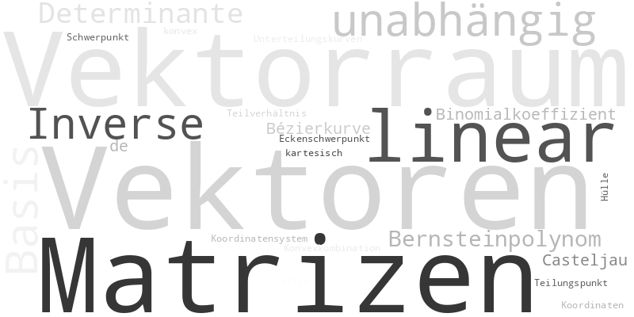<!-- style="display: block; margin-left: auto; margin-right: auto; max-width: 1000px; " -->

Lernziele
-----

* ..


### Affine Koordinatensysteme

Ziel ist es, die Lage eines Punktes auf einer Geraden / in der Ebene / im Raum in einem geeigneten Koordinatensystem zu beschreiben.

Koordinatensystem auf einer Geraden
===================================

Gegeben sind zwei Punkte $O$ ('Ursprung') sowie $E$ ('Einheitspunkt') auf einer Geraden $g$. Die Strecke $[O,E]$ besitzt die Länge $\overline{OE}=e>0$ ('Einheitslänge').


Für einen weiteren Punkt $X\in g$ gilt nach dem Strahlensatz
$$
  \frac{|x|}{1}=\frac{\overline{OX}}{\overline{OE}}\geq 0
$$
worin $|x|$ den Absolutbetrag des reellen Skalenwertes $x$ bezeichnet. Um eine eineindeutige Zuordnung zwischen den Werten $x$ und den Lagen des Punktes $X\in g$ bezüglich der Punkte $O\in g$ und $E\in g$ zu erhalten, wird vereinbart:

| $x>0$ | $x<0$ |
| $O$ trennt die Punkte $E$ und $X$ *nicht* | $O$ trennt die Punkte $E$ und $X$ |

Des Weiteren wird $x=0$ genau für die Lage $X=O$ vereinbart.

> **Definition.** Das Teilverhältnis eines Punktes $X$ auf der Geraden $AB$ ist das vorzeichenbehaftete Verhältnis
> $$
  \lambda=TV(X,B,A)=\epsilon\cdot\frac{\overline{AX}}{\overline{AB}},
  \quad\epsilon=\pm1
$$
> je nachdem $A$ die Punkte $B$ und $X$ trennt oder nicht.
>
> $\lambda$ wird affine Koordinate von $X$ bezüglich $(A,B)$, das Paar $(A,B)$ ein **affines Koordinatensystem** auf $g$ genannt.

> **Satz.** Ein affines Koordinatensystem auf einer Geraden $g$ ist durch zwei verschiedene Punkte $O\in g$ und $E\in g$ bestimmt. Jedem Punkt $X$ der Geraden wird in eineindeutiger Weise als affine Koordinate
> $$
  x=TV(X,E,O)
$$
> zugewiesen.

**Beispiel 1.** Für den Halbierungspunkt $H$ einer Strecke $[A,B]$ gilt nach Definition $$ TV(H,B,A)=\frac{\overline{HA}}{\overline{BA}}\cdot (+1)=\frac{1}{2}$$ Das Teilverhältnis vergleicht die Länge der Teilstrecke $[A,H]$ mit der Länge der Gesamtstrecke $[A,B]$. Das Vorzeichen ist $+1$, da $A$ die Punkte $B$ und $H$ nicht trennt.

Soll ein Punkt $T$ der Strecke $[A,B]$ diese im Verhältnis $1:3$ der Teillängen teilen, so ergeben sich zwei mögliche Lagen von $T$.[^3]

<!-- style="display: block; margin-left: auto; margin-right: auto; max-width: 615px;" -->
```````````````````````````````````````````````````````````````````
A                 B     A                 B     A                 B
*--------*--------*     *----*------------*     *------------*----*
         H                   T                               T
```````````````````````````````````````````````````````````````````

Für das Teilverhältnis ergibt sich entsprechend $TV(T,B,A)=\frac{1}{4}$ beziehungsweise $TV(T,B,A)=\frac{3}{4}$. Siehe Abschnitt [Teilungspunkt einer Strecke](#Teilungspunkt-einer-Strecke).

**Bemerkung.** Das Teilverhältnis bleibt unter Parallelprojektionen erhalten, d. h. es ändert sich dabei nicht .[^4] Man sagt, es ist invariant unter Parallelprojektionen.

<!-- style="display: block; margin-left: auto; margin-right: auto; max-width: 415px;" -->
``````````````````````````````````````````````````
     \
--- A *-------------*---------------*---- h
     / \           / B''           / C''
    =   \         =               =
   /     \       /               /
--*-------\-----*---------------*---- g'
  A'       \   / B'            / C'
            \ /               /
             *  B            /
              \             /
               \           /
                \         /
                 \       /
                  \     /
                   \   /
                    \ /
                     * C
                      \
                       g
``````````````````````````````````````````````````

Durch Parallelprojektion werden alle Punkte der Geraden $g$ abgebildet auf Punkte der Geraden $g'$ mithilfe untereinander paralleler Projektionsgeraden
$$
  AA'\,,\quad BB'\,,\quad CC'
$$
Wähle eine Gerade $h$ parallel zu $g'$ durch $A$. Durch Parallelprojektion ergeben sich die Punkte
$$
  B''=BB'\cap h\,,\quad C''=CC'\cap h
$$
mit den Abständen
$$
  \overline{A'B'}=\overline{AB''}\,,\quad \overline{A'C'}=\overline{AC''}
$$
Mit dem Strahlensatz gilt schließlich
$$
  \frac{\overline{AB}}{\overline{AC}}=\frac{\overline{AB''}}{\overline{AC''}}=\frac{\overline{A'B'}}{\overline{A'C'}}
$$
$\square$


Koordinatensystem in einer Ebene
================================

Ein affines Koordinatensystem in einer Ebene lässt sich durch drei Punkte dieser Ebene festlegen, die ein echtes Dreieck bilden. Einer der Punkte sei mit $O$ ('Ursprung'), die beiden anderen mit $E_1$ bzw. $E_2$ ('Einheitspunkte') bezeichnet.

Die Paare $(O,E_1)$ bzw. $(O,E_2)$ bilden jeweils ein affines Koordinatensystem auf
$$
  g_i=O\vee E_i\,,\quad i\in\{1,2\}
$$
die Koordinatenachsen genannt werden. Die Strecken $[O,E_1]$ bzw. $[O,E_2]$ besitzen die Längen $\overline{OE_1}=e_1$ bzw. $\overline{OE_2}=e_2$ ('Einheitslängen').

Jeder Punkt $X$ der Ebene legt vermöge der Geraden $\bar{g}_i$ mit
$$
  \bar{g}_i\parallel g_i \;\wedge\; \bar{g}_i\ni X
$$
ein Punktepaar $(X_1,X_2)$ mit
$$
  X_1 = \bar{g}_2\cap g_1\,,\quad X_2 = \bar{g}_1\cap g_2
$$
fest.

$: Ein Punkt $X$ wird durch die Teilverhältnisse der beiden Koordinatenprojektionen $X_i$ zur Strecke $[O,E_i]$, $i\in\{1,2\}$, umkehrbar eindeutig beschrieben.")

Für $X\not\in g_i$, $i\in\{1,2\}$, bilden $O$ und $X$ die gegenüberliegenden Punkte eines achsenparallelen Parallelogramms mit den Seitenlängen $e_1$ und $e_2$.

> **Satz.** Ein affines Koordinatensystem in einer Ebene $\mathcal{A}^2$ ist durch ein in $\mathcal{A}^2$ liegendes echtes Dreieck mit Eckpunkten $O$, $E_1$ und $E_2$ bestimmt. Jeder Punkt $X\in\mathcal{A}^2$ ist in in umkehrbar eindeutiger Weise durch seine affinen Koordinaten
> $$
  x_1=TV(X_1,E_1,O)\,,\quad x_2=TV(X_2,E_2,O)
$$
> festgelegt.[^1]

Jeder Kantenzug des Parallelogramms von $O$ nach $X$, in dem jede Strecke parallel zu $g_i$ genau einmal vorkommt, heißt dabei ein **Koordinatenweg** von $X$ bezüglich des affinen Koordinatensystems $(O,E_1,E_2)$.

**Bemerkung.** Zur Berechnung des Teilverhältnis von drei Punkten auf einer Geraden $g$ können zweireihige Determinanten zu den Koordinatenvektoren der Punkte verwendet werden.
$$
  TV(C,B,A)=\frac{\det{\begin{pmatrix} x_A & x_C \\ y_A & y_C  \end{pmatrix}}}{\det{\begin{pmatrix} x_A & x_B \\ y_A & y_B \end{pmatrix}}}
$$
Überlegen Sie, in welchen Fällen sich diese Formel verwenden lässt, und in welchen Fällen nicht. Warum beschreibt diese das Teilverhältnis?

Mit Hilfe der Javascript Bibliothek [Algebrite](http://algebrite.org/) ist nachfolgend die Berechnung des Teilverhältnis der drei Punkte ausgeführt.

``` javascript
A=[xa,ya]
B=[xb,yb]
C=[xc,yc]
zaehler=[[C[1],A[1]],[C[2],A[2]]]
nenner=[[B[1],A[1]],[B[2],A[2]]]
det(zaehler)/det(nenner)
```
@Algebrite.eval


Koordinatensystem im dreidimensionalen Raum
===========================================

Ein affines Koordinatensystem im dreidimensionalen Raum $\mathcal{A}^3$ lässt sich durch vier Punkte dieser Ebene festlegen, die ein echtes Tetraeder bilden. Einer der Punkte sei mit $O$ ('Ursprung'), die anderen mit $E_1$ bzw. $E_2$ bzw. $E_3$ ('Einheitspunkte') bezeichnet.

Die Paare $(O,E_1)$ bzw. $(O,E_2)$ bzw. $(O,E_3)$ bilden jeweils ein affines Koordinatensystem auf
$$
  g_i=O\vee E_i\,,\quad i\in\{1,2,3\}
$$
die Koordinatenachsen genannt werden. Die Strecken $[O,E_1]$ bzw. $[O,E_2]$ bzw. $[O,E_3]$ besitzen die Längen $\overline{OE_1}=e_1$ bzw. $\overline{OE_2}=e_2$ bzw. $\overline{OE_3}=e_3$ ('Einheitslängen').

Jeder Punkt $X$ der Ebene legt vermöge der Ebenen $\epsilon_i$ mit
$$
  \epsilon_i\parallel g_{j}\;\wedge\;\epsilon_i\parallel g_{k}\;\wedge\;\epsilon_i\ni X
$$
und $j\in\{1,2,3\}$, $k\in\{1,2,3\}$ sowie $i\not=j\not=k\not=i$ auf ein Punktetripel $(X_1,X_2,X_3)$ mit
$$
  X_i = \epsilon_i\cap g_i\,,\quad i\in\{1,2,3\}
$$
fest.
Für $X\not\in g_i$, $i\in\{1,2,3\}$, bilden $O$ und $X$ die gegenüberliegenden Punkte eines achsenparallelen [Parallelepipeds](https://de.wikipedia.org/wiki/Parallelepiped "Wikipedia") mit den Kantenlängen $e_1$, $e_2$ und $e_3$.

> **Satz.** Ein affines Koordinatensystem im dreidimensionalen Raum $\mathcal{A}^3$ ist durch ein in $\mathcal{A}^3$ liegendes echtes Tetraeder mit Eckpunkten $O$, $E_1$, $E_2$ und $E_2$ bestimmt. Jeder Punkt $X\in\mathcal{A}^3$ ist in in umkehrbar eindeutiger Weise durch seine affinen Koordinaten
> $$
  x_1=TV(X_1,E_1,O)\,,\quad x_2=TV(X_2,E_2,O)\,,\quad x_3=TV(X_3,E_3,O)
$$
> festgelegt.[^1]

Jeder Kantenzug des Parallelepipeds von $O$ nach $X$, in dem jede Strecke parallel zu $g_i$ genau einmal vorkommt, heißt dabei ein **Koordinatenweg** von $X$ bezüglich des affinen Koordinatensystems $(O,E_1,E_2,E_3)$.

> **Definition.** Ein affines Koordinatensystem heißt **kartesisch**, wenn die Koordinatenachsen paarweise orthogonal sind und die Längen der Einheitsstrecken übereinstimmen.[^2]

**Beispiel 2.** Das natürliche Koordinatensystem in $\mathbb{R}^3$ mit Ursprung und den Einheitspunkten
$$
  O(0,0,0)\,,\quad E_1(1,0,0)\,,\quad E_2(0,1,0)\,,\quad E_3(0,0,1)
$$
ist kartesisch, da die Einheitslängen gleich sind
$$
  \overline{OE_j}=(e_j)^2=1\quad\leftrightarrow\quad \overrightarrow{OE_j}\cdot\overrightarrow{OE_j}=1
$$
für beliebige $j\in\{1,2,3\}$ und die Koordinatenachsen paarweise orthogonal sind
$$
  OE_j\perp OE_k\quad\leftrightarrow\quad \overrightarrow{OE_j}\cdot\overrightarrow{OE_k}=0
$$
für beliebige $(j,k)\in\{1,2,3\}^2$ mit $j\not=k$.

**Beispiel 3.** Der Abstand zweier Punkte $X$ und $Y$ in der Ebene $\mathcal{A}^2$ berechnet sich bezüglich eines affinen Koordinatensystems $(O,E_1,E_2)$ mithilfe des Kosinussatzes in einem allgemeinen Dreieck
$$
  \overline{XY}^2=
  (y_1-x_1)^2\cdot (e_1)^2+(y_2-x_2)^2\cdot (e_2)^2 \\
  -2\cdot(y_1-x_1)\cdot(y_2-x_2)\cdot|\overrightarrow{OE_1}\cdot\overrightarrow{OE_2}|
$$
Ist das Koordinatensystem speziell kartesisch, so ergibt sich hieraus der Abstand mittels
$$
  \overline{XY}=\sqrt{(y_1-x_1)^2+(y_2-x_2)^2}
$$

Sicher gewusst?
===============

Sie können Ihr Wissen gern bei der Beantwortung der nachstehenden Fragen testen.

**Frage 1.** Nachstehend sind drei grundsätzlich zu unterscheidende Lagen von $X$ bezüglich des Paares $(O,E)$ angegeben. Ordnen Sie die Abbildungen den Größenangaben für
$$
  x=TV(X,E,O)
$$
zu.

<!-- style="display: block; margin-left: auto; margin-right: auto; max-width: 415px;" -->
``````````````````````````````````````````````````
O     E                     O     E     O     E
*-----*-------*     *-------*-----*     *-----*
              X     X                   X
      (a)                 (b)             (c)
``````````````````````````````````````````````````

[[(a)] [(b)] [(c)]]
[( ) ( ) (X)]  $x=0$
[(X) ( ) ( )]  $x>0$
[( ) (X) ( )]  $x<0$
[[?]] Der Punkt $O$ wird als Ursprung, $E$ als Einheitspunkt eines affinen Koordinatensystems auf der Gerade $OE$ verwendet.
****************************************

Im Bild (a) trennt $O$ die beiden übrigen Punkte nicht, jedoch in (b). Im Fall (c) fällt $X$ mit $O$ zusammen.

****************************************
---


**Frage 2.** Das Teilverhältnis des Punktes $X$ bezüglich $(A,B)$ mit $$ A(1,0)\,,\quad B(3,0)\,,\quad X(-5,0)$$ berechnet sich

[( )] $TV(X,B,A)=-5$
[( )] $TV(X,B,A)=-\frac{1}{3}$
[(X)] $TV(X,B,A)=-3$
[[?]] An der Reihenfolge der Argumente in $TV(.)$ ist abzulesen, dass der Punkt $A$ als Ursprung, $B$ als Einheitspunkt eines affinen Koordinatensystems auf der Gerade $AB$ interpretiert wird. Es berechnet sich $$
  TV(X,B,A)=\epsilon\cdot\frac{\overline{XA}}{\overline{BA}}
$$
****************************************

Die Punkte $A$,$B$ und $X$ liegen auf der $x$-Achse eines Koordinatensystems, wobei $B$ und $X$ durch $A$ (Ursprung des affinen Koordinatensystems) getrennt sind. Es berechnet sich $$
  TV(X,B,A)=(-1)\cdot\frac{6}{2}=-3
$$

****************************************

[^1]: Im zu $O\in\mathcal{A}^d$, $d\in\{2,3\}$, gehörigen Ortsvektorraum bilden die zu $E_1$ bis $E_d$ gehörenden Ortsvektoren eine Basis, worin sich der Ortsvektor eines jeden Punktes $X\in\mathcal{A}^d$ mit den Koeffizienten $(x_1,\ldots,x_d)$ eindeutig darstellen lässt.

[^2]: Diesen Einheitsstrecken wird die Länge $1$ zugewiesen.

[^3]: Soll eine Strecke durch einen Punkt der Strecke im Verhältnis $m:n$ geteilt werden, so existieren für $m\in\mathbb{N}$ und $n\in\mathbb{N}$ mit $m$ verschieden von $n$ stets zwei Möglichkeiten.

[^4]: Sofern nicht in Richtung der Geraden $g$ projiziert wird.


### Basistransformationen

Bezogen auf ein gewähltes affines Koordinatensystem $(O,E_1,...E_d)$ mit $d\in\mathbb{N}$, $d>0$ ist die natürliche Basis $(e_1,\ldots,e_d)$ gegeben mit $$
  e_1=\overrightarrow{OE_1}=\begin{pmatrix} 1 \\ 0 \\ \vdots \\ 0 \end{pmatrix},\quad\ldots\quad,\,
  e_d=\overrightarrow{OE_d}=\begin{pmatrix} 0 \\ \vdots \\ 0 \\ 1 \end{pmatrix}
$$ Jeder Vektor $x\in\mathbb{R}^d$ besitzt die eindeutige Darstellung als Linearkombination $$
  x=\sum_{i=1}^d{x_i\cdot e_i}
$$ bezüglich dieser Basis mit den reellen Koeffizienten $x_i$, den **Koordinaten** bezüglich der Basis $(e_1,\ldots,e_d)$. Bezüglich einer anderen Basis $(b_1,\ldots,b_d)$ besitze $x$ die Koordinaten $(x_1^\prime,\ldots,x_d^\prime)\in\mathbb{R}^d$ und lässt sich somit darstellen als $$
  x=\sum_{i=1}^d{x_i^\prime\cdot b_i}
$$


Basiswechsel
=====

Hier wird der Basiswechsel im Vektorraum betrachtet $$
  (e_1,\ldots, e_d)\quad\to\quad(b_1,\ldots, b_d)
$$ worin erstere die "alte" und letztere die "neue" Basis genannt wird. Stellt man den $i$-ten Basisvektor $b_i$ der neuen Basis als Linearkombination in der alten Basis dar, d. h. $$
  b_{\textcolor{red}{i}}=b_{1\textcolor{red}{i}}\cdot e_1+\ldots+b_{d\textcolor{red}{i}}\cdot e_d=\sum_{k=1}^d{b_{k\textcolor{red}{i}}\cdot e_k}\,,\quad \textcolor{red}{i}\in\{1,\ldots,d\}
$$ und somit - unter Vertauschung der Reihenfolge der Summenzeichen $$
  x=\sum_{\textcolor{red}{i}=1}^d{\left[x_{\textcolor{red}{i}}^\prime\cdot\left(\sum_{k=1}^d{b_{k\textcolor{red}{i}}\cdot e_k}\right)\right]}=
  \sum_{k=1}^d{\left[\left(\sum_{\textcolor{red}{i}=1}^d{b_{k\textcolor{red}{i}}\cdot x_{\textcolor{red}{i}}^\prime}\right)\cdot e_k\right]}
$$ Darin bezeichnen $$\sum_{\textcolor{red}{i}=1}^d{b_{k\textcolor{red}{i}}\cdot x_{\textcolor{red}{i}}^\prime}=x_k $$ die Koordinaten von $x$ bezüglich der alten Basis. Hieraus ergibt sich schließlich die Basistransformation der Koordinatenvektoren $$
  \begin{pmatrix} x_1 \\ \vdots \\ x_d \end{pmatrix}=
  \begin{pmatrix} b_{11} & \ldots & b_{1d} \\ \vdots & \ddots & \vdots \\ b_{d1} & \ldots & b_{dd} \end{pmatrix}\cdot
  \begin{pmatrix} x_1^\prime \\ \vdots \\ x_d^\prime \end{pmatrix}
$$ Die quadratische Matrix $B$ in der vorstehenden Gleichung beschreibt den **Basiswechsel**. Die Spaltenvektoren von $B$ sind die Koordinaten der "neuen" Basisvektoren $b_i$ bezüglich der "alten" Basis $(e_1,\ldots,e_d)$.

**Beispiel 1.** Gegeben ist die natürliche Basis in $\mathbb{R}^2$ mit $$
  e_1=\begin{pmatrix} 1 & 0 \end{pmatrix}\quad\text{und}\quad
  e_2=\begin{pmatrix} 0 & 1 \end{pmatrix}
$$ Die Vektoren $$
  b_1=\textcolor{red}{1}\cdot e_1+\textcolor{red}{1}\cdot e_2=\begin{pmatrix} \textcolor{red}{1} \\ \textcolor{red}{1} \end{pmatrix}\quad\text{und}\quad
  b_2=\textcolor{purple}{1}\cdot e_1\textcolor{purple}{-1}\cdot e_2=\begin{pmatrix} \textcolor{purple}{1} \\ \textcolor{purple}{-1} \end{pmatrix}
$$ lassen sich bezüglich der Basis $(e_1,e_2)$ darstellen, woraus sich die Matrix des Basiswechsels ergibt $$
  B=\begin{pmatrix} \textcolor{red}{1} & \textcolor{purple}{1} \\ \textcolor{red}{1} & \textcolor{purple}{-1} \end{pmatrix}
$$ Ein (Orts-) Vektor $x$, der bezüglich der "neuen" Basis $(b_1,b_2)$ die Koordinaten $(x_1^\prime,x_2^\prime)$ besitzt, besitzt bezüglich der "alten" Basis $(e_1,e_2)$ den Koordinatenvektor $$
  \begin{pmatrix} x_1 \\ x_2 \end{pmatrix}=
  \begin{pmatrix} 1 & 1 \\ 1 & -1 \end{pmatrix}\cdot\begin{pmatrix} x_1^\prime \\ x_2^\prime \end{pmatrix}=
  \begin{pmatrix} x_1^\prime+x_2^\prime \\ x_1^\prime-x_2^\prime \end{pmatrix}
$$ Es gelten beispielsweise $$
  x^\prime=1\cdot b_1+1\cdot b_2\quad\text{bzw.}\quad x=2\cdot e_1+0\cdot e_2
$$ Vergleiche die nachstehende Abbildung.

$ (rot) und neue Basis $(b_1,b_2)$ (blau). Dargestellt ist auch ein Vektor $x$, dessen Koordinatenvektor in der neuen Basis $(1,1)^\top$, nach Basistransformation in die alte Basis $(2,0)^\top$ ist.")

Die Berechnung des Koordinatenvektor $x$ bezüglich $(e_1,e_2)$ aus dem durch Basiswechsels $$
  (e_1,e_2)\to (b_1,b_2)
$$ betrachteten Koordinatenvektor $x^\prime$ bezüglich $(b_1,b_2)$ ist nachfolgend unter Benutzung der Javascript Bibliothek [Algebrite](http://algebrite.org/) interaktiv ausführbar.

``` javascript
e1=[1,0]
e2=[0,1]
b1=e1+e2
b2=e1-e2
B=[b1,b2]
y=[m,n]
dot(B,y)
```
@Algebrite.eval

Ein Wechsel der Basis wird in den nachstehenden Videos an einem Beispiel erklärt.

!?[Basiswechsel-1](https://www.youtube.com/watch?v=1xsnQdYLwEs "Basistransformation (Übersicht), Video von Daniel Jung")

!?[Basiswechsel-2](https://www.youtube.com/watch?v=gBGA9hbO3_o "Basistransformation (Rechnung), Video von Daniel Jung")

Soll nun ~~umgekehrt~~ $x^\prime=C\cdot x$ berechnet werden mit zu bestimmender Matrix $$
  C=\begin{pmatrix} c_{11} & \ldots & c_{1d} \\ \vdots & \ddots & \vdots \\ b_{d1} & \ldots & b_{dd} \end{pmatrix}
$$ so folgt wegen $$
  x^\prime=C\cdot x=C\cdot\left(B\cdot x^\prime\right)=\left(C\cdot B\right)\cdot x^\prime
$$ dass das Matrixprodukt $C\cdot B=E$ die Einheitsmatrix ergibt, äquivalent hierzu ist $C=B^{-1}$ ist die zur Basistransformationsmatrix $B$ inverse Matrix.

**Beispiel 2.** Ist der Basiswechsel wie im Beispiel 1 gegeben durch $$
  \begin{pmatrix} x_1 \\ x_2 \end{pmatrix}=
  \begin{pmatrix} 1 & 1 \\ 1 & -1 \end{pmatrix}\cdot\begin{pmatrix} x_1^\prime \\ x_2^\prime \end{pmatrix}=
  \begin{pmatrix} x_1^\prime+x_2^\prime \\ x_1^\prime-x_2^\prime \end{pmatrix}
$$ so berechnet sich die zur Basistransformationsmatrix $B$ inverse Matrix zu $$
  B^{-1}=\begin{pmatrix} 1 & 1 \\ 1 & -1 \end{pmatrix}^{-1}=\frac{1}{\det{B}}\cdot\begin{pmatrix} -1 & -1 \\ -1 & 1 \end{pmatrix}^\top=\frac{1}{2}\cdot\begin{pmatrix} 1 & 1 \\ 1 & -1 \end{pmatrix}
$$ denn es gilt $$
  B\cdot B^{-1}=\begin{pmatrix} 1 & 1 \\ 1 & -1 \end{pmatrix}\cdot\frac{1}{2}\cdot\begin{pmatrix} 1 & 1 \\ 1 & -1 \end{pmatrix}=\begin{pmatrix} 1 & 0 \\ 0 & 1 \end{pmatrix}=E
$$ Somit ergibt sich der umgekehrte Wechsel der Basen $$
  \begin{pmatrix} x_1^\prime \\ x_2^\prime \end{pmatrix}=\frac{1}{2}\cdot
  \begin{pmatrix} 1 & 1 \\ 1 & -1 \end{pmatrix}\cdot\begin{pmatrix} x_1 \\ x_2 \end{pmatrix}=
  \frac{1}{2}\cdot\begin{pmatrix} x_1+x_2 \\ x_1-x_2 \end{pmatrix}
$$ Die Vektoren der "alten" Basis berechnen sich als Linearkombination der Vektoren der "neuen" Basis $$
  e_1=\frac{1}{2}\cdot b_1+\frac{1}{2}\cdot b_2\quad\text{bzw.}\quad
  e_2=\frac{1}{2}\cdot b_1-\frac{1}{2}\cdot b_2
$$


Wechsel des Koordinatensystems
=====

Sind im $d$-dimensionalen Raum zwei affine Koordinatensysteme $$
  (O,E_1,...,E_d)\quad\text{bzw.}\quad (U,B_1,...,B_d)
$$ gegeben mit Ursprung $O$ beziehungsweise $U$ und den Basen $$
  (e_1,...,e_d)\quad\text{bzw.}\quad (b_1,...,b_d)
$$ worin $e_i=\overrightarrow{OE_i}$ beziehungsweise $b_j=\overrightarrow{UB_j}$, so lässt sich der Wechsel der Koordinatensysteme $$
  (O,E_1,...,E_d)\quad\to\quad (U,B_1,...,B_d)
$$ berechnen mit Hilfe des nachstehenden Schemas.

>**Wechsel des Koordinatensystems**
>
>1. Wechsel der Basen $(e_1,...,e_d)\;\to\; (b_1,...,b_d)$ mit der Basistransformationsmatrix $B=(b_{ij})_{ij=1,...,d}$
>2. Darstellung des Koordinatenursprungs $U$ des "neuen" Koordinatensystems in der Basis des "alten" Koordinatensystems: $$
  u=\sum_{i=1}^d{u_i\cdot e_i}
$$ bezeichnet den Ortsvektor zu $U$
>3. Darstellung des Koordinatenvektors $x$ bzw. $x^\prime$ eines Punktes $X$ bezüglichdes "alten" beziehungsweise "neuen" Koordinatensystems $$
  x=B\cdot x^\prime+u\quad\leftrightarrow\quad x^\prime=B^{-1}\cdot x-B^{-1}\cdot u
$$

**Beispiel 3.** Gegeben ist eine ebene Kurve $c$ mit der Parameterdarstellung $$
  t\in\mathbb{R}\mapsto (x,y)^\top(t)=
  \left(\frac{1}{2}\cdot t-\frac{1}{10}\cdot t^3, \frac{1}{5}\cdot t^3\right)^\top
$$ bezogen auf ein ebenes kartesisches Koordinatensystem $(O,E_1,E_2)$. Sie enthält für $t=0$ den Koordinatenursprung $O$ und besitzt die erste Koordinatenachse als Tangente in $O$. Ebenso ist der Punkt $B_1$ ein Kurvenpunkt, dessen Koordinaten $$
  B_1\left(\frac{2}{5},\frac{1}{5}\right)
$$ für $t=1$ angenommen werden, siehe nachstehende Abbildung.

 in kartesischem Koordinatensystem $(O,E_1,E_2)$ beziehungsweise $(O,B_1,B_2)$.")

Hier ist ein zu $(O,E_1,E_2)$ gleichorientiertes kartesisches Koordinatensystem $(O,B_1,B_2)$ mit Einheitspunkten $B_j$ zu konstruieren und der Wechsel des Koordinatensystems $$
  (O,E_1,E_2)\quad\text{bzw.}\quad (O,B_1,B_2)
$$ anzugeben.

1. Der noch fehlende Punkt $B_2$ besitzt sicherlich den Koordinatenvektor $b_2$ mit $$
  \left(b_2\cdot b_1=0\right)\;\;\wedge\;\;\left(|b_2|=|b_1|\right)\quad\leadsto\quad{b_2}=\left(-\frac{1}{5},\frac{2}{5}\right)^\top
$$
2. Der Basiswechsel stellt sich sich unter Verwendung der Übergangsmatrix $B$ dar durch $$
  \begin{pmatrix} x \\ y \end{pmatrix}=
  B\cdot
  \begin{pmatrix} x^\prime \\ y^\prime \end{pmatrix}=
  \frac{1}{5}\cdot\begin{pmatrix} 2 & -1 \\ 1 & 2 \end{pmatrix}\cdot
  \begin{pmatrix} x^\prime \\ y^\prime \end{pmatrix}
$$ worin $(x^\prime,y^\prime)$ die Koordinaten eines Punktes $X$ im Koordinatensystem $(O,B_1,B_2)$ und $(x,y)$ die Koordinaten desselben Punktes im Koordinatensystem $(O,E_1,E_2)$ bezeichnen. Umgekehrt gilt $$
\begin{pmatrix} x^\prime \\ y^\prime \end{pmatrix}=
B^{-1}\cdot\begin{pmatrix} x \\ y \end{pmatrix}=
\begin{pmatrix} 2 & 1 \\ -1 & 2 \end{pmatrix}\cdot\begin{pmatrix} x \\ y \end{pmatrix}
$$
3. Die Kurve $c$ besitzt im Koordinatensystem $(O,B_1,B_2)$ die Parameterdarstellung $$
  \begin{pmatrix} x^\prime \\ y^\prime \end{pmatrix}=
  \begin{pmatrix} 2 & 1 \\ -1 & 2 \end{pmatrix}\cdot
  \begin{pmatrix}\frac{1}{2}\cdot t-\frac{1}{10}\cdot t^3 \\ \frac{1}{5}\cdot t^3\end{pmatrix}=
  \begin{pmatrix} t \\ \frac{1}{2}\cdot t^3-\frac{1}{2}\cdot t\end{pmatrix}
$$ Mit $x^\prime=t$ ergibt sich daraus eine Gleichung der Kurve $c$ $$
  y^\prime\left(x^\prime\right)=\frac{1}{2}\cdot \left(x^\prime\right)^3-\frac{1}{2}\cdot x^\prime
$$

Die Berechnung des Basiswechsels ist nachfolgend unter Benutzung der Javascript Bibliothek [Algebrite](http://algebrite.org/) interaktiv ausführbar. Mit Hilfe des Befehls `dot(C,v)` wird das Produkt der Matrix $C$ mit dem Vektor $v=(x,y)^\top$ berechnet und ausgegeben.

``` javascript
b1=[2/5,-1/5]
b2=[1/5,2/5]
B=[b1,b2]
C=inv(B)
x=1/2*t-1/10*t^3
y=1/5*t^3
dot(C,[x,y])
```
@Algebrite.eval

**Beispiel 4.** Gegeben ist ein Tetraeder in allgemeiner Lage mit den Eckpunkten $A$, $B$, $C$ und $D$. Zu zeigen ist, dass die Verbindungsstrecken der Mittelpunkte der gegenüberliegenden Kanten des Tetraeders einen gemeinsamen Punkt besitzen.[^1]

1. Für den Nachweis wird ein angepasstes affines Koordinatensystem $(O,E_1,E_2,E_3)$ gewählt mit $$
  O=A\,,\quad E_1=B\,,\quad E_2=C\quad\text{und}\quad E_3=D
$$ d. h. die Eckpunkte des Tetraeders besitzen in diesem Koordinatensystem die Koordinatenvektoren $$
  a=(0,0,0)^\top\,,\quad b=(1,0,0)^\top\,,\quad c=(0,1,0)^\top\quad\text{und}\quad d=(0,0,1)^\top
$$
2. Die Mittelpunkte der sechs Kanten des Tetraeders besitzen die Koordinatenvektoren $$
  M_{AD}\;\sim\; m_{AD}=\frac{1}{2}\cdot a+\frac{1}{2}\cdot d=\frac{1}{2}\cdot\begin{pmatrix} 0 \\ 0 \\ 1\end{pmatrix}
  \quad\text{und}\quad
  M_{BC}\;\sim\; m_{BC}=\frac{1}{2}\cdot b+\frac{1}{2}\cdot c=\frac{1}{2}\cdot\begin{pmatrix} 1 \\ 1 \\ 0\end{pmatrix}
$$ ebenso $$
  M_{AB}\;\sim\; m_{AB}=\frac{1}{2}\cdot a+\frac{1}{2}\cdot b=\frac{1}{2}\cdot\begin{pmatrix} 1 \\ 0 \\ 0\end{pmatrix}
  \quad\text{und}\quad
  M_{DC}\;\sim\; m_{DC}=\frac{1}{2}\cdot d+\frac{1}{2}\cdot c=\frac{1}{2}\cdot\begin{pmatrix} 0 \\ 1 \\ 1\end{pmatrix}
$$ sowie $$
  M_{AC}\;\sim\; m_{AC}=\frac{1}{2}\cdot a+\frac{1}{2}\cdot c=\frac{1}{2}\cdot\begin{pmatrix} 0 \\ 1 \\ 0\end{pmatrix}
  \quad\text{und}\quad
  M_{BD}\;\sim\; m_{BD}=\frac{1}{2}\cdot b+\frac{1}{2}\cdot d=\frac{1}{2}\cdot\begin{pmatrix} 1 \\ 0 \\ 1\end{pmatrix}
$$ Vergleiche hierzu Abschnitt [Teilungspunkt einer Strecke](#Teilungspunkt-einer-Strecke).
3. Die drei Verbindungsstrecken der zuvor bestimmten Paare von Kantenmitten besitzen Parameterdarstellungen $$
  [M_{AD},M_{BC}]=:m_1\quad\sim\quad x=\alpha\cdot\frac{1}{2}\cdot\begin{pmatrix} 0 \\ 0 \\ 1 \end{pmatrix}+(1-\alpha)\cdot\frac{1}{2}\cdot\begin{pmatrix} 1 \\ 1 \\ 0 \end{pmatrix}=\frac{1}{2}\cdot\begin{pmatrix}1-\alpha \\ 1-\alpha \\ \alpha \end{pmatrix}\quad\text{mit}\quad \alpha\in[0,1]
$$ ebenso $$
  [M_{AB},M_{DC}]=:m_2\quad\sim\quad y=\frac{1}{2}\cdot\begin{pmatrix} \beta \\ 1-\beta \\ 1-\beta \end{pmatrix}\quad\text{mit}\quad \beta\in[0,1]
$$ sowie $$
  [M_{AC},M_{BD}]=:m_3\quad\sim\quad z=\frac{1}{2}\cdot\begin{pmatrix} 1-\gamma \\ \gamma \\ 1-\gamma \end{pmatrix}\quad\text{mit}\quad \gamma\in[0,1]
$$
4. Die Schnittpunkte je zweier Strecken berechnen sich durch Gleichsetzen der zuvor berechneten Parameterdarstellungen, beispielsweise $$
  \frac{1}{2}\cdot\begin{pmatrix}1-\alpha \\ 1-\alpha \\ \alpha \end{pmatrix}=
  \frac{1}{2}\cdot\begin{pmatrix} \beta \\ 1-\beta \\ 1-\beta \end{pmatrix}\quad \leadsto\quad\alpha=\beta=\frac{1}{2}
$$ d. h. es existiert ein Schnittpunkt $S_{12}=m_1\cap m_2$ mit Ortsvektor $s_{12}=\frac{1}{4}\cdot(1,1,1)^\top$. Durch analoge Rechnung ergibt sich unmittelbar $$
  s_{12}=s_{23}=s_{13}=:s
$$ Diese Eigenschaft bleibt unter den weiter oben betrachteten Koordinatentransformationen erhalten.

**Bemerkung.** Die im vorstehenden Beispiel nachgewiesene Eigenschaft von Tetraedern ist  als [Satz von Reusch](https://de.wikipedia.org/wiki/Satz_von_Commandino) bekannt.

Sicher gewußt
=====

Testen Sie Ihr erworbenes Wissen bei der Beantwortung der folgenden Fragen.

**Frage 1.** Bezeichnen bei einer Parallelverschiebung eines räumlichen Koordinatensystems $$
  x\,,\;y\,,\; z\quad\text{bzw.}\quad x^\prime\,,\; y^\prime\,,\;z^\prime
$$ die "alten" beziehungsweise "neuen" Koordinaten eines Punktes $X$ und zusätzlich $$
  u\,,\; v\,,\; w
$$ die Koordinaten des "neuen" Koordinatenursprungs im "alten" Koordinatensystem, so berechnet sich der Wechsel des Koordinatensystems vermöge

[[ ]] $$ x=x^\prime-u\,,\quad y=y^\prime-v\,,\quad z=z^\prime-w $$
[[X]] $$ x^\prime=x-u\,,\quad y^\prime=y-v\,,\quad z^\prime=z-w $$
[[ ]] $$ x^\prime=-u\,,\quad y^\prime=-v\,,\quad z^\prime=-w $$
[[X]] $$ x=x^\prime+u\,,\quad y=y^\prime+v\,,\quad z=z^\prime+w $$
[[?]] Bei einer Parallelverschiebung des Koordinatensystems gelten für die Basisvektoren $$
  b_1=e_1\,,\quad b_2=e_2\,,\quad b_3=e_3
$$
****************************************

Die Übergangsmatrix für den Basiswechsel ist die dreireihige Einheitsmatrix, da bei einer Parallelverschiebung des Koordinatensystems für die Basisvektoren $$
  b_1=e_1\,,\quad b_2=e_2\,,\quad b_3=e_3
$$ gelten. Der Wechsel stellt sich somit dar als $$
  \begin{pmatrix} x \\ y \\ z \end{pmatrix}=
  \begin{pmatrix} 1 & 0 & 0 \\ 0 & 1 & 0 \\ 0 & 0 & 1 \end{pmatrix}\cdot
  \begin{pmatrix} x^\prime \\ y^\prime \\ z^\prime \end{pmatrix}+
  \begin{pmatrix} u \\ v \\ w \end{pmatrix}\quad\leftrightarrow\quad
  \left\{\begin{array}{l} x=x^\prime+u \\ y=y^\prime+v \\ z=z^\prime+w \end{array}\right.
$$ Siehe auch die nachstehende Abbildung für eine Betrachtung in ebenen Koordinatensystemen.

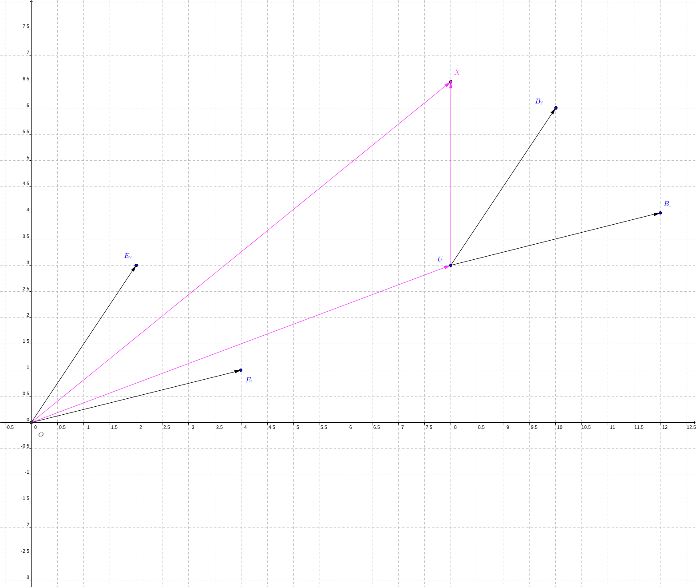

****************************************

**Frage 2.** Gegeben ist die Übergangsmatrix für den Basiswechsel zweier Koordinatensysteme $$
  B=\begin{pmatrix} 1 & 2 & 0 \\ 1 & -1 & 0 \\ 0 & 0 & 1 \end{pmatrix}
$$ bezogen auf eine Basis $(e_1,e_2,e_3)$.

Entnehmen Sie aus der Übergangsmatrix die Darstellung der Vektoren der "neuen" Basis $(b_1,b_2,b_3)$.

[( )] $$
  b_1=\textcolor{red}{1}\cdot e_1+\textcolor{red}{0}\cdot e_2+\textcolor{red}{0}\cdot e_3\,,\quad
  b_2=\textcolor{red}{0}\cdot e_1+\textcolor{red}{1}\cdot e_2+\textcolor{red}{0}\cdot e_3\,,\quad
  b_3=\textcolor{red}{0}\cdot e_1+\textcolor{red}{0}\cdot e_2+\textcolor{red}{1}\cdot e_3 $$
[( )] $$
  b_1=\textcolor{red}{1}\cdot e_1+\textcolor{red}{2}\cdot e_2+\textcolor{red}{0}\cdot e_3\,,\quad
  b_2=\textcolor{red}{1}\cdot e_1\textcolor{red}{-1}\cdot e_2+\textcolor{red}{0}\cdot e_3\,,\quad
  b_3=\textcolor{red}{0}\cdot e_1+\textcolor{red}{0}\cdot e_2+\textcolor{red}{1}\cdot e_3 $$
[(X)] $$
  b_1=\textcolor{red}{1}\cdot e_1+\textcolor{red}{1}\cdot e_2+\textcolor{red}{0}\cdot e_3\,,\quad
  b_2=\textcolor{red}{2}\cdot e_1\textcolor{red}{-1}\cdot e_2+\textcolor{red}{0}\cdot e_3\,,\quad
  b_3=\textcolor{red}{0}\cdot e_1+\textcolor{red}{0}\cdot e_2+\textcolor{red}{1}\cdot e_3 $$
[[?]] Es gilt $$ \begin{pmatrix} x \\ y \\ z \end{pmatrix}=B\cdot\begin{pmatrix} x^\prime \\ y^\prime \\ z^\prime \end{pmatrix} $$ mit den Koordinaten $(x,y,z)$ eines Punktes bezüglich des "alten" Koordinatensystems beziehungsweise den Koordinaten $(x^\prime,y^\prime,z^\prime)$ deselben Punktes bezüglich des neuen Koordinatensystems.
****************************************

Die quadratische Matrix in der Basistransformation der Koordinatenvektoren $$
  \begin{pmatrix} x \\ y \\ z \end{pmatrix}=
  \begin{pmatrix} \textcolor{red}{1} & \textcolor{blue}{2} & \textcolor{magenta}{0} \\ \textcolor{red}{1} & \textcolor{blue}{-1} & \textcolor{magenta}{0} \\ \textcolor{red}{0} & \textcolor{blue}{0} & \textcolor{magenta}{1} \end{pmatrix}\cdot
  \begin{pmatrix} x^\prime \\ y^\prime \\ z^\prime \end{pmatrix}
$$ beschreibt den **Basiswechsel**: Die Spaltenvektoren von $B$ sind die Koordinaten der "neuen" Basisvektoren $b_i$ bezüglich der "alten" Basis $(e_1,e_2,e_3)$, d. h. $$
  b_1=\textcolor{red}{1}\cdot e_1+\textcolor{red}{1}\cdot e_2+\textcolor{red}{0}\cdot e_3\,,\quad
  b_2=\textcolor{blue}{2}\cdot e_1\textcolor{blue}{-1}\cdot e_2+\textcolor{blue}{0}\cdot e_3\,,\quad
  b_3=\textcolor{magenta}{0}\cdot e_1+\textcolor{magenta}{0}\cdot e_2+\textcolor{magenta}{1}\cdot e_3 $$

****************************************

**Frage 3.** Gegeben ist eine quadratische Matrix $$
  C=\begin{pmatrix} 1 & 2 & 3 \\ 1 & -1 & 0 \\ 0 & 0 & 0 \end{pmatrix}
$$ Entscheiden Sie, ob $C$ Übergangsmatrix eines Basiswechsels sein kann.

[( )] $C$ beschreibt einen Basiswechsel.
[(X)] $C$ beschreibt keinen Basiswechsel.
[[?]] Die Spaltenvektoren von $C$ sind die Koordinaten der "neuen" Basisvektoren $b_i$ bezüglich der "alten" Basis $(e_1,e_2,e_3)$. Dies bedeutet insbesondere, dass die Vektoren $b_i$ linear unabhängig sind.
****************************************

Die Vektoren berechnen sich gemäß $$
  b_1=1\cdot e_1+1\cdot e_2+0\cdot e_3\,,\quad
  b_2=2\cdot e_1-1\cdot e_2+0\cdot e_3\,,\quad
  b_3=3\cdot e_1+0\cdot e_2+0\cdot e_3 $$
Dabei gilt offensichtlich $b_3=b_1+b_2$, wonach die Vektoren $b_i$ nicht linear abhängig sind und somit keine Basis bilden können. Für die Matrix $C$ gilt äquivalent $\det{C}=0$.

****************************************


[^1]: Dieser Punkt entspricht dem Schwerpunkt der Ecken des sonst masselos gedachten Tetraeders, wenn gleiche Gewichte in jedem Eckpunkt angenommen werden. Siehe Abschnitt [Massenschwerpunkt](#Massenschwerpunkt).


### Teilungspunkt einer Strecke

Zu einem gegebenem Teilverhältnis soll der Teilungspunkt einer Strecke unter Benutzung der Ortsvektoren der Punkte dargestellt werden.

Gegeben ist eine Verbindungsgerade $g=AB$ zweier Punkte $A$ und $B$ und ein weiterer Punkt $C\in g$. Für das Teilverhältnis von $C$ bezüglich $[A,B]$ gelte
$$
  \lambda=TV(C,B,A)=\epsilon\cdot\frac{\overline{AC}}{\overline{AB}}\quad\leftrightarrow\quad \overrightarrow{AC}=\lambda\cdot\overrightarrow{AB}
$$
Unter Benutzung der Ortsvektoren $a=\overrightarrow{OA}$, $b=\overrightarrow{OB}$ und $c=\overrightarrow{OC}$ stellt sich $c$ dar
$$
  c-a=\lambda\cdot(b-a)\quad\leftrightarrow\quad c=(1-\lambda)\cdot a+\lambda\cdot b
$$

Werden die Argumente in $TV(\,.\,)$ permutiert, so ändert sich im Allgemeinen der Wert des Teilverhältnisses.

> **Satz.** Für das Teilverhältnis eines Punktes $C\in g$ auf der Verbindungsgeraden $g=AB$ zweier verschiedener Punkte $A$ und $B$ gelte
> $$
  \lambda=TV(C,B,A) \in\mathbb{R}
$$
> Durch Permutation der Argumente nimmt das Teilverhältnis - soweit erklärt - einen der Werte
> $$ \lambda\,,\quad 1-\lambda\,,\quad \frac{1}{\lambda}\,,\quad \frac{1}{1-\lambda}\,,\quad 1-\frac{1}{\lambda}\,,\quad \frac{\lambda}{\lambda-1}
$$
> an. Insbesondere gelten:
>
> 1. Für  $C\not=A$ gilt: $\;TV({\color{blue}B},{\color{red}C},A)=TV({\color{red}C},{\color{blue}B},A)^{-1}=\frac{1}{\lambda}$
> 2. Es gilt: $\;TV(C,{\color{blue}A},{\color{red}B})=1-TV(C,{\color{red}B},{\color{blue}A})=1-\lambda$

**Beweis.** Zum Beweis der beiden letzten Aussagen kann ein Koeffizientenvergleich zwischen den Linearkombinationen von linker und rechter Seite angestrebt werden.

Für $\lambda\not=0$ ergibt sich schrittweise aus $\lambda=TV(C,B,A)$
$$
  c=(1-\lambda)\cdot a+\lambda\cdot b\quad\leftrightarrow\quad b=\frac{\lambda-1}{\lambda}\cdot a+\frac{1}{\lambda}\cdot c
$$
Andererseits gilt:
$$
  \mu=TV(B,C,A)\quad\leftrightarrow\quad b=(1-\mu)\cdot a+\mu\cdot c
$$
Aus dem Koeffizientenvergleich der rechten Seiten ergibt sich unmittelbar $\mu=\frac{1}{\lambda}$.

Des Weiteren gilt offensichtlich
$$
  \nu=TV(C,A,B)\quad\leftrightarrow\quad
  c=\nu\cdot a+(1-\nu)\cdot b\quad\leftrightarrow\quad
  \lambda=1-\nu
$$

Die beiden Permutationen
$$
  p=\begin{pmatrix} {\color{red}C} & {\color{blue}B} & A \\ {\color{blue}B} & {\color{red}C} & A \end{pmatrix}\,,\quad
  q=\begin{pmatrix} C & {\color{red}B} & {\color{blue}A} \\ C & {\color{blue}A} & {\color{red}B} \end{pmatrix}
$$
stellen eine Transposition (Tauschung) der ersten bzw. letzten beiden Elemente dar. Mit Hilfe der Hintereinanderausführung dieser lassen sich alle Permutationen von $(A,B,C)$ darstellen, woraus sich die genannten Werte des Teilverhältnisses ergeben.
$$
  \lambda\;\stackrel{p}{\longleftrightarrow}\;
  \frac{1}{\lambda}\;\stackrel{q}{\longleftrightarrow}\;
  1-\frac{1}{\lambda}\;\stackrel{p}{\longleftrightarrow}\;
  \frac{\lambda}{\lambda-1}\;\stackrel{q}{\longleftrightarrow}\;
  \frac{1}{1-\lambda}\;\stackrel{p}{\longleftrightarrow}\;
  1-\lambda\;\stackrel{q}{\longleftrightarrow}\;\lambda
$$

$\square$

**Beispiel 1.** Für den Mittelpunkt $M$ einer Strecke $[A,B]$ ergeben sich einsichtig die Teilverhältnisse

| $(\,.\,,\,.\,,\,.\,)$   | $TV(\,.\,)$   |
| :--------- | :--------- |
| $(M,B,A)$ | $\frac{1}{2}$ |
| $(B,M,A)$ | $2$           |
| $(B,A,M)$ | $-1$          |
| $(A,B,M)$ | $-1$          |
| $(A,M,B)$ | $2$           |
| $(M,A,B)$ | $\frac{1}{2}$ |

Interessant scheint, dass in diesem Beispiel von den sechs verschiedenen Teilverhältnis-Werten lediglich drei voneinander verschieden sind.

Für den Teilungspunkt $T$ einer Strecke $[P,Q]$ mit gegebenem Teilverhältnis $TV(P,Q,T)=\lambda$ ergibt sich unter Verwendung der Ortsvektoren
$$
  t=\frac{1}{1-\lambda}\cdot p-\frac{\lambda}{1-\lambda}\cdot q
$$
Teilt $T$ die Strecke $[P,Q]$ innen im Verhältnis $\alpha:\beta$, so ergeben sich $\lambda=-\frac{\alpha}{\beta}$ und somit die Koeffizienten
$$
  \frac{1}{1-\lambda}=\frac{\beta}{\alpha+\beta}\,,\quad
  -\frac{\lambda}{1-\lambda}=\frac{\alpha}{\alpha+\beta}
$$
Der innere Teilungspunkt $T$ auf $[P,Q]$ stellt sich somit dar $$
  t=\frac{1}{\alpha+\beta}\cdot\left(\beta\cdot p+\alpha\cdot q\right)
$$

$T$ lässt sich physikalisch als [Schwerpunkt](#Massenschwerpunkt) des Massesystems $\{P,Q\}$ deuten, wenn

* $P$ das Gewicht $\beta$
* $Q$ das Gewicht $\alpha$
* und somit dem Massesystem $\{P,Q\}$ das Gesamtgewicht $\alpha+\beta$

zugewiesen wird.

<!-- style="display: block; margin-left: auto; margin-right: auto; max-width: 415px;" -->
``````````````````````````````````````````````````
     P                        T            Q
     *------------------------*------------*
     |                       / \           |
     #                      .---.          #
     b                                     |
                                           #
                                           a
``````````````````````````````````````````````````

Im nachstehenden Video wird die Berechnung des Mittelpunktes einer Strecke unter Nutzung der analytischen Geometrie erklärt.

!?[Mittelpunkt](https://www.youtube.com/watch?v=JU7YspTgFew&t=2s)

**Beispiel 2.** *Methode des Eckenabschneidens nach G. Chaikin*

Durch Konstruktion von Teilungspunkten auf den Seiten eines Polygons soll ein Unterteilungspolygon durch 'Abschneiden der Ecken' des ersten Polygons erzeugt werden.

Gegeben sind die Eckpunkte eines Würfels $\Phi$ durch ihre kartesischen Koordinaten $$
  A(+2,-2,-2)\,,\quad B(+2,+2,-2)\,,\quad C(-2,+2,-2)\,,\quad D(-2,-2,-2) \\ E(+2,-2,+2)\,,\quad F(+2,+2,+2)\,,\quad G(-2,+2,+2)\,,\quad H(-2,-2,+2)
$$ Das geschlossene Polygon $$
  A-B-C-G-F-E-H-D-A
$$ ist als Teilmenge der Ecken- und Kantenmenge eines Würfels mit der Kantenlänge 'vier' in nachstehender Abbildung graphisch dargestellt. Es besitzt je acht (gleichlangen) Kanten und Punkte: $n=8$.

 auf den Kanten eines Würfels.")<!-- style="width: 50%;" -->

Alle Seiten dieses Polygons werden nun durch je zwei Teilungspunkte $Q_{j}$ und $R_{j}$ mit $$
  j\in\{AB,BC,CG,GF,FE,EH,HD,DA\}
$$ im Verhältnis $\alpha:\beta:\alpha=1:3:1$ unterteilt. Die Punkte bilden ein so genanntes Unterteilungspolygon erster Stufe (magenta) des Ausgangspolygons $$
   Q_{AB}-R_{AB}-Q_{BC}-R_{BC}-Q_{CG}-R_{CG}-Q_{GF}-R_{GF}-Q_{FE}-R_{FE}-
   Q_{EH}-R_{EH}-Q_{HD}-R_{HD}-Q_{DA}-R_{DA}-Q_{AB}
$$ welches aus $n_1=2\cdot n=16$ (nicht gleichlangen) Kanten besteht. $$
  \left[
  \left[\begin{array}{r} 2.0\\-1.2\\-2.0\end{array}\right],
  \left[\begin{array}{r} 2.0\\ 1.2\\-2.0\end{array}\right],
  \left[\begin{array}{r} 1.2\\ 2.0\\-2.0\end{array}\right],
  \left[\begin{array}{r}-1.2\\ 2.0\\-2.0\end{array}\right],
  \left[\begin{array}{r}-2.0\\ 2.0\\-1.2\end{array}\right],
  \left[\begin{array}{r}-2.0\\ 2.0\\ 1.2\end{array}\right],
  \left[\begin{array}{r}-1.2\\ 2.0\\ 2.0\end{array}\right],
  \left[\begin{array}{r} 1.2\\ 2.0\\ 2.0\end{array}\right],\right. \\
  \hspace{0.2cm}\left.\left[\begin{array}{r} 2.0\\ 1.2\\ 2.0\end{array}\right],
  \left[\begin{array}{r} 2.0\\-1.2\\ 2.0\end{array}\right],
  \left[\begin{array}{r} 1.2\\-2.0\\ 2.0\end{array}\right],
  \left[\begin{array}{r}-1.2\\-2.0\\ 2.0\end{array}\right],
  \left[\begin{array}{r}-2.0\\-2.0\\ 1.2\end{array}\right],
  \left[\begin{array}{r}-2.0\\-2.0\\-1.2\end{array}\right],
  \left[\begin{array}{r}-1.2\\-2.0\\-2.0\end{array}\right],
  \left[\begin{array}{r} 1.2\\-2.0\\-2.0\end{array}\right] \right]
$$ Das Unterteilungspolygon ist in der nachstehenden Abbildung dargestellt.

 des Ausgangspolygons.")<!-- style="width: 50%;" -->

Das Verfahren des 'Eckenabschneidens' kann nun erneut auf das Unterteilungspolygon erster Stufe angewendet werden. Die nachstehende Abbildung zeigt die Unterteilungspolygone zweiter (rot, $32$ Seiten) und dritter Stufe (grün, $64$ Seiten).

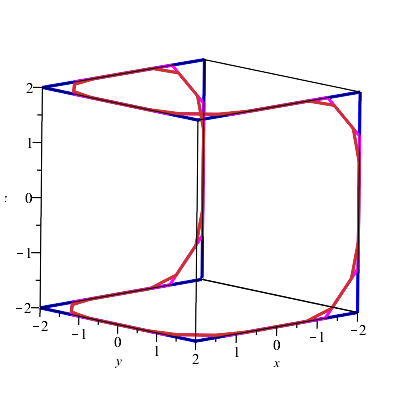
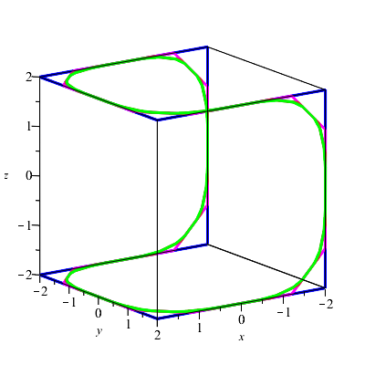

**Bemerkung.** Nachfolgend ist der Pseudo-Code einer Prozedur angegeben, mit der zu einer gegebenen Liste von Koordinatenvektoren zu $n$ Punkten eines geschlossenen Polygons, zum Beispiel $$
    P:=[[30,20],[70,15],[80,90],[20,70],[30,20]]
$$ eine Liste von Koordinaten zu $2\cdot n$ Unterteilungspunkten auf den Seiten des ursprünglichen Polygons berechnet und ausgegeben wird. Siehe Chaikin-Methode des 'Eckenabschneidens' im vorangestellten Beispiel.

<!-- data-showGutter="false" -->
```javascript
// PSEUDO-CODE
// Eingabe: Liste P mit Koordinatenvektoren zu n Punkten, Parameter u mit 0<u<0.5
// L: leere Liste
// n: Anzahl der Elemente von P
// v: 1-2*u
// Wiederhole für i=1 bis n-1
//    q: (u+v)*P[i]+u*P[i+1]
//    r: u*P[i]+(u+v)*P[i+1]
//    Erweitere L um die Elemente der Liste [q,r]
// Ende Wiederholen
// Erweitere L um das Element L[1]
// Ausgabe: Liste L mit 2*n Punkten
// ENDE PSEUDO-CODE
```

Vollziehen Sie den dargestellten Pseudo-Code nach. Beantworten Sie hierfür die nachstehenden Fragen.

1. Begründen Sie, dass die im Pseudo-Code aufgeführten Linearkombinationen konvexe Linearkombinationen sind.
2. Kennzeichnen Sie den Einfluss des zu wählenden Parameters $u$ auf die Teilungsverhältnisse der Punkte $q$ und $r$ auf den Seiten des Polygons $P$.
3. Implementieren Sie diese Prozedur mithilfe einer Programmiersprache Ihrer Wahl.


Sicher gewusst?
===============


Sie können Ihr Wissen gern bei der Beantwortung der nachstehenden Fragen testen.

Gegeben ist ein Dreieck mit den Eckpunkten $A$, $B$ und $C$ sowie ein weiterer Punkt $O$. Die Verbindungsgeraden $$
  AO\,,\quad BO\quad\text{und}\quad CO
$$ der Eckpunkte des Dreiecks mit dem Punkt $O$ besitzen im Fall der nichtparallelen Lage mit der dem Eckpunkt gegenüberliegenden Seite einen gemeinsamen Punkt $$
  D=AO\cap BC\,,\quad E=BO\cap AC\quad\text{und}\quad F=CO\cap AB
$$

**Frage 1.** Berechnen Sie in Abhängigkeit der Koordinaten $O(x_0,y_0)$ die nachstehenden Teilverhältnisse für ein angepasstes affines Koordinatensystem $(U,E_1,E_2)$ der Ebene mit dem Ursprung $U=A$, und den Einheitspunkten $E_1=B$ bzw. $E_2=C$ auf der ersten - bzw. zweiten Koordinatenachse.

[(X)] $$TV(E,C,A)=\frac{y_0}{1-x_0}$$
[( )] $$TV(E,C,A)=\frac{1-x_0}{y_0}$$
[( )] $$TV(E,C,A)=\frac{x_0+y_0-1}{y_0}$$
[[?]] Bestimmen Sie eine Gleichung der Geraden $BO$ - beispielsweise in der Form $0=\lambda\cdot x+\mu\cdot y+\nu$ - und berechnen Sie den Schnittpunkt mit der Geraden $AC$. Berechnen Sie das gesuchte Teilverhältnis.
****************************************

Die Gleichung der Geraden $BO$ besitzt die Gleichung $$
  0=-y_0\cdot x-(1-x_0)\cdot y+y_0\quad\leftarrow\quad
  y=-\frac{y_0}{1-x_0}\cdot x+\frac{y_0}{1-x_0}
$$ Mit der Geraden $AC$ (zweite Koordinatenachse, $x=0$) besitzt diese den Punkt $$
  E\left(0,\frac{y_0}{1-x_0}\right)\quad 1-x_0\not=0
$$ gemeinsam. Für $x_0=1$ ist $BO$ parallel zu $AC$, so dass in diesem Fall kein (eigentlicher) Schnittpunkt existiert. Das gesuchte Teilverhältnis ergibt sich unmittelbar zu $$
  TV(E,C,A)=\frac{y_0}{1-x_0}
$$ Durch Permutation der Argumente ergeben sich des Weiteren $$
  TV(C,E,A)=\frac{1-x_0}{y_0}\quad\text{und}\quad
  TV(C,A,E)=\frac{x_0+y_0-1}{y_0}
$$

****************************************

[(X)] $$TV(F,B,A)=\frac{x_0}{1-y_0}$$
[( )] $$TV(F,B,A)=\frac{1-y_0}{x_0}$$
[( )] $$TV(F,B,A)=\frac{x_0+y_0-1}{x_0}$$
[[?]] Bestimmen Sie eine Gleichung der Geraden $CO$ - beispielsweise in der Form $0=\lambda\cdot x+\mu\cdot y+\nu$ - und berechnen Sie den Schnittpunkt mit der Geraden $AB$. Berechnen Sie das gesuchte Teilverhältnis.
****************************************

Die Gleichung der Geraden $CO$ besitzt die Gleichung $$
  0=(y_0-1)\cdot x-x_0\cdot y+x_0\quad\leftarrow\quad
  y=\frac{y_0-1}{x_0}\cdot x+1
$$ Mit der Geraden $AB$ (erste Koordinatenachse, $y=0$) besitzt diese den Punkt $$
  F\left(\frac{x_0}{1-y_0},0\right)\quad 1-y_0\not=0
$$ gemeinsam. Für $y_0=1$ ist $CO$ parallel zu $AB$, so dass in diesem Fall kein (eigentlicher) Schnittpunkt existiert. Das gesuchte Teilverhältnis ergibt sich unmittelbar zu $$
  TV(F,B,A)=\frac{x_0}{1-y_0}
$$ Durch Permutation der Argumente ergeben sich des Weiteren $$
  TV(B,F,A)=\frac{1-y_0}{x_0}\quad\text{und}\quad
  TV(B,A,F)=\frac{x_0+y_0-1}{x_0}
$$

****************************************

[( )] $$TV(D,B,C)=\frac{x_0+y_0}{x_0}$$
[(X)] $$TV(D,B,C)=\frac{x_0}{x_0+y_0}$$
[( )] $$TV(D,B,C)=-\frac{y_0}{x_0}$$
[[?]] Bestimmen Sie eine Gleichung der Geraden $AO$ - beispielsweise in der Form $0=\lambda\cdot x+\mu\cdot y+\nu$ - und berechnen Sie den Schnittpunkt mit der Geraden $BC$. Berechnen Sie das gesuchte Teilverhältnis.
****************************************

Die Gleichung der Geraden $AO$ besitzt die Gleichung $$
  0=y_0\cdot x-x_0\cdot y\quad\leftarrow\quad
  y=\frac{y_0}{x_0}\cdot x
$$ Mit der Geraden $BC$ (Gleichung $y=-x+1$) besitzt diese den Punkt $$
  D\left(\frac{x_0}{x_0+y_0},\frac{y_0}{x_0+y_0}\right)\quad x_0+y_0\not=0
$$ gemeinsam. Für $x_0=-y_0$ ist $AO$ parallel zu $BC$, so dass in diesem Fall kein (eigentlicher) Schnittpunkt existiert. Das gesuchte Teilverhältnis ergibt sich unmittelbar zu $$
  TV(D,B,C)=\frac{\det{\begin{pmatrix} 0 & \frac{x_0}{x_0+y_0} \\ 1 & \frac{y_0}{x_0+y_0} \end{pmatrix}}}{\det{\begin{pmatrix} 0 & 1 \\ 1 & 0 \end{pmatrix}}}=\frac{x_0}{x_0+y_0}
$$ Durch Permutation der Argumente ergeben sich des Weiteren $$
  TV(B,D,C)=\frac{x_0+y_0}{x_0}\quad\text{und}\quad
  TV(B,C,D)=-\frac{y_0}{x_0}
$$

****************************************

**Frage 2.** Berechnen Sie in Abhängigkeit der Koordinaten $O(x_0,y_0)$ das Produkt $$
  TV(A,B,F)\cdot TV(B,C,D)\cdot TV(C,A,E)
$$ der zuvor berechneten Teilverhältnisse.

[( )] $-\frac{(x_0+y_0-1)^2}{x_0^2}$
[(X)] $-1$
[( )] $-\frac{x_0^2}{y_0^2}$
[[?]] Transformieren Sie die zuvor berechneten Teilverhältnisse unter Permutation der Argumente. Siehe obigen Satz in diesem Abschnitt.
****************************************

Für die in Frage 1 berechneten Teilverhältnisse ergeben sich durch Permutation der Argumente $$
  TV(C,A,E)=1-\frac{1}{TV(E,C,A)}=1-\frac{1-x_0}{y_0}=\frac{x_0+y_0-1}{y_0}
$$ ebenso $$
  TV(A,B,F)=1-\frac{1}{1-TV(F,B,A)}=1-\frac{1}{1-\frac{x_0}{1-y_0}}=1+\frac{1-y_0}{x_0+y_0-1}=\frac{x_0}{x_0+y_0-1}
$$ sowie $$
  TV(B,C,D)=1-\frac{1}{TV(D,B,C)}=1-\frac{1}{\frac{x_0}{x_0+y_0}}=-\frac{y_0}{x_0}
$$ Das zu berechnende Produkt ergibt sich somit $$
  TV(A,B,F)\cdot TV(B,C,D)\cdot TV(C,A,E)=
  \frac{x_0}{x_0+y_0-1}\cdot\left(-\frac{y_0}{x_0}\right)\cdot
  \frac{x_0+y_0-1}{y_0}=-1
$$ und ist somit unabhängig von der Lage des Punktes $O(x_0,y_0)$. Die Aussage ist unter dem [Satz von Ceva](https://de.wikipedia.org/wiki/Satz_von_Ceva) bekannt.

****************************************


### Massenschwerpunkt

> **Satz.** Zu einem gegebenen System von Punkten $P_i$ mit den Ortsvektoren $p_i$ und den Gewichten $\gamma_i>0$ bestimmt
> $$
  s=\frac{1}{\sum_{i=1}^n{\gamma_i}}\cdot\sum_{j=1}^n{\left(\gamma_j\cdot p_j\right)}
$$
> den Massenschwerpunkt $S$ dieses Systems, worin $n\in\mathbb{N}$.

**Beweis.** Die Schwerpunktformel kann unter Benutzung des Verfahrens der vollständigen Induktion bewiesen werden.

1.*Induktionsanfang*. Die Formel ist für $n=1$ offensichtlich wahr, ebenso für $n=2$ nach dem voranstehenden Abschnitt.
2.*Induktionsschluss*. Die Schwerpunktformel gelte für $n=k$. Dann folgt für $n=k+1$
$$
  s_{k+1}=\frac{1}{{\color{red}\gamma_{k+1}+}\sum_{i=1}^k{\gamma_i}}\cdot
  \left({\color{red}\gamma_{k+1}\cdot p_{k+1}+}\sum_{j=1}^k{\left(\gamma_j\cdot p_j\right)}\right)=
  \frac{1}{\sum_{i=1}^{k+1}{\gamma_i}}\cdot\sum_{j=1}^{k+1}{\left(\gamma_j\cdot p_j\right)}
$$
$\square$

**Beispiel 1.** Zur Berechnung des Schwerpunktes dreier Massenpunkte
$$
  X(x,y)\,,\;\gamma_X>0\quad\longleftrightarrow\quad(x,y,\gamma_X)
$$
stellt sich die Formel wie folgt dar. Beachten Sie, dass im nachfolgend dargestellten Minimalcode keine Spezifikation der Variablen der Gewichte $\gamma$ vorgenommen worden ist.

``` javascript
A=[xA,yA,gammaA]
B=[xB,yB,gammaB]
C=[xC,yC,gammaC]
m=A[3]+B[3]+C[3]
1/m*(A[1]*A[3]+B[1]*B[3]+C[1]*C[3])
1/m*(A[2]*A[3]+B[2]*B[3]+C[2]*C[3])
```
@Algebrite.eval

**Beispiel 2.** Der Schwerpunkt der Ecken eines Dreiecks, die jeweils mit *gleichen Massen* belegt sind, ist der gemeinsame Punkt der drei (!) Seitenhalbierenden.

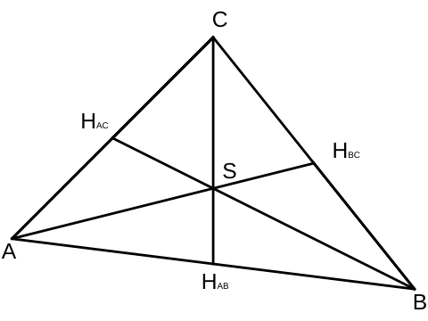

Für den Nachweis wird ein affines Koordinatensystem mit Ursprung $O=A$ und den Einheitspunkten $E_1=B$ sowie $E_2=C$ gewählt.

Die Halbierungspunkte der Seiten des Dreiecks berechnen sich in diesem Koordinatensystem einsichtig zu
$$
  H_{AB}\left(\frac{1}{2},0\right)\,,\quad
  H_{AC}\left(0,\frac{1}{2}\right)\,,\quad
  H_{BC}\left(\frac{1}{2},\frac{1}{2}\right)
$$
die Seitenhalbierenden besitzen die Gleichungen
$$
  H_{AB}C\,:\;\;2\cdot x_1+x_2=1\,,\quad
  H_{BC}A\,:\;\;x_1-x_2=0\,,\quad
  H_{AC}B\,:\;\;x_1+2\cdot x_2=1
$$
Der gemeinsame Punkt der drei Geraden ergibt sich als Lösung eines Systems linearer Gleichungen
$$
  \begin{pmatrix} 2 & 1 & 1 \\ 1 & -1 & 0 \\ 1 & 2 & 1 \end{pmatrix}\;\stackrel{Z_3+Z_2\to Z_3}{\longrightarrow}\;\begin{pmatrix} 2 & 1 & 1 \\ 1 & -1 & 0 \\ 2 & 1 & 1 \end{pmatrix}\;\rightarrow\;\begin{pmatrix} 1 & -1 & 0 \\ 2 & 1 & 1 \end{pmatrix}\;\stackrel{Z_2-2\cdot Z_1\to Z_2}{\longrightarrow}\;\begin{pmatrix} 1 & -1 & 0 \\ 0 & 3 & 1 \end{pmatrix}\;\stackrel{Z_2\cdot\frac{1}{3}\to Z_2}{\longrightarrow}\;\begin{pmatrix} 1 & -1 & 0 \\ 0 & 1 & \frac{1}{3} \end{pmatrix}
$$
Die eindeutig bestimmten Koordinaten von $S$ sind
$$
  S\left(\frac{1}{3},\frac{1}{3}\right)
$$
Ein Vergleich mit der Schwerpunktformel unter Benutzung der Ortsvektoren der Eckpunkte ergibt
$$
  s=\frac{1}{3}\cdot a+\frac{1}{3}\cdot b+\frac{1}{3}\cdot c=\frac{1}{3}\cdot\begin{pmatrix} 1 \\ 1\end{pmatrix}
$$
Des Weiteren folgt aus der Konstruktion des Schwerpunktes $S$ des Dreiecks $ABC$, dass $S$ die Schwerlinien
$$
  [A,H_{BC}]\,,\quad [B,H_{AC}]\,,\quad [C,H_{AB}]
$$
im Verhältnis $2:1$ der Teillängen teilt, d. h.
$$
  TV(S,H_{BC},A)=TV(S,H_{AC},B)=TV(S,H_{AB},C)=\frac{2}{3}
$$


### Konvexe Punktmengen

Bei der Berechnung des Schwerpunktes eines Massensystems ist zu beobachten, dass für die Koeffizienten der Linearkombinationen
$$
 \alpha_j:=\frac{\gamma_j}{\sum_{i=1}^n{\gamma_i}}
$$
stets die Bedingungen
$$
  \alpha_j\geq0\;\;\forall j\in\{1,2,\ldots,n\}\quad\text{sowie}\quad \sum_{j=1}^n{\alpha_j}=1
$$
gelten.

> **Definition.** Eine Linearkombination der Form
>$$
  x=\alpha_1\cdot x_1+\alpha_2\cdot x_2+\ldots+\alpha_n\cdot x_n $$
>mit Vektoren $x_j$ und Skalaren $\alpha_j$, für die gelten
>$$
  \alpha_j\geq0\;\;\forall j\in J\quad\text{sowie}\quad \sum_{j\in J}{\alpha_j}=1 $$
> heißt eine **Konvexkombination** der Vektoren $x_j$.

**Beispiel 1.** Für zwei verschiedene Punkte $X_1$ und $X_2$ beschreibt die Konvexkombination in den Ortsvektoren der Punkte
$$
  x=\alpha_1\cdot x_1+\alpha_2\cdot x_2\,,\quad \alpha_1\geq0\wedge\alpha_2\geq0\,,\quad \alpha_1+\alpha_2=1
$$  
das Innere (und die Randpunkte) der Strecke $[X_1,X_2]$. Mit der Bezeichnung $\alpha=\alpha_2$ und $\alpha_1=1-\alpha$ folgt
$$
  x=(1-\alpha)\cdot x_1+\alpha\cdot x_2
$$
d. h. die Beschreibung eines Teilungspunktes auf der Strecke $[X_1,X_2]$.

**Beispiel 2.** Für drei verschiedene, nicht kollineare Punkte $X_1$, $X_2$ und $X_3$ beschreibt die Konvexkombination in den Ortsvektoren der Punkte
$$
  x=\alpha_1\cdot x_1+\alpha_2\cdot x_2+\alpha_3\cdot x_3\,,\quad \alpha_1\geq0\wedge\alpha_2\geq0\wedge\alpha_3\geq0\,,\quad \alpha_1+\alpha_2+\alpha_3=1
$$  
das Innere (und die Seiten) des Dreiecks $X_1X_2X_3$. Mit der Bezeichnung $\alpha=\alpha_2$, $\beta=\alpha_3$ und $\alpha_1=1-\alpha-\beta$ folgt
$$
  x=(1-\alpha-\beta)\cdot x_1+\alpha\cdot x_2+\beta\cdot x_3=x_1+\alpha\cdot(x_2-x_1)+\beta\cdot(x_3-x_1)
$$
d. h. ein Punkt auf der durch $X_1$, $X_2$ und $X_3$ bestimmten Dreiecksfläche.

**Beispiel 3.** Entsprechend ergibt sich das Innere eines Tetraeders als Konvexkombination seiner Eckpunkte.

**Bemerkung.** Allgemein heißt eine Punktmenge $M$ **konvex**, wenn mit zwei beliebigen Punkten $P\in M$ und $Q\in M$ auch alle Punkte der Strecke $[P,Q]$ in $M$ oder auf dem Rand von $M$ liegen. Siehe [Konvexe Mengen](https://de.wikipedia.org/wiki/Konvexe_Menge).

Eine Erklärung der Konvexität von Mengen finden Sie alternativ in folgendem Video.

!?[youtube](https://www.youtube.com/watch?v=C1xN4KpySn0)

In der folgenden Abbildung sind ein konvexes Sechseck (links) und ein nicht-konvexes Sechseck abgebildet.

<!-- style="display: block; margin-left: auto; margin-right: auto; max-width: 415px;" -->
``````````````````````````````````````````````````
   A  *---------*  B             A  *---------*  B
     /           \                   \       /
    /             \                   \     /
F  *               *  C             F  *   *  C
    \             /                   /     \
     \           /                   /       \
   E  *---------* D              E  *---------* D
``````````````````````````````````````````````````

Der Durchschnitt aller konvexen Mengen, die eine gegebene Punktmenge $\{X_1,X_2,\ldots,X_n\}$ enthalten, wird **konvexe Hülle** von $X_1$, $X_2$ bis $X_n$ genannt. Analytisch wird diese durch die Menge aller Konvexkombinationen der Punkte $X_j$ bestimmt.

Ein effizienter Algorithmus zur Berechnung der konvexen Hülle ist [Graham Scan](https://de.wikipedia.org/wiki/Graham_Scan).


Sicher gewusst?
===============


Sie können Ihr Wissen gern bei der Beantwortung der nachstehenden Fragen testen.

**Frage.** Gegeben sind die folgenden Punktmengen und das dargestellte Polygon (rot).

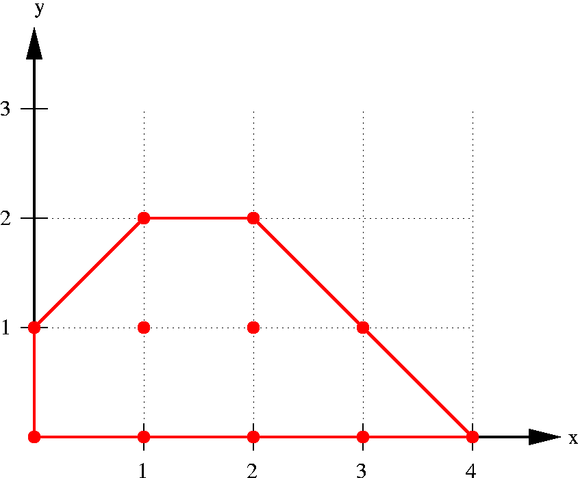<!-- style="width: 75%;" -->

Entscheiden Sie, welche der Punktmengen das rot umrandete Gebiet als konvexe Hülle besitzt.

[[ ]] $\{(x,y)\; (0\leq x\leq4\;\wedge\;0\leq y\leq2)\}$
[[X]] $(0,0)$, $(0,1)$, $(1,2)$, $(2,2)$, $(1,1)$, $(2,1)$, $(3,1)$ und $(4,0)$
[[ ]] $(0,0)$, $(0,1)$, $(1,2)$, $(3,1)$ und $(4,0)$
[[X]] $(0,0)$, $(0,1)$, $(1,2)$, $(2,2)$ und $(4,0)$
[[?]] Stellen Sie die Punktmengen in einem kartesischen Koordinatensystem graphisch dar.
****************************************

Die Punktmenge $$ \{(x,y)\; (0\leq x\leq4\;\wedge\;0\leq y\leq2)\} $$ bildet ein achsenparalleles Rechteck mit den Seitenlängen vier und zwei: Es ist eine konvexe Menge, jedoch nicht die dargestellte. Die Punktmenge $(0,0)$, $(0,1)$, $(1,2)$, $(3,1)$ und $(4,0)$ enhält nicht den Eckpunkt $(2,2)$ des dargestellten Polygons. Die beiden anderen Punktmengen besitzen das rot umrandete Gebiet als konvexe Hülle.

****************************************


### De Casteljau Algorithmus

Unter Verwendung des Teilverhältnisses auf Strecken lassen sich ebenso Kurven konstruieren. In diesem Abschnitt wird das Konzept einer **Bézierkurve** vorgestellt, die sich interaktiv und koordinatenunabhängig über ihr Kontrollpolygon konstruieren lässt. Siehe [Bézierkurve](https://www.geogebra.org/m/myvbmhcj "de casteljau Algorithmus für Bézierkurve ").

Das Konzept der Bézierkurven wurde unabhängig voneinander von Pierre Bézier bei Renault (1959) und von Paul de Casteljau bei Citroën (1962) für die computerunterstützte Konstruktion entwickelt.

**Beispiel 1.** Gegeben ist ein aus zwei Strecken bestehendes Polygon mit den Eckpunkten $P_0$, $P_1$ und $P_2$. Diese werden Kontrollpunkte genannt und bilden die Eckpunkte eines Kontrollpolygons $P_0-P_1-P_2$.

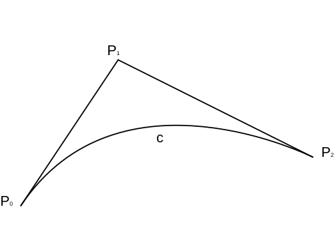

Verfahren für $n=2$
===================

1. Stufe
--------

Bilde auf den Seiten des Kontrollpolygons den Teilungspunkt $P_i^1$ zum gleichen Wert $t\in[0,1]$ des Teilverhältnisses. Unter Verwendung der Ortsvektoren der Kontrollpunkte stellen sich die Teilungspunkte dar $$
  p_0^1=(1-t)\cdot p_0+t\cdot p_1\,,\quad
  p_1^1=(1-t)\cdot p_1+t\cdot p_2
$$ Diese bilden Teilungspunkte $1$-ter Stufe.

2. Stufe
--------

Die Teilungspunkte $P_0^1$ und $P_1^1$ auf den Seiten des Kontrollpolygons bilden eine neue Strecke. Konstruiere auf dieser den Teilungspunkt $P_0^2$ zweiter Stufe zum gleichen Wert $t\in[0,1]$ des Teilverhältnisses. $$
  p_0^2=(1-t)\cdot p_0^1+t\cdot p_1^1
$$ Das Verfahren endet hier.[^1]

Variation des Parameters
------------------------

Wird der Parameter $t\in[0,1]$ variiert, so entstehen verschiedene Lagen des Punktes $P_0^2(t)$, die als Linearkombination der Ortsvektoren der Kontrollpunkte dargestellt werden können $$\begin{array}{rl}
  x(t)=p_0^2(t) & =(1-t)\cdot\left((1-t)\cdot p_0+t\cdot p_1\right)+t\cdot\left((1-t)\cdot p_1+t\cdot p_2\right) \\
  & = (1-t)^2\cdot p_0+2\cdot t\cdot (1-t)\cdot p_1+t^2\cdot p_2
\end{array}$$ Im Beispiel entspricht dies einer quadratischen Parametrisierung der Menge aller Punkte $P_0^2(t)$, die **Bézierkurve** $c$ der Ordnung $n=2$ zum Kontrollpolygon $P_0-P_1-P_2$ genannt wird.

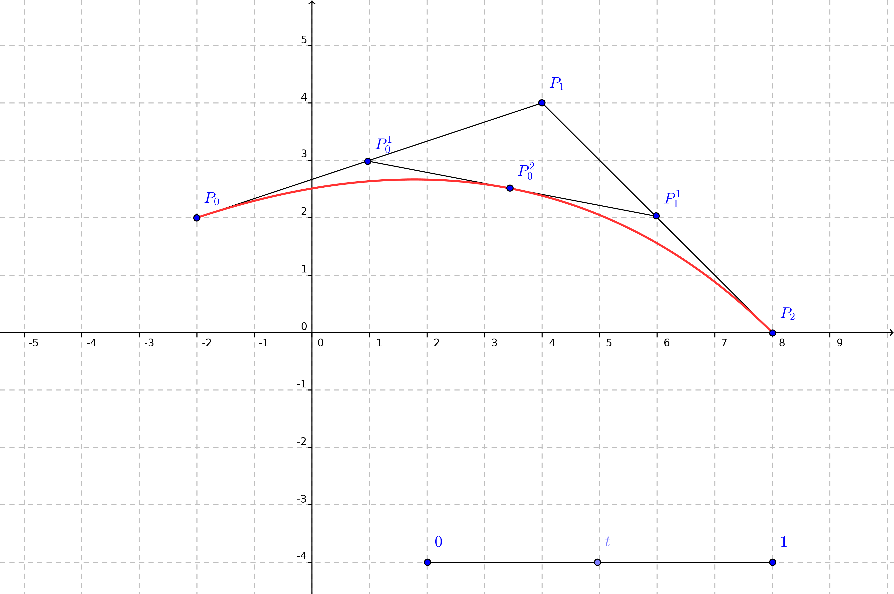

**Bemerkung 1.** Die Koeffizienten der angegebenen Linearkombination sind Polynome zweiten Grades $$
  B_0^2(t)=(1-t)^2\,,\quad B_1^2(t)=2\cdot t\cdot (1-t)\,,\quad B_2^2(t)=t^2
$$ und werden Bernsteinpolynome (zweiten Grades) genannt. Für diese gelten $$
  B_0^2(t)\geq0\;\wedge\; B_2^2(t)\geq0\;\wedge\;\left(B_1^2(t)\geq0\;\leftrightarrow\; t\in[0,1]\right)
$$ sowie $$
  \sum_{i=0}^ 3{B_i^2(t)}=(1-t)^2+2\cdot t\cdot (1-t)+t^2=1
$$ Hieraus folgt, dass die auf dem Intervall $[0,1]\ni t$ definierte Bézierkurve $c$ in der konvexen Hülle ihrer Kontrollpunkte liegt.

Die [Bernsteinpolynome](https://de.wikipedia.org/wiki/Bézierkurve) lassen sich allgemein berechnen mit Hilfe der Formel $$
  B_i^n(t)=\binom{n}{i}\cdot(1-t)^{n-i}\cdot t^i\,,\quad n\in\mathbb{N}\,,i\in\mathbb{N}\,,i\leq n
$$ worin für die Bernsteinpolynome zweiten Grades $n=2$ zu setzen ist.

```javascript
B2=binomial(2,m)*t^m*(1-t)^(2-m)
B02=subst(0,m,B2)
B12=subst(1,m,B2)
B22=subst(2,m,B2)
B02
B12
B22
simplify(B02+B12+B22)
```
@Algebrite.eval

**Bemerkung 2.** Für den Tangentenvektor an eine Bézierkurve in $X(t_0)\in c$ mit $t_0\in[0,1]$ gilt $$ \begin{array}{rl}
  \dot{x}(t_0) & =\frac{\mathrm{d}}{\mathrm{d}t}{x(t)}|_{t=t_0}=\dot{B}_0^2(t_0)\cdot p_0+\dot{B}_1^2(t_0)\cdot p_1+\dot{B}_2^2(t_0)\cdot p_2 \\
  & = -2\cdot(1-t)\cdot p_0+\left(2\cdot(1-t)-2\cdot t\right)\cdot p_1+2\cdot t\cdot p_2 \\
  & = 2\cdot\left(p_1^1-p_0^1\right)(t_0)
  \end{array}
$$ d. h. die Trägergerade der Strecke $\left[P_0^1,P_1^1\right]$ aus der vorletzten Stufe des de Casteljau Algorithmus bildet die Tangente an $c$ im Kurvenpunkt $X(t_0)$. Insbesondere bilden $$
  2\cdot(p_1-p_0) \quad\text{bzw.}\quad 2\cdot(p_2-p_1)
$$ die Tangentenvektoren in $X(0)=P_0$ beziehungsweise $X(1)=P_2$.

```javascript
d(B02)
d(B12)
d(B22)
x=d(B02*p0+B12*p1+B22*p2)
p01=(1-t)*p0+t*p1
p11=(1-t)*p1+t*p2
x-2*(p11-p01)
```
@Algebrite.eval


Verfahren für allgemeines $n\in\mathbb{N}$
==========================================

Das Verfahren zur Konstruktion einer Bézierkurve zweiter Ordnung kann auf den Fall $n>2$ verallgemeinert werden. Hierfür wird das Kontrollpolygon $$ P_0-P_1-...-P_{n-1}-P_n $$ vorausgesetzt. Das nachfolgende Schema zeigt das wiederholte Bestimmen der Teilungspunkte $P_j^k$ $k$-ter Stufe auf den Polygonen $(k-1)$-ter Stufe ($k\in\mathbb{N},1\leq k\leq n$), wobei $k-1=0$ für das Kontrollpolygon gesetzt wird.

<!-- style="display: block; margin-left: auto; margin-right: auto;" -->
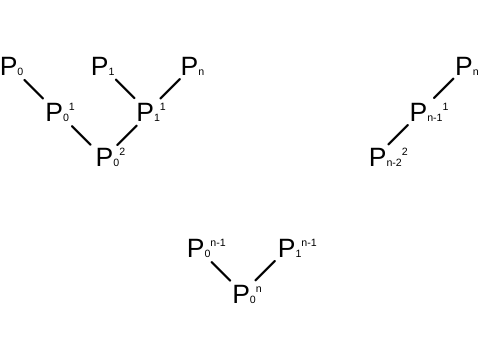

Der Teilungspunkt $X(t)=P_0^{n}(t)$ ist Kurvenpunkt der **Bézierkurve** $n$-ter Ordnung zum Kontrollpolygon $P_0-P_1-...-P_{n-1}-P_n$ und besitzt die Parametrisierung $$
  x(t)=\sum_{i=0}^n{B_i^n(t)\cdot p_i}\,,\quad n\in\mathbb{N},\;n\geq2
$$ worin $p_i$ die Ortsvektoren der Kontrollpunkte $P_i$ und $$
  B_i^n(t)=\binom{n}{i}\cdot(1-t)^{n-i}\cdot t^i
$$ die **Bernsteinpolynome** $n$-ten Grades bezeichnen.[^2]

Die Konstruktion einer Bézierkurve vom Grad $n=3$ nach dem de Casteljau Algorithmus finden Sie im folgenden Video.

!?[youtube](https://www.youtube.com/watch?v=YATikPP2q70)

**Bemerkung 3.** *Exkurs Mathematik.* Die in der Darstellung der Bernsteinpolynome auftretenden [Binomialkoeffizienten](https://de.wikipedia.org/wiki/Binomialkoeffizient) lassen sich definieren als $$
  \binom{n}{i}=\frac{n!}{i!\cdot(n-i)!}\,,\quad n\in\mathbb{N}\,,\;i\in\mathbb{N}\,,\; i\leq n
$$ sowie $$
  \binom{n}{i}=0\,,\quad n\in\mathbb{N}\,,\;i\not\in\{0,1,...,n\}
$$ Sie beschreiben die Anzahl aller Möglichkeiten, aus einer Menge von $n$ verschiedenen Elementen genau $i$ ohne Zurücklegen und ohne Berücksichtigung der Reihenfolge auszuwählen. Für $n=2$ ergeben sich im Speziellen $$
  \binom{2}{0}=1\,,\quad\binom{2}{1}=2\,,\quad\binom{2}{2}=1
$$ die beispielsweise als Koeffizienten in der binomischen Formel $$
  (a+b)^2=1\cdot a^2+2\cdot a\cdot b+1\cdot b^2
$$ auftreten. Warum?

>**Satz 1.** *Refursionsformel.* Die Bernsteinpolynome $n$-ten Grades lassen sich rekursiv definieren vermöge $$
  B_i^n(t)=(1-t)\cdot B_i^{n-1}(t)+t\cdot B_{i-1}^{n-1}(t)\quad \forall \,t\in\mathbb{R}
$$ d. h. als Linearkombination von Bernsteinpolynomen $(n-1)$-ten Grades.

**Beweisidee.** Der Nachweis der Rekursionsformel kann durch direktes Nachrechnen unter Benutzung der Definition der Bernsteinpolynome geführt werden.

**Beispiel 2.** Die Bernsteinpolynome für $n\leq2$ sollen rekursiv berechnet und mit der expliziten Bildungsvorschrift vergleichen werden. Für $n=0$ ergeben sich $$
  B_0^0(t)=1\,,\quad B_i^0=0 \quad\forall\, i\not\in\{0,1,...,n\}
$$ Aus diesen lassen sich alle Bernsteinpolynome für den Indexwert $n=1$ berechnen $$
  B_0^1(t)=(1-t)\cdot B_0^0(t)+t\cdot B_{-1}^0(t)=1-t\,,\quad B_1^1(t)=(1-t)\cdot B_1^0(t)+t\cdot B_{0}^0(t)=t
$$ Unter erneuter Benutzung der Rekursionsformel ergeben sich die Bernsteinpolynome für den Indexwert $n=2$: $$
  \begin{array}{rl}
    B_0^2(t) & =(1-t)\cdot B_0^1(t)+t\cdot B_{-1}^1(t)=(1-t)^2 \\
    B_1^2(t) & =(1-t)\cdot B_1^1(t)+t\cdot B_{0}^1(t)=2\cdot(1-t)\cdot t \\
    B_2^2(t) & =(1-t)\cdot B_2^1(t)+t\cdot B_{1}^1(t)=t^2
  \end{array}
$$

**Bemerkung 4.** Siehe [Pascalsches Dreieck](https://de.wikipedia.org/wiki/Pascalsches_Dreieck).

>**Satz 2.** Für die Bernsteinpolynome $n$-ten Grades gilt $$
  \sum_{i=0}^n{B_i^n(t)}=1\quad \forall \,t\in\mathbb{R}
$$

**Beweis.** Die Gültigkeit der Aussage folgt aus der Gleichung $$
  1=1^n=(t+(1-t))^n=\sum_{i=0}^n{\binom{n}{i}\cdot t^i\cdot (1-t)^{n-i}}=\sum_{i=0}^n{B_i^n(t)}
$$ unter Benutzung des [Binomischen Lehrsatzes](https://de.wikipedia.org/wiki/Binomischer_Lehrsatz). $\square$

```javascript
n=3
sum(binomial(n,i)*t^i*(1-t)^(n-i),i,0,n)
```
@Algebrite.eval

>**Satz 3.** Eine Bézierkurve mit der Parametrisierung $$
  t\mapsto x(t)=\sum_{i=0}^n{B_i^n(t)\cdot p_i}\,,\quad n\in\mathbb{N},\;n\geq2
$$ ist für jede Wahl $t\in[0,1]$ eine Konvexkombination der Kontrollpunkte, d. h. die Kurve liegt in der konvexen Hülle ihrer Kontrollpunkte.

**Beweis.** Diese Aussage folgt direkt aus Satz 2 und der Aussage, dass für alle Bernsteinpolynome $B_i^n(t)\geq0$ gilt, falls $t\in[0,1]$. Dies lässt sich unmittelbar mittels vollständiger Induktion aus der Rekursionsformel ableiten (Satz 1). $\square$

>**Satz 4.** Eine Bézierkurve mit der Parametrisierung $$
  t\mapsto x(t)=\sum_{i=0}^n{B_i^n(t)\cdot p_i}\,,\quad n\in\mathbb{N},\;n\geq2
$$ und $t\in[0,1]$ ist Parameterdarstellung der Bézierkurve nach dem de Casteljau Algorithmus.

Auf einen Nachweis dieser Aussage wird hier verzichtet.

Auf weitere Eigenschaften von Bézierkurven sowie deren Verwendung im Kurvendesign wird später genauer eingegangen.


Sicher gewusst?
===============


Sie können Ihr Wissen gern bei der Beantwortung der nachstehenden Fragen testen.

**Frage 1.** Für die Binomialkoeffizienten $$
  \binom{n}{i} \quad\text{mit}\quad n\in\mathbb{N}\,,\;i\in\mathbb{N}\,,\;i\leq n
$$ gilt die Symmetrie
$$
  \binom{n}{i}=\binom{n}{n-i}
$$

[[X]] Wahr
[[ ]] Falsch
[[?]] Die Binomialkoeffizienten berechnen sich für $n\in\mathbb{N}$ und $i\in\mathbb{N}$ mit $i\leq n$ nach der Formel $$
  \binom{n}{i}=\frac{n!}{i!\cdot(n-i)!}
$$
****************************************

Der Binomialkoeffizient berechnet sich $$
  \binom{n}{n-i}=\frac{n!}{(n-i)!\cdot(n-(n-i))!}=\frac{n!}{(n-i)!\cdot i!}=\binom{n}{i} $$

****************************************

**Frage 2.** Gegeben ist das Kontrollpolygon $$
  P_0(1,0)\,,\quad P_1(1,1)\,,\quad P_2(0,1)
$$ einer Bézierkurve $c$. Kennzeichnen Sie die wahren Aussagen in den folgenden Aussagen.

[[ ]] $c$ enthält den Punkt $P_1$.
[[X]] $c$ berührt die Geraden $y=1$ und $x=1$.
[[ ]] $c$ berührt die Geraden $y=0$ und $x=0$.
[[X]] $c$ enthält den Punkt $P_0$.
[[X]] $c$ liegt im Inneren und dem Rand des Dreiecks $P_0P_1P_2$.
[[?]] Die Bézierkurve $c$ besitzt die Parametrisierung in Bézierdarstellung $$ x(t)=\sum_{i=0}^n{B_i^2(t)\cdot p_i}\,,\quad t\in[0,1] $$ worin $B_i^2(t)$ die Bernsteinpolynome zweiten Grades und $p_i$ die Ortsvektoren der Kontrollpunkte bezeichnen.
****************************************

Die Bézierkurve $c$ interpoliert den ersten und letzten Punkt des Kontrollpolygons, also $P_0$ und $P_2$. $P_1\not\in c$, da $$ p_1\not=x(t)=(1-t)^2\cdot p_0+2\cdot(1-t)\cdot t\cdot p_1+t^2\cdot p_2\quad\forall\, t\in[0,1] $$ was nach Einsetzen der Ortsvektoren für $p_i$ ersichtlich ist. $c$ besitzt in $P_0$ den Tangentenvektor $2\cdot(p_1-p_0)$ und in $P_2$ den Tangentenvektor $2\cdot(p_2-p_1)$. Die Bézierkurve $c$ liegt in der konvexen Hülle der Kontrollpunkte.

****************************************

[^1]: Wird das Verfahren der Streckenteilung auf ein Kontrollpolygon mit $4$ Kontrollpunkten durchgeführt, so entstehen in der $1$-ten Stufe drei Teilungspunkte. Diese bilden ein Polygon $P_0^1-P_1^1-P_2^1$, auf welches der Teilungsschritt 2 wiederholt angewendet werden kann. Das Verfahren endet mit dem (einzigen) Teilungspunkt $P_0^3$.

[^2]: Genauer heißt $x(t)$ Bézierdarstellung, da diese Parametrisierung in der Basis der Bernsteinpolynome (hier zunächst ohne Nachweis) angegeben ist.


## Affine Transformationen


In diesem ersten Kapitel vertiefen Sie Ihre Kenntnisse in der Integration reeller Funktionen einer reellen Veränderlichen. Dazu zählen u. a.

* affine Abbildungen, darunter Affinitäten und deren Eigenschaften
* spezielle Affinitäten
* Kongruenzen und Ähnlichkeiten
* abbildungsgeometrische Erzeugung geometrischer Figuren

Für einen Überblick über die Themen dieses Kapitels sehen Sie in der nachstehenden Graphik einige zentrale Begriffe. Schlagen Sie diese in diesem Abschnitt nach.

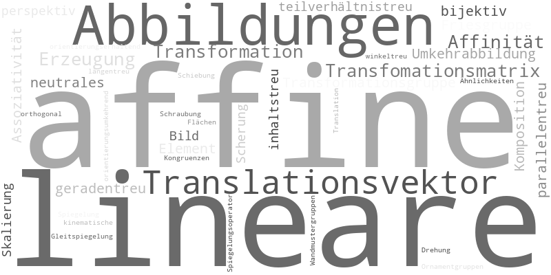<!-- style="display: block; margin-left: auto; margin-right: auto; max-width: 1000px; " -->

Lernziele
-----

* ..


### Definition


Definition affiner Abbildungen
==============================

Wir beginnen mit dem Begriff einer affinen Abbildung.

>**Definition 1.** Eine Abbildung des $d$-dimensionalen affinen Raumes $\mathcal{A}^d$ ($d\in\mathbb{N},\,d\geq1$) $$
  \alpha:\mathcal{A}^d\to \mathcal{A}^d
$$ die Punkte $X$ auf Punkte $X^\prime=\alpha(X)$ abbildet, heißt **affine Abbildung**, wenn sie bezogen auf ein affines Koordinatensystem $[O,E_1,...,E_d]$ mit Ortsvektor $$
  x=\overrightarrow{OX}\quad\text{und}\quad x^\prime=\overrightarrow{OX^\prime}
$$ in der Form $$
  x\mapsto x^\prime=A\cdot x+a\quad\text{mit}\quad A\in\mathbb{R}^{d,d}\,,\;a\in\mathbb{R}^{d}
$$ dargestellt werden kann.

Die reelle, quadratische Matrix $A$ wird Abbildungsmatrix (Transformationsmatrix), der reelle Vektor $a$ wird Translationsvektor von $\alpha$ genannt. Für $d=2$ heißt $\alpha$ affine Abbildung der Ebene, für $d=3$ affine Abbildung des dreidimensionalen Raumes.

Die Abbildung von Punkten der Ebene beziehungsweise des dreidimensionalen Raumes wird in nachstehendem Video an Beispielen erläutert. (Der Translationsvektor ist in diesen Beispielen jeweils der Nullvektor.)

!?[Affine Abbildung](https://www.youtube.com/watch?v=r0CNAI2rHfY)

**Beispiel 1.** Die affine Abbildung $\alpha$ mit $$
  A=\mathrm{diag}{(1,1)}\,,\quad a=(2,-3)^\top
$$ worin $A$ die zweireihige Einheitsmatrix ist, beschreibt eine Translation aller Punkte $X$ der Ebene $\mathcal{A}^2$ mit dem Translationsvektor $a$.

```javascript
A=[[1,0],[0,1]]
a=[[2],[-3]]
x=[[x1],[x2]]
dot(A,x)+a
```
@Algebrite.eval

**Beispiel 2.** Die affine Abbildung $\alpha$ mit $$
  A=\mathrm{diag}{(1,1,0)}\,,\quad a=(0,0,0)^\top
$$ beschreibt die Projektion aller Punkte $X$ des dreidimensionalen Raumes $\mathcal{A}^3$ in die Ebene $z=0$ (*"Grundrissprojektion"*).

```javascript
A=[[1,0,0],[0,1,0],[0,0,0]]
a=[[0],[0],[0]]
x=[[x1],[x2],[x3]]
dot(A[1],x)+a[1]
dot(A[2],x)+a[2]
dot(A[3],x)+a[3]
```
@Algebrite.eval

>**Definition 2.** Eine affine Abbildung $$ x\mapsto x^\prime=A\cdot x+a $$ heißt **Affinität**, falls $A$ eine reguläre Matrix ist, d. h. falls $\det{A}\not=0$.

Das Beispiel 1 beschreibt eine Affinität, da $\det{A}=1$, Beispiel 2 hingegen eine affine Abbildung, die keine Affinität ist: Hier ist $\det{A}=0$.


Folgerungen
===========

Die nachstehenden Eigenschaften werden für den Fall $d=3$ formuliert, können jedoch für jede Wahl $d\geq 2$ in gleicher Weise angegeben werden.


Eigenschaft 1
-------------

Die Koordinaten des Bildpunktes $X'$ unter einer affinen Abbildung $\alpha$ berechnen sich linear in den Koordinaten des Urbildes $X$.

```javascript
A=[[a11,a12,a13],[a21,a22,a23],[a31,a32,a33]]
a=[[a1],[a2],[a3]]
x=[[x1],[x2],[x3]]
i=1
inner(A[i],x)+a[i]
```
@Algebrite.eval

In Matrixdarstellung stellt sich der Ortsvektor des Bildpunktes $X'$ für den Fall $d=3$ dar mittels
$$
  \begin{pmatrix} x_1' \\ x_2' \\ x_3' \end{pmatrix}=
  \begin{pmatrix} a_{11} & a_{12} & a_{13} \\ a_{21} & a_{22} & a_{23} \\ a_{31} & a_{32} & a_{33} \end{pmatrix}\begin{pmatrix} x_1 \\ x_2 \\ x_3 \end{pmatrix}+\begin{pmatrix} a_1 \\ a_2 \\ a_3 \end{pmatrix}
$$
worin die Komponenten der Transformationsmatrix $A$ mit $a_{ij}$, die Komponenten des Translationsvektors $a$ mit $a_i$ bezeichnet sind.


Eigenschaft 2
-------------

Der Translationsvektor $a$ ist Ortsvektor des Bildpunktes $O'=\alpha(O)$ (Bild des Koordinatenursprungs), denn
$$
  \begin{pmatrix} o_1 \\ o_2 \\ o_3 \end{pmatrix}=
  \begin{pmatrix} 0 \\ 0 \\ 0 \end{pmatrix}\mapsto
  \begin{pmatrix} o_1' \\ o_2' \\ o_3' \end{pmatrix}=
  \begin{pmatrix} a_{11} & a_{12} & a_{13} \\ a_{21} & a_{22} & a_{23} \\ a_{31} & a_{32} & a_{33} \end{pmatrix}\begin{pmatrix} 0 \\ 0 \\ 0 \end{pmatrix}+\begin{pmatrix} a_1 \\ a_2 \\ a_3 \end{pmatrix}=\begin{pmatrix} a_1 \\ a_2 \\ a_3 \end{pmatrix}
$$


Eigenschaft 3
-------------

Für die Bilder der Einheitspunkte $E_i$, $i\in\{1,2,3\}$, mit den Ortsvektoren $e_i$ gelten
$$
  \begin{pmatrix} 1 \\ 0 \\ 0 \end{pmatrix}\mapsto
  \begin{pmatrix} a_{11} & a_{12} & a_{13} \\ a_{21} & a_{22} & a_{23} \\ a_{31} & a_{32} & a_{33} \end{pmatrix}\begin{pmatrix} 1 \\ 0 \\ 0 \end{pmatrix}+\begin{pmatrix} a_1 \\ a_2 \\ a_3 \end{pmatrix}=\textcolor{magenta}{\begin{pmatrix} a_{11} \\ a_{21} \\ a_{31} \end{pmatrix}}+\begin{pmatrix} a_1 \\ a_2 \\ a_3 \end{pmatrix}
$$
und
$$
  \begin{pmatrix} 0 \\ 1 \\ 0 \end{pmatrix}\mapsto
  \begin{pmatrix} a_{11} & a_{12} & a_{13} \\ a_{21} & a_{22} & a_{23} \\ a_{31} & a_{32} & a_{33} \end{pmatrix}\begin{pmatrix} 0 \\ 1 \\ 0 \end{pmatrix}+\begin{pmatrix} a_1 \\ a_2 \\ a_3 \end{pmatrix}=\textcolor{magenta}{\begin{pmatrix} a_{12} \\ a_{22} \\ a_{32} \end{pmatrix}}+\begin{pmatrix} a_1 \\ a_2 \\ a_3 \end{pmatrix}
$$
sowie
$$
  \begin{pmatrix} 0 \\ 0 \\ 1 \end{pmatrix}\mapsto
  \begin{pmatrix} a_{11} & a_{12} & a_{13} \\ a_{21} & a_{22} & a_{23} \\ a_{31} & a_{32} & a_{33} \end{pmatrix}\begin{pmatrix} 0 \\ 0 \\ 1 \end{pmatrix}+\begin{pmatrix} a_1 \\ a_2 \\ a_3 \end{pmatrix}=\textcolor{magenta}{\begin{pmatrix} a_{13} \\ a_{23} \\ a_{33} \end{pmatrix}}+\begin{pmatrix} a_1 \\ a_2 \\ a_3 \end{pmatrix}
$$
Das ist jeweils die Summe aus dem $i$-ten Spaltenvektor von $A$ und dem Translationsvektor $a$. Es gilt mit Eigenschaft 2
$$
  \overrightarrow{\alpha(O)\alpha(E_i)}=e_i'-o'=s_i\,,\quad i\in\{1,2,3\}
$$

Der $i$-te Spaltenvektor $s_i$ in der Spaltenvektordarstellung von $A$ $$ A=\begin{pmatrix} s_1 & s_2 & s_3 \end{pmatrix} $$ ist der Richtungsvektor $\overrightarrow{O'E_i'}$, der von $O'=\alpha(O)$ nach $E_i'=\alpha(E_i)$ zielt, dargestellt im affinen Koordinatensystem $(O,E_1,E_2,E_3)$.

.")

<!-- style="color:magenta" -->**Merkregel.** "Willst die Matrix du erhalten, schreib die Bilder der Basis in die Spalten."

**Bemerkung 1.** Mit den Eigenschaften 2 und 3 haben Transformationsmatrix $A$ und Translationsvektor $a$ einer affinen Abbildung $\alpha$ geometrische Bedeutung. (Definition)


Eigenschaft 4
-------------

Für einen Punkt $X\in\mathcal{A}^3$ in allgemeiner Lage mit Ortsvektor / Koordinaten
$$
  x=\begin{pmatrix} x_1 \\ x_2 \\ x_3 \end{pmatrix}=
  \sum_{i=1}^3{x_i\cdot e_i}
$$
bezüglich der Basis $(e_1,e_2,e_3)$ ergibt sich der Bildvektor unter $\alpha$ gemäß
$$
  x'=\begin{pmatrix} x_1' \\ x_2' \\ x_3' \end{pmatrix}=
  A\cdot\left(\sum_{i=1}^3{x_i\cdot e_i}\right)+a=
  \left(\sum_{i=1}^3{x_i\cdot A\cdot e_i}\right)+a=
  \left(\sum_{i=1}^3{x_i\cdot s_i}\right)+a
$$
Aus dieser Darstellung lässt sich erkennen, dass $X$ im affinen Koordinatensystem $(O,E_1,E_2,E_3)$ dieselben Koordinaten besitzt wie Koeffizienten in der vorstehenden Linearkombination.

Ist die Transfomationsmatrix $A$ regulär[^1], so sind deren Spaltenvektoren linear unabhängig, so dass $\left(O',E_1',E_2',E_3'\right)$ wieder ein affines Koordinatensystem ist. Siehe Abschnitt [Affine Koordinatensysteme](#Affine-Koordinatensysteme). Hieraus ergibt sich folgende Erzeugungsmöglichkeit einer Affinität.

> **Erzeugung einer Affinität.** Sind zwei affine Koordinatensysteme $$
  \left(O,E_1,E_2,E_3\right)\,,\quad \left(O',E_1',E_2',E_3'\right)
$$ gegeben, so lässt sich eine Affinität $$
  \alpha:X\mapsto X'=\alpha(X)
$$ durch gleiche Koordinaten angeben: Das Urbild $X$ besitzt den Ortsvektor $$
  x=\begin{pmatrix} \blue{x_1} \\ \blue{x_2} \\ \blue{x_3} \end{pmatrix} \quad\text{bezüglich}\quad \left(O,E_1,E_2,E_3\right)
$$ und das Bild $X'=\alpha(X)$ besitzt den gleichen Ortsvektor $$
  x'=\begin{pmatrix} \blue{x_1} \\ \blue{x_2} \\ \blue{x_3} \end{pmatrix} \quad\text{bezüglich}\quad \left(O',E_1',E_2',E_3'\right)
$$


Eigenschaft 5
-------------

Der Differenzvektor zweier Punkte $X$ und $Y$ mit den Ortsvektoren $x$ beziehungsweise $y$
$$
  \overrightarrow{XY}=y-x=:z
$$
wird unter der affinen Abbildung $\alpha$ abgebildet auf
$$
  \overrightarrow{\alpha(X)\alpha(Y)}=y'-x'=(A\cdot y+a)-(A\cdot x+a)=A\cdot(y-x)=A\cdot z
$$
worin $x'$ beziehungsweise $y'$ die Ortsvektoren der Bilder $X'=\alpha(X)$ beziehungsweise $Y'=\alpha(Y)$ bezeichnen.

>**Definition 3.** Ist der Translationsvektor $a$ einer affinen Abbildung $\alpha$ der Nullvektor, d. h. $$
  \alpha:X\mapsto X'\quad\text{mit}\quad x\mapsto x'=A\cdot x
$$ so heißt $\alpha$ eine **lineare Abbildung**. Der Ursprung $O$ des Koordinatensystems $(O,E_1,E_2,E_3)$ ist unter $\alpha$ ein Fixpunkt.[^2]

**Beispiel 3.** Zu bestimmen ist eine analytische Darstellung der Spiegelung (der Punkte) der Ebene an der $x_1$-Achse eines gewählten kartesischen Koordinatensystems.

Bezeichnen $(x_1,x_2)$ die kartesischen Koordinaten eines Punktes $X$ in allgemeiner Lage, so gilt für dessen Spiegelbild $X'=\alpha(X)$
$$
    x_1'=x_1\quad\wedge\quad y_1'=-y_1
$$
Hieraus ergibt sich die Matrixdarstellung der affinen Abbildung $$
  \alpha:\,\begin{pmatrix} x_1 \\ x_2 \end{pmatrix}\mapsto
  \begin{pmatrix} x_1' \\ x_2' \end{pmatrix}=
  \begin{pmatrix} 1 & 0 \\ 0 & -1 \end{pmatrix}\cdot
  \begin{pmatrix} x_1 \\ x_2 \end{pmatrix}
$$
Aus der Darstellung von $\alpha$ ist erkennbar, dass der Translationsvektor $a$ der Nullvektor und die Transformationsmatrix regulär ist, die Abbildung somit eine Affinität und sogar linear ist.

Im nachstehenden Video ist dieses Beispiel im Kontext der linearen Abbildungen erläutert.

!?[Lineare Abbildung](https://www.youtube.com/watch?v=lg1oYbkzauk)

Eine Möglichkeit der Berechnung des Bildes einer Geraden unter einer linearen Abbildung ist an einem Beispiel im nachstehenden Video erläutert.

!?[Lineares Bild](https://www.youtube.com/watch?v=9FBulSYvlF0)


Sicher gewusst?
===============


Sie können Ihr Wissen gern bei der Beantwortung der nachstehenden Fragen testen.

**Frage 1.** Gegeben sind die folgenden Abbildungsmatrizen affiner Abbildungen
$$
  A_1=\begin{pmatrix} 1 & 2 \\ 2 & 4 \end{pmatrix}\quad\text{sowie}\quad
  A_2=\begin{pmatrix} 1 & 2 & 3 \\ 0 & 1 & 4 \\ -3 & -6 & -9 \end{pmatrix}
$$
Welche dieser beschreibt ~~keine~~ Affinität?

[[X]] $A_1$
[[X]] $A_2$
[[?]] Die Matrix $A$ legt eine Affinität fest, falls die Matrix regulär ist, d. h. $\det{A}\not=0$.
****************************************

Für beide Matrizen gilt $\det{A_1}=\det{A_2}=0$: je zwei Zeilen sind linear abhängig. Daher sind die durch diese Matrizen beschriebenen affinen Abbildungen keine Affinitäten.

****************************************

**Frage 2.** Unter einer affinen Abbildung der Ebene werden abgebildet
$$
  \begin{pmatrix} 0 \\ 0 \end{pmatrix}\mapsto\begin{pmatrix} 1 \\ 2 \end{pmatrix}\,,\quad
  \begin{pmatrix} 1 \\ 0 \end{pmatrix}\mapsto\begin{pmatrix} 3 \\ 2 \end{pmatrix}\,,\quad
  \begin{pmatrix} 0 \\ 1 \end{pmatrix}\mapsto\begin{pmatrix} 2 \\ -4 \end{pmatrix}
$$
Geben Sie die Matrixdarstellung der linearen Abbildung an.

[(X)] $\begin{pmatrix} x' \\ y' \end{pmatrix}=\begin{pmatrix} 2 & 1 \\ 0 & -6 \end{pmatrix}\cdot\begin{pmatrix} x \\ y \end{pmatrix}+\begin{pmatrix} 1 \\ 2 \end{pmatrix}$
[( )] $\begin{pmatrix} x' \\ y' \end{pmatrix}=\begin{pmatrix} 3 & 2 \\ 2 & -4 \end{pmatrix}\cdot\begin{pmatrix} x \\ y \end{pmatrix}+\begin{pmatrix} 1 \\ 2 \end{pmatrix}$
[[?]] Setzen Sie jeweils Urbild- und Bildvektor in die Matrixdarstellung ein.
****************************************

Die Basisvektoren sind $$
  \begin{pmatrix} 1 \\ 0 \end{pmatrix}\quad\text{und}\quad
  \begin{pmatrix} 0 \\ 1 \end{pmatrix}
$$ Deren Bilder ergeben sich als Differenzen $$
  \begin{pmatrix} 3-1 \\ 2-2 \end{pmatrix}\quad\text{und}\quad
  \begin{pmatrix} 2-1 \\ -4-2 \end{pmatrix}
$$ und bilden die Spalten der Transformationsmatrix.

****************************************

**Frage 3.** Entscheiden Sie: Eine affine Abbildung der Ebene, die verschieden von der identischen Abbildung ist, besitzt entweder genau einen Fixpunkt, eine Fixpunktgerade oder keinen Fixpunkt.

[(X)] Wahr.
[( )] Falsch.
[[?]] Für einen Fixpunkt $X$ unter einer affinen Abbildung $\alpha$ gilt $X=\alpha(X)$.
****************************************

Besitzt die affine Abbildung der Ebene die Matrixdarstellung $$
  \alpha:x\mapsto x'=A\cdot x+a
$$ mit Transformationsmatrix $A\in\mathbb{R}^{2,2}$ und Translationsvektor $a\in\mathbb{R}^2$, so berechnen sich die Fixpunkte vermöge $$
  A\cdot x+a=x\quad\leftrightarrow\quad (A-E)\cdot x=-a
$$ mit zweireihiger Einheitsmatrix $E$. Dies ist ein lineares Gleichungssystem, dessen Lösungsmenge entweder leer, einelementig oder ein affiner Unterraum der Dimension $1$ ist.

****************************************

[^1]: Ist die Transformationsmatrix $A$ eine reguläre Matrix, so ist die dadurch beschriebene affine Abbildung sogar eine Affinität.

[^2]: Ein Punkt $X$ heißt Fixpunkt unter der affinen Abbildung $\alpha$, falls $X=\alpha(X)$, d. h. wenn Bild und Urbild des Punktes übereinstimmen. Für lineare Abbildungen ergibt sich hieraus $$
  \left(x\mapsto x=A\cdot x\right)\quad\leftrightarrow\quad \left(A-E\right)\cdot x=0
$$ worin $E$ die dreireihige Einheitsmatrix bezeichnet. Aus der Darstellung folgt, dass sich die (Ortsvektoren der) Fixpunkte als Eigenvektoren von $A$ zum Eigenwert $1$ berechnen lassen.


### Algebraische Eigenschaften

In diesem Abschnitt werden algebraische Eigenschaften von Affinitäten besprochen. Zentraler Begriff ist die [Transformationsgruppe](https://de.wikipedia.org/wiki/Gruppenoperation) der Affinitäten des $\mathcal{A}^d$, die schrittweise eingeführt wird.

Für die nachfolgenden Betrachtungen bezeichne
$$
  \alpha:\mathcal{A}^d\to\mathcal{A}^d\,,\quad d\in\{2,3\}
$$
eine Affinität, d. h. unter Benutzung von Ortsvektoren bezüglich eines gewählten affinen Koordinatensystems
$$
  \alpha:x\mapsto x'=\alpha(x)=A\cdot x+a
$$
mit regulärer Transformationsmatrix $A\in\mathbb{R}^{d,d}$ ($\det{A}\not=0$) und Translationsvektor $a\in\mathbb{R}^d$.


Komposition
===========

Aus der Schulmathematik ist bekannt, dass die Summe / das Produkt reeller Zahlen wieder eine reelle Zahl ist. Diese sind naheliegende Beispiele für Verknüpfungen.

Im nachstehenden Video werden an Beispielen Verknüpfungen und Verknüpfungsgebilde erläutert.

!?[Verknüpfung](https://www.youtube.com/watch?v=vrh1y9bwhls)

Für beliebige Affinitäten $\alpha_1$ und $\alpha_2$ in $\mathcal{A}^d$ ist eine Verknüpfung, die Hintereinanderausführung (Komposition) zweier Affinitäten, erklärt: Besitzen Affinitäten die Matrixdarstellungen
$$
  \alpha_1:x\mapsto x'=A_1\cdot x+a_1\quad\text{und}\quad
  \alpha_2:x\mapsto x'=A_2\cdot x+a_2
$$
mit $\det{A_i}\not=0$ und $i\in\{1,2\}$, so lässt sich die Komposition[^0] dieser erklären vermöge
$$
  \alpha_2\circ\alpha_1:x\mapsto \alpha_2(\alpha_1(x))
$$
(lies: "$\alpha_2$ nach $\alpha_1$") mit der Matrixdarstellung
$$
  \alpha_2(\textcolor{magenta}{\alpha_1(x)})=A_2\cdot\left(\textcolor{magenta}{A_1\cdot x+a_1}\right)+a_2=B\cdot x+b
$$
worin
$$
  B=A_2\cdot A_1\quad\text{und}\quad b=A_2\cdot a_1+a_2
$$
die Transformationsmatrix beziehungsweise den Translationsvektor bezeichnen. Mit dem [Multiplikationssatz für Determinanten](https://de.wikipedia.org/wiki/Determinante) folgt für die Determinante der Komposition
$$
  \det{B}=\det{(A_2\cdot A_1)}=\det{A_2}\cdot\det{A_1}\not=0
$$
Damit gilt folgender Satz.

>**Satz 1.** Die Komposition zweier Affinitäten in $\mathcal{A}^d$ ist wieder eine Affinität.

**Bemerkung 1.** Eine wichtige Folgerung aus der Komposition von Affinitäten ist, dass die Hintereinanderausführung von beliebigen Affinitäten des $\mathcal{A}^d$ nicht aus der Menge herausführt.

Aus der Eigenschaft, dass die Matrizenmultiplikation im Allgemeinen ~~nicht~~ kommutativ ist, folgt, dass die Komposition von Affinitäten im Allgemeinen ~~nicht~~ kommutativ ist. Es gilt
$$
  \alpha_2\circ\alpha_1=\alpha_1\circ\alpha_2\quad\leftrightarrow\quad
  \left(A_2\cdot A_1=A_1\cdot A_2\quad\wedge\quad A_2\cdot a_1+a_2=A_1\cdot a_2+a_1\right)
$$

Die Eigenschaft der Kommutativität für allgemeine Verknüpfungsgebilde ist an Beispielen im nachstehenden Video erläutert.

!?[Kommutativität](https://www.youtube.com/watch?v=tPAHFqAZ6W4)

**Gegenbeispiel 1.** Die Komposition zweier Translationen der Ebene mit den Matrixdarstellungen
$$
  \tau_1: x\mapsto x'=E\cdot x+t_1 \quad\text{und}\quad
  \tau_2: x\mapsto x'=E\cdot x+t_2
$$
worin $E=\mathrm{diag}{(1,1)}$ die zweireihige Einheitsmatrix sowie $t_i\in\mathbb{R}^2$ mit $i\in\{1,2\}$ die Translationsvektoren bezeichnen, ist offensichtlich kommutativ, d. h. die Reihenfolge der Hintereinanderausführung beider Translationen ist vertauschbar.

Des Weiteren gilt der nachstehende Satz.

>**Satz 2.** Für beliebige Affinitäten $\alpha_1$, $\alpha_2$ und $\alpha_3$ gilt $$
  \alpha_3\circ\left(\alpha_2\circ\alpha_1\right)=\left(\alpha_3\circ\alpha_2\right)\circ\alpha_1
$$ d. h. die Komposition von Affinitäten ist **assoziativ**.[^1]

**Beweis.** Der Beweis vorstehender Aussage nutzt die Assoziativität der Multiplikation von Matrizen aus. Unter Verwendung der Matrixdarstellungen der Affinitäten
$$
  \alpha_i:x\mapsto x'=A_i\cdot x+a_i\,,\quad i\in\{1,2,3\}
$$
ergeben sich einerseits schrittweise die Kompositionen
$$
  \alpha_2\circ\alpha_1:x\mapsto x'=A_2\cdot A_1\cdot x+A_2\cdot a_1+a_2
$$
sowie
$$
  \begin{array}{rrrrl}
    \alpha_3\circ(\alpha_2\circ\alpha_1) & : & x\mapsto x' & = & A_3\cdot(\textcolor{magenta}{A_2\cdot A_1\cdot x+A_2\cdot a_1+a_2})+a_3 \\ & & & = & A_3\cdot A_2\cdot A_1\cdot x+A_3\cdot A_2\cdot a_1 +A_3\cdot a_2+a_3 \\
    & & & = & B\cdot x+b
  \end{array}
$$
worin
$$
  B= A_3\cdot A_2\cdot A_1\quad\text{bzw.}\quad b=A_3\cdot A_2\cdot a_1 +A_3\cdot a_2+a_3
$$
Transformationsmatrix beziehungsweise Translationsvektor beschreiben. Analog bilden sich anderseits die Kompositionen
$$
  \alpha_3\circ\alpha_2:x\mapsto x'=A_3\cdot A_2\cdot x+A_3\cdot a_2+a_3
$$
sowie
$$
\begin{array}{rrrrl}
  (\alpha_3\circ\alpha_2)\circ\alpha_1 & : & x\mapsto x' & = & A_3\cdot A_2\cdot(\textcolor{magenta}{A_1\cdot x+a_1})+A_3\cdot a_2+a_3 \\
  & & & = & A_3\cdot A_2\cdot A_1\cdot x+A_3\cdot A_2\cdot a_1 +A_3\cdot a_2+a_3 \\
  & & & = & B\cdot x+b
\end{array}
$$
worin
$$
C= A_3\cdot A_2\cdot A_1\quad\text{bzw.}\quad c=A_3\cdot A_2\cdot a_1 +A_3\cdot a_2+a_3
$$
Im Vergleich ergeben sich $B=C$ und $b=c$, wonach die Gleichheit aus Satz 2 folgt. $\square$

Die Eigenschaft der Assoziativität für allgemeine Verknüpfungsgebilde ist an Beispielen im nachstehenden Video erläutert.

!?[Assoziativität](https://www.youtube.com/watch?v=uDi_UKcDLdQ)


Existenz der Umkehrabbildung
============================

Da die Transformationsmatrix $A$ zu $\alpha$ regulär angenommen wird, existiert die zu $A$ (multiplikativ) inverse Matrix und es gilt umkehrbar
$$
  x'=A\cdot x+a\quad\leftrightarrow\quad \textcolor{magenta}{A^{-1}}\cdot x'=\textcolor{magenta}{A^{-1}}\cdot A\cdot x+\textcolor{magenta}{A^{-1}}\cdot a \quad\leftrightarrow\quad x=A^{-1}\cdot x'-A^{-1}\cdot a
$$
Daher existiert zu jeder Affinität $\alpha$ eine eindeutig bestimmte **Umkehrabbildung** $\alpha^{-1}$ mit
$$
  \alpha^{-1}:x'\mapsto x=A^{-1}\cdot x'-A^{-1}\cdot a
$$
d. h. jedem Ortsvektor $x$ eines Punktes $X$ kann umkehrbar eindeutig ein Bildvektor $x'$ zu $X'$ zugeordnet werden. Des Weiteren ist die Komposition
$$
  \alpha^{-1}\circ\alpha:\;x\stackrel{\alpha}{\longmapsto}x'\stackrel{\alpha^{-1}}{\longmapsto}x
$$
die identische Abbildung, denn
$$
  x=A^{-1}\cdot\left(A\cdot x+a\right)-A^{-1}\cdot a=A^{-1}\cdot A\cdot x+A^{-1}\cdot a-A^{-1}\cdot a = E\cdot x = x
$$
worin $E=\mathrm{diag}{(1,..,1)}$ die $d$-reihige Einheitsmatrix in $\mathbb{R}^{d,d}$ bezeichnet. Analoges gilt auch für die Komposition
$$
  \alpha\circ\alpha^{-1}:\;x'\stackrel{\alpha^{-1}}{\longmapsto}x\stackrel{\alpha}{\longmapsto}x'
$$

Mit Satz 1 folgen:

>**Satz 3.** Zu jeder Affinität $\alpha$ existiert eine eindeutig bestimmte Umkehrabbildung $\alpha^{-1}$, die wieder eine Affinität ist.

>**Folgerung 4.** Jede Affinität $\alpha$ ist [bijektiv](https://de.wikipedia.org/wiki/Bijektive_Funktion), d. h. injektiv und surjektiv.

**Beispiel 2.** Zur Affinität $\alpha$ mit der Matrixdarstellung
$$
  \alpha:
  \begin{pmatrix} x_1 \\ x_2 \end{pmatrix}\mapsto
  \begin{pmatrix} x_1' \\ x_2' \end{pmatrix}=
  \begin{pmatrix} 1 & 2 \\ 3 & 4 \end{pmatrix}\cdot
  \begin{pmatrix} x_1 \\ x_2 \end{pmatrix}+
  \begin{pmatrix} -2 \\ 3 \end{pmatrix}
$$
ist die Umkehrabbildung $\alpha^{-1}$ zu berechnen.

Die Transformationsmatrix
$$
  A=\begin{pmatrix} 1 & 2 \\ 3 & 4 \end{pmatrix}
$$
besitzt die inverse Matrix
$$
  A^{-1}=\frac{1}{\det{A}}\cdot\begin{pmatrix} 4 & -2 \\ -3 & 1 \end{pmatrix}=-\frac{1}{2}\cdot\begin{pmatrix} 4 & -2 \\ -3 & 1 \end{pmatrix}
$$
denn es gilt einsichtig
$$
  A\cdot A^{-1}=\begin{pmatrix} 1 & 2 \\ 3 & 4 \end{pmatrix}\cdot\left(-\frac{1}{2}\right)\cdot\begin{pmatrix} 4 & -2 \\ -3 & 1 \end{pmatrix}=\begin{pmatrix} 1 & 0 \\ 0 & 1 \end{pmatrix}=A^{-1}\cdot A
$$
für die Matrizenmultiplikation.[^2]

Damit lässt sich $\alpha^{-1}$ angeben zu
$$
  \alpha^{-1}:
  \begin{pmatrix} x_1' \\ x_2' \end{pmatrix}
  \mapsto
  \begin{pmatrix} x_1 \\ x_2 \end{pmatrix}=\left(-\frac{1}{2}\right)\cdot
  \begin{pmatrix} 4 & -2 \\ -3 & 1 \end{pmatrix}\cdot
  \begin{pmatrix} x_1 \\ x_2 \end{pmatrix}-
  \left(-\frac{1}{2}\right)\cdot
  \begin{pmatrix} 4 & -2 \\ -3 & 1 \end{pmatrix}\cdot
  \begin{pmatrix} -2 \\ 3 \end{pmatrix}
$$
worin sich der Translationsvektor der Umkehrabbildung zu
$$
  b=-\left(-\frac{1}{2}\right)\cdot
  \begin{pmatrix} 4 & -2 \\ -3 & 1 \end{pmatrix}\cdot
  \begin{pmatrix} -2 \\ 3 \end{pmatrix}=
  \begin{pmatrix} 7 \\ -\frac{9}{4} \end{pmatrix}
$$
berechnet.

Die Eigenschaft der inversen Elemente für allgemeine Verknüpfungsgebilde ist an Beispielen im nachstehenden Video erläutert.

!?[Inverses Element](https://www.youtube.com/watch?v=Dmbbash4PrM)


Neutrales Element
=================

In der Menge der Affinitäten des $\mathcal{A}^d$ ist eine Abbildung $\alpha_{id}$ gesucht, für die
$$
  \alpha\circ\alpha_{id}=\alpha_{id}\circ\alpha=\alpha
$$
für alle Affinitäten $\alpha$ des $\mathcal{A}^d$ gilt. Diese wird **neutrales Element** der Komposition genannt. Die Abbildung $\alpha_{id}$ soll sich also wie die "Eins" bei der Multiplikation beziehungsweise wie die "Null" bei der Addition reeller Zahlen verhalten.[^3]

Ihre Existenz folgt unmittelbar aus der nachstehenden Äquivalenz, die sich aus der Existenz der Umkehrabbildung für Affinitäten unter Anwendung des Assoziativgesetzes ergibt.
$$
  \left(\alpha_{id}\circ\alpha\right)\textcolor{magenta}{\circ\alpha^{-1}}=\alpha\textcolor{magenta}{\circ\alpha^{-1}}\quad\leftrightarrow\quad
  \alpha_{id}=\alpha\circ\alpha^{-1}
$$
beziehungsweise
$$
  \textcolor{magenta}{\alpha^{-1}\circ}\left(\alpha\circ\alpha_{id}\right)=\textcolor{magenta}{\alpha^{-1}\circ}\alpha\quad\leftrightarrow\quad
  \alpha_{id}=\alpha^{-1}\circ\alpha
$$
Das neutrale Element ist also die identische Abbildung
$$
  \alpha_{id}:x\mapsto x'=x=E\cdot x+o
$$
deren Transformationsmatrix $E$ die $d$-reihige Einheitsmatrix und deren Translationsvektor $o$ der $d$-dimensionale Nullvektor sind. Offensichtlich gilt $\det{E}=1$, wonach die Matrix $E$ regulär ist.

>**Satz 5.** Es existiert eine eindeutig bestimmte Affinität $\alpha_{id}$ mit $$
  \alpha\circ\alpha_{id}=\alpha_{id}\circ\alpha=\alpha
$$ für alle Affinitäten $\alpha$ des affinen Raumes $\mathcal{A}^d$.

Die Eigenschaft der Existenz des neutralen Elementes für allgemeine Verknüpfungsgebilde ist an Beispielen im nachstehenden Video erläutert.

!?[Neutrales Element](https://www.youtube.com/watch?v=TSXp1yZBZZ4)


Transformationsgruppe der Affinitäten
=====================================

Die Aussagen aus den Sätzen 2, 3 und 5 können benutzt werden, um folgenden Satz zu beweisen.

>**Satz 6.** Die Menge aller Affinitäten $$
  \alpha:\mathcal{A}^d\to\mathcal{A}^d
$$ bildet bezüglich der Komposition eine **Gruppe**.

**Bemerkung 2.** Der Begriff einer Gruppe ist eine mathematische Struktur. Andere mathematische Strukturen sind beispielsweise *Körper* oder *Vektorraum*. Die axiomatische Definition einer Gruppe ist in nachstehendem Video erläutert.

!?[Gruppe](https://www.youtube.com/watch?v=LyFCkZXkly0)

Im Rahmen dieser Vorlesungen werden Transformationsgruppen benutzt, um beispielsweise periodische Muster, so genannte Ornamente zu analysieren beziehungsweise aus einem Grundmuster zu erzeugen.

**Beispiel 3.** Ein Beispiel für ein Ornament ist in nachfolgender Abbildung dargestellt. Es ist ein ~~Fries~~ (Bandornament). Siehe https://de.wikipedia.org/wiki/Friesgruppe

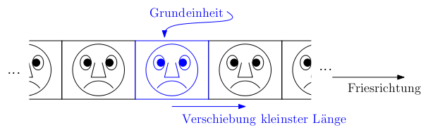

Die periodische Fortsetzung der Grundeinheit wird durch wiederholte Translation $\tau$ mit fester Translationsrichtung und festem Translationsbetrag erzeugt.

Die Menge aller Abbildungen, die sich wiederholtes Verknüpfen von $\tau$ (und ihrer Umkehrabbildung) ergeben, bildet die Gruppe dieses Frieses, dessen **Friesgruppe**. Die von $\tau$ erzeugte Friesgruppe enthält sowohl die $k$-fachen Kompositionen
$$
  \tau^k:=(...((\tau\circ\tau)\circ\tau)\circ...)\circ\tau
$$
worin $k\in\mathbb{N}$, als auch
$$
  \tau^{-k}:=(...((\tau^{-1}\circ\tau^{-1})\circ\tau^{-1})\circ...)\circ\tau^{-1}
$$
Mit $\tau^{-1}\circ\tau$ ist auch die identische Abbildung in der Friesgruppe enthalten.

Wird die Grundeinheit "ausgetauscht", so entsteht ein anderes Fries zur selben Friesgruppe.

Eine interaktive Möglichkeit, Friese aus einer Grundeinheit durch Anwenden verschiedener Friesgruppen zu erzeugen, finden Sie unter [Friesgruppen](https://www.geogebra.org/m/wjpjzrce). Viel Spaß damit ;)

>**Definition.** Sei $\alpha$ mit $$
  \alpha:x\mapsto x'=A\cdot x+a
$$ eine Affinität. Ist $A=E=\mathrm{diag}{(1,...,1)}$ die $d$-reihige Einheitsmatrix, so heißt $$
  \alpha:x\mapsto x'= x+a
$$ **Translation** mit Translationsvektor $a$.

>**Satz 7.** Jede Affinität des $d$-dimensionalen affinen Raumes $\mathcal{A}^d$ ist Komposition einer linearen Abbildung und einer Translation.[^4]

**Beweis.** Eine Affinität mit der Matrixdarstellung
$$
  \alpha:x\mapsto x'=A\cdot x+a\,,\quad\det{A}\not=0
$$
worin $A\in\mathbb{R}^{d,d}$ die (reguläre) Transformationsmatrix und $a\in\mathbb{R}^d$ den Translationsvektor bezeichnen, lässt sich als Komposition
$$
  \tau\circ\gamma:x\mapsto x''=E\cdot(\textcolor{magenta}{A\cdot x})+a
$$
der Affinitäten
$$
  \gamma:x\mapsto x'=A\cdot x\quad\text{sowie}\quad \tau:x'\mapsto x''=E\cdot x'+a
$$
darstellen, worin $E$ die $d$-reihige Einheitsmatrix beschreibt. $\square$


Sicher gewusst?
===============


Sie können Ihr Wissen gern bei der Beantwortung der nachstehenden Fragen testen.

**Frage 1.** Entscheiden Sie, ob die folgende affine Abbildung umkehrbar ist.
$$
  \alpha:\begin{pmatrix} x_1 \\ x_2 \end{pmatrix}\mapsto
  \begin{pmatrix} x_1' \\ x_2' \end{pmatrix}=
  \begin{pmatrix} 1 & -2 \\ -2 & 4 \end{pmatrix}\cdot
  \begin{pmatrix} x_1 \\ x_2 \end{pmatrix}+
  \begin{pmatrix} 7 \\ -3 \end{pmatrix}
$$

[( )] Die Umkehrabbildung $\alpha^{-1}$ zu $\alpha$ kann dargestellt werden durch $$ \alpha^{-1}:\begin{pmatrix} x_1' \\ x_2' \end{pmatrix}\mapsto
  \begin{pmatrix} x_1 \\ x_2 \end{pmatrix}=
  \begin{pmatrix} 1 & -2 \\ -2 & 4 \end{pmatrix}^{-1}\cdot
  \begin{pmatrix} x_1' \\ x_2' \end{pmatrix}-
  \begin{pmatrix} 1 & -2 \\ -2 & 4 \end{pmatrix}^{-1}\cdot
  \begin{pmatrix} 7 \\ -3 \end{pmatrix}
$$ und existiert also.
[(X)] Die Abbildung $\alpha$ ist nicht umkehrbar.
[[?]] Die Umkehrbarkeit von affinen Abbildungen $\alpha$ des $d$-dimensionalen affinen Raumes $\mathcal{A}^d$ ist an die Regularität der Transformationsmatrix gekoppelt.
****************************************

Die Determinante der Transformationsmatrix berechnet sich $$ \det{\begin{pmatrix} 1 & -2 \\ -2 & 4 \end{pmatrix}}=1\cdot 4-(-2)^2=0 $$ wonach die Transformationsmatrix nicht regulär ist. Die inverse Matrix $$ \begin{pmatrix} 1 & -2 \\ -2 & 4 \end{pmatrix}^{-1} $$ existiert nicht, die Umkehrabbildung demnach auch nicht.

****************************************

**Frage 2.** Ist die Komposition der beiden affinen Abbildungen $$
\alpha_1:\begin{pmatrix} x_1 \\ x_2 \end{pmatrix}\mapsto
\begin{pmatrix} x_1' \\ x_2' \end{pmatrix}=
\begin{pmatrix} 0 & 1 \\ 1 & 0 \end{pmatrix}\cdot
\begin{pmatrix} x_1 \\ x_2 \end{pmatrix}
$$ sowie $$
\alpha_2:\begin{pmatrix} x_1 \\ x_2 \end{pmatrix}\mapsto
\begin{pmatrix} x_1' \\ x_2' \end{pmatrix}=
\begin{pmatrix} 1 & 0 \\ 0 & 1 \end{pmatrix}\cdot
\begin{pmatrix} x_1 \\ x_2 \end{pmatrix}+
\begin{pmatrix} 1 \\ 1 \end{pmatrix}
$$ kommutativ?

[(X)] Ja.
[( )] Nein.
[[?]] Es ist zu prüfen, ob hier $$ \alpha_1\circ\alpha_2=\alpha_2\circ\alpha_1 $$ gilt. Berechnen Sie zur Entscheidung der Frage die Matrixdrstellungen von $\alpha_1\circ\alpha_2$ und $\alpha_2\circ\alpha_1$.
****************************************

Es gilt einerseits $$ \alpha_1\circ\textcolor{magenta}{\alpha_2}: \begin{pmatrix} x_1 \\ x_2 \end{pmatrix}\mapsto
\begin{pmatrix} x_1' \\ x_2' \end{pmatrix}=
\begin{pmatrix} 0 & 1 \\ 1 & 0 \end{pmatrix}\cdot\left(\textcolor{magenta}{
\begin{pmatrix} 1 & 0 \\ 0 & 1 \end{pmatrix}\cdot
\begin{pmatrix} x_1 \\ x_2 \end{pmatrix}+
\begin{pmatrix} 1 \\ 1 \end{pmatrix}}\right)=
\begin{pmatrix} 0 & 1 \\ 1 & 0 \end{pmatrix}\cdot
\begin{pmatrix} x_1 \\ x_2 \end{pmatrix}+
\begin{pmatrix} 1 \\ 1 \end{pmatrix}
$$ Der Translationsvektor von $\alpha_2$ ist offenbar ein Eigenvektor der Transformationsmatrix von $\alpha_1$ zum Eigenwert Eins. Andererseits berechnet sich $$ \alpha_2\circ\textcolor{magenta}{\alpha_1}: \begin{pmatrix} x_1 \\ x_2 \end{pmatrix}\mapsto
\begin{pmatrix} x_1' \\ x_2' \end{pmatrix}=
\begin{pmatrix} 1 & 0 \\ 0 & 1  \end{pmatrix}\cdot\left(\textcolor{magenta}{
\begin{pmatrix} 0 & 1 \\ 1 & 0 \end{pmatrix}\cdot
\begin{pmatrix} x_1 \\ x_2 \end{pmatrix}}\right)+
\begin{pmatrix} 1 \\ 1 \end{pmatrix}=
\begin{pmatrix} 0 & 1 \\ 1 & 0 \end{pmatrix}\cdot
\begin{pmatrix} x_1 \\ x_2 \end{pmatrix}+
\begin{pmatrix} 1 \\ 1 \end{pmatrix}
$$ d. h. mit gleichem Ergebnis.[^5]

****************************************

[^0]: Das Verknüpfungszeichen der Komposition ist "$\circ$" und sollte nicht mit dem Verknüpfungssymbol beim Bilden des Skalarproduktes verwechselt werden.

[^1]: Diese Aussage gilt allgemeiner sogar für affine Abbildungen in $\mathcal{A}^d$.

[^2]: Das Produkt zweier quadratischer Matrizen gleichen Typs im Allgemeinen ~~nicht~~ kommutativ ist.

[^3]: Die Existenz einer solchen Affinität $\alpha_{id}$ ist für den Nachweis der Gruppeneigenschaft der Affinitäten des $\mathcal{A}^d$ von struktureller Bedeutung.

[^4]: Diese Aussage gilt sogar allgemeiner für affine Abbildungen.

[^5]: Im Allgemeinen ist die Hintereinanderausführung zweier Abbildungen nicht kommutativ.


### Geometrische Eigenschaften

In diesem Abschnitt werden ausgewählte geometrische Eigenschaften von Affinitäten des $d$-dimensionalen Raumes $\mathcal{A}^d$ untersucht.

Eine Eigenschaft ist an den Erhalt unter Affinitäten gekoppelt, in diesem Sinne eine affine Eigenschaft. Beispielsweise werden Parallelogramme unter Affinitäten auf Parallelogramme abgebildet: Die Parallelität von Geraden bleibt unter Affinitäten erhalten, Seitenlängen oder Winkelgrößen in einer geometrischen Figur hingegen im Allgemeinen nicht.

In diesem Sinne ist auch die Kongruenz (Deckungsgleichheit) geometrischer Figuren an Längen und Winkel erhaltende Abbildungen gekoppelt, die sogenannten Kongruenzen. Diese werden an späterer Stelle untersucht.


Erhalt von Geraden
==================

Eine Gerade $g$ des $d$-dimensionalen Raumes $\mathcal{A}^d$, $d=\{2,3\}$, lässt sich mithilfe einer Parameterdarstellung beschreiben
$$
  g:\;x=s+\lambda\cdot t\,,\quad \lambda\in\mathbb{R}
$$
worin $s\in\mathbb{R}^d$ den Ortsvektor eines Punktes der Geraden (Stützvektor) und $t\in\mathbb{R}^d\setminus\{o\}$ einen Richtungsvektor der Geraden bezeichnet.

Das Bild dieser Gerade unter einer Affinität
$$
  \alpha:\mathcal{A}^d\to\mathcal{A}^d,x\mapsto x'=A\cdot x+a
$$
mit regulärer Transformationsmatrix $A\in\mathbb{R}^{d,d}$ und Translationsvektor $a\in\mathbb{R}^d$ berechnet sich zu
$$
  g':\;x'=A\cdot\left(s+\lambda\cdot t\right)+a=s'+\lambda\cdot A\cdot t
$$
worin $s'=\alpha(s)$ das Bild von $s$ unter $\alpha$ und $A\cdot t$ als affines Bild eines "Differenzvektors" gedeutet werden kann (Siehe Eigenschaft 5 im Abschnitt [Definition und allgemeine Eigenschaften](#Definition-und-allgemeine-Eigenschaften).) Das heißt $x'$ ist wieder Parameterdarstellung einer Geraden, sofern $A\cdot t\not=o$ (Nullvektor). Es gilt
$$
  \forall\, t\not=o\;\left(A\cdot t\not=o\right)\quad\leftrightarrow\quad \det{A}\not=0
$$
Die Gerade $g'$ heißt die Bildgerade von $g$ unter der Affinität $\alpha$.

**Beispiel 1.** Gegeben ist die Parameterdarstellung einer Geraden $g$ in der Ebene $\mathbb{R}^2$
$$
  g:\;\begin{pmatrix} x_1 \\ x_2 \end{pmatrix}=
  \begin{pmatrix} 2 \\ 3 \end{pmatrix}+
  \lambda\cdot\begin{pmatrix} 2 \\ 1 \end{pmatrix}\,,\quad\lambda\in\mathbb{R}
$$
Zu berechnen ist das Bild $g'$ der Geraden $g$ unter der Affinität
$$
  \alpha:\begin{pmatrix} x_1 \\ x_2 \end{pmatrix}\mapsto
  \begin{pmatrix} x_1' \\ x_2' \end{pmatrix}=
  \begin{pmatrix} 1 & 0 \\ 0 & -1 \end{pmatrix}\cdot
  \begin{pmatrix} x_1 \\ x_2 \end{pmatrix}+
  \begin{pmatrix} 2 \\ 0 \end{pmatrix}
$$
Dies ist eine Spiegelung der Ebene an der $x_1$-Achse ($x_2=0$) mit anschließender Translation in Richtung dieser Achse.[^1] Sie nachstehende Abbildung

^\top$.")

Das affine Bild $s'$ des Stützvektors $s$ von $g$ unter $\alpha$ besitzt die Koordinatendarstellung
$$
  \begin{pmatrix} s_1' \\ s_2' \end{pmatrix}=
  \begin{pmatrix} 1 & 0 \\ 0 & -1 \end{pmatrix}\cdot
  \begin{pmatrix} 2 \\ 3 \end{pmatrix}+
  \begin{pmatrix} 2 \\ 0 \end{pmatrix}=
  \begin{pmatrix} 4 \\ -3 \end{pmatrix}
$$
das affine Bild $t'$ des Richtungsvektors $t$ von $g$ (als Differenzvektor)
$$
  \begin{pmatrix} t_1' \\ t_2' \end{pmatrix}=
  \begin{pmatrix} 1 & 0 \\ 0 & -1 \end{pmatrix}\cdot
  \begin{pmatrix} 2 \\ 1 \end{pmatrix}=
  \begin{pmatrix} 2 \\ -1 \end{pmatrix}
$$
Die Bildgerade $g'$ besitzt damit eine Parameterdarstellung
$$
  g':\;\begin{pmatrix} x_1 \\ x_2 \end{pmatrix}=
  \begin{pmatrix} 4 \\ -3 \end{pmatrix}+
  \lambda\cdot\begin{pmatrix} 2 \\ -1 \end{pmatrix}\,,\quad\lambda\in\mathbb{R}
$$

Die Berechnung der Bildgerade unter einer Affinität ist an einem Beispiel im nachstehenden Video erläutert.

!?[Bildgerade](https://www.youtube.com/watch?v=9FBulSYvlF0)

**Bemerkung 1.** Für die Berechnung des Richtungsvektors $t'$ von $g'$ ist ~~lediglich~~ die Transformationsmatrix $A$ von links mit $t$ zu multiplizieren. Die Äquivalenz  
$$
  \forall\, t\not=o\;\left(A\cdot t\not=o\right)\quad\leftrightarrow\quad \det{A}\not=0
$$
lässt sich mit Hilfe des Kerns einer linearen Abbildung deuten, welche der quadratischen Matrix $A$ zugeordnet ist.

Im nachstehenden Video ist der Kern[^2] einer linearen Abbildung / Matrix an einem Beispiel erläutert.

!?[Kern einer linearen Abbildung](https://www.youtube.com/watch?v=1JpqMmOSDoI)

**Bemerkung 2.** Wie der Erhalt von Geraden unter Affinitäten lässt sich der **Erhalt von Ebenen** unter einer Affinität im dreidimensionalen Raum beweisen.

Aus beiden Eigenschaften folgt, dass unter Affinitäten der Ebene / des dreidimensionalen Raumes

1. Dreiecke auf Dreiecke / ebene Polygone auf ebene Polygone mit gleicher Seiten- und Eckenzahlen
2. [Polyeder](https://de.wikipedia.org/wiki/Polyeder) auf Polyeder mit gleichen Flächen-, Kanten- und Eckenzahlen etc.

abgebildet werden. Siehe auch das interaktive Beispiel [Bild unter Affinität](https://www.geogebra.org/m/mZ8N3n6N).

**Beispiel 2.** Gegeben sind ein Kreis $k$ um den Koordinatenursprung $O(0,0)$ mit Radius $r=1$, des Weiteren die Punkte
$$
  E_1=(1,0)\,,\quad E_2=(0,1)\quad\text{sowie}\quad P\left(\frac{1}{2},\frac{1}{2}\cdot\sqrt{3}\right)
$$
auf $k$.

Zu berechnen ist die affine Abbildung $\alpha$ mit der Matrixdarstellung $$
  \alpha:x\mapsto x'=A\cdot x+a
  $$ welche die Punkte $$
  O\mapsto O'=O\,,\quad E_1\mapsto E_1'=E_1\quad\text{und}\quad E_2\mapsto E_2'=P
$$ abbildet. Der Koordinatenursprung wird unter $\alpha$ auf sich abgebildet, woraus sich der Translationsvektor $a=\overrightarrow{OO'}=(0,0)^\top$ ergibt. Die Spaltenvektoren der Transformationsmatrix $A$ ergeben sich zu $$
  s_1=\overrightarrow{O'E_1'}=(1,0)^\top\quad\text{und}\quad
  s_2=\overrightarrow{O'E_2'}=\left(\frac{1}{2},\frac{1}{2}\cdot\sqrt{2}\right)^\top
$$ woraus schließlich die Matrixdarstellung $$
  \alpha:\begin{pmatrix} x \\ y \end{pmatrix}\mapsto
  \begin{pmatrix} x' \\ y' \end{pmatrix}=
  \begin{pmatrix} 1 & \frac{1}{2} \\ 0 & \frac{1}{2}\cdot\sqrt{2}\end{pmatrix}\cdot
  \begin{pmatrix} x \\ y \end{pmatrix}
$$ Es gilt einsichtig $\det{A}=\frac{1}{2}\cdot\sqrt{3}$, wonach $\alpha$ eine Affinität ist.


Mit bekannter Matrixdarstellung ist nun das affine Bild $q'$ des Quadrates $q$ mit den Eckpunkten $O$, $E_1$, $E(1,1)$ und $E_2$ zu berechnen. Da Vierecke unter Affinitäten wieder auf Vierecke abgebildet werden, ist zur Bestimmung des Quadratbildes unter $\alpha$ das affine Bild $E'$ zu $E$ zu berechnen.
$$
  \begin{pmatrix} 1 \\ 1 \end{pmatrix}\mapsto
  \begin{pmatrix} x' \\ y' \end{pmatrix}=
  \begin{pmatrix} 1 & \frac{1}{2} \\ 0 & \frac{1}{2}\cdot\sqrt{2}\end{pmatrix}\cdot
  \begin{pmatrix} 1 \\ 1 \end{pmatrix}=
  \begin{pmatrix} \frac{3}{2} \\ \frac{1}{2}\cdot\sqrt{3} \end{pmatrix}
$$
Das sind die Koordinaten von $E'$ im affinen Koordinatensystem $(O,E_1,E_2)$. Im affinen Koordinatensystem $(O',E_1',E_2')$ besitzt $E'$ die Koordinaten $(1,1)$. Siehe 'Erzeugung einer Affinität' im Abschnitt [Definition und allgemeine Eigenschaften](#Definition-und-allgemeine-Eigenschaften).

Das affine Bild $q'$ des Quadrates $q$ unter $\alpha$ ist ein Parallelogramm (hier sogar eine Raute). Siehe die nachstehende Abbildung.


Erhalt von Parallelität
=======================

Parallele Geraden werden unter einer Affinität auf parallele Geraden abgebildet, d. h.
$$
  g\parallel h\quad\stackrel{\alpha}{\longrightarrow}\quad g'\parallel h'
$$
für $g'=\alpha(g)$ und $h'=\alpha(h)$. Es gilt nämlich für Richtungsvektoren der Geraden $g$ und $h$
$$
  t_g=\lambda\cdot t_h
$$
für einen Parameterwert $\lambda\in\mathbb{R}\setminus\{0\}$: Die Vektoren $t_g$, $t_h$ sind linear abhängig. Für deren affine Bilder folgt
$$
  t_g'=A\cdot t_g=A\cdot\left(\lambda\cdot t_h\right)=\lambda\cdot\left(A\cdot t_h\right)=\lambda\cdot t_h'
$$
d. h. aus der linearen Abhängigkeit der Urbilder folgt die lineare Abhängigkeit der Bilder unter der Affinität
$$
  \alpha:\mathcal{A}^d\to\mathcal{A}^d,x\mapsto x'=A\cdot x+a
$$
mit $\det{A}\not=0$.

**Bemerkung 3.** Analog wie im vorstehenden Beispiel ein Quadrat unter $\alpha$ auf ein Parallelogramm abgebildet wird, ist das Bild einer Würfeloberfläche unter einer Affinität des dreidimensionalen Raumes ein [Parallelepiped](https://de.wikipedia.org/wiki/Parallelepiped).


Erhalt des Teilverhältnisses
============================

Da das Bild einer Geraden unter einer Affinität wieder eine Gerade ist, stellt sich die Frage, wie sich das Teilverhältnis von drei Punkten der Gerade transformiert.

Für die folgende Betrachtung bezeichnen $P$, $Q$ und $T$ drei Punkte auf einer Geraden $g$ mit dem Teilverhältnis
$$
  TV(P,Q,T)=\lambda\quad\leftrightarrow\quad t=\frac{1}{1-\lambda}\cdot p-\frac{\lambda}{1-\lambda}\cdot q
$$
vergleiche Abschnitt [Teilungspunkt einer Strecke](#Teilungspunkt-einer-Strecke).

Werden die Punkte $P$, $Q$ und $T$ unter einer Affinität
$$
  \alpha:\mathcal{A}^d\to\mathcal{A}^d,x\mapsto x'=A\cdot x+a
$$
mit $\det{A}\not=0$ abgebildet auf die Punkte $P'$, $Q'$ und $T'$ mit Ortsvektoren
$$
  p'=A\cdot p+a\,,\quad q'=A\cdot q+a\quad\text{und}\quad
  t'=A\cdot t+a
$$
so folgt für die Konvexkombination
$$
  \frac{1}{1-\lambda}\cdot p'-\frac{\lambda}{1-\lambda}\cdot q'=
  \frac{1}{1-\lambda}\cdot (A\cdot p+a)-\frac{\lambda}{1-\lambda}\cdot (A\cdot q+a)=a+A\cdot\left(\frac{1}{1-\lambda}\cdot p-\frac{\lambda}{1-\lambda}\cdot q\right)=t'
$$
d. h. es gilt allgemein für drei Punkte auf einer Geraden
$$
TV(P,Q,T)=TV(P',Q',T')  
$$
falls dieses erklärt ist.

**Bemerkung 4.** Da das Teilverhältnis von drei Punkten auf einer Geraden unter Affinitäten erhalten bleibt, wird insbesondere der Mittelpunkt einer Strecke auf den Mittelpunkt der Bildstrecke abgebildet.

**Beispiel 3.** Ein Kreis $k$ zur Gleichung $x_1^2+x_2^2=1$ besitzt den Mittelpunkt $O(0,0)$ und den Radius $r=1$. Dieser wird unter der Affinität
$$
  \alpha:x\mapsto x'=B\cdot x+b
$$
mit
$$
  B=\begin{pmatrix} 2 & 0 \\ 0 & 3 \end{pmatrix}\quad\text{und}\quad
  b=\begin{pmatrix} 1 \\ -1 \end{pmatrix}
$$
vermöge
$$
  x_1'=2\cdot x+1\;\wedge\; x_2'=3\cdot x_2-1\quad\rightarrow\quad
  x_1=\frac{1}{2}\cdot(x_1'-1)\;\wedge\; x_2=\frac{1}{3}\cdot(x_2'+1)
$$
abgebildet auf eine Ellipse $k'$ mit der quadratischen Gleichung
$$
  \frac{(x_1'-1)^2}{4}+\frac{(x_2'+1)^2}{9}=1
$$
Dies ist die Gleichung einer Ellipse mit Mittelpunkt $M'(1,-1)$ in achsenparalleler Lage mit den Halbachsenlängen $a_1=2$ und $a_2=3$.


Ein interaktives Beispiel der Affinität eines Kreises auf eine Ellipse ist unter [Ellipse als affines Bild eines Kreises](https://www.geogebra.org/m/RkhYxK5m) erläutert.


Erhalt des Schwerpunktes
========================

>**Satz.** Gegeben ist ein System von Massepunkten $P_i$, $i\in\{1,...,n\}$, mit den Ortsvektoren $p_i$ und Gewichten $\gamma_i\geq0$. Der Schwerpunkt $S$ dieses Massesystems besitzt den Ortsvektor $$
  s=\frac{1}{\sum_{j=1}^n{\gamma_j}}\cdot\sum_{i=1}^n{\gamma_i\cdot p_i}
$$ Das Bild $\alpha(S)$ unter einer Affinität $\alpha:x\mapsto x'=A\cdot x+a$ ist Schwerpunkt des Massesystems $$
  \alpha(P_1)\,,...\,,\alpha(P_n)
$$ mit den Gewichten $\gamma_i$.

**Beweis.** Der Schwerpunkt $S'$ des Massesystems
$$
  \alpha(P_1)\,,...\,,\alpha(P_n)
$$
mit den Gewichten $\gamma_i$ besitzt den Ortsvektor
$$
  s'=\frac{1}{\sum_{j=1}^n{\gamma_j}}\cdot\sum_{i=1}^n{\gamma_i\cdot(A\cdot p_i+a)}=
  \frac{1}{\sum_{j=1}^n{\gamma_j}}\cdot\left[\left(\sum_{i=1}^n{\gamma_i}\right)\cdot a+A\cdot\sum_{i=1}^n{\left(\gamma_i\cdot p_i\right)}\right]=\alpha(s)
$$

$\square$


Affines Bild einer Bézierkurve
==============================

>**Satz.** Das Bild einer Bézierkurve $c$ mit den Kontrollpunkten $$
  P_0\,,\, P_1\,,\,...\,,\,P_n
$$ unter einer Affinität $\alpha:x\mapsto x'=A\cdot x+a$ ist die Bézierkurve zum affinen Bild $$
  \alpha(P_0)\,,\alpha(P_1)\,,...\,,\alpha(P_n)
$$ der Kontrollstruktur.

**Beweis.** Das affine Bild der Bézierkurve berechnet sich unter Verwendung der Ortsvektoren $p_i$ der Kontrollpunkte $P_i$
$$
  \alpha(c)=A\cdot\left(\sum_{i=0}^n{\left(B_i^n(t)\cdot p_i\right)}\right)+a
$$
Zu zeigen ist, dass sich diese Darstellung in die folgende äquivalent überführen lässt
$$
  \alpha(c)=\sum_{i=0}^n{\left(B_i^n(t)\cdot(A\cdot p_i+a)\right)}=\sum_{i=0}^n{\left(B_i^n(t)\cdot\alpha(p_i)\right)}
$$
d. h. die Wirkung von $\alpha$ auf $c$ lässt sich durch die affine Transformation der Kontrollpunkte $\alpha(P_i)$ beschreiben.

Unter Anwendung des Satzes 2 aus dem Abschnitt [De Casteljau Algorithmus](#De-Casteljau-Algorithmus) kann der Translationsvektor $a$
$$
  a=a\cdot 1=a\cdot\sum_{i=0}^n{B_i^n(t)}\quad\forall\; t\in[0,1]
$$
Unter Verwendung der Rechenregeln für Summen folgt hieraus
$$
  \alpha(c)=\sum_{i=0}^n{\left(B_i^n(t)\cdot A\cdot p_i\right)}+\sum_{i=0}^n{\left(B_i^n(t)\cdot a\right)}=\sum_{i=0}^n{\left(B_i^n(t)\cdot(A\cdot p_i+a)\right)}
$$
und damit die Behauptung. $\square$

Die Möglichkeit einer interaktiven Erzeugung von drehsymmetrischen Ornamenten unter Benutzung von Bézierkurven ist unter [Bézier-Rosette](https://www.geogebra.org/m/YdNJrPfp) zu probieren.

[^1]: Diese Affinität hat die zusätzliche Eigenschaft, Längen von Strecken / Kurven zu erhalten, des Weiteren die Größe von Winkeln. Sie gehört zu den so genannten Kongruenzen.

[^2]: Der Kern $\ker{\alpha}$ einer linearen Abbildung $\alpha$ ist die Menge der Vektoren $x$, die durch $\alpha$ auf den Nullvektor $o$ abgebildet werden, d. h. alle Lösungen der Gleichung $\alpha(x)=o$.


### Spezielle Affinitäten

In diesem Abschnitt werden spezielle Affinitäten, die sich als "Grundabbildungen" zur Modellierung verwenden lassen, näher untersucht. Die Aufzählung der Abbildungen erhebt keinen Anspruch auf Vollständigkeit und kann beliebig ergänzt werden.

Interaktive Beispiele von Affinitäten der Ebene finden sich beispielsweise unter [Strecken, Drehen und Verschieben](https://www.geogebra.org/m/fsx5ntDY).


Skalierung
==========

>**Definition 1.** Eine Affinität $\alpha$ des des $d$-dimensionalen Raumes $\mathcal{A}^d$ mit der Matrixdarstellung $$
  \alpha:x\mapsto x'=A\cdot x\,,\quad A=\mathrm{diag}{(\lambda_1,...,\lambda_d)}\;\;\text{mit}\;\;\lambda_i\not=0\;\;\forall\,i\in\{1,...,d\}
$$ heißt **Skalierung** / Maßstabsänderung entlang der Koordinatenachsen. Die Komponenten $\lambda_i$ werden Skalierungsfaktoren entlang der $i$-ten Koordinatenachse genannt.[^1]

**Beispiel 1.** Gegeben ist eine Skalierung $\alpha$ der Ebene entlang der $x_2$-Achse mit
$$
  \alpha:\begin{pmatrix} x_1 \\ x_2 \end{pmatrix}\mapsto
  \begin{pmatrix} x_1' \\ x_2' \end{pmatrix}=
  \begin{pmatrix} 1 & 0 \\ 0 & \lambda \end{pmatrix}\cdot
  \begin{pmatrix} x_1 \\ x_2 \end{pmatrix}
$$
d. h. mit Skalierungsfaktoren Eins bzw. $\lambda\not=0$ entlang der $x_1$- bzw. der $x_2$-Achse.


1. Für $\lambda>0$ beschreibt $\alpha$ eine Streckung / Stauchung in Richtung der $x_2$-Achse.
2. Für $\lambda<0$ erfolgt zusätzlich eine "Richtungsumkehr".
3. Für $\lambda=-1$ heißt $\alpha$ eine Affinspiegelung.

Eine interaktive Darstellung der Wirkung des Skalierungsfaktors $\lambda$ entlang der zweiten Koordinatenachse findet sich unter [Skalierung](https://www.geogebra.org/m/Yj12Hl4W#material/HAwGHnlx).

Die Skalierung $\alpha$ besitzt die folgenden Eigenschaften:

1. Für alle Punkte $X$ der Ebene sind die Verbindungsgeraden $XX'$ zugeordneter Punkte $X\stackrel{\alpha}{\longmapsto} X'$ parallel zur $x_2$-Achse.
2. Die Punkte $X$ auf der $x_1$-Achse werden unter $\alpha$ auf sich selbst abgebildet
$$
  X(x_1,x_2)\;\text{mit}\; x_2=0\quad\rightarrow\quad X'=\alpha(X)=X
$$

>**Definition 2.** Eine Affinität $\alpha$ der Ebene $$
  \alpha:X\mapsto X'=\alpha(X)
$$ mit den Eigenschaften
>
>1. Ist $X\not=X'$, so ist $XX'\parallel s$ zu einer festen Gerade $s$.
>2. Es existiert eine Gerade $a\not\parallel s$ mit $Y=Y'$ für alle Punkte $Y\in a$ (Fixpunktgerade).
>
> heißt **perspektive Affinität** der Ebene.

Sofern bestimmt, werden die Geraden $XX'\parallel s$ *Affinitätsgeraden* durch $X$ genannt, $s$ könnte als *Affinitätsrichtung* bezeichnet werden. Die Fixpunktgerade $a$ einer perspektiven Affinität wird *Affinitätsachse* genannt.

**Bemerkung 1.** Gilt für die Affinitätsrichtung $s$ und die Affinitätsachse $a$ einer perspektiven Affinität $\alpha$ die Relation $s\perp a$, so wird $\alpha$ **orthogonale** perspektive Affinität genannt.

**Bemerkung 2.** Die Bestimmung eines Bildpunktes einer perspektiven Affinität kann auch konstruktiv-geometrisch erfolgen. Hierfür seien die Achse $a$ und ein Punkt-Bildpunktpaar $(X,X')$ mit $X\not=X'$ einer perspektiven Affinität $\alpha$ gegeben.

Die Konstruktion des Bildpunktes $Y'$ eines weiteren Punktes $Y$ unter $\alpha$ erfolgt entsprechend der nachstehenden Konstruktion.

$: Die Konstruktion des affinen Bildes $Y'$ zu einem Punkt $Y$ erfolgt durch Anwendung des Strahlensatzes.")

1. Konstruiere die Affinitätsgerade $g$ durch $Y$ ($g\parallel XX'$)
2. Verbinde $X$ mit $Y$ und schneide diese Gerade mit der Affinitätsachse $a$, d. h. $$ XY\cap a=\{H\}\,,\quad (H=H') $$
3. Schneide die Verbindungsgerade $H'X'$ mit der Affinitätsgerade $g$ durch $Y$, d. h. $$ H'X'\cap g=\{Y'\} $$

~~Begründung.~~ Mit dem Strahlensatz gilt einerseits für die Punkte $X$, $X'$ und $\{F\}=XX'\cap a$ $$
  TV(X',X,F)=\lambda
$$ anderseits gilt für die Punkte $Y$, $Y'$ und $\{G\}=YY'\cap a$ $$
  TV(Y',Y,G)=\lambda
$$
wodurch der Punkt $Y'$ eindeutig bestimmt ist.

Einige Konstruktionsmethoden der Darstellenden Geometrie nutzen perspektive Affinitäten, beispielsweise die Konstruktion einer [Ellipse](https://www.geogebra.org/m/urEjRpeY) als perspektiv affines Bild eines Kreises.


Scherung
========

>**Definition 3.** Eine Affinität $\alpha$ der Ebene mit der Matrixdarstellungen $$
  \alpha:\begin{pmatrix} x_1 \\ x_2 \end{pmatrix}\mapsto
  \begin{pmatrix} x_1' \\ x_2' \end{pmatrix}=
  \begin{pmatrix} 1 & \lambda \\ 0 & 1 \end{pmatrix}\cdot
  \begin{pmatrix} x_1 \\ x_2 \end{pmatrix}\,,\quad \lambda\in\mathbb{R}
$$ heißt **Scherung** entlang der $x_1$-Achse.

Der in vorstehender Definition auftretende reelle Parameter $\lambda$ wird *Scherungsparameter* genannt. Unter $\alpha$ wird ein Punkt abgebildet vermöge
$$
  \begin{pmatrix} x_1 \\ x_2 \end{pmatrix}\mapsto
  \begin{pmatrix} x_1' \\ x_2' \end{pmatrix}=
  \begin{pmatrix} x_1+\lambda\cdot x_2 \\ x_2 \end{pmatrix}
$$
d. h. dieser wird entsprechend seiner zweiten Koordinate um $\lambda\cdot x_2$ entlang der ersten Achse verschoben. Die Scherung eines Rechtecks in ein flächeninhaltsgleiches Parallelogramm ist in nachstehender Abbildung dargestellt.

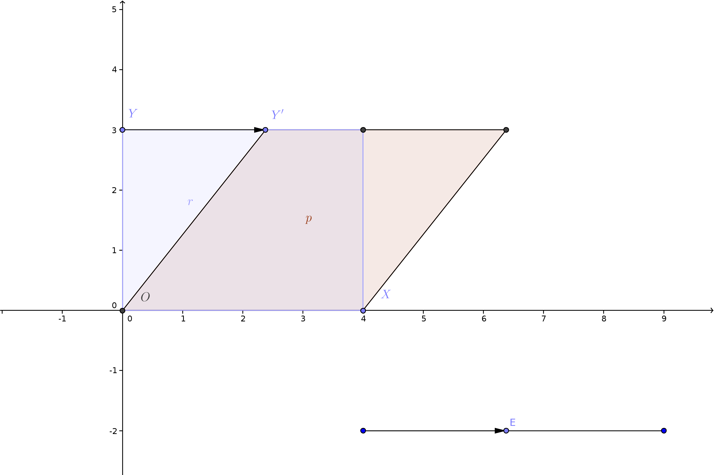

Für den Flächeninhalt des Rechtecks $r$ gilt unter Benutzung der zweidimensionalen Ortsvektoren $x$ bzw. $y$ der Eckpunkte des Rechtecks sowie des Vektorproduktes in $\mathbb{R}^3$
$$
  I=\left\Vert{\begin{pmatrix} x \\ 0 \end{pmatrix}\times\begin{pmatrix} y \\ 0 \end{pmatrix}}\right\Vert=
  \left\Vert{\begin{pmatrix} 0 \\ 0 \\ \det{(x,y)}\end{pmatrix}}\right\Vert=|\det{(x,y)}|
$$
d. h. der Flächeninhalt $I$ kann durch den Absolutbetrag einer Determinante berechnet werden.

durch Scherung wird das Rechteck $r$ auf das Parallelogramm $p$ abgebildet, dessen Flächeninhalt sich entsprechend berechnet
$$
  \det{(x',y')}=\det{\begin{pmatrix} x_1+\lambda\cdot x_2 & y_1+\lambda\cdot y_2 \\ x_2 & y_2 \end{pmatrix}} = (x_1+\lambda\cdot x_2)\cdot y_2-x_2\cdot(y_1+\lambda\cdot y_2)=\det{(x,y)}
$$
d. h. der Flächeninhalt von $r$ gleicht dem des entlang der $x_1$-Achse aus $r$ gescherten Parallelogramms $p$. Es gilt $I_r=I_p$.

**Bemerkung 3.** Für den Spat zweier beziehungsweise dreier Vektoren in $\mathbb{R}^2$ beziehungsweise $\mathbb{R}^3$ gilt $I=\vert\det{(x,y)}\vert$ beziehungsweise $I=\vert\det{(x,y,z)}\vert$.

Unter einer Affinität $\alpha:x\mapsto x'=A\cdot x$ wird $I$ transformiert in
$$
  I'=\vert\det{(x',y',z')}\vert=\vert\det{(A\cdot x,A\cdot y,A\cdot z)}\vert=
  \vert\det{(A\cdot (x,y,z))}\vert=
  \vert\det{A}\vert\cdot\vert\det{(x,y,z)}\vert=\vert\det{A}\vert\cdot I
$$

>**Definition 4.** Eine Affinität $\alpha$ mit $$
  \alpha:x\mapsto x'=\alpha(x)=A\cdot x\quad\text{und}\quad
  \vert\det{A}\vert=1
$$ heißt eine **inhaltstreue Affinität**.

>**Definition 5.** Eine Affinität $\alpha$ mit $$
  \alpha:x\mapsto x'=\alpha(x)=A\cdot x
$$ und $\det{A}>0$ wird **orientierungserhaltend** genannt. Ist hingegen $\det{A}<0$, so heißt $\alpha$ **orientierungsumkehrend**.


Sicher gewusst?
===============

Testen Sie Ihr Wissen bei der Beantwortung der nachstehenden Fragen.

**Frage 1.** Sind $\alpha$ und $\beta$ zwei inhaltstreue Affinitäten des $d$-dimensionalen affinen Raumes $\mathcal{A}^d$, so

[[ ]] ist die Verkettung $\beta\circ\alpha$ orientierungserhaltend.
[[X]] sind die Umkehrabbildungen $\alpha^{-1}$ und $\beta^{-1}$ ebenso inhaltstreu.
[[ ]] sind diese auch orientierungserhaltend.
[[X]] ist die Verkettung $\beta\circ\alpha$ ebenso inhaltstreu.
[[?]] Nutzen Sie, dass sich die Transformationsmatrizen zweier verketteter Affinitäten multiplizieren. Die Verkettung einer Affinität des $d$-dimensionalen affinen Raumes $\mathcal{A}^d$ mit ihrer Umkehrabbildung ist nach Definition die identische Abbildung.
****************************************

Für die Festlegung der Inhaltstreue gilt unter Benutzung der Transformationsmatrix $A$ $$
  |\det{A}|=1\quad\rightarrow\quad \det{A}=1>0\;\;\vee\;\;\det{A}=-1<0
$$ Für die Hintereinanderausführung zweier inhaltstreuer Affinitäten mit den Transformationsmatrizen $A$ und $B$ folgt durch Anwendung des Produktsatzes für Determinanten $$
  |\det{(A\cdot B)}|=|\det{A}\cdot\det{B}|=|\det{A}|\cdot|\det{B}|=1\cdot 1=1
$$
d. h. die Komposition ist wieder inhaltstreu.

Für die Umkehrabbildung $\alpha^{-1}$ gilt mit $\alpha^{-1}\circ\alpha=\mathrm{id}$ durch Anwendung des Produktsatzes für Determinanten $$
  |\det{(A^{-1}\cdot A)}|=|\det{\left(A^{-1}\right)}\cdot\det{A}|=|\det{\left(A^{-1}\right)}|\cdot|\det{A}|=1\quad\to\quad|\det{\left(A^{-1}\right)}|=1
$$ d. h. $\alpha^{-1}$ ist wieder inhaltstreu. (analog für $\beta^{-1}$ nachweisbar) 

Aus der Betrachtung der Inhaltstreue unter einer Affinität folgt nicht, dass diese notwendig orientierungserhaltend bzw. der _umkehrend ist. Hierfür ist zusätzlich $\det{A}>0$ bzw. $\det{A}<0$ zu fordern.

****************************************

**Frage 2.** Sind $\alpha$ und $\beta$ zwei orientierungsumkehrende Affinitäten des $d$-dimensionalen affinen Raumes $\mathcal{A}^d$, so

[[ ]] ist die Komposition $\beta\circ\alpha$ orientierungsumkehrend.
[[X]] ist die Komposition $\beta\circ\alpha$ orientierungserhaltend.
[[X]] sind die Umkehrabbildungen $\alpha^{-1}$ und $\beta^{-1}$ ebenso orientierungsumkehrend.
[[ ]] sind diese auch inhaltstreu.
[[?]] Nutzen Sie, dass sich die Transformationsmatrizen zweier hintereinander ausgeführter Affinitäten multiplizieren. Die Verkettung einer Affinität des $d$-dimensionalen affinen Raumes $\mathcal{A}^d$ mit ihrer Umkehrabbildung ist nach Definition die identische Abbildung.
****************************************

Unter Benutzung der Transformationsmatrix $A$ gilt für orientierungserhaltende bzw. -umkehrende Affinitäten $$
  \det{A}>0\quad\text{bzw.}\quad\det{A}<0
$$ Für die Hintereinanderausführung zweier orientierungsumkehrender Affinitäten $\alpha$ und $\beta$ mit den Transformationsmatrizen $A$ und $B$ folgt durch Anwendung des Produktsatzes für Determinanten $$
  \det{(B\cdot A)}=\det{B}\cdot\det{A}>0
$$ d. h. die Komposition ist orientierungserhaltend. (Die Komposition einer orientierungsumkehrenden mit einer -erhaltenden Affinität wäre hingegen orientierungsumkehrend.)

Für die Umkehrabbildung $\alpha^{-1}$ gilt mit $\alpha^{-1}\circ\alpha=\mathrm{id}$ durch Anwendung des Produktsatzes für Determinanten $$
  \det{(A^{-1}\cdot A)}=\det{\left(A^{-1}\right)}\cdot\det{A}=1\quad\to\quad\det{\left(A^{-1}\right)}=\frac{1}{\det{A}}<0
$$ d. h. $\alpha^{-1}$ ist wieder orientierungsumkehrend. (analog für $\beta^{-1}$ nachweisbar) 

Aus der Betrachtung des Orientierungserhalts bzw. der _umkehr unter einer Affinität folgt nicht, dass diese notwendig inhaltstreu ist. Hierfür ist zusätzlich $ |\det{A}|=1$ zu fordern.

****************************************


[^1]: Für die Determinante der Transformationsmatrix $A$ folgt $$
  \det{A}=\det{\mathrm{diag}{(\lambda_1,...,\lambda_d)}}=\prod_{i=1}^d{\lambda_i}\not=0\quad\leftrightarrow\quad\lambda_i\not=0\;\;\forall\,i\in\{1,...,d\}
$$ wonach $\alpha$ eine Affinität darstellt.


### Kongruenzen

Die Ausführungen dieses Kapitels beziehen sich auf ein kartesisches rechtsorientiertes[^1] Koordinatensystem.

>**Definition 1.** Eine winkeltreue Affinität des $d$-dimensionalen affinen Raumes $\mathcal{A}^d$ heißt **Ähnlichkeit**, eine längentreue Ähnlichkeit heißt **Kongruenz**.


Erhalt von Winkelgrößen
=======================

Betrachtet wird ein Winkel $\angle{ASB}$ (mit Scheitelpunkt $S$), für dessen Winkelmaß unter Benutzung der Ortsvektoren $a$, $b$ und $s$ gilt $$
  \cos{\measuredangle{ASB}}=\frac{(b-s)\cdot(a-s)}{\Vert b-s\Vert\cdot\Vert a-s\Vert}
$$
Ohne Beschränkung der Allgemeinheit kann $S$ mit dem Koordinatenursprung identifiziert werden. Gelten speziell $$
  A=E_i\,,\quad B=E_j
$$ für $i\not=j$, so gelten für die Ortsvektoren $e_i\cdot e_j=0$, d. h. das Skalarprodukt der Vektoren ergibt den Wert Null. Für eine Ähnlichkeit folgt, dass die Spaltenvektoren der Transformationsmatrix paarweise orthogonal sind. Es gilt $$
  s_i\cdot s_j=0\quad\forall i\not=j
$$

~~Aber~~: Diese Eigenschaft ist für Transformationsmatrizen nicht hinreichend, da z. B. die Matrix $$
  A=\begin{pmatrix} 1 & 0 & 0 \\ 0 & \sqrt{2} & 0 \\ 0 & 0 & \pi \end{pmatrix}
$$ wegen $\det{A}=\sqrt{2}\cdot\pi\not=0$ eine Affinität $\alpha$ mit
$$
  \alpha:x\mapsto x'=A\cdot x
$$
festlegt. Die Spaltenvektoren der Matrix $A$ $$
  s_1=\begin{pmatrix} 1 \\ 0 \\ 0 \end{pmatrix}\,,\quad
  s_2=\begin{pmatrix} 0 \\ \sqrt{2} \\ 0 \end{pmatrix}\quad\text{und}\quad
  s_3=\begin{pmatrix} 0 \\ 0 \\ \pi \end{pmatrix}
$$ sind paarweise orthogonal, da $$
  s_i\cdot s_j=0\quad\forall i\not=j\,,\;i\in\{1,2,3\}\,,\;j\in\{1,2,3\}
$$ Jedoch gelten mit den Ortsvektoren $$
  x=\begin{pmatrix} 1 \\ 1 \\ 1 \end{pmatrix}\,,\quad
  y=\begin{pmatrix} 1 \\ 0 \\ -1\end{pmatrix}
$$ und $x\cdot y=0$ unter der Affinität $\alpha$ für deren affine Bilder $$
  x'=A\cdot x=\begin{pmatrix} 1 \\ \sqrt{2} \\ \pi \end{pmatrix}\,,\quad
  y'=A\cdot y=\begin{pmatrix} 1 \\ 0 \\ -\pi \end{pmatrix}
$$ mit $x'\cdot y'=1-\pi^2\not=0$. Das heißt $\alpha$ ist ~~nicht~~ winkeltreu.

Für den Erhalt der Winkeltreue unter einer Affinität ist die Forderung, dass die Raumdiagonale in einem Würfel orthogonal zu den Flächendiagonalen ist. In der nachfolgenden Abbildung ist der Würfel mit Eckpunkten $$
  O(0,0,0)\,,\quad E_1(1,0,0)\,,\quad E_2(0,1,0)\,,\quad E_3(0,0,1)\quad\text{usw.}
$$ betrachtet. Die $O$ gegenüberliegende Ecke $E(1,1,1)$ des Würfels bildet die Raumdiagonale $OE$, die Einheitspunkte auf den Achsen bilden Flächendiagonalen des Würfels.

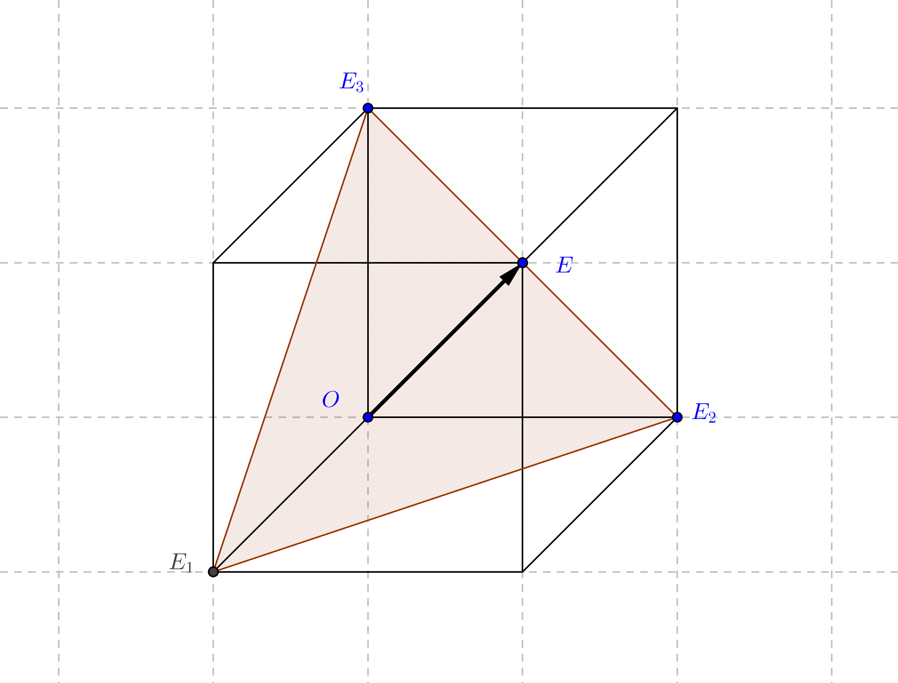

Für die Paare von Vektoren $(x,x')$ beziehungsweise $(y,y')$ unter einer Affinität $$
  \alpha:x\mapsto x'=A\cdot x\,,\quad A=(s_1,s_2,s_3)\,,\quad\det{A}\not=0
$$ berechnen sich $$
  x=\overrightarrow{OE}=e_1+e_2+e_3\stackrel{\alpha}{\longmapsto}s_1+s_2+s_3=x'
$$ sowie $$
  y=\overrightarrow{E_1E_3}=-e_1+e_3\stackrel{\alpha}{\longmapsto}-s_1+s_3=y'
$$ und schließlich $$
  x\cdot y=0\quad\stackrel{\alpha}{\longmapsto}\quad \left(x'\cdot y'=0\leftrightarrow s_1^2=s_3^2\right)
$$ Analoges berechnet sich für $y=\overrightarrow{E_1E_2}$.

>**Definition 2.** Eine Matrix $A$ der Form $$
  A=(s_1,...,s_d)\in\mathbb{R}^{(d,d)}
$$ mit den Eigenschaften
>
>1. $s_i\cdot s_j=0\quad\forall\;i\not=j$ (paarweise Orthogonalität)
>2. $s_i\cdot s_i=s_i^2=1\quad\forall\;i$ (Einheitsvektor)
>
> mit $i\in\{1,...,d\}$ und $j\in\{1,...,d\}$ heißt **orthogonal**.

**Beispiel 1.** Gegeben sind die nachstehenden quadratischen Matrizen $$
  A_1=\begin{pmatrix} \frac{1}{2} & -\frac{1}{2}\cdot\sqrt{3} \\ \frac{1}{2}\cdot\sqrt{3} & \frac{1}{2} \end{pmatrix}\,,\quad
  A_2=\begin{pmatrix} 1 & a \\ 0 & b \end{pmatrix}\,,\quad
  A_3=\begin{pmatrix} 1 & -1 \\ 0 & 0 \end{pmatrix}\quad\text{und}\quad
  A_4=\begin{pmatrix} 1 & 0 & 0 \\ 0 & \cos{\varphi} & -\sin{\varphi} \\ 0 & \sin{\varphi} & \cos{\varphi} \end{pmatrix}
$$ Die Matrizen sind auf Orthogonalität zu prüfen.

1. Die Matrix $A_1$ ist orthogonal, da für die Spaltenvektoren $$
  s_1=\begin{pmatrix} \frac{1}{2} \\ \frac{1}{2}\cdot\sqrt{3} \end{pmatrix}\quad\text{und}\quad s_2=\begin{pmatrix} -\frac{1}{2}\cdot\sqrt{3} \\ \frac{1}{2} \end{pmatrix}
$$ offensichtlich gelten $$
  s_1\cdot s_2=0\quad\text{sowie}\quad s_1^2=s_2^2=1
$$
2. Zur Matrix $A_2$ gehören die Spaltenvektoren $$
  s_1=\begin{pmatrix} 1 \\ 0 \end{pmatrix}\quad\text{und}\quad s_2=\begin{pmatrix} a \\ b \end{pmatrix}
$$ Für diese berechnen sich $$
  s_1\cdot s_2=1\cdot a+0\cdot b=a\quad\text{sowie}\quad s_1^2=1\,,\;s_2^2=a^2+b^2
$$ Damit ist $A_2$ genau dann orthogonal, falls $a=0$ und $b\in\{-1,1\}$ gelten.
3. Matrix $A_3$ ist nicht orthogonal, da die Spaltenvektoren nicht orthogonal zueinander sind.
4. Zur Matrix $A_4$ gehören die Spaltenvektoren $$
  s_1=\begin{pmatrix} 1 \\ 0 \\ 0 \end{pmatrix}\,,\quad
  s_2=\begin{pmatrix} 0 \\ \cos{\varphi} \\ \sin{\varphi} \end{pmatrix}\quad\text{und}\quad
  s_3=\begin{pmatrix} 0 \\-\sin{\varphi} \\ \cos{\varphi} \end{pmatrix}
$$ Für diese berechnen sich $$
  s_1\cdot s_2=s_1\cdot s_3=0\quad\text{sowie}\quad s_2\cdot s_3=\cos{\varphi}\cdot\left(-\sin{\varphi}\right)+\sin{\varphi}\cdot\cos{\varphi}=0\quad\forall\;\varphi\in\mathbb{R}
$$ sowie - nach Anwendung des trigonometrischen Pythagoras - die (Quadrate der) Normen $$
  s_1^2=1\,,\quad s_2^2=s_3^2=\left(\cos{\varphi}\right)^2+\left(\sin{\varphi}\right)^2=1\quad\forall\;\varphi\in\mathbb{R}
$$ Damit ist $A_4$ für alle Parameterwerte $\varphi\in\mathbb{R}$ orthogonal.


**Bemerkung 1.** Aus beiden Eigenschaften folgt äquivalent $$
  A\cdot A^\top=A^\top\cdot A=E\quad\leftrightarrow\quad A^\top=A^{-1}
$$ worin $E=\mathrm{diag}{(1,...,1)}$ die $d$-reihige Einheitsmatrix bezeichnet. Mit Hilfe dieser Matrixgleichung lässt sich eine Matrix auf Orthogonalität prüfen.

Für eine orthogonale Matrix $B$ sowie einen Skalar $\mu\in\mathbb{R}\setminus\{0\}$ und die $\mu$-fache Matrix $A=\mu\cdot B$ berechnen sich die affinen Bilder zweier beliebiger Vektoren $x=(x_1,...,x_d)^\top$ und $y=(y_1,...,y_d)^\top$ unter der Affinität $$
  \alpha:x\mapsto x'=A\cdot x\,,\quad\det{A}\not=0
$$ vermöge $$
  x\mapsto x'=A\cdot x=\sum_{i=1}^d{x_i\cdot s_i}\,,\quad
  y\mapsto y'=A\cdot y=\sum_{i=1}^d{y_i\cdot s_i}
$$ Hieraus folgt für den zwischen $x$ und $y$ eingeschlossenen Winkel $$
  \cos{\measuredangle{(x',y')}}=
  \frac{x_1\cdot y_1\cdot s_1^2+...+x_d\cdot y_d\cdot s_d^2}{\sqrt{x_1^2\cdot s_1^2+...x_d^2\cdot s_d^2}\cdot\sqrt{y_1^2\cdot s_1^2+...y_d^2\cdot s_d^2}}=
  \frac{\Vert s_1\Vert^2\cdot\left(\sum_{i=1}^d{x_i\cdot y_i}\right)}{\Vert s_1\Vert\cdot\sqrt{\sum_{i=1}^d{x_1^2}}\cdot\Vert s_1\Vert\cdot\sqrt{\sum_{i=1}^d{x_1^2}}}=
  \cos{\measuredangle{(x,y)}}
$$

>**Satz 1.** Jede Ähnlichkeit $\alpha$ des $d$-dimensionalen affinen Raumes $\mathcal{A}^d$ lässt sich beschreiben durch $$
  \alpha:x\mapsto x'=\mu\cdot B\cdot x+b
$$ mit orthogonaler Matrix $B\in\mathbb{R}^{d,d}$, Ähnlichkeitsfaktor $\mu\in\mathbb{R}\setminus\{0\}$ und Translationsvektor $b\in\mathbb{R}^d$.

**Bemerkung 2.** Unter einer Ähnlichkeit $\alpha$ wird jede Strecke auf eine Strecke der $\vert\mu\vert$-fachen Länge abgebildet.


Erhalt von Längen
=================

Für $\mu=1$ beschreibt die Matrixdarstellung in Satz 1 eine Kongruenz. Diese ist winkeltreu und längentreu.

Besitzt die Transformationsmatrix $A=1\cdot B$ die Spaltendarstellung $$
  A=(s_1,s_2,s_3)
$$ so gilt $\det{A}=\pm1$, denn $$
  \det{A}=\det{(s_1,s_2,s_3)}=s_1\cdot(s_2\times s_3)=\pm s_1^2=\pm1
$$
Mit Definition 5 aus dem Abschnitt [Spezielle Affinitäten](#Spezielle-Affinitäten) werden unterschieden:

1. Orientierungserhaltende Kongruenzen, falls $\det{A}=1$
2. Orientierungsumkehrende Kongruenzen, falls $\det{A}=-1$

Einfache Beispiele für orientierungserhaltende Kongruenzen sind *Translationen* und *Drehungen* der Ebene bzw. des dreidimensionalen Raumes. Hierbei wird ein mit einem Quadrat / Würfel verbundenes kartesisches Koordinatensystem unter Beibehaltung der Orientierung ('Rechte- bzw. Linke-Hand-Regel') kongruent verlagert.

Beispiele für orientierungsumkehrende Kongruenzen sind *Spiegelungen* der Ebene an einer Geraden bzw. Spiegelungen des dreidimensionalen Raumes an einer Ebene. Ein kartesisches Koordinatensystem wird hierbei unter Umkehr seiner Orientierung kongruent verlagert.

[^1]: Diese Aussage bezieht sich auf ein kartesisches Koordinatensystem im dreidimensionalen affinen Raum, lässt sich jedoch allgemein für affine Räume der Dimension $d\geq2$ formulieren: Zeigen Daumen, Zeigefinger beziehungsweise Mittelfinger der ~~rechten~~ Hand in Richtung der ersten, zweiten beziehungsweise dritten Achse eines kartesischen Koordinatensystems, so liegt ein räumliches, ~~rechts~~orientiertes Koordinatensystem vor. Entsprechend lässt sich ein linksgerichtetes kartesisches Koordinatensystem festlegen.


Sicher gewusst?
===============

**Frage 1.** Gegeben ist eine quadratische Matrix der Form $$
  A=\mu\cdot\begin{pmatrix} \sqrt{2} & 0 & 0 \\ 0 & 1 & 1 \\ 0 & -1 & 1 \end{pmatrix}
$$ mit Parameter $\mu\in\mathbb{R}$.

Geben Sie alle Werte $\mu$ an, für die $A$ Transformationsmatrix einer Kongruenz ist.

[[ ]] $\mu=-\sqrt{2}$
[[X]] $\mu=\frac{1}{2}\cdot\sqrt{2}$
[[X]] $\mu=-\frac{1}{\sqrt{2}}$
[[ ]] Es gibt keinen Parameterwert $\mu$, so dass $A$ die gesuchte Eigenschaft besitzt.
[[ ]] $\mu=\sqrt{2}$
[[?]] Berechnen Sie das Produkt $A\cdot A^\top$. Beachten Sie den skalaren Faktor $\mu$.
****************************************

$$
  A\cdot A^\top=\mu^2\cdot\begin{pmatrix} \sqrt{2} & 0 & 0 \\ 0 & 1 & 1 \\ 0 & -1 & 1 \end{pmatrix}\cdot\begin{pmatrix} \sqrt{2} & 0 & 0 \\ 0 & 1 & -1 \\ 0 & 1 & 1 \end{pmatrix}=\mu^2\cdot\begin{pmatrix} 2 & 0 & 0 \\ 0 & 2 & 0 \\ 0 & 0 & 2 \end{pmatrix}
$$ Damit ist $A$ eine orthogonale Matrix genau dann, wenn $\mu^2\cdot 2=1$, d. h. $\mu=\pm\frac{1}{\sqrt{2}}$.

****************************************

**Frage 2.** Welche der nachstehenden Matrizen $A$ bzw. $B$ ist Transformationsmatrix einer Ähnlichkeit?

[( )] $$ A=\begin{pmatrix} 1 & 0 \\ 0 & 2 \end{pmatrix} $$
[(X)] $$ B=\begin{pmatrix} 2 & 0 \\ 0 & 2 \end{pmatrix} $$
[[?]] Die Wirkung der bezüglich $A$ bzw. $B$ beschriebenen Affinität auf einen Kreis $k$ ist in der folgenden Abbildung dargestellt. 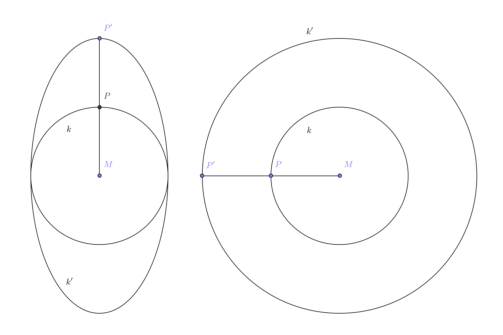
****************************************

Die Spaltenvektoren der Matrix $A$ sind orthogonal, jedoch besitzen sie verschiedene Längen. Im Sinne der Definition orthogonaler Matrizen ist $A$ weder orthogonal noch ein skalares Vielfaches einer orthogonalen Matrix, beschreibt demnach ~~keine~~ Ähnlichkeit. Die Matrix $A$ beschreibt eine Skalierung, siehe Abschnitt [Spezielle Affinitäten](#Spezielle-Affinitäten).

Für die Matrix $B$ gilt $B=2\cdot E$ mit zweireihiger Einheitsmatrix $E$. Demnach beschreibt $B$ nach Satz 1 eine Ähnlichkeit.

****************************************


### Drehungen

Drehungen in der Ebene
======================

Definition
----------

In diesem Abschnitt werden Drehungen der Ebene um den Koordinatenursprung mit Drehwinkel $\varphi$ betrachtet. Siehe nachstehende Abbildung.

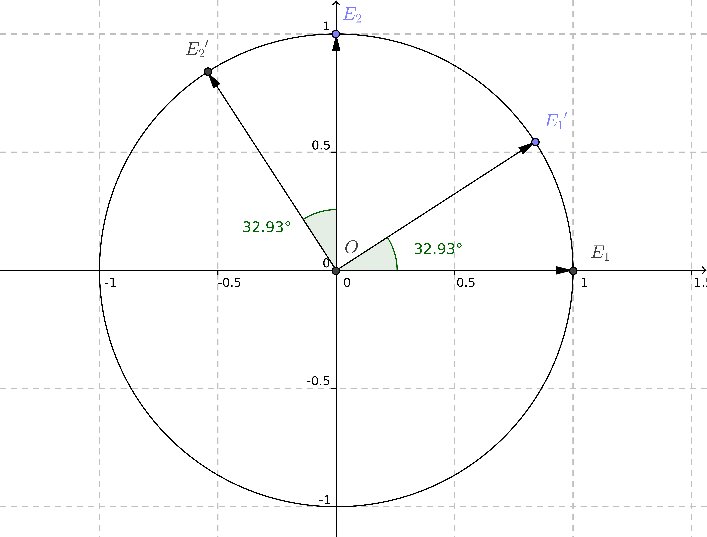

Für die Matrixdarstellung dieser Drehung $\alpha$ $$
  \alpha: x\mapsto x'=A\cdot x+a
$$ ergeben sich unmittelbar:

1. Der Translationsvektor ist der Nullvektor, also $a=(0,0)^\top$.
2. Für die Darstellung der Transformationsmatrix $A=(s_1,s_2)^\top$ sind die Bilder der natürlichen Basis $$
  e_1=\begin{pmatrix} 1 \\ 0 \end{pmatrix}\,,\quad
  e_2=\begin{pmatrix} 0 \\ 1 \end{pmatrix}
$$ in der Basis $[e_1,e_2]$ zu bestimmen. Es ergeben sich unmittelbar $$
  s_1=e_1'=\begin{pmatrix} \cos{\varphi} \\ \sin{\varphi} \end{pmatrix}\,,\quad
  s_2=e_2'=\begin{pmatrix} -\sin{\varphi} \\ \cos{\varphi} \end{pmatrix}
$$ und somit $$
  A=\begin{pmatrix} \cos{\varphi} & -\sin{\varphi} \\ \sin{\varphi} & \cos{\varphi} \end{pmatrix}\,,\quad \varphi\in[-\pi,\pi)
$$ Die Transformationsmatrix $A$ wird **Drehmatrix** genannt und ist orthogonal im Sinne von Definition 2 im Abschnitt [Kongruenzen und Ähnlichkeiten](#Kongruenzen-und-Ähnlichkeiten). Außerdem gilt $\det{A}=1$.

**Bemerkung 1.** Drehmatrizen mit Drehwinkeln $\varphi$ und $\varphi+2\cdot\pi$ beschreiben dieselbe Drehung. Insofern ist es für manche Anwendungen ausreichend, sich auf Winkel $\varphi\in[-\pi,\pi)$ zu beziehen.

Eine Herleitung der Transformationsmatrix für Drehungen der Ebene um den Koordinatenursprung ist im nachstehenden Video erläutert.

!?[Drehung in der Ebene](https://www.youtube.com/watch?v=Z85UyxiXubk)


Eigenschaften
-------------

Zur Bestimmung der ~~Umkehrabbildung~~ einer Drehung der Ebene um den Koordinatenursprung $O$ mit Drehwinkel $\varphi$ ist die Drehmatrix zu transponieren. Es gilt $$
  \alpha^{-1}:x'\mapsto x=A^{-1}\cdot x'=A^\top\cdot x'
$$ worin wegen der Beziehungen[^1] $\cos{\varphi}=\cos{(-\varphi)}$ und $\sin{\varphi}=-\sin{(-\varphi)}$ für beliebige Winkel $\varphi\in\mathbb{R}$ gilt $$
  A^\top=
  \begin{pmatrix} \cos{\varphi} & \sin{\varphi} \\ -\sin{\varphi} & \cos{\varphi} \end{pmatrix}=
  \begin{pmatrix} \cos{(-\varphi)} & -\sin{(-\varphi)} \\ \sin{(-\varphi)} & \cos{(-\varphi)} \end{pmatrix}
$$ Die entspricht einer Ersetzung des Drehwinkels $\varphi$ in der Matrixdarstellung durch den Drehwinkel $\psi=-\varphi$ (Drehung um den gleichen Winkel bei umgekehrtem Drehsinn).

Die Hintereinanderausführung zweier Drehungen $$
  \rho_1:x\mapsto x'=A_1\cdot x\quad\text{sowie}\quad
  \rho_2:x'\mapsto x''=A_2\cdot x'
$$ mit den Drehmatrizen $$
  A_i=\begin{pmatrix} \cos{\varphi_i} & -\sin{\varphi_i} \\ \sin{\varphi_i} & \cos{\varphi_i} \end{pmatrix}\,,\quad \varphi_i\in[-\pi,\pi)
$$ ergibt sich $$
  \alpha=\rho_2\circ\rho_1:x\stackrel{\rho_1}{\longmapsto}x'\stackrel{\rho_2}{\longmapsto}x''
$$ mit der Matrixdarstellung $$
  x''=A_2\cdot(A_1\cdot x)=(A_2\cdot A_1)\cdot x
$$ worin sich das Matrizenprodukt unter Nutzung der Additionstheoreme für Sinus und Kosinus berechnet zu $$
  A_2\cdot A_1=
  \begin{pmatrix} \cos{\varphi_2} & -\sin{\varphi_2} \\ \sin{\varphi_2} & \cos{\varphi_2} \end{pmatrix}\cdot\begin{pmatrix} \cos{\varphi_1} & -\sin{\varphi_1} \\ \sin{\varphi_1} & \cos{\varphi_1} \end{pmatrix}=
  \begin{pmatrix} \cos{(\varphi_1+\varphi_2)} & -\sin{(\varphi_1+\varphi_2)} \\ \sin{(\varphi_1+\varphi_2)} & \cos{(\varphi_1+\varphi_2)} \end{pmatrix}\,,\quad (\varphi_1+\varphi_2)\in[-\pi,\pi)
$$ Die Komposition $\alpha$ beschreibt also wieder eine Drehung um den Koordinatenursprung $O$ mit Drehwinkel $\varphi_1+\varphi_2$.

Speziell für $\varphi_1=\varphi$ und $\varphi_2=-\varphi$ mit $\varphi\in[-\pi,\pi)$ ergibt sich mit $$
  \alpha:x\mapsto x''=\begin{pmatrix} \cos{0} & -\sin{0} \\ \sin{0} & \cos{0} \end{pmatrix}\cdot x=\begin{pmatrix} 1 & 0 \\ 0 & 1 \end{pmatrix}\cdot x=x
$$ die identische Abbildung $\alpha_{id}$.

Zusammenfassend ergibt sich aus den genannten Eigenschaften

>**Satz 1.** Die Menge der Drehungen $\rho$ der Ebene um den Koordinatenursprung eines kartesischen, rechtsgerichteten  Koordinatensystems mit reellem Drehwinkel bildet bezüglich der Hintereinanderausführung eine Gruppe, die $SO(2)$ genannt wird.

**Beispiel 2.** Untergruppen von $SO(2)$ sind die Drehungen mit Drehwinkeln $$
  \varphi_k=k\cdot\frac{2\cdot\pi}{n}\,,\quad k\in\{1,2,...,n\}
$$ zu festem Parameter $n\in\mathbb{N}\setminus\{0\}$. Zum Beispiel für $n=4$ die Drehungen mit den Drehwinkeln $$
  \varphi\in\left\{\frac{\pi}{2},\pi,\frac{3\cdot\pi}{2},2\cdot\pi\right\}
$$ Diese lassen sich deuten als die Drehungen um das Zentrum eines Quadrates, die das Quadrat auf sich abbilden. Sie gehören zu den *Symmetrieabbildungen* des Quadrates, die bezüglich der Hintereinanderausführung eine Gruppe bilden: Die *Symmetriegruppe* des Quadrates.

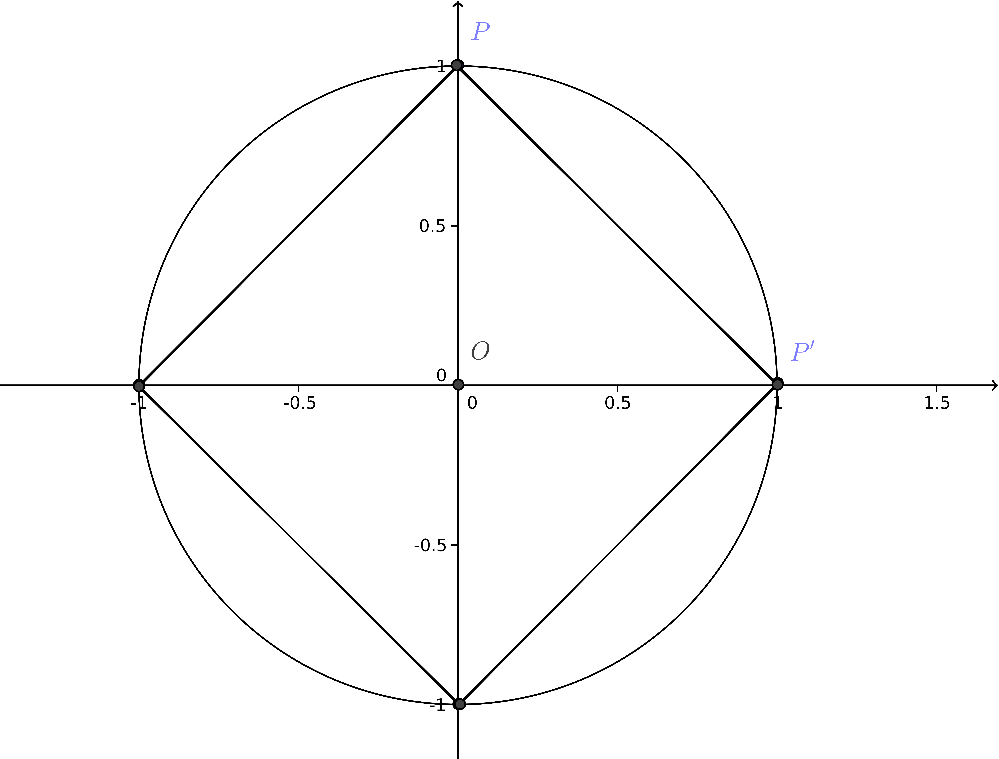


Drehungen im dreidimensionalen Raum
===================================

Drehung um die Koordinatenachsen
--------------------------------

Im dreidimensionalen Raum können Drehungen um Geraden ausgeführt werden, für deren Beschreibung mehr Freiheitsgrade existieren.[^2]

Zum Beispiel eine Drehung $\rho$ um die $x_3$-Achse des kartesischen Koordinatensystems mit Drehwinkel $\varphi\in[-\pi,\pi)$.

1. Durch die räumliche Drehung $\rho$ werden die Punkte der $xy$-Ebene ($z=0$) in dieser Ebene um den Koordinatenursprung $O$ gedreht, $\rho$ kann in der $xy$-Ebene durch eine ebene Drehung beschrieben werden.
2. Die Punkte in der Ebene $z=c$ mit $c\in\mathbb{R}$ werden unter der räumlichen Drehung $\rho$ in dieser Ebene um den Punkt $M_c(0,0,c)$ gedreht. D. h. $\rho$ beschreibt in den Ebenen $z=c$ ebene Drehungen, die $x_3$-Koordinate jedes Punktes ist unter $\rho$ fest.
3. Die Punkte der Drehachse sind unter der Drehung $\rho$ fest (Fixpunktgerade).

Für die Festlegung der Matrixdarstellung $$
  \rho:x\mapsto x'=D_3\cdot x+a\,,\quad D_3\in\mathbb{R}^{3,3}\,,\; a\in\mathbb{R}^3
$$ ist damit zu bemerken:

1. Der Koordinatenursprung $O$ ist - als Punkt der Drehachse - unter der Drehung $\rho$ fest. Hieraus folgt, dass der Translationsvektor der Nullvektor ist, $a=o$.
2. Die Einheitspunkte $E_i$, $i\in\{1,2,3\}$, des kartesischen Koordinatensystems werden unter der Drehung $\rho$ abgebildet auf $$
  E_1'(\cos{\varphi},\sin{\varphi},0)\,,\quad
  E_2'(-\sin{\varphi},\cos{\varphi},0)\quad\text{und}\quad
  E_3'(0,0,1)
$$ Die Ortsvektoren dieser Punkte entsprechen den Spaltenvektoren der Transformationsmatrix $D_3$ $$
  D_3=\begin{pmatrix}
    \cos{\varphi} & -\sin{\varphi} & 0 \\
    \sin{\varphi} & \cos{\varphi} & 0 \\
    0 & 0 & 1
  \end{pmatrix}
$$ Die Matrix $D_3$ wird *Drehmatrix* bezogen auf die $x_3$-Achse genannt.

Die Drehmatrix $D_3$ ist eine orthogonale Matrix, da gilt $$
  D_3\cdot D_3^\top=
  \begin{pmatrix}
    \cos{\varphi} & -\sin{\varphi} & 0 \\
    \sin{\varphi} & \cos{\varphi} & 0 \\
    0 & 0 & 1
  \end{pmatrix}\cdot
  \begin{pmatrix}
    \cos{\varphi} & \sin{\varphi} & 0 \\
    -\sin{\varphi} & \cos{\varphi} & 0 \\
    0 & 0 & 1
  \end{pmatrix}=
  \begin{pmatrix} 1 & 0 & 0 \\ 0 & 1 & 0 \\ 0 & 0 & 1 \end{pmatrix}
$$ Außerdem gilt $\det{D_3}=1$. Dies bedeutet, dass die Drehung eine orientierungserhaltende Kongruenz ist.

**Bemerkung 2.** Bei Drehung um die $x_1$-Achse beziehungsweise um die $x_2$-Achse besitzt die Drehmatrix die Gestalt $$
  D_1=\begin{pmatrix} 1 & 0 & 0 \\ 0 & \cos{\varphi} & -\sin{\varphi} \\ 0 & \sin{\varphi} & \cos{\varphi} \end{pmatrix}\quad\text{bzw.}\quad
  D_2=\begin{pmatrix} \cos{\varphi} & 0 & \sin{\varphi} \\ 0 & 1 & 0 \\ -\sin{\varphi} & 0 & \cos{\varphi} \end{pmatrix}
$$ worin $\varphi\in[-\pi,\pi)$ den Drehwinkel bezüglich der in positiver Richtung der Koordinatenachse orientierten Drehachse entspricht.[^3]


Drehung um Achsen durch den Koordinatenursprung
-----------------------------------------------

Eine Drehung um eine Achse $g$ durch den Koordinatenursprung $O$ in allgemeiner Lage kann als Drehung um die erste Achse bezüglich eines angepassten Koordinatensystems beschrieben werden. Für den Wechsel des Koordinatensystems können ["geographische" Koordinaten](https://www.geogebra.org/m/zzvraxdj) verwendet werden.

Die "Länge" beziehungsweise "Breite" eines Richtungsvektors $g$ der Geraden sind durch die Winkel $$
  \varphi\in[0,2\cdot\pi)\quad\text{bzw.}\quad
  \theta\in\left[-\frac{\pi}{2},\frac{\pi}{2}\right]
$$ beschrieben. Dabei wird der Winkel

1. $\varphi$ als Winkel in der $x_1x_2$-Ebene ("Äquatorebene") zwischen der positiven $x_1$-Richtung / dem Vektor $e_1$ und dem 'Grundriss' des Richtungsvektors $g$ festgelegt. Orientierung bezogen auf die positive $x_3$-Richtung.
2. $\theta$ als Winkel zwischen $g$ und der Ebene $x_3=0$. Für den Winkel $\theta$ ist festgelegt $$
  \left.\begin{array}{r} \theta>0 \\ \theta=0 \\ \theta<0 \end{array}\right\}
  \quad\leftrightarrow\quad
  \left\{\begin{array}{r} g\cdot e_3>0 \\ g\cdot e_3=0 \\ g\cdot e_3<0 \end{array}\right.
$$ worin $e_3=(1,0,0)^\top$ einen Normalenvektor der Ebene $x_3=0$ bezeichnet.   

Die (Richtung der) Drehachse $g$ kann dann vermöge $$
  D_3(\varphi)\cdot D_2(-\theta)\cdot e_1=
  \begin{pmatrix}
    \cos{\varphi} & -\sin{\varphi} & 0 \\
    \sin{\varphi} & \cos{\varphi} & 0 \\
    0 & 0 & 1
  \end{pmatrix}\cdot
  \begin{pmatrix} \cos{\theta} & 0 & -\sin{\theta} \\ 0 & 1 & 0 \\ \sin{\theta} & 0 & \cos{\theta} \end{pmatrix}\cdot
  \begin{pmatrix} 1 \\ 0 \\ 0 \end{pmatrix}=
  \begin{pmatrix} \cos{\varphi}\cdot\cos{\theta} \\ \sin{\varphi}\cdot\cos{\theta} \\ \sin{\theta} \end{pmatrix}
$$ berechnet werden. Der Wechsel des Koordinatensystems ist demnach durch $$
  B=D_3(\varphi)\cdot D_2(-\theta)
$$ beschrieben, einer Komposition aus zwei Drehungen um die Koordinatenachsen. Der Wechsel des Koordinatensystems kann rückgängig gemacht werden durch $$
  B^{-1}=D_2(\theta)\cdot D_3(-\varphi)
$$ Für die Drehung um $g$ mit dem Drehwinkel $\gamma$ folgt schließlich
$$
  \textcolor{magenta}{D_2(\theta)\cdot D_3(-\varphi)}\cdot x'=D_1(\gamma)\cdot \textcolor{magenta}{D_2(\theta)\cdot D_3(-\varphi)}\cdot x
$$ und nach Multiplikation mit $B$ von links $$
  x'=\textcolor{magenta}{D_3(\varphi)\cdot D_2(-\theta)}\cdot D_1(\gamma)\cdot \textcolor{magenta}{D_2(\theta)\cdot D_3(-\varphi)}\cdot x
$$ Hieraus folgt, dass sich eine Drehung $\rho$ um eine Gerade $g\ni O$ mit den "geographischen" Koordinaten $(\varphi,\theta)$ durch Hintereinanderausführung von Drehungen um die Koordinatenachsen des kartesischen Koordinatensystems $[O,E_1,E_2,E_3]$ darstellen lässt. Die Frage, ob die Hintereinanderausführung von Drehungen wieder eine Drehung beschreibt, wird in den Sätzen 2 und 3 in diesem Abschnitt besprochen.

**Beispiel 3.** Es ist die Drehung eines Punktes $P(x_1,x_2,x_3)$ um die Ursprungsgerade $g$ mit Richtungsvektor $$
  g=\begin{pmatrix} 1 \\ 1 \\ 1 \end{pmatrix}
$$ um den Winkel $\gamma=120^\circ$ zu berechnen.

Die Koordinaten $(\varphi,\theta)$ lassen sich durch räumliche Überlegungen direkt bestimmen.[^4] Da der 'Grundriss' von $g$ die Komponenten $$
  \begin{pmatrix} 1 & 1 & 0 \end{pmatrix}^\top
$$ folgt unmittelbar $\varphi=\frac{\pi}{4}$. Der Winkel $\theta$ ergibt sich nach der folgenden Abbildung zu $$
  \tan{\theta}=\frac{\sqrt{2}}{2}\quad\leftrightarrow\quad \theta=\arctan{\left(\frac{\sqrt{2}}{2}\right)}\approx0.615
$$

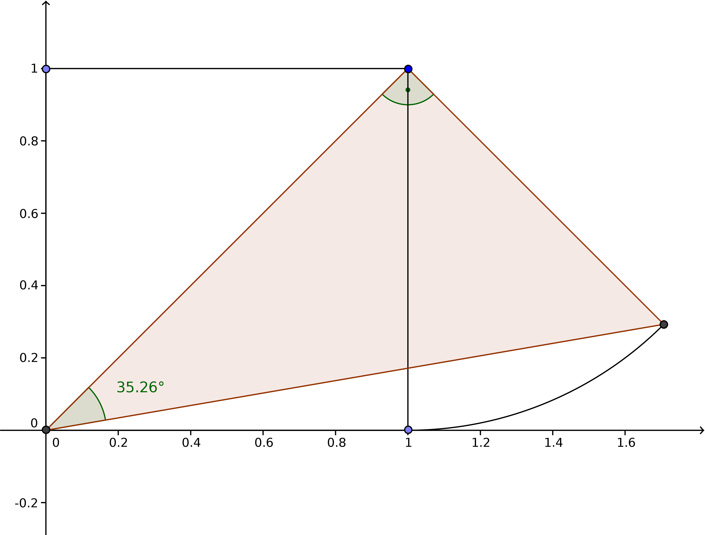

Die Berechnung des Bildpunktes $P'$ eines Punktes $P(x_1,x_2,x_3)$ in allgemeiner Lage ist nachfolgend unter Benutzung der Javascript Bibliothek Algebrite ausgeführt.

``` javascript
P=[[x],[y],[z]]
gamma0=2/3*pi
theta0=arctan(1/2*sqrt(2))
phi0=pi/4
D1=[[1,0,0],[0,cos(gamma),-sin(gamma)],[0,sin(gamma),cos(gamma)]]
D2=[[cos(theta),0,sin(theta)],[0,1,0],[-sin(theta),0,cos(theta)]]
D3=[[cos(phi),-sin(phi),0],[sin(phi),cos(phi),0],[0,0,1]]
inner(
    subst(phi0,phi,D3),
    subst(-theta0,theta,D2),
    subst(gamma0,gamma,D1),
    subst(theta0,theta,D2),
    subst(-phi0,phi,D3),
    P
)
```
@Algebrite.eval

Prüfen Sie die Wirkung der Drehung $\rho$ auf die Eckpunkte $$
  \begin{array}{llll}
    (0,0,0)\,, & (1,0,0)\,,& (1,1,0)\,,& (0,1,0) \\
    (0,0,1)\,, & (1,0,1)\,,& (1,1,1)\,,& (0,1,1)
  \end{array}
$$ Begründen Sie, dass durch $\rho$ eine Symmetrieabbildung des Würfels beschrieben ist.

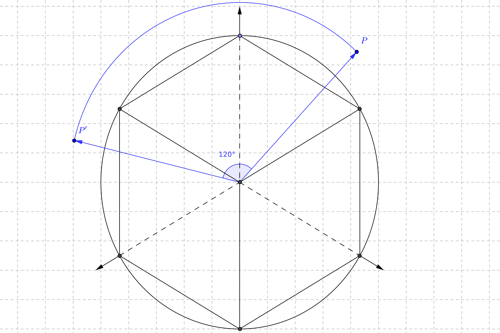

>**Satz 2.** Jede Kongruenz $\rho:\mathcal{A}^3\to\mathcal{A}^3$ mit $$
  \rho:x\mapsto x'=A\cdot x\,,\quad A\cdot A^\top=E\,,\quad \det{A}=1
$$ worin $E$ die dreireihige Einheitsmatrix bezeichnet, ist eine Drehung um eine Gerade durch den Ursprung des Koordinatensystems.

**Beweis.** Siehe *Gert Bär, Geometrie, Abschnitt 7.4, S.146, Satz 1.*

>**Satz 3.** Die Menge aller Drehungen des dreidimensionalen affinen Raumes $\mathcal{A}^3$ um Geraden durch den Ursprung eines kartesischen Koordinatensystems bildet bezüglich der Hintereinanderausführung eine Gruppe. Diese wird mit $SO(3)$ bezeichnet.

**Beweisidee.** Es reicht zu zeigen, dass die Menge der orthogonalen dreireihigen Matrizen mit Determinate Eins eine Matrixgruppe bezogen auf die Multiplikation als Verknüpfung bilden. Es gelten:

1. ~~Abgeschlossenheit~~. Sind $A$ und $B$ zwei orthogonale Matrizen mit $\det{A}=\det{B}=1$, so gilt für das Matrixprodukt $C=A\cdot B$ einerseits unter Benutzung der Rechenregeln für das Transponieren von Matrizen $$
  (A\cdot B)^\top\cdot(A\cdot B)=B^\top\cdot A^\top\cdot A\cdot B=B^\top\cdot B=E
$$ Anderseits folgt unter Benutzung des Produktsatzes für Determinanten $$
  \det{(A\cdot B)}=\det{A}\cdot \det{B}=1\cdot 1=1
$$ D. h. das Produkt $C$ ist erneut eine orthogonale Matrix mit determinante Eins.
2. ~~Assoziativität~~. Klar.
3. ~~Neutrales Element~~. Das neutrale Element in der Menge der orthogonalen dreireihigen Matrizen mit Determinate Eins ist die dreireihige Einheitsmatrix $E$. Diese ist Transformationsmatrix der identischen Abbildung $\rho_{id}$.
4. ~~Inverses Element~~. Für alle orthogonalen dreireihigen Matrizen $A$ mit Determinate Eins existiert eine eindeutig bestimmte Matrix $$
  A^{-1}=A^\top\quad\left(A^\top\cdot A=A\cdot A^\top=E\right)
$$ Die Matrix $A^\top$ ist offensichtlich orthogonal und besitzt die einsichtig die Determinante Eins. $\square$

**Bemerkung 3.** Im Gegensatz zur Gruppe $SO(2)$ ist die Reihenfolge der Faktoren im Matrixprodukt in $SO(3)$ im Allgemeinen nicht vertauschbar.


Sicher gewusst?
===============

**Frage 1.** Gegeben ist ein gleichseitiges Dreieck mit Mittelpunkt im Ursprung $O$ eines kartesischen Koordinatensystems.

Geben Sie jene Transformationsmatrizen $A_i$ an, die eine Drehung des Dreiecks um $O$ auf sich beschreiben.

[[ ]] $$ A_1=\begin{pmatrix} \frac{1}{2}\cdot\sqrt{3} & -\frac{1}{2} \\ \frac{1}{2} & \frac{1}{2}\cdot\sqrt{3}  \end{pmatrix} $$
[[X]] $$ A_2=\begin{pmatrix} -\frac{1}{2} & -\frac{1}{2}\cdot\sqrt{3} \\ \frac{1}{2}\cdot\sqrt{3} & -\frac{1}{2}  \end{pmatrix} $$
[[ ]] $$ A_3=\begin{pmatrix} \frac{1}{2} & -\frac{1}{2}\cdot\sqrt{3} \\ \frac{1}{2}\cdot\sqrt{3} & \frac{1}{2}  \end{pmatrix} $$
[[X]] $$ A_4=\begin{pmatrix} -\frac{1}{2} & \frac{1}{2}\cdot\sqrt{3} \\ -\frac{1}{2}\cdot\sqrt{3} & -\frac{1}{2}  \end{pmatrix} $$
[[?]] Die Transformationsmatrix zur Beschreibung einer Drehung um den Ursprung des kartesischen Koordinatensystems in $\mathbb{R}^2$ ist $$
  A=\begin{pmatrix} \cos{\varphi} & -\sin{\varphi} \\ \sin{\varphi} & \cos{\varphi} \end{pmatrix}
$$ worin $\varphi\in[0,2\cdot\pi)$ gewählt werden kann.
****************************************

Drehungen des Dreiecks um dessen Mittelpunkt mit Drehwinkeln $\frac{2}{3}\cdot\pi$, $\frac{4}{3}\cdot\pi$ sowie $0$ (innerhalb des Grundintervalls) bilden da gleichseitige Dreieck auf sich ab. Es berechnen sich $$
  \sin{\left(\frac{2}{3}\cdot\pi\right)}=\frac{1}{2}\cdot\sqrt{3}\,,\quad
  \cos{\left(\frac{2}{3}\cdot\pi\right)}=-\frac{1}{2}\,,\quad
  \sin{\left(\frac{4}{3}\cdot\pi\right)}=-\frac{1}{2}\cdot\sqrt{3}\,,\quad
  \cos{\left(\frac{4}{3}\cdot\pi\right)}=-\frac{1}{2}
$$ Neben der Einheitsmatrix beschreiben die Matrizen $A_2$ und $A_4$ gesuchten Drehungen.

****************************************

**Frage 2.** Berechnen Sie für die Richtung $$
  g=\begin{pmatrix} 0 \\ 1 \\ -1 \end{pmatrix}
  $$ die "geographischen" Koordinaten $(\varphi,\theta)$ mit $$
  \varphi\in[0,2\cdot\pi)\quad\text{und}\quad\theta\in\left[-\frac{\pi}{2},\frac{\pi}{2}\right]
$$

[( )] $$ (\varphi,\theta)=\left(\frac{\pi}{2},0\right) $$
[(X)] $$ (\varphi,\theta)=\left(\frac{\pi}{2},-\frac{\pi}{4}\right) $$
[( )] $$ (\varphi,\theta)=\left(\frac{3}{2}\cdot\pi,-\frac{\pi}{4}\right) $$
[(X)] $$ (\varphi,\theta)=\left(\frac{\pi}{2},\frac{\pi}{4}\right) $$
[[?]] Die "geographischen" Koordinaten $(\varphi,\theta)$ bestimmen einen Vektor $$
  \begin{pmatrix} \cos{\varphi}\cdot\cos{\theta} \\ \sin{\varphi}\cdot\cos{\theta} \\ \sin{\theta} \end{pmatrix}
$$ der Länge Eins.
****************************************

Der Vektor $g$ ist zunächst zu normieren $$
  g=\Vert g\Vert\cdot g_0\quad\text{mit}\quad \Vert d\Vert=\sqrt{2}\quad\text{und}\quad
  g_0=\begin{pmatrix} 0 \\ \frac{1}{\sqrt{2}} \\ -\frac{1}{\sqrt{2}} \end{pmatrix}
$$ Aus dem Ansatz $$
  g_0=\begin{pmatrix} 0 \\ \frac{1}{\sqrt{2}} \\ -\frac{1}{\sqrt{2}} \end{pmatrix}=\begin{pmatrix} \cos{\varphi}\cdot\cos{\theta} \\ \sin{\varphi}\cdot\cos{\theta} \\ \sin{\theta} \end{pmatrix}
$$ folgen in den angegebenen Intervallen $$
  \sin{\theta}=-\frac{1}{\sqrt{2}}\quad\rightarrow\quad \theta=-\frac{\pi}{4}
$$ sowie $$
  \left(\cos{\varphi}=0\;\wedge\; \sin{\varphi}\cdot\cos{\theta}=\frac{1}{\sqrt{2}}\right)\quad\rightarrow\quad \varphi=\frac{\pi}{2}
$$

****************************************

[^1]: Die reelle Sinusfunktion ist eine ungerade Funktion, die reelle Kosinusfunktion ist hingegen gerade. Siehe [Gerade und ungerade Funktion](https://de.wikipedia.org/wiki/Gerade_und_ungerade_Funktionen).

[^2]: Bei einer ebenen Drehung wird das Drehzentrum durch seine kartesischen Koordinaten festgelegt. Zur Festlegung der Drehachse einer räumlichen Drehung sind beispielsweise die kartesischen (räumlichen) Koordinaten eines Punktes der Drehachse sowie die drei Komponenten eines Richtungsvektors anzugeben.

[^3]: Die Angabe eines Winkels im Raum benötigt den Bezug auf eine Orientierung der Trägerebene des Winkels. Zur räumlichen Vorstellung der Orientierung des Drehwinkels kann helfen, den Daumen der rechten Hand in Richtung der orientierten Drehachse zu richten, während die gekrümmten Finger den orientierten Winkel anzeigen.

[^4]: Die "geographischen" Koordinaten $(\varphi,\theta)$ können alternativ aus dem Ansatz $$
  \frac{1}{\sqrt{3}}\cdot\begin{pmatrix} 1 \\ 1 \\ 1 \end{pmatrix}=
  \begin{pmatrix} \cos{\varphi}\cdot\cos{\theta} \\ \sin{\varphi}\cdot\cos{\theta} \\ \sin{\theta} \end{pmatrix}
$$ berechnet werden. Hierfür ist allerdings der Vektor $g$ zu normieren, da die rechte Seite für jede Wahl von $(\varphi,\theta)$ ein Vektor der Länge Eins ist: Der Vektor $g$ besitzt die Länge $\Vert g\Vert=\sqrt{3}$.


### Schraubungen

Translationen
=============

Translationen $\tau$ sind bereits im Abschnitt [Algebraische Eigenschaften](#Algebraische-Eigenschaften) eingeführt worden.

Jeder Punkt $P\in\mathcal{A}^d$ wird in dieselbe Richtung mit demselben Richtungssinn und Betrag verschoben. Für $d=3$ ergibt sich die Matrixdarstellung $$
  \tau: \begin{pmatrix} x_1 \\ x_2 \\ x_3 \end{pmatrix}\mapsto
  \begin{pmatrix} x_1' \\ x_2' \\ x_3' \end{pmatrix}=
  \begin{pmatrix} 1 & 0 & 0 \\ 0 & 1 & 0 \\ 0 & 0 & 1 \end{pmatrix}\cdot
  \begin{pmatrix} x_1 \\ x_2 \\ x_3 \end{pmatrix}+
  \begin{pmatrix} a_1 \\ a_2 \\ a_3 \end{pmatrix}
$$ worin $a=(a_1,a_2,a_3)^\top$ den Translationsvektor beschreibt. Dessen Länge $$
  \Vert a\Vert=\sqrt{a_1^2+a_2^2+a_3^2}
$$ legt den Translationsbetrag fest.


Eigenschaften
-------------

1. Die Hintereinanderausführung zweier Translationen des $d$-dimensionalen affinen Raumes ist erneut eine Translation, denn mit Translationen $$
  \tau_1:x\mapsto x'=E\cdot x+a\,,\quad
  \tau_2:x'\mapsto x''=E\cdot x'+b\,,\quad
$$ mit $d$-dimensionalen Translationsvektoren $a$ und $b$ und $d$-reihiger Einheitsmatrix $E$ folgt $$
  \tau_2\circ\tau_1:x\mapsto x''=E\cdot (E\cdot x+a)+b=E\cdot x+(a+b)
$$ das ist eine Translation mit Translationsvektor $a+b$.
2. Für $a=b=o$ (Nullvektor) ist die Hintereinanderausführung $\tau_2\circ\tau_1=\alpha_{id}$ die identische Abbildung.
3. Die Hintereinanderausführung zweier Translationen des $d$-dimensionalen Raumes ist kommutativ, d. h. es gilt $$
  \tau_2\circ\tau_1=\tau_1\circ\tau_2
$$

Nahezu analog zur Gruppeneigenschaft der Drehungen in $SO(3)$ lässt sich zeigen

>**Satz 1.** Die Menge der Translationen des $\mathcal{A}^d$ bildet bezüglich der Hintereinanderausführung eine kommutative Gruppe, die mit $\mathbb{R}^d$ bezeichnet wird.[^1]


Schraubungen
============

Eine Schraubung $\kappa$ des dreidimensionalen Raumes entsteht durch Hintereinanderausführung einer Drehung $\rho$ um eine Achse $g$ mit Drehwinkel $\varphi$ und Translation $\tau$ entlang $g$ mit Betrag $|p|$ mit $p\in\mathbb{R}$ $$
  \kappa=\tau(g,p)\circ\rho(g,\varphi)
$$

Ein Beispiel für eine kontinuierliche Schraubung um die $x_3$-Achse eines kartesischen Koordinatensystems kann unter [Schraublinie](https://www.geogebra.org/m/dWVkRc4Q) betrachtet werden.

**Beispiel.** Zu berechnen ist die Schraubung um die $x_1$-Achse eines kartesischen Koordinatensystems mit Drehwinkel $\varphi\in[0,2\cdot\pi)$ und Schubvektor $a=p\cdot e_1$, $p\in\mathbb{R}$, in Richtung der ersten Achse.

1. Eine Drehung $\rho$ um die $x_1$-Achse eines kartesischen Koordinatensystems besitzt die Matrixdarstellung $$
  \rho:\begin{pmatrix} x_1 \\ x_2 \\ x_3 \end{pmatrix}\mapsto
  \begin{pmatrix} x_1' \\ x_2' \\ x_3' \end{pmatrix}=
  \begin{pmatrix} 1 & 0 & 0 \\ 0 & \cos{\varphi} & -\sin{\varphi} \\ 0 & \sin{\varphi} & \cos{\varphi} \end{pmatrix}\cdot
  \begin{pmatrix} x_1 \\ x_2 \\ x_3 \end{pmatrix}
$$ worin $\varphi$ den Drehwinkel angibt. Siehe Abschnitt [Drehungen](#Drehungen).
2. Eine Translation in Richting der Drehachse $e_1$ besitzt den Translationsvektor $$
  a=p\cdot e_1=p\cdot \begin{pmatrix} 1 \\ 0 \\ 0 \end{pmatrix}=
  \begin{pmatrix} p \\ 0 \\ 0 \end{pmatrix}\,,\quad p\in\mathbb{R}
$$
3. Für die Hintereinanderausführung folgt unmittelbar
$$
  \kappa:\begin{pmatrix} x_1 \\ x_2 \\ x_3 \end{pmatrix}\mapsto
  \begin{pmatrix} x_1' \\ x_2' \\ x_3' \end{pmatrix}=
  \begin{pmatrix} 1 & 0 & 0 \\ 0 & 1 & 0 \\ 0 & 0 & 1 \end{pmatrix}\cdot\left(\begin{pmatrix} 1 & 0 & 0 \\ 0 & \cos{\varphi} & -\sin{\varphi} \\ 0 & \sin{\varphi} & \cos{\varphi} \end{pmatrix}\cdot
  \begin{pmatrix} x_1 \\ x_2 \\ x_3 \end{pmatrix}\right)+\begin{pmatrix} p \\ 0 \\ 0 \end{pmatrix}
$$ also $$
  \kappa:\begin{pmatrix} x_1 \\ x_2 \\ x_3 \end{pmatrix}\mapsto
  \begin{pmatrix} x_1' \\ x_2' \\ x_3' \end{pmatrix}=
  \begin{pmatrix} 1 & 0 & 0 \\ 0 & \cos{\varphi} & -\sin{\varphi} \\ 0 & \sin{\varphi} & \cos{\varphi} \end{pmatrix}\cdot
\begin{pmatrix} x_1 \\ x_2 \\ x_3 \end{pmatrix}+\begin{pmatrix} p \\ 0 \\ 0 \end{pmatrix}
$$ Hierin wird $p$ **Schraubparameter** genannt.

**Bemerkung 1.** Für Schraubparameter $p=0$ sind *Drehungen* $$
 \kappa=\tau(\textcolor{magenta}{0})\circ\rho(\varphi)=\rho(\varphi)
$$ mit Drehwinkel $\varphi$ beschrieben, hingegen für $\varphi=0$ *Translationen* $$
  \kappa=\tau(p)\circ\rho(\textcolor{magenta}{0})=\tau(p)
$$ mit dem Translationsvektor $$
  a=\begin{pmatrix} p \\ 0 \\ 0 \end{pmatrix}
$$ Eine Schraubung umfasst somit alle anderen orientierungserhaltenden Kongruenzen des dreidimensionalen Raumes.

Die Matrixdarstellung einer Schraubung lässt sich in **homogener Darstellung**[^2] unter alleiniger Verwendung der Matrixmultiplikation darstellen. Für das vorstehende Beispiel ergibt sich beispielsweise $$
  \kappa:\begin{pmatrix} \textcolor{magenta}{1} \\ x_1 \\ x_2 \\ x_3 \end{pmatrix}\mapsto
  \begin{pmatrix} \textcolor{magenta}{1} \\ x_1' \\ x_2' \\ x_3' \end{pmatrix}=
  \begin{pmatrix} \textcolor{magenta}{1} & \textcolor{magenta}{0} & \textcolor{magenta}{0} & \textcolor{magenta}{0} \\ \textcolor{blue}{p} & 1 & 0 & 0 \\ \textcolor{blue}{0} & 0 & \cos{\varphi} & -\sin{\varphi} \\ \textcolor{blue}{0} & 0 & \sin{\varphi} & \cos{\varphi} \end{pmatrix}\cdot
  \begin{pmatrix} \textcolor{magenta}{1} \\ x_1 \\ x_2 \\ x_3 \end{pmatrix}
$$ Translationsvektor und Transformationsmatrix der Schraubung entsprechen Untermatrizen der vierreihigen (homogenen) Transformationsmatrix $T$.

Für eine Translation beziehungsweise Skalierung (im Allgemeinen keine Kongruenz!) des dreidimensionalen Raumes ergeben sich die homogenen Transformationsmatrizen $$
  \begin{pmatrix} \textcolor{magenta}{1} & \textcolor{magenta}{0} & \textcolor{magenta}{0} & \textcolor{magenta}{0} \\ \textcolor{blue}{a_1} & 1 & 0 & 0 \\ \textcolor{blue}{a_2} & 0 & 1 & 0 \\ \textcolor{blue}{a_3} & 0 & 0 & 1 \end{pmatrix}\quad\text{bzw.}\quad
  \begin{pmatrix} \textcolor{magenta}{1} & \textcolor{magenta}{0} & \textcolor{magenta}{0} & \textcolor{magenta}{0} \\ \textcolor{blue}{0} & \lambda_1 & 0 & 0 \\ \textcolor{blue}{0} & 0 & \lambda_2 & 0 \\ \textcolor{blue}{0} & 0 & 0 & \lambda_3 \end{pmatrix}
$$ Entsprechend für andere affine Abbildungen.

Hintereinanderausführungen von orientierungserhaltenden Kongruenzen lassen sich so durch Multiplikation homogener Transformationsmatrizen allein darstellen.

**Bemerkung 2.** Jede Schraubung $\kappa=\tau\circ\rho$ um eine Gerade $g$ des dreidimensionalen Raumes mit Drehwinkel $\varphi$ und Schraubparameter $p$ kann bezogen auf ein angepasstes, kartesisches Rechtskoordinatensystem als Schraubung um die $x_1$-Achse beschrieben werden.


Sicher gewusst?
===============

**Frage 1.** Eine Schraubung $\kappa$ um die $x_1$-Achse mit Drehwinkel $\varphi$ und Schraubparameter $p$ besitzt die Matrixdarstellung $$
  \kappa:x\mapsto x'=D_1(\varphi)\cdot x+p\cdot e_1
$$ mit Drehmatrix $D_1(\varphi)$ und Vektor $e_1=(1,0,0)^\top$.

Geben Sie die Matrixdarstellung der Umkehrabbildung an.

[( )] $$ \kappa^{-1}:x'\mapsto x=D_1(\varphi)\cdot x'-p\cdot e_1 $$
[( )] $$ \kappa^{-1}:x'\mapsto x=D_1(-\varphi)\cdot x'+p\cdot e_1 $$
[(X)] $$ \kappa^{-1}:x'\mapsto x=D_1(-\varphi)\cdot x'-p\cdot e_1 $$
[( )] $$ \kappa^{-1}:x\mapsto x'=D_1(-\varphi)\cdot x-p\cdot e_1 $$
[[?]] Stellen Sie $$
  x'=D_1(\varphi)\cdot x+p\cdot e_1
$$ nach $x$ um.
****************************************

Es ergibt sich $$
  x'=D_1(\varphi)\cdot x+p\cdot e_1\quad\leftrightarrow\quad
  x'-p\cdot e_1=D_1(\varphi)\cdot x
$$ sowie nach Multiplikation mit $D_1^{-1}(\varphi)=\textcolor{magenta}{D_1(-\varphi)}$ von links $$
  \textcolor{magenta}{D_1(-\varphi)}\cdot\left(x'-p\cdot e_1\right)=\textcolor{magenta}{D_1(-\varphi)}\cdot D_1(\varphi)\cdot x-\textcolor{magenta}{D_1(-\varphi)}\cdot p\cdot e_1
$$ und mit $D_1(-\varphi)\cdot e_1=e_1$ äquivalent $$
  D_1(-\varphi)\cdot x'-p\cdot e_1=E\cdot x=x
$$
worin $E$ die dreireihige Einheitsmatrix bezeichnet.

****************************************

**Frage 2.** Gegeben sind zwei Schraubungen $\kappa_i$ mit den Matrixdarstellungen $$
  \kappa_i:x\mapsto x'=D_1(\varphi_i)\cdot x+p_i\cdot e_1\,,\quad i\in\{1,2\}
$$ worin $D_1(\varphi_i)$ die die Drehung um die $x_1$-Achse beschreibende Matrix, der Parameter $\varphi_i\in\mathbb{R}$ den Drehwinkel und $p_i\in\mathbb{R}$ den Schraubparameter beschreiben. Des Weiteren $e_1=(1,0,0)^\top$.

Wählen Sie unter den nachfolgenden Aufgaben die wahren Aussagen.

[[X]] $$ D_1(\varphi_1)\cdot D_1(\varphi_2)=D_1(\varphi_1+\varphi_2) $$
[[X]] $$ \kappa_1\circ\kappa_2=\kappa_2\circ\kappa_1 $$
[[X]] Die Hintereinanderausführung $\kappa_2\circ\kappa_1$ ist wieder eine Schraubung um die $x_1$-Achse.
[[X]] $$ \kappa_1\circ\kappa_2=\alpha_{id}\quad\leftrightarrow\quad \varphi_1+\varphi_2=0\;\wedge\; p_1+p_2=0 $$
[[?]] Berechnen Sie die Matrixdarstellung für die Abbildung $\kappa_2\circ\kappa_1$. Beachten Sie, dass dabei $D_1(\varphi)\cdot p\cdot e_1$ gilt. Warum?
****************************************

Es gilt $$
  \kappa_2\circ\kappa_1:x\mapsto x'=D_1(\varphi_1+\varphi_2)\cdot x+(p_1+p_2)\cdot e_1
$$ Die Hintereinanderausführung beider Schraubungen um die $x_1$-Achse ist wieder eine Schraubung um dieselbe Achse. Insbesondere ist $\kappa_1\circ\kappa_2=\alpha_{id}$ (identische Abbildung) dann und nur dann, wenn $$
  \varphi_1+\varphi_2=0\quad\wedge\quad p_1+p_2=0
$$ Wegen der Vertauschbarkeit von $$
  \varphi_1+\varphi_2=\varphi_2+\varphi_1\quad\wedge\quad
  p_1+p_2=p_2+p_1
$$ in den reellen Zahlen folgen $$
  D_1(\varphi_1)\cdot D_1(\varphi_2)=D_1(\varphi_1+\varphi_2)
$$ sowie schließlich $$
  \kappa_1\circ\kappa_2=\kappa_2\circ\kappa_1
$$ $\square$

****************************************

[^1]: Die Hintereinanderausführung in $\mathbb{R}^d$ kann durch eine Vektoraddition beschrieben werden.

[^2]: Die geometrische Bedeutung der zusätzlichen Nullen und Einsen (Magenta\left(n\cdot n^\top\right)) in der Matrixdarstellung wird im Kapitel zur projektiven Geometrie erklärt.


### (Gleit-) Spiegelungen

In diesem Abschnitt werden [Spiegelungen](https://www.geogebra.org/m/H8H7W7WZ#material/ZErTPYqq) der Ebene $\mathcal{A}^2$ an Geraden $s$ dieser Ebene beziehungsweise Spiegelungen des dreidimensionalen Raumes $\mathcal{A}^3$ an Ebenen $\Sigma$ untersucht.[^1]

Das geometrische Abbildungsprinzip des 'Spiegelns' des dreidimensionalen Raumes wird für verschiedene Bezugselemente wie Spiegelachse / -ebene / -punkt im nachstehenden Video erläutert.

!?[Spiegeln0](https://www.youtube.com/watch?v=uGGGwCChnmI)

Unter Spiegelungen werden kartesische, rechtsgerichtete Koordinatensysteme unter Orientierungsumkehr auf kartesische, linksgerichtete Koordinatensystem abgebildet. Zur Orientierung von Koordinatensystemen, siehe [Drei-Finger-Regel](https://de.wikipedia.org/wiki/Drei-Finger-Regel).


Spiegelgerade durch Koordinatenursprung
=======================================

Matrixdarstellung
-----------------

Enthält die Spiegelgerade /-achse $s$ den Koordinatenursprung, so besitzt ihre Gleichung die Gestalt $$
  n_1\cdot x_1+n_2\cdot x_2=0\,,\quad (n_1,n_2)\in\mathbb{R}^2\quad\text{mit}\quad n_1^2+n_2^2\not=0
$$ worin $(x_1,x_2)$ die kartesischen Koordinaten eines Punktes $X$ der Geraden bezeichnen. Wird speziell $$
  n_1^2+n_2^2=1
$$ gewählt (durch geeignete Multiplikation beider Seiten der Geradengleichung), so lässt sich die Geradengleichung von $s$ darstellen als Matrixprodukt $$
  n^\top\cdot x=0\quad\text{mit}\quad |n|^2=n^\top\cdot n=n_1^2+n_2^2=1
$$ sowie $n=(n_1,n_2)^\top$ und $x=(x_1,x_2)^\top$. Der Vektor ist ein Einheitsnormalenvektor der Geraden $s$, die Gleichungsdarstellung wird *Hesse-Normalform* der Geradengleichung genannt.

$ aus Punkt $X$ und dessen Bildpunkt $X'$ unter der Spiegelung an $s$.")

Für die Bestimmung der Matrixdarstellung der Spiegelung $\sigma$ an der Geraden $s$ ist zunächst die Normalprojektion (orthogonale-) des Ortsvektors $x$ zu $X$ auf das orthogonale Komplement $[n]$ von $s$ zu betrachten. Es gilt $$
  y=\frac{x^\top\cdot n}{n^\top\cdot n}\cdot n=\left(x^\top\cdot n\right)\cdot n
$$ Vergleiche [Orthogonalprojektion](https://de.wikipedia.org/wiki/Skalarprodukt) eines Vektors.

Die Abbildungsgleichung ergibt sich hiermit aus der vorstehenden Abbildung zu $$
  x'=x-2\cdot y=x-2\cdot\left(x^\top\cdot n\right)\cdot n
$$ Unter Verwendung des [dyadischen Produktes](https://de.wikipedia.org/wiki/Dyadisches_Produkt) $$
  \left(x^\top\cdot n\right)\cdot n=
  (x_1\cdot n_1+x_2\cdot n_2)\cdot\begin{pmatrix} n_1 \\ n_2 \end{pmatrix}=
  \begin{pmatrix} x_1\cdot n_1^2+x_2\cdot n_2\cdot n_1 \\ x_1\cdot n_1\cdot n_2+x_2\cdot n_2^2 \end{pmatrix}=
  \begin{pmatrix} n_1^2 & n_1\cdot n_2 \\ n_2\cdot n_1 & n_2^2 \end{pmatrix}\cdot\begin{pmatrix} x_1 \\ x_2 \end{pmatrix}=
  \left(n\cdot n^\top\right)\cdot x
$$ ergibt sich schließlich

>**Satz 1.** Die Spiegelung $\sigma$ eines Punktes $X$ an der Geraden $s$ mit der Hesse-Normalform $$
  n^\top\cdot x=0\quad\text{mit}\quad |n|^2=n^\top\cdot n=n_1^2+n_2^2=1
$$ besitzt die Matrixdarstellung $$
  \sigma:x\mapsto x'=\left(E-2\cdot(n\cdot n^\top)\right)\cdot x
$$ unter Benutzung der Ortsvektoren der Punkte  $X$ bzw. $X'$.

**Bemerkung 1.** Die Transformationsmatrix $T=E-2\cdot(n\cdot n^\top)$ ist durch den Einheitsnormalenvektor $n$ der Spiegelachse $s$ eindeutig bestimmt und wird als *Spiegelungsoperator* bezeichnet.

**Beispiel 1.** Zu berechnen ist der Operator der Spiegelung an der Geraden $s$ mit der Gleichung $$
  x_1=x_2
$$ das ist die Winkelsymmetrale des ersten und dritten Quadranten. Der Normalenvektor $n=(1,-1)^\top$ von $s$ besitzt die Norm $$
  |n|=\sqrt{1^2+(-1)^2}=\sqrt{2}
$$ wonach sich die Hesse-Normalform der Geraden berechnet zu $$
  \frac{1}{2}\cdot\sqrt{2}\cdot x_1-\frac{1}{2}\cdot\sqrt{2}\cdot x_2=0
$$ Mit dem normierten Vektor $$
  n=\frac{1}{2}\cdot\sqrt{2}\cdot\begin{pmatrix} 1 \\ -1 \end{pmatrix}
$$ berechnet sich die Transformationsmatrix der Spiegelung (Spiegelungsoperator) an $s$ zu $$
  T=E-2\cdot(n\cdot n^\top)=
  \begin{pmatrix} 1 & 0 \\ 0 & 1 \end{pmatrix}-
  2\cdot \left(\frac{1}{2}\cdot\sqrt{2}\right)^2\cdot
  \left(\begin{pmatrix} 1 \\ -1 \end{pmatrix}\cdot\begin{pmatrix} 1 & -1 \end{pmatrix}\right)=
  \begin{pmatrix} 0 & 1 \\ 1 & 0 \end{pmatrix}
$$ Die Spiegelung $\sigma$ an der Geraden $s$ bestzt damit die Matrixdarstellung $$
  \sigma:\begin{pmatrix} x_1 \\ x_2 \end{pmatrix}\mapsto
  \begin{pmatrix} x_1' \\ x_2' \end{pmatrix}=
  \begin{pmatrix} 0 & 1 \\ 1 & 0 \end{pmatrix}\cdot
  \begin{pmatrix} x_1 \\ x_2 \end{pmatrix}
$$

``` javascript
x=[x1,x2]
E=unit(2)
n=[1,-1]
b=abs(n)
T=E-2*1/b^2*[[n[1]*n[1],n[1]*n[2]],[n[2]*n[1],n[2]*n[2]]]
T
inner(T,x)
```
@Algebrite.eval


Involutorische Abbildung
------------------------

Für die Hintereinanderausführung $\sigma\circ\sigma=\sigma^2$ ist das Quadrat der Transformationsmatrix $$
  T^2=\left(E-2\cdot\left(n\cdot n^\top\right)\right)^2
$$ zu berechnen. Es ergibt sich einsichtig $$
  \left(E-2\cdot\left(n\cdot n^\top\right)\right)\cdot \left(E-2\cdot\left(n\cdot n^\top\right)\right)=
  E^2-2\cdot E\cdot\left(n\cdot n^\top\right)-2\cdot \left(n\cdot n^\top\right)\cdot E+4\cdot\left(n\cdot n^\top\right)^2
$$ Nach kurzer Rechnung $$
  \left(n\cdot n^\top\right)^2=
  \left(\frac{1}{2}\cdot\sqrt{2}\right)^2\cdot\begin{pmatrix} 1 & -1 \\ -1 & 1 \end{pmatrix}^2=\begin{pmatrix} 1 & -1 \\ -1 & 1 \end{pmatrix}
$$ folgt schließlich $$
  T^2=E
$$ d. h. die zweimalige Ausführung der Spiegelung $\sigma$ ergibt die identische Abbildung, $\sigma^2=\alpha_{id}$.

**Bemerkung 2.** Eine Abbildung $\alpha\not=\alpha_{id}$ mit $\alpha^2=\alpha_{id}$ wird **involutorische Abbildung** genannt. Neben Geradenspiegelungen $\sigma$ besitzt auch Drehungen um einen Punkt mit Drehwinkel $180^\circ$ diese Eigenschaft.


Spiegelgerade ~~nicht~~ durch Koordinatenursprung
=======================================

Für Geraden $s$ nicht durch den Koordinatenursprung ergibt sich die Hesse-Normalform der Geradengleichung vermöge $$
  n\cdot(x-p)=n\cdot x-d=0\quad\text{mit}\quad |n|^2=n^\top\cdot n=1
$$ mit Einheitsnormalenvektor $n$, Stützvektor $p$ zu einem Punkt $P\in s$ sowie mit Ortsvektor $x$ eines (allgemeinen) Punktes $X$ auf $s$. Die skalare Größe $d$ bezeichnet darin den (vorzeichenbehafteten) Abstand von $s$ vom Ursprung des kartesischen Koordinatensystems, gemessen in Richtung $n$.

Zur Ermittlung der Matrixdarstellung der Spiegelung an der Geraden $s$ ist eine zusätzliche Translation $$
  \tau_d:x\mapsto x'=E\cdot x+d\cdot n=x+d\cdot n
$$ mit dem Translationsvektor $d\cdot n$ zu betrachten. Mit $\tau_d^{-1}$ lässt sich $s$ in den Koordinatenursprung verschieben mit Lage $\bar{s}\parallel s$. Nach erfolgter Spiegelung an $\bar{s}$ wird die Translation rückgängig gemacht. Es ergibt sich schließlich $$
  \sigma_s=\tau_d\circ\sigma_{\bar{s}}\circ\tau_d^{-1}
$$ mit der Matrixdarstellung $$
  \sigma_s:x\mapsto x'=\left(E-2\cdot\left(n\cdot n^\top\right)\right)\cdot \left(x-d\cdot n\right)+d\cdot n
$$ Nach kurzer Rechnung ergibt sich hieraus $$
  \sigma_s:x\mapsto x'=\left(E-2\cdot\left(n\cdot n^\top\right)\right)\cdot x+2\cdot d\cdot n
$$

>**Satz 2.** Eine Spiegelung der Ebene an einer Geraden $s$ in allgemeiner Lage lässt sich darstellen als Hintereinanderausführung $$
  \sigma_s=\tau_{2\cdot d}\circ\sigma_{\bar{s}}
$$ worin die Abbildungen
>
>1. $\sigma_{\bar{s}}$ die Geradenspiegelung an der parallel zu  $s$ nach $O$ verschobenen Spiegelgerade $\bar{s}$
>2. $\tau_{2\cdot d}$ die Translation mit dem Schiebvektor $2\cdot d\cdot n$ mit Normaleneinheitsvektor $n$ der Spiegelachse $s$ und $|d|=\mathrm{dist}{(s,\bar{s})}$
>
> bezeichnen.

**Bemerkung 3.** Die vorstehenden Überlegungen - insbesondere auch die Sätze 1 und 2 - lassen sich analog auf Spiegelungen des dreidimensionalen Raumes an Ebenen mit $$
  n^\top\cdot x-n^\top\cdot p=0\quad\text{mit}\quad |n|^2=n^\top\cdot n=1
$$ verallgemeinern.


Hintereinanderausführung von Spiegelungen
=========================================

Gegeben sind zwei Spiegelungen $\sigma_i$, $i\in\{1,2\}$, an zwei verschiedenen Geraden $s_i\subset\mathcal{A}^2$. Letztere sind durch die Hesse-Normalform der Geradengleichungen $$
  n_i^\top\cdot x-d_i=0\quad\text{mit}\quad |n_i|^2=n_i^\top\cdot n_i=1
$$ gegeben.

Für die Untersuchung der Hintereinanderausführung beider Spiegelungen wird ein angepasstes kartesisches Koordinatensystem verwendet.


Fall 1.
-------

Es wird $s_1\not\parallel s_2$ vorausgesetzt. Dann werden vereinbart:

1. Der Schnittpunkt $D=s_1\cap s_2$ ist Koordinatenursprung
2. Die Gerade $s_1$ ist erste Koordinatenachse

eines kartesischen Koordinatensystems in der Ebene $\mathcal{A}^2$. Damit lassen sich beide Spiegelungen durch den Spiegelungsoperator $$
  T_1=E-2\cdot\left(n_1\cdot n_1^\top\right)\quad\text{bzw.}\quad
  T_2=E-2\cdot\left(n_2\cdot n_2^\top\right)
$$ mit Normaleneinheitsvektoren $n_i$ bestimmen. Für die folgenden Betrachtungen werde $$
  \measuredangle{(s_1,s_2)}=\gamma
$$ bezeichnet.

1. $$ \sigma_1:\begin{pmatrix} x_1 \\ x_2 \end{pmatrix}\mapsto
\begin{pmatrix} x_1' \\ x_2' \end{pmatrix}=
\left(\begin{pmatrix} 1 & 0 \\ 0 & 1 \end{pmatrix}-2\cdot\begin{pmatrix} 0 \\ 1 \end{pmatrix}\cdot\begin{pmatrix} 0 & 1 \end{pmatrix}\right)\cdot\begin{pmatrix} x_1 \\ x_2 \end{pmatrix}=
\begin{pmatrix} 1 & 0 \\ 0 & -1 \end{pmatrix}\cdot\begin{pmatrix} x_1 \\ x_2 \end{pmatrix}
$$
2. $$ \sigma_2:\begin{pmatrix} x_1 \\ x_2 \end{pmatrix}\mapsto
\begin{pmatrix} x_1' \\ x_2' \end{pmatrix}=
\left(\begin{pmatrix} 1 & 0 \\ 0 & 1 \end{pmatrix}-2\cdot\begin{pmatrix} -\sin{\gamma} \\ \cos{\gamma} \end{pmatrix}\cdot\begin{pmatrix} -\sin{\gamma} & \cos{\gamma} \end{pmatrix}\right)\cdot\begin{pmatrix} x_1 \\ x_2 \end{pmatrix}=
\begin{pmatrix} 1-2\cdot\sin^2{\gamma} & 2\cdot\sin{\gamma}\cdot\cos{\gamma} \\ 2\cdot\sin{\gamma}\cdot\cos{\gamma} & 1-2\cdot\cos^2{\gamma} \end{pmatrix}\cdot\begin{pmatrix} x_1 \\ x_2 \end{pmatrix}
$$ Unter Benutzung des trigonometrischen Pythagoras und der Additionstheoreme für Sinus und Kosinus ergibt sich $$
  T_2=\begin{pmatrix} \cos{(2\cdot\gamma)} & \sin{(2\cdot\gamma)} \\ \sin{(2\cdot\gamma)} & -\cos{(2\cdot\gamma)} \end{pmatrix}
$$
3. Die Hintereinanderausführung $\sigma_2\circ\sigma_1$ ist durch das Matrixprodukt $$
  T_2\cdot T_1=
  \begin{pmatrix} \cos{(2\cdot\gamma)} & \sin{(2\cdot\gamma)} \\ \sin{(2\cdot\gamma)} & -\cos{(2\cdot\gamma)} \end{pmatrix}\cdot
  \begin{pmatrix} 1 & 0 \\ 0 & -1 \end{pmatrix}=
  \begin{pmatrix} \cos{(2\cdot\gamma)} & -\sin{(2\cdot\gamma)} \\ \sin{(2\cdot\gamma)} & \cos{(2\cdot\gamma)} \end{pmatrix}
$$ beschrieben.

>**Satz 3.** Die Hintereinanderausführung zweier Geradenspiegelungen an sich schneidenden, verschiedenen Geraden ist eine Drehung um den gemeinsamen Punkt. Der (orientierte!)[^2] Drehwinkel entspricht dem Doppelten des von den Spiegelachsen eingeschlossenen Winkels.

**Bemerkung 4.** Die "Zerlegung" einer [Drehung](https://www.geogebra.org/m/bUFxr7g4) um einen Punkt $D$ mit Drehwinkel $\varphi=2\cdot\gamma$ in ein "Produkt" zweier Geradenspiegelungen ist ebenso möglich, wenn auch nicht eindeutig.

1. Die Spiegelachsen schließen den Winkel $\measuredangle{s_1,s_2}=\gamma$ ein. (Orientierung beachten!)
2. Der Drehpunkt $D$ ist gemeinsamer Punkt der Spiegelachsen.

Hierdurch ist die relative Lage der Spiegelachsen zueinander bestimmt: Wird eine der beiden Spiegelachsen fest gewählt, so ist die andere eindeutig in ihrer Lage bestimmt. Siehe auch die nachstehende Abbildung.

$, bestehend aus Urbild und Bild eines Punktes unter einer Drehung um den Ursprung eines kartesischen Koordinatensystems. Der Punkt $X''$ wird ebenso nach Spiegelung von $X$ an $s_1$ und anschließender Spiegelung des Bildes $X'$ an $s_2$ erhalten.")


Fall 2.
-------

Es wird $s_1\parallel s_2$ vorausgesetzt. Dann werden vereinbart:

1. Ein beliebiger Punkt $D\in s_1$ ist Koordinatenursprung
2. Die Gerade $s_1$ ist erste Koordinatenachse

eines kartesischen Koordinatensystems in der Ebene $\mathcal{A}^2$.

Damit lassen sich beide Spiegelungen durch den Spiegelungsoperator $$
  T_1=E-2\cdot\left(n_1\cdot n_1^\top\right)\quad\text{bzw.}\quad
  T_2=E-2\cdot\left(n_2\cdot n_2^\top\right)
$$ mit Normaleneinheitsvektoren $n_1=\pm n_2$ bestimmen. Für die folgenden Betrachtungen werde $$
  \mathrm{dist}{(s_1,s_2)}=|d|
$$ bezeichnet.

1. $$ \sigma_1:\begin{pmatrix} x_1 \\ x_2 \end{pmatrix}\mapsto
\begin{pmatrix} x_1' \\ x_2' \end{pmatrix}=
\begin{pmatrix} 1 & 0 \\ 0 & -1 \end{pmatrix}\cdot\begin{pmatrix} x_1 \\ x_2 \end{pmatrix}
$$ wie in Fall 1.
2. $$ \sigma_2:\begin{pmatrix} x_1 \\ x_2 \end{pmatrix}\mapsto
\begin{pmatrix} x_1' \\ x_2' \end{pmatrix}=
\begin{pmatrix} 1 & 0 \\ 0 & -1 \end{pmatrix}\cdot\begin{pmatrix} x_1 \\ x_2 \end{pmatrix}+2\cdot d\cdot \begin{pmatrix} 0 \\ 1 \end{pmatrix}
$$ Siehe Satz 2.
3. Die Hintereinanderausführung $\sigma_2\circ\sigma_1$ ist durch das Matrixprodukt $$
  T_2\cdot T_1=
  \begin{pmatrix} 1 & 0 \\ 0 & -1 \end{pmatrix}\cdot
  \begin{pmatrix} 1 & 0 \\ 0 & -1 \end{pmatrix}=
  \begin{pmatrix} 1 & 0 \\ 0 & 1 \end{pmatrix}
$$ als Transformationsmatrix sowie den Translationsvektor $$
  2\cdot d\cdot \begin{pmatrix} 0 \\ 1 \end{pmatrix}=\begin{pmatrix} 0 \\ 2\cdot d \end{pmatrix}
$$ beschrieben.

>**Satz 4.** Die Hintereinanderausführung zweier Geradenspiegelungen an parallelen, verschiedenen Geraden ist eine Translation in Richtung der gemeinsamen Normalenrichtung. Der (orientierte!)[^2] Translationsbetrag entspricht dem Doppelten des Abstandes beider Spiegelachsen.

**Bemerkung 5.** Die "Zerlegung" einer Translation mit Translationsvektor $a=2\cdot d\cdot n$ in ein "Produkt" zweier Geradenspiegelungen ist ebenso möglich, wenn auch nicht eindeutig.

1. Die parallelen Spiegelachsen besitzen den Abstand $\mathrm{dist}{(s_1,s_2)}=|d|$ ein. (Orientierung beachten!)
2. Der gemeinsame Normaleneinheitsvektor ist $n$.

Hierdurch ist die relative Lage der Spiegelachsen zueinander bestimmt: Wird eine der beiden Spiegelachsen fest gewählt, so ist die andere eindeutig in ihrer Lage bestimmt. Siehe auch die nachstehende Abbildung.

$, bestehend aus Urbild und Bild eines Punktes unter einer Translation mit Vektor $2\cdot d\cdot n$. Der Punkt $X''$ wird ebenso nach Spiegelung von $X$ an $s_1$ und anschließender Spiegelung des Bildes $X'$ an $s_2$ erhalten.")

**Bemerkung 6.** Alternativ kann der dreidimensionale Raum / die ebene auch an einem *Punkt* gespiegelt werden. Das geometrische Abbildungsprinzip unter Benutzung analytischer Geometrie wird an einem Beispiel im nachstehenden Video erläutert.

!?[Spiegelung3](https://www.youtube.com/watch?v=_-EJb97xg_o)


Gleitspiegelung
===============

>**Definition 1.** Das kommutative Produkt $\gamma=\sigma\circ\tau$ einer Spiegelung $\sigma$ an einer Geraden $s$ und einer Translation $\tau\not=\alpha_{id}$ in Richtung von $s$ heißt **Gleitspiegelung** mit der Gleitspiegelachse $s$.

Fällt $s$ mit der $x_1$-Achse eines kartesischen, rechtsorientierten Koordinatensystem zusammen, ist die Matrixdarstellung von $\gamma$ gegeben durch $$
  \gamma:\begin{pmatrix} x_1 \\ x_2 \end{pmatrix}\mapsto
  \begin{pmatrix} x_1' \\ x_2' \end{pmatrix}=
  \begin{pmatrix} 1 & 0 \\ 0 & -1 \end{pmatrix}\cdot\begin{pmatrix} x_1 \\ x_2 \end{pmatrix}+p\cdot\begin{pmatrix} 1 \\ 0 \end{pmatrix}
$$ mit Parameter $p\in\mathbb{R}$.

**Bemerkung 7.** Im Gegensatz zur Gruppe $\mathbb{R}^2$ der Translationen der Ebene $\mathcal{A}^2$ bilden die Gleitspiegelungen bezogen auf eine gemeinsame Gleitspiegelachse keine Gruppe: Die Hintereinanderausführung zweier Gleitspiegelungen bezogen auf eine Achse $s$ ist eine orientierungserhaltende Kongruenz, die Komposition führt also aus der Menge der Gleitspiegelungen heraus.

Analog zu Satz 2 im Abschnitt [Drehungen](#Drehungen) kann formuliert werden:

>**Satz 5.** Jede orientierungsumkehrende Kongruenz der Ebene $\mathcal{A}^2$ ist eine Spiegelung beziehungsweise eine Gleitspiegelung.

**Beweisidee.** Gegeben sind zwei kartesische Koordinatensysteme der Ebene $$
  (O,E_1,E_2)\quad\text{und}\quad (O',E_1',E_2')
$$ mit verschiedenen Orientierungen. Nach der Translation $\tau$ mit Translationsvektor $$
  a=\overrightarrow{OO'}
$$ fallen die Koordinatenursprünge beider kartesischen Koordinatensysteme zusammen, das Bild $\tau{(O,E_1,E_2)}$ ist dabei symmetrisch zu $(O',E_1',E_2')$ bezogen auf eine Achse $\hat{s}\ni O$. Damit existiert eine Gleitspiegelachse / Spiegel- $s\parallel \hat{s}$, diese verläuft durch den Mittelpunkt $M$ der Strecke $[O,O']$.

1. Ist $OO'\perp\hat{s}$, so ist $\gamma$ die Spiegelung an $s$ (Fixpunktgerade). Für jede Gerade $g\perp s$ gilt ebenso $\gamma(g)=g$.
2. Gilt $OO'\not\perp\hat{s}$, so existiert eine Translation $\tau_1$ in Richtung $\hat{s}$, so dass $O^{\tau_1}O'\perp\hat{s}$ (Fall 1).

Unter Argumentation der Existenz von Fixpunkten können hiermit die folgenden Aussagen (**Dreispiegelungssatz**) begründet werden.

>**Satz 6.** Sind $a$, $b$ und $c$ drei Geraden durch einen gemeinsamen Punkt $P$, so beschreibt die Hintereinanderausführung der Geradenspiegelungen $$
  \sigma_a\circ\sigma_b\circ\sigma_c=:\sigma
$$ wieder eine Geradenspiegelung $\sigma$ an einer Geraden $d\ni P$.

>**Satz 7.** Sind $a$, $b$ und $c$ drei parallele Geraden, so beschreibt die Hintereinanderausführung der Geradenspiegelungen $$
  \sigma_a\circ\sigma_b\circ\sigma_c=:\sigma
$$ wieder eine Geradenspiegelung $\sigma$ an einer Geraden $d\parallel a$.


Sicher gewusst?
===============

**Frage 1.** Unter dem [Link](https://www.geogebra.org/m/NXYQravq) ist die Billardaufgabe 'Spiel-über-eine-Bande' konstruktiv-geometrisch zu lösen.

Geben Sie die korrekte Reihenfolge der auszuführenden Konstruktionsschritte an. Führen Sie die Konstruktion aus.

[[1] [2] [3]]
[( ) (X) ( )]  Schneide die Gerade $R'W$ mit der Bande: Schnittpunkt $Q$
[( ) ( ) (X)]  Zeichne das Polygon $W-Q-R$
[(X) ( ) ( )]  Spiegele den Ort $R$ an der Bande: Bildpunkt $R'$
[[?]] Beim Bandenspiel eines "geometrischen" Billards gilt das Reflexionsgesetz, d. h. die geradlinige Bahn der gespielten Kugel vor und nach Bandenberührung schließen mit der Bande jeweils Winkel gleicher Größe ein.

**Frage 2.** Zu bestimmen ist der Spiegelungsoperator $T$ für die Spiegelung an der Winkelsymmetralen des zweiten und vierten Quadranten.

[( )] $$ T_1=\begin{pmatrix} 1 & 0 \\ 0 & -1 \end{pmatrix} $$
[( )] $$ T_2=\begin{pmatrix} -1 & 0 \\ 0 & 1 \end{pmatrix} $$
[(X)] $$ T_3=\begin{pmatrix} 0 & -1 \\ -1 & 0 \end{pmatrix} $$
[( )] $$ T_4=\begin{pmatrix} 0 & 1 \\ -1 & 0 \end{pmatrix} $$
[[?]] Die Winkelsymmetrale des zweiten und vierten Quadranten besitzt den Einheitsnormalenvektor $$
  n=\frac{1}{2}\cdot\sqrt{2}\cdot\begin{pmatrix} 1 \\ 1 \end{pmatrix}
$$ Berechnen Sie das dyadische Produkt $n\cdot n^\top$ und daraus den Spiegelungsoperator $$
  T=E-2\cdot\left(n\cdot n^\top\right)
$$
****************************************

Es berechnen sich $$
  n\cdot n^\top=\left(\frac{1}{2}\cdot\sqrt{2}\right)^2\cdot\begin{pmatrix} 1 \\ 1 \end{pmatrix}\cdot\begin{pmatrix} 1 & 1 \end{pmatrix}=
  \frac{1}{2}\cdot\begin{pmatrix} 1 & 1 \\ 1 & 1 \end{pmatrix}
$$ und weiter $$
  E-2\cdot\left(n\cdot n^\top\right)=\begin{pmatrix} 1 & 0 \\ 0 & 1 \end{pmatrix}-\begin{pmatrix} 1 & 1 \\ 1 & 1 \end{pmatrix}=\begin{pmatrix} 0 & -1 \\ -1 & 0 \end{pmatrix}=T_3
$$ Die Transformationsmatrizen $T_1$ bzw. $T_2$ beschreiben Spiegelungen an den Koordinatenachsen, Transformationsmatrix $T_4$ eine (orientierungserhaltende!) Drehung um den Koordinatenursprung mit Drehwinkel $\varphi=-\frac{\pi}{2}$.

****************************************


[^1]: Diese werden üblicherweise Geradenspiegelungen beziehungsweise Ebenenspiegelungen genannt.

[^2]: Der Richtungssinn ist durch die Reihenfolge der Spiegelungen festgelegt.


### Erzeugung geometrischer Figuren

Kurvenparametrisierung
======================

Ändert sich die Lage einer Figur in Abhängigkeit eines Parameters $u\in U\subseteq\mathbb{R}$ stetig, so lassen sich Bahnkurven / -flächen unter der Schar von Transformation $$
  \alpha_U=\left\{\alpha_u\;\left(u\in U\right)\right\}
$$ erzeugen. Ebenfalls lässt sich die Form einer Figur mit Hilfe einer Abbildung verändern.

**Beispiel 1.** Ein Kreis $k$ lässt sich als Bahnkurve eines Punktes $X$ unter einer kontinuierlichen Drehung um Winkel $\varphi\in[0,2\cdot\pi)$ beschreiben.

Bezeichnen $M(m_1,m_2)$ das Drehzentrum sowie $X(x_1,x_2)$ einen beliebig, aber fest gewählten Punkt, so beschreibt $$
  \varphi\mapsto\begin{pmatrix} x_1' \\ x_2' \end{pmatrix}=f(\varphi)=
  \begin{pmatrix} \cos{\varphi} & -\sin{\varphi} \\ \sin{\varphi} & \cos{\varphi} \end{pmatrix}\cdot\left(
    \begin{pmatrix} x_1 \\ x_2 \end{pmatrix}-
    \begin{pmatrix} m_1 \\ m_2 \end{pmatrix}\right)+
    \begin{pmatrix} m_1 \\ m_2 \end{pmatrix}
    \,,\quad \varphi\in[0,2\cdot\pi)
$$ beziehungsweise, unter Verwendung der Ortsvektoren $$
  \varphi\mapsto x'=f(\varphi)=D\cdot (x-m)+m
$$ eine Kurve $k\in\mathcal{A}^2$, die **Trajektorie** des Punktes $X$ unter der kontinuierlichen Drehung genannt wird. Für $M(0,0)$ und $X(1,0)$ berechnet sich die Parametrisierung der Trajektorie zu $$
  x'=(\cos{\varphi},\sin{\varphi})^\top\,,\quad \varphi\in[0,2\cdot\pi)
$$ beschreibt also einen Kreis.

Die Berechnung einer Parametrisierung der Kreislinie kann unter Verwendung der Javascript Bibliothek [Algebrite](http://algebrite.org/) an einem Beispiel nachvollzogen werden.

``` javascript
D = [[cos(t),-sin(t)],[sin(t),cos(t)]]
X = [7,2]
M = [4,2]
inner(D,X-M)+M
```
@Algebrite.eval

Unter Berechnung der Längen $$
  |x'-m|=|D\cdot (x-m)|=|x-m|
$$ lässt sich allgemein zeigen, dass $k$ eine Kreislinie um den Punkt $M$ ist.

Die Berechnung der Abstandsgleichheit eines Punktes $Y$ bzw. seines Bildes unter der Drehung um einen Punkt $N$ ist nachfolgend unter Verwendung der Javascript Bibliothek [Algebrite](http://algebrite.org/) allgemein ausgeführt.

``` javascript
Y = [y1,y2]
N = [n1,n2]
Y1 = inner(D,Y-N)+N
abs(Y-N)-abs(Y1-N)
```
@Algebrite.eval

**Bemerkung 1.**
Ist in der Parametrisierung von $k$ abweichend $$
  \varphi\in[\varphi_1,\varphi_2]\quad\text{mit}\quad\Delta\varphi=\varphi_2-\varphi_1
$$ so entsteht ein Kreisbogen zum Zentriwinkel $\Delta\varphi$. Siehe nachfolgende Abbildung.

Wird der den Kreis erzeugende Punkt $X$ durch eine Gerade $g$ mit $M\not\in g$ ersetzt, so hüllt $g$ einen Kreis $k$ um $M$ mit Radius $r=\mathrm{dist}{(M,g)}$ ein.

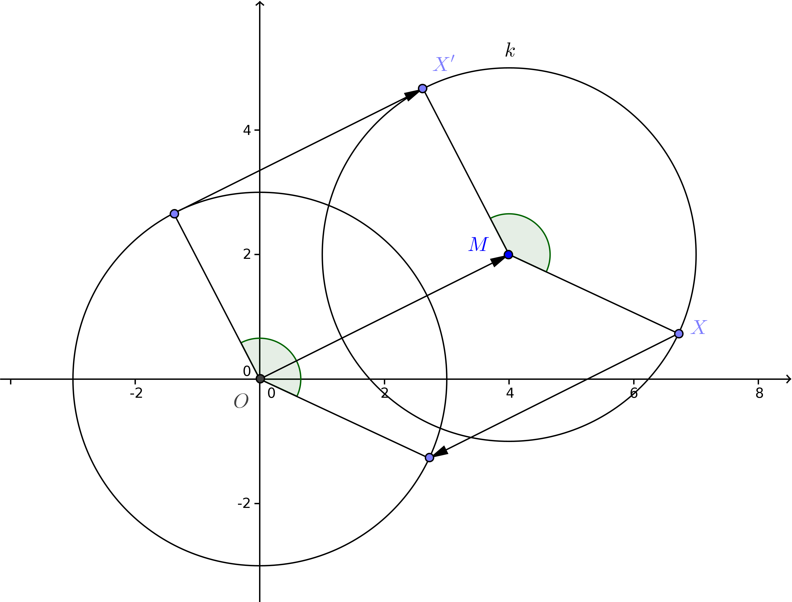

**Beispiel 2.** Ellipsen lassen sich als perspektiv affine Bilder von Kreisen erzeugen.

Für den Nachweis dieser Aussage werden einer Ellipse $k$ mit halben Achsenlängen $0<b<a$ die zu $k$ konzentrischen Kreise $k_1$ durch die Hauptscheitel $A$ und $B$ beziehungsweise $k_2$ durch die Nebenscheitel $C$ und $D$ hinzugefügt.[^1]

Bezogen auf ein gewähltes kartesisches Rechtskoordinatensystem mit Ursprung im den gemeinsamen Mittelpunkt von $k$, $k_1$ und $k_2$ besitzen die Kreise $k_1$ beziehungsweise $k_2$ die Gleichungen $$
  x_1^2+x_2^2=a^2\quad\text{bzw.}\quad x_1^2+x_2^2=b^2
$$ Werden die Koordinatenachsen zusätzlich in Richtung der Achsen von $k$ gewählt, so beschreibt $$
  \frac{x_1^2}{a^2}+\frac{x_2^2}{b^2}=1
$$ die Ellipse $k$. Siehe nachstehende Abbildung.

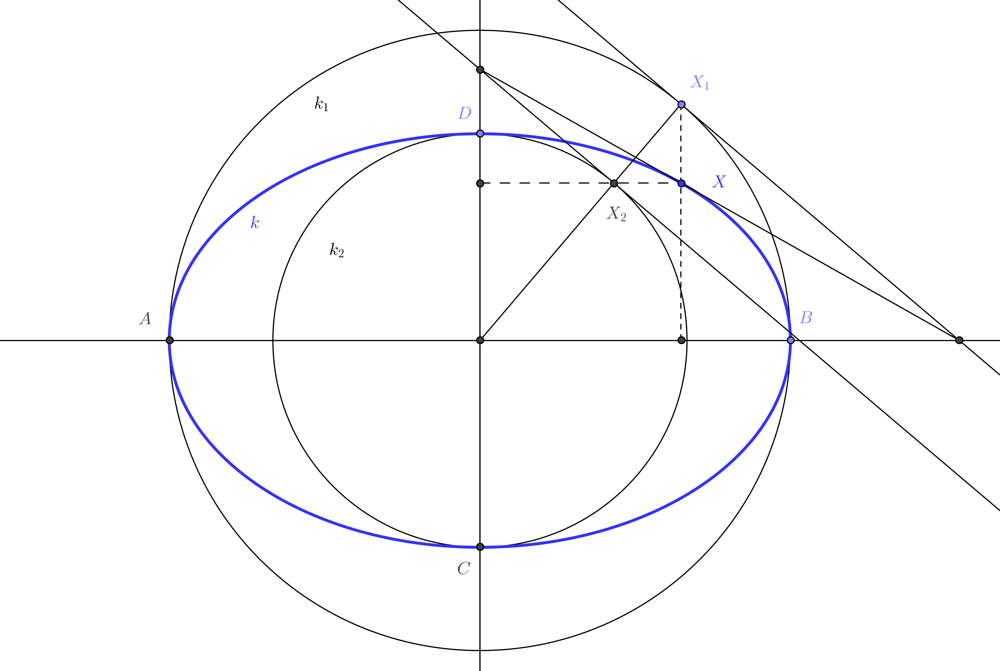

Kreispunkte $X\in k_1$ lassen sich parametrisieren mittels $$
  X(a\cdot\cos{\varphi},a\cdot\sin{\varphi})\,,\quad\varphi\in[0,2\cdot\pi)
$$ Werden diese einer Skalierung in Richtung der zweiten Achse mit Skalierungsfaktor $\lambda=\pm b/a$ unterworfen, so besitzen die Bildpunkte die Darstellung $$
  \varphi\mapsto\begin{pmatrix} x_1' \\ x_2' \end{pmatrix}=
  \begin{pmatrix} 1 & 0 \\ 0 & \pm\frac{b}{a} \end{pmatrix}\cdot
  \begin{pmatrix} a\cdot\cos{\varphi} \\ a\cdot\sin{\varphi} \end{pmatrix}=
  \begin{pmatrix} a\cdot\cos{\varphi} \\ \pm b\cdot\sin{\varphi} \end{pmatrix}\,,\quad\varphi\in[0,2\cdot\pi)
$$ Dies ist eine Parametrisierung der Ellipse $k$, denn es gilt nach Einsetzen $$
  \frac{(x_1')^2}{a^2}+\frac{(x_2')^2}{b^2}=
  \frac{a^2\cdot\cos^2{\varphi}}{a^2}+\frac{b^2\cdot\sin^2{\varphi}}{b^2}=1
$$ Die Ellipse $k$ lässt sich also als perspektiv affines Bild (Skalierung) ihres Hauptscheitelkreises $k_1$ erzeugen. Analog erzeugt die Skalierung $$
  \begin{pmatrix} x_1 \\ x_2 \end{pmatrix}\mapsto\begin{pmatrix} x_1' \\ x_2' \end{pmatrix}=
  \begin{pmatrix} \pm\frac{a}{b} & 0 \\ 0 & 1 \end{pmatrix}\cdot
  \begin{pmatrix} x_1 \\ x_2 \end{pmatrix}
$$ die Ellipse $k$ als perspektiv affines Bild des Nebenscheitelkreises $k_2$.

**Bemerkung 2.** Die vorstehende Abbildung zeigt die geometrische Verwandtschaft zwischen Punkt und Tangente in diesem Punkt der Ellipse $k$ und dem jeweils zugeordneten Punkt und der Tangente in diesem Punkt eines der beiden Kreise $k_i$, $i\in\{1,2\}$. Hierin ergibt sich eine konstruktiv-geometrische Konstruktion der Tangente an eine Ellipse $k$ in einem Punkt $X\in k$.

Mit den Eigenschaften von Affinitäten folgt darüber hinaus der folgende Satz.

>**Proposition 1.** Zu jedem Durchmesser $d$ einer Ellipse $k$ existiert genau ein Durchmesser $\bar{d}$, bei dem die parallelen Tangenten in den Punkten $\bar{D}_1$ und $\bar{D}_2$ der Ellipse parallel zu $d$ sind. Diese Relation ist symmetrisch bezogen auf jedes Paar $(d,\bar{d})$.

>**Definition 1.** Paare $(d,\bar{d})$ von Durchmessern einer Ellipse mit der Eigenschaft aus Satz 1 werden zueinander **konjugierte Durchmesser** genannt.


Das aus Haupt- und Nebenachse einer (echten) Ellipse bestehende Paar ist das einzige Paar konjugierter Durchmesser, welches zusätzlich orthogonal ist.

**Bemerkung 3.** Mit dem vorstehenden Satz lassen sich Ellipsen und Nutzung konjugierter Durchmesserpaare *freihand* zeichnen. Siehe auch [Ellipsen zeichnen](https://de.wikipedia.org/wiki/Ellipse_(Darstellende_Geometrie)).

Die Ellipse ist in ein gegebenes, umschließendes (Tangenten-) Parallelogramm einzuzeichnen.

1. Die Verbindungsgeraden gegenüberliegender Seitenmitten bilden ein konjugiertes Durchmesserpaar.
2. Insbesondere besteht für Tangentenrechtecke das Durchmedderpaar aus Haupt- und Nebenachse.

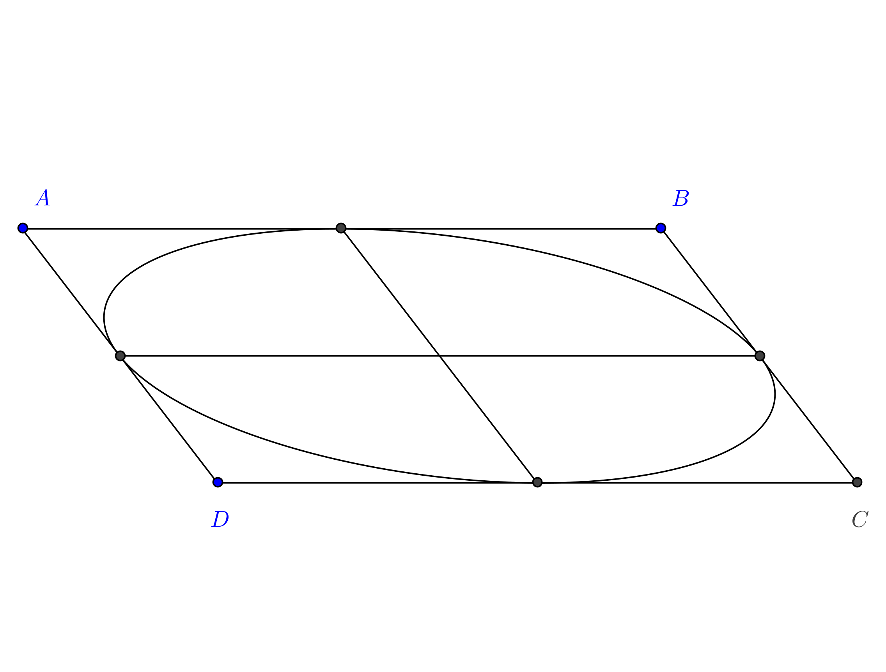


Flächenparametrisierung
=======================

**Beispiel 3.** Analog zur Erzeugung eines Kreises als Trajektorie eines Punktes unter einer stetigen Kreisbewegung soll hier die Kugeloberfläche durch stetiges Rotieren eines (Halb-) Kreises um einen Durchmesser der Kreislinie erzeugt werden.

1. Ein Halbkreis $k$ in der $x_1x_3$-Ebene lässt sich parametirsieren vermöge $$
  x=(\cos{\varphi},0,\sin{\varphi})^\top\,,\quad \varphi\in\left[-\frac{\pi}{2},\frac{\pi}{2}\right]
$$
2. Der Halbkreis $k$ wird stetig um die $x_3$-Achse gedreht. Die dadurch überstrichene Kugeloberfläche stellt sich dar $$
  x'=\begin{pmatrix} \cos{\psi} & -\sin{\psi} & 0 \\ \sin{\psi} & \cos{\psi} & 0 \\ 0 & 0 & 1 \end{pmatrix}\cdot
  \begin{pmatrix} \cos{\varphi} \\ 0 \\ \sin{\varphi} \end{pmatrix}=
  \begin{pmatrix} \cos{\psi}\cdot\cos{\varphi} \\ \sin{\psi}\cdot\cos{\varphi} \\ \sin{\varphi} \end{pmatrix}\,,\quad\psi\in[0,2\cdot\pi)
$$ Dies entspricht einer Parametrisierung der [Kugel](https://de.wikipedia.org/wiki/Kugel) vom Radius Eins mit Mittelpunkt im Koordinatenursprung. Das Parameterpaar $(\varphi,\psi)$ entspricht den im Abschnitt [Drehungen](#Drehungen) eingeführten, an geographische Koordinaten angelehnten Parametern.

**Beispiel 4.** Wird ein Kreis $k(M,r)$ mit Mittelpunkt $M$ und Radius $r$ um eine Gerade $a$ in der Kreisebene gedreht, für die $M\not\in a$ gilt, so entsteht ein [Kreistorus](https://de.wikipedia.org/wiki/Torus).

1. Mit dem Ziel einer an die Erzeugung angepassten Parametrisierung eines Torus wird ein Kreis in der $x_1x_3$-Koordinatenebene um den Mittelpunkt $M(R,0,0)$ mit Radius $r>0$ betrachtet. Dessen Parametrisierung ergibt sich einsichtig zu $$
  k:\varphi\mapsto\begin{pmatrix} x_1 \\ x_2 \\ x_3 \end{pmatrix}=f(\varphi)=
  \begin{pmatrix} R \\ 0 \\ 0 \end{pmatrix}+r\cdot
  \begin{pmatrix} \cos{\varphi} \\ 0 \\ \sin{\varphi} \end{pmatrix}=\begin{pmatrix} R+r\cdot\cos{\varphi} \\ 0 \\ r\cdot\sin{\varphi} \end{pmatrix}\,,\quad
  \varphi\in[-\pi,\pi)
$$ Zur Festlegung des Parameters $\varphi$, siehe nachstehende Abbildung.
2. Bei steiger Rotation von $k$ um die $x_3$-Koordinatenachse wird der Torus als Bahnfläche von $k$ erzeugt. $$
  \psi\mapsto\begin{pmatrix} x_1' \\ x_2' \\ x_3' \end{pmatrix}=g(\psi)=
  \begin{pmatrix} \cos{\psi} & -\sin{\psi} & 0 \\ \sin{\psi} & \cos{\psi} & 0 \\ 0 & 0 & 1 \end{pmatrix}\cdot
  \begin{pmatrix} R+r\cdot\cos{\varphi} \\ 0 \\ r\cdot\sin{\varphi} \end{pmatrix}=\begin{pmatrix} R\cdot\cos{\psi}+r\cdot\cos{\psi}\cdot\cos{\varphi} \\ R\cdot\sin{\psi}+r\cdot\sin{\psi}\cdot\cos{\varphi} \\ r\cdot\sin{\varphi} \end{pmatrix}\,,\quad
  \psi\in[0,2\cdot\pi)
$$

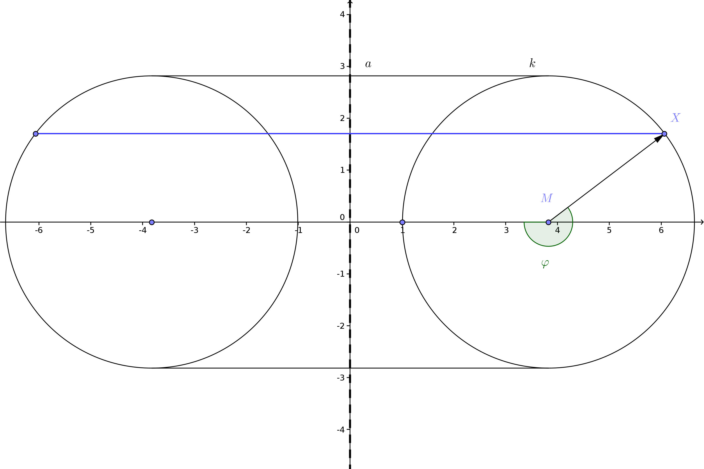

Mit Blick auf die Parameter $R>0$ und $r>0$ sind zu unterscheiden:

1. $r<R$: Ringtorus
2. $r=R$: Horntorus (das "Torusloch"schließt sich.)
3. $r>R$: [Spindeltorus](https://de.wikipedia.org/wiki/Spindeltorus)

Für $R=0$ und $r>0$ wird daneben die Kugeloberfläche beschrieben.

Ebene Schnitte eines Torus:

1. deren Trägerebenen die Drehachse $a$ enthalten, sind Kreispaare
2. deren Trägerebenen orthogonal zur Drehachse verlaufen, sind Kreispaare oder ein Kreis oder leer

[^1]: Der Kreis besitzt diese die Gleichung $k_1$ wirdvon *Hauptscheitelkreis* von $k$ genannt, hingegen $k_2$ Nebenscheitelkreis von $k$.


Ornamente
=========

Im Abschnitt [Algebraische Eigenschaften](#Algebraische-Eigenschaften), Beispiel 3 wurde durch eine einzelne Translation $\tau$ (der Ebene) und die Potenzen $\tau^k$, $k\in\mathbb{Z}$, eine Friesgruppe $\left\{\tau^k,\circ\right\}$ bezogen auf die Hintereinanderausführung von Abbildungen erzeugt. Angewendet auf ein Grundmuster entsteht ein sogenanntes *Fries*.

In diesem Abschnitt soll auf die Erzeugung von ebenen Ornamenten eingegangen werden. Des Weiteren wird die Äquivalenzklassenbildung von Ornamenten hinsichtlich der zugehörigen Ornamentgruppen thematisiert. Die - hier nicht angesprochene - Frage nach räumlichen Ornamenten führt u. a. zu den in der Kristallographie verwendeten [kristallographischen Raumgruppen](https://de.wikipedia.org/wiki/Ebene_kristallographische_Gruppe).


Ornamentgruppen
---------------

>**Definition 2.** Eine Gruppe von Transformationen von $\mathcal{A}^2$ heißt diskret, wenn jeder Punkt von $\mathcal{A}^2$ eine diskrete Bildpunktmenge[^1] besitzt. Diskrete Kongruenzgruppen heißen *Ornamentgruppen*.

**Bemerkung 4.** Formal benötigt es für den Begriff 'diskrete Punktmenge' einen Umgebungsbegriff, d. h. eine Topologie. Hier wird der euklidische Abstand $|x-y|\in[0,\infty)$ implizit angenommen.

**Beispiel 5.** In der nachstehenden Abbildung ist ein regelmäßiges Achteck dargestellt. Die Eckpunkte lassen sich als Bildpunktmenge der Gruppe aller Drehungen $\rho$ um den Koordinatenursprung $O$ eines kartesischen Koordinatensystems der Ebene mit Drehwinkeln $\varphi$ interpretieren. $$
  \left\{\rho(O,\varphi)\;\left(\varphi=k\cdot \frac{\pi}{4}\;\wedge\; k\in\mathbb{Z}_8\right)\right\}
$$ Hierbei ist zu beachten, dass die Drehungen für Drehwinkel $$
  \varphi_k=k\cdot\frac{\pi}{4}\quad\text{und}\quad \varphi_{k+8\cdot m}=(k+8\cdot m)\cdot\frac{\pi}{4}=k\cdot\frac{\pi}{4}+m\cdot 2\cdot\pi\,,\; m\in\mathbb{Z}
$$ wegen der Periodizität von $\sin{\varphi}$ und $\cos{\varphi}$ gleich sind. Daher reicht es aus, $k\in\mathbb{Z}_8$ (Restklassen (-ring) bei Division natürlicher Zahlen durch 8) zu betrachten.

Wird ein Grundmuster unter der Wirkung der Gruppe betrachtet, entsteht ein sogenanntes [Rosettenmuster](https://www.geogebra.org/m/YdNJrPfp) / -ornament.

$ mit $k\in\mathbb{Z}_8$.")

**Bemerkung 5.** Eng verwandt mit Ornamenten / Ornamentgruppen sind die Symmetriegruppen von Figuren. Bezeichnet $\mathcal{F}\subset\mathcal{A}^2$ eine ebene Figur, so heißt eine Kongruenz $\sigma$ mit $\sigma(\mathcal{F})=\mathcal{F}$ eine Symmetrieabbildung der Figur. Die Menge aller solcher Abbildungen bildet die Symmetriegruppe der Figur $\mathcal{F}$. (Nachweis!) Besteht die Symmetriegruppe nur aus der identischen Abbildung, so heißt $\mathcal{F}$ **asymmetrisch**.

 spiegelsymmetrischen Kirchen Santa Maria di Monte Santo und Santa Maria dei Miracoli.[^2]")

Aus den vorangegangenen Abschnitten ist bekannt, dass zwischen orientierungserhaltenden und orientierungsumkehrenden Kongruenzen zu unterscheiden ist.

1. *Orientierungserhaltende Kongruenzen* sind entweder die identische Abbildung oder Drehungen um einen Punkt der Ebene oder Translationen.
2. *Orientierungsumkehrende Kongruenzen* sind entweder Spiegelungen an Geraden oder Gleitspiegelung entlang Geraden.

Einen Überblick über die verschiedenen ebenen Kongruenzen gibt die nachstehende Tabelle.

|  | Translation | Drehung | Spiegelung | Gleitspiegelung | Identität |
| :----- | :----- | :----- | :----- | :----- | :----- |
| Fixpunkte | $\emptyset$ | Drehzentrum $Z$ | Spiegelachse $a$ | $\emptyset$ | alle Punkte |
| Fixgeraden | alle Geraden parallel zur Translationsrichtung | $\emptyset$ bzw. alle Geraden durch $Z$ | $a$ und alle Geraden orthogonal zu $a$ | Gleitspiegelachse $a$ | alle Geraden |
| Orientierung| erhaltend | erhaltend | umkehrend | umkehrend | erhaltend |


Friesgruppen
------------

>**Definition 3.** Durch Translationen $\tau$ oder Gleitspiegelungen $\gamma$ erzeugte Ornamentgruppen $$
  \mathcal{O}=\left\{\tau^k\;(k\in\mathbb{Z}),\circ\right\}\quad\text{bzw.}\quad
  \mathcal{O}=\left\{\gamma^k\;(k\in\mathbb{Z}),\circ\right\}
$$ werden **Friesgruppen** / Bandmustergruppen genannt.

Der Orbit eines Punktes $P$ unter $\mathcal{O}$ ist eine unendliche Punktmenge. Das aus der Wirkung von $\mathcal{O}$ auf eine Grundfigur erzeugte Ornament wird **Fries** / Bandmuster genannt.

**Beispiel 6.** Einfache Beispiele für Friese sind die Folgenden.

1. $$ \mathrm{L\quad L\quad L\quad L }\quad\text{bzw.}\quad\mathrm{\Gamma\quad \Gamma\quad \Gamma\quad \Gamma }$$
2. $$ \mathrm{L\quad \Gamma\quad L\quad \Gamma }$$
3. $$ \mathrm{\Sigma\quad \Sigma\quad \Sigma\quad \Sigma }$$

Während die Friese aus 1. durch wiederholte Translationen des Buchstabens  $\mathrm{L}$ beziehungsweise $\mathrm{\Gamma}$ erzeugt werden, ist das Fries aus 2. durch Potenzen einer Gleitspiegelung von $\mathrm{\Gamma}$ oder $\mathrm{L}$ entstanden. Die Bandmuster aus 1. und 2. gehören also zu verschiedenen Friesgruppen.

Der Buchstabe $\mathrm{\Sigma}$ besitzt eine zusätzliche Symmetrie: er besitzt eine Spiegelachse in Translationsrichtung. Das dazugehörige Fries kann damit durch Translationen beziehungsweise Gleitspiegelungen erzeugt werden.

Interaktive Beispiele zur Erzeugung von Bandmustern sind unter [Friese](https://www.geogebra.org/m/wjpjzrce) zu finden.

**Bemerkung 6.** Eine Analyse der Friese ist durch Bestimmung der zugehörigen Friesgruppe möglich. Hierfür sind zusätzliche Symmetrien des Grundmusters zu betrachten. Diese Symmetrien müssen die Fixgeradenmenge der erzeugenden Translationen bzw. Gleitspiegelungen fest lassen. Mithin sind möglich:

1. Spiegelung $\sigma_1$ an Gerade parallel zur Translationsrichtung (siehe Beispiel 6 (3))
2. Spiegelung $\sigma_2$ an Gerade orthogonal zur Translationsrichtung
3. Drehung $\rho$ mit Winkel $\varphi=\pi$
4. Gleitspiegelung $\gamma$ entlang Gerade parallel zur Translationsrichtung

Eine [Klassifikation](https://de.wikipedia.org/wiki/Friesgruppe) der Friesgruppen ist nach der Existenz von Drehungen und der Existenz von Spiegelungen bzw.Gleitspiegelungen möglich. (Die in jeder Friesgruppe existierenden Translationen sind zur Klassifikation ungeeignet.)

>**Satz 2.** Es existieren insgesamt sieben verschiedene Friesgruppen. (Ohne Nachweis.)


Wandornamentgruppen
-------------------

>**Definition 4.** Werden auf ein durch Potenzen $\tau_1^k$, $k\in\mathbb{Z}$, einer Translation erzeugtes Fries Translationen $\tau_2^m$, $m\in\mathbb{Z}$, in einer zu $\tau_1$ linear unabhängigen Richtung ausgeführt, so entsteht ein *Wandornament.*

Eine Analyse der Wandornamente ist durch Bestimmung der zugehörigen Wandornamentgruppe möglich. Hierfür sind zusätzliche Symmetrien des Grundmusters zu betrachten. Diese Symmetrien müssen die Fixgeradenmenge der erzeugenden Translationen in Richtungen $\tau_1$ und $\tau_2$ jeweils als Ganzes fest lassen beziehungsweise vertauschen. Mithin sind möglich:

1. Spiegelung $\sigma_1$ an Gerade parallel zur Translationsrichtung von $\tau_1$, falls die Translationsrichtung von $\tau_2$ hierzu orthogonal ist.
2. Spiegelung $\sigma_2$ an Gerade parallel zur Translationsrichtung von $\tau_2$, falls die Translationsrichtung von $\tau_1$ hierzu orthogonal ist.
3. Gleitspiegelung $\gamma_i$ entlang Gerade $a_i$ parallel zur Translationsrichtung von $\tau_i$, $i=1,2$
4. Drehungen mit Drehwinkeln $$
  \frac{1}{6}\cdot\pi\,,\quad\frac{1}{4}\cdot\pi\,,\quad\frac{1}{3}\cdot\pi\,,\quad\frac{1}{2}\cdot\pi
$$

Eine Klassifikation der Wandornamentgruppen ist nach der Existenz von Drehungen und der Existenz von Spiegelungen beziehungsweise Gleitspiegelungen möglich. (Die in jeder Wandornamentgruppe existierenden unabhängigen Translationen sind zur Klassifikation ungeeignet.)

>**Satz 3.** Es existieren insgesamt siebzehn verschiedene Wandornamentgruppen. (Ohne Nachweis.)

Die Klassifikation der zu Wandornamenten zugehörigen Wandornamentgruppen ist unter [Kristallographische Gruppe](https://de.wikipedia.org/wiki/Ebene_kristallographische_Gruppe) erläutert.


Sicher gewusst?
===============

**Frage 1.** Auf der Seite von Wikipedia zu Friesgruppen sind die folgenden Bandmuster abgebildet 

Kennzeichnen Sie das Vorhandensein der in Beispiel 6 genannten  Symmetrien des Grundmusters.

[[$\sigma_1$] [$\sigma_2$] [$\rho$] [$\gamma$]]
[[ ] [ ] [ ] [ ]]  $F1$
[[ ] [ ] [X] [ ]]  $F2$
[[ ] [X] [ ] [ ]]  $F3$
[[X] [ ] [ ] [X]]  $F4.1$
[[ ] [ ] [ ] [X]]  $F4.2$
[[X] [X] [X] [X]]  $F5.1$
[[ ] [X] [X] [X]]  $F5.2$


[^1]: Die Menge aller Bildpunkte $\sigma(P)$ eines Punktes $P$ unter einer Transformationsgruppe wird **Orbit** von $P$ unter dieser Gruppe genannt.

[^2]: Quelle: Von Berthold Werner - Eigenes Werk, Gemeinfrei, [Wikipedia](https://commons.wikimedia.org/w/index.php?curid=3258859).


## Projektive Geometrie


### Projektionen


Definition
=====


In diesem Abschnitt werden Projektionen des dreidimensionalen Raumes betrachtet. Es werden das geometrische Abbildungsprinzip erklärt sowie Eigenschaften von Projektionen abgeleitet. Die Notwendigkeit einer Erweiterung des dreidimensionalen Raumes durch uneigentliche Elemente wird aufgezeigt.

>**Definition 1.** Gegeben sind ein als fest angenommener Punkt $Z$ und eine als fest angenommene Ebene $\Pi$ mit $Z\not\in\Pi$. Die Abbildung $$
  ^c:A^3\setminus\Delta\to\Pi\quad\text{mit}\quad P\mapsto P^c:=ZP\cap\Pi
$$ worin $\Delta$ die zu $\Pi$ parallele Ebene durch $Z$ bezeichnet, heißt [Zentralprojektion](https://de.wikipedia.org/wiki/Zentralprojektion) von $A^3$ in $\Pi$.

**Bemerkung 1.** Die in Definition 1 beschriebene Abbildung bildet die Punkte des dreidimensionalen Raumes (mit Ausnahme der Punkte in $\Delta$) ab in die Ebene $\Pi$: Erstere bildet die Grundmenge der Abbildung, letztere die Zielmenge der Abbildung. Jedem Punkt $P$ der Grundmenge wird der eindeutig bestimmte Schnittpunkt der Verbindungsgerade $ZP$ mit $\Pi$ zugeordnet. Siehe nachstehende Abbildung.

 Zentralbilder.")

**Bemerkung 2.** Für Punkte $V\in\Delta$ der Ebene $$
  \Delta\parallel \Pi\quad\text{mit}\quad \Delta\ni Z
$$ sind die Geraden $ZV$ parallel zu $\Pi$ und ergeben somit keinen (eigentlichen) Schnittpunkt $V^c$. Diese heißen daher *Verschwindungpunkte* und $\Delta$ Verschwindungsebene.

Im Folgenden werden nachstehende Bezeichnungen gewählt.

| Symbol | Bezeichnung | Definition |
| :----- | :----- | :----- |
| $\Pi$ (lies: Pi) | Bildebene | Trägerebene aller Bildpunkte unter der Zentralprojektion $^c$ |
| $Z$ | Projektionszentrum | Gemeinsamer Punkt aller Projektionsstrahlen |
| $P$ | Urbild (-Punkt) | Punkt $P$ der Grundmenge, der unter der Zentralprojektion $^c$ auf $P^c$ abgebildet wird |
| $P^c$ | (Zentral-) Bild | Punkt $P^c$ der Zielmenge, auf den $P$ unter der Zentralprojektion $^c$ eindeutig abgebildet wird |
| $ZP$ | Projektionsgerade | zu $P$ eindeutig bestimmte Verbindungsgerade, deren Schnittpunkt mit der Bildebene den Bildpunkt $P^c$ bildet |
| $\Delta$ | Verschwindungsebene | Ebene, deren Punkte $V$ ~~kein~~ Zentralbild besitzen (Verschwindungspunkte) |

>**Definition 2.** Gegeben sind eine als fest angenommene Ebene $\Pi$ und eine als fest angenommene Gerade $g$ und mit $g\not\parallel\Pi$ (und somit auch $g\not\subset\Pi$). Die Abbildung $$
  ^p:A^3\to\Pi\quad\text{mit}\quad Q\mapsto Q^p:=g_Q\cap\Pi\;\;\text{und}\;\;g_Q\ni Q\,,\;g_Q\parallel g
$$ heißt [Parallelprojektion](https://de.wikipedia.org/wiki/Parallelprojektion) von $A^3$ in $\Pi$.

**Bemerkung 3.** Die bei Zentralprojektionen eingeführten Bezeichnungen können sinngemäß übernommen werden. Im Unterschied zur Zentralprojektion bilden die Projektionsgeraden einer Parallelprojektion eine zweiparametrige Menge zu $g$ paralleler Geraden. Stellt man sich das Projektionszentrum $Z$ beliebig weit von $\Pi$ entfernt vor, so gestatten beide Projektionen ein nahezu identisches Konstruktionsprinzip. Siehe nachstehende Abbildung.

 und einer Parallelprojektion: Im ersten Fall enthalten diese das Projektionszentrum $Z$, bilden demnach ein 'Geradenbündel', während im zweiten Fall alle Geraden parallel sind ('Parallelgeradenbündel'). ")

>**Definition 3.** Eine Parallelprojektion, bei der die Projektionsgeraden $g$ orthogonal zur Bildebene $\Pi$ verlaufen, heißt [Normal- bzw. Orthogonalprojektion](https://de.wikipedia.org/wiki/Orthogonalprojektion) und wird mit $^n$ bezeichnet.
>
>Ist die Bildebene $\Pi$ speziell die / parallel zur Ebene:
>
>1. $z=0$ (horizontal angenommene $xy$-Ebene), so heißt $^n$ *Grundrissprojektion*
>2. $x=0$ ($yz$-Ebene), so heißt $^n$ *Aufrissprojektion*
>3. $y=0$ ($xz$-Ebene), so heißt $^n$ *Kreuzrissprojektion*

Die Projektionsverfahren der Zentral- versus Parallelprojektion sind im nachstehenden Video an einem Beispiel erläutert.

!?[Projektion](https://www.youtube.com/watch?v=d7MtNwyRpsQ "Professor Bihr, Technische Hochschule Ulm")


Eigenschaften
=====

<!-- style="background-color: lightgray;"-->
>Für Projektionen $^c$ beziehungsweise $^p$ beziehungsweise $^n$ gelten:
>
>1. Das Bild eines Punktes $Q\in A^3$ unter einer Projektion ist wieder ein Punkt. Ausnahmen bilden bei der Zentralprojektion das Projektionszentrum $Z$ (keine Projektionsgerade) und die Punkte der Verschwindungsebene $\Delta$. Deren Projektionsgeraden sind parallel zur Bildebene $\Pi$, besitzen demnach keinen (eigentlichen) Schnittpunkt.
>2. Das Bild einer Geraden $g\subset A^3$ ist genau dann ein Punkt, wenn $g$ Projektionsgerade ist: $g$ heißt dann **projizierend**. Das Bild einer nichtprojizierenden Geraden unter Projektion ist wieder eine Gerade. Ausnahmen bilden Geraden in der Verschwindungsebene $\Delta$.[^1]

<!-- style="background-color: lightgray;"-->
>Speziell für Parallelprojektionen $^p$ gelten:
>
>3. Das Teilverhältnis auf nichtprojizierenden Strecken bleibt unter Parallelprojektionen erhalten, das heißt: $$
    \left(T\in[A,B]\quad\text{mit}\quad \operatorname{TV}(T,A,B)=\lambda\right)\quad\stackrel{^p}{\to}\quad
    \left(T^p\in[A^p,B^p]\quad\text{mit}\quad \operatorname{TV}(T^p,A^p,B^p)=\lambda\right)
$$ Insbesondere werden Mittelpunkte auf Strecken auf die Mittelpunkte ihrer Bilder abgebildet.
>4. Die parallele Lage nichtprojizierender Geraden bleibt unter Parallelprojektionen erhalten.
>5. Ebene Figuren in zur Bildebene $\Pi$ parallelen Ebenen werden unter Parallelprojektionen kongruent, d. h. deckungsgleich abgebildet.

<!-- style="background-color: lightgray;"-->
>Speziell für Normalprojektionen $^n$ gilt:
>
>6. Für die orthogonale Lage zweier nichtprojizierender Geraden $a$, $b$ gilt $$
  a^n\perp b^n\quad\leftrightarrow\quad a\parallel \Pi\;\; \vee\;\;b\parallel\Pi
$$ (Erhalt orthogonaler Lage)


Projektionen von Flächen
=====


Kurven und Flächen können punktweise projiziert gedacht werden. Durch jeden Punkt einer Kurve ist eine eindeutig bestimmte Projektionsgerade festgelegt, die Gesamtheit aller hierdurch bestimmten Projektionsgeraden bilden eine allgemeine Kegel- bzw. Zylinderfläche. Siehe die Abbildung in Bemerkung 3 in diesem Abschnitt.

Für eine Ebene $\Sigma$ des dreidimensionalen Raumes heißt $$ s=\Sigma\cap\Pi $$ die **Spurgerade** dieser Ebene in der Bildebene $\Pi$. Gilt für das Projektionszentrum $Z\in\Sigma$, so ist $$ \Sigma^\alpha=s \quad\text{mit}\quad\alpha\in\{c,p,n\} $$ die Ebene ist im oben genannten Wortsinn projizierend.

Gegeben ist eine nicht notwendig ebene Fläche $\Phi$ im dreidimensionalen Raum $A^3$. Es wird vorausgesetzt, dass an jedem Punkt $X\in\Phi$ der Fläche die Tangentialebene existiert.

>**Definition 4.** Ein Flächenpunkt $X\in\Phi$ heißt genau dann [Kontur- oder Umrisspunkt](https://de.wikipedia.org/wiki/Umrisskonstruktion) der Fläche $\Phi$ bezüglich einer gegebenen Projektion, wenn die Tangentialebene von $\Phi$ in $X$ projizierend ist.
>
>1. Die Gesamtheit aller Konturpunkte $X$ bildet die **Kontur** $u\subset\Phi$ der Fläche unter der Projektion.
>2. Die Gesamtheit aller Projektionsgeraden $g$ durch die Konturpunkte bildet den **Konturkegel** bzw. **-zylinder**.[^2]
>3. Das (zweidimensionale) Bild der Kontur einer Fläche unter der betrachteten Projektion wird **scheinbare Kontur** von $\Phi$ genannt.

**Bemerkung 4.** Bei einem Polyeder [testet](https://de.wikipedia.org/wiki/Umrisskonstruktion) man jede ebene Teilfläche auf Sichtbarkeit / Nichtsichtbarkeit. Anschließend werden die Kanten ermittelt, die zu sichtbaren und nichtsichtbaren Polyederflächen gehören. Diese Kanten bilden die Kontur des Polyeders.

**Beispiel 1.** Die Kontur $u$ einer Kugel $\Phi$ mit Mittelpunkt $M$ und Radius $r$ soll unter der Zentralprojektion $^c$ bezüglich eines Paares $(Z,\Pi)$ aus Projektionszentrum und Bildebene bestimmt werden. $Z$ ist im Äußeren der Kugel gewählt. Siehe nachstehende Abbildung.

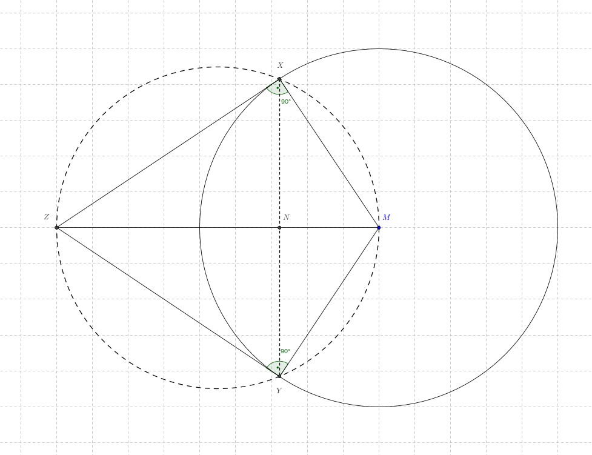

Jeder Konturpunkt $X$ bestimmt ein rechtwinkliges Dreieck $ZMX$, dessen Seitenlängen $$
  \overline{ZM}\,,\quad r\quad\text{und}\quad\sqrt{\overline{ZM}^2-r^2}
$$ (letztere nach Anwendung des Satzes von Pythagoras) und damit unabhängig von der Lage von $X\in\Phi$ sind. Die Kontur lässt $u$ lässt sich somit durch kontinuierliches Drehen eines Konturpunktes um die Achse $ZM$ erzeugen: $u$ ist ein Kreis auf $\Phi$ um den Lotfußpunkt von $X$ auf $ZM$. Der Radius $R$ von $u$ ergibt sich nach Anwendung von Katheten- und Höhensatz in der vorstehenden ebenen Figur zu $$
  R=\frac{r}{\overline{ZM}}\cdot\sqrt{\overline{ZM}^2-r^2}\;\;(<r)
$$ Siehe auch nachstehende räumliche Abbildung.

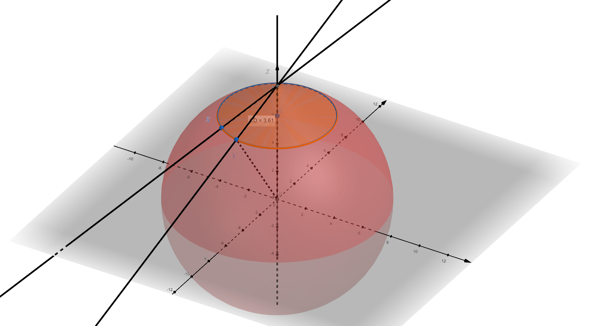


Sicher gewusst?
=====


Nutzen Sie die nachfolgenden Fragen, um Ihren Kenntnisstand zu diesem Abschnitt zu testen.

**Frage 1.** Ein Würfel mit der Kantenlänge $a$ soll in Richtung einer seiner Raumdiagonalen orthogonal in eine Ebene projiziert werden. Geben Sie die Gestalt scheinbaren Kontur des Würfels an.

[(X)] Die scheinbare Kontur ist ein regelmäßiges Sechseck mit der Seitenlänge $\frac{\sqrt{6}}{3}\cdot a$.
[( )] Die scheinbare Kontur ist ein Quadrat mit der Seitenlänge $a$.
[( )] Die scheinbare Kontur ist ein Rechteck mit den Seitenlängen $a$ und $\sqrt{2}\cdot a$.
[[?]] Die scheinbare Kontur des Würfels ist eine Polygonfläche, die sich aus den Bildern der sichtbaren Seitenflächen des Würfels zusammensetzt. Wird (normal) entlang einer Raumdiagonalen projiziert, sind drei Seitenflächen des Würfels sichtbar, die einen Eckpunkt und paarweise eine Kante gemeinsam haben (Würfelecke). Vergleiche hierzu Bemerkung 4 in diesem Abschnitt.
****************************************

1. Wird der Würfel entlang einer Raumdiagonalen projiziert, sind genau drei Seitenflächen des Würfels um eine Würfelecke sichtbar, die übrigen drei nicht sichtbar. Die drei an die Würfelecke angrenzenden Rauten sind Normalbilder dreier Würfelflächen und ergeben ein reguläres Sechseck, siehe nachstehende Abbildung.

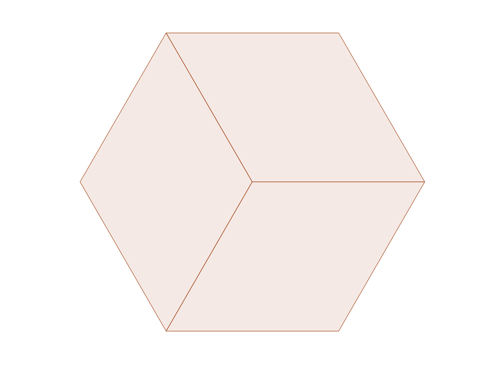

Der Abstand $d$ der (anderen) Eckpunkte des Würfels von der projizierenden Raumdiagonalen berechnet sich unter Nutzung von Katheten- und Höhensatz aus der Kantenlänge $a$. $$
  a^2=q\cdot\sqrt{3}\quad\wedge\quad q\cdot (\sqrt{3}\cdot a-q)=d^2\quad\leadsto\quad d=\frac{\sqrt{6}}{3}\cdot a
$$ Dieser Abstand bleibt unter der Orthogonalprojektion erhalten. Warum?

2. Wird abweichend entlang einer Kante des Würfels projiziert, ergibt sich mit analoger Begründung ein Quadrat mit der Seitenlänge $a$.

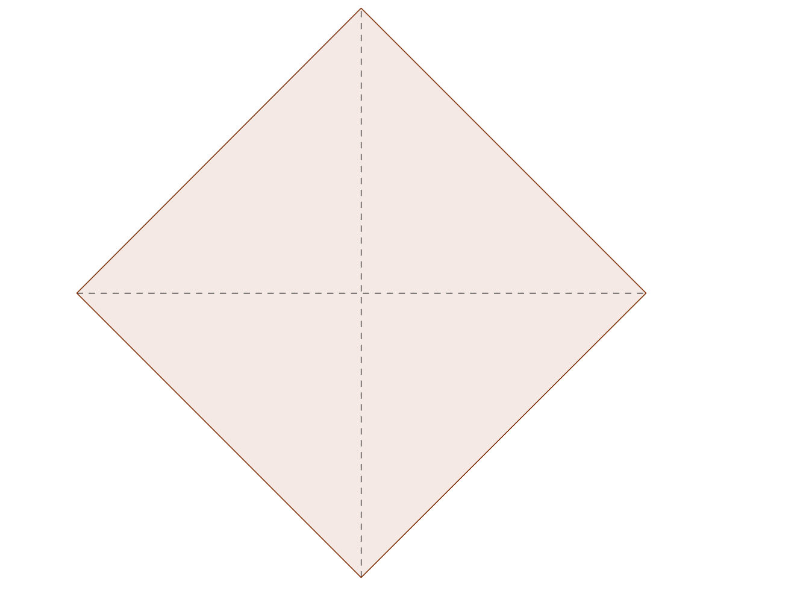

3. Wird abweichend entlang einer Flächendiagonalen des Würfels projiziert, ergibt sich mit analoger Begründung ein Rechteck mit den Seitenlängen $a$ und $\sqrt{2}\cdot a$.

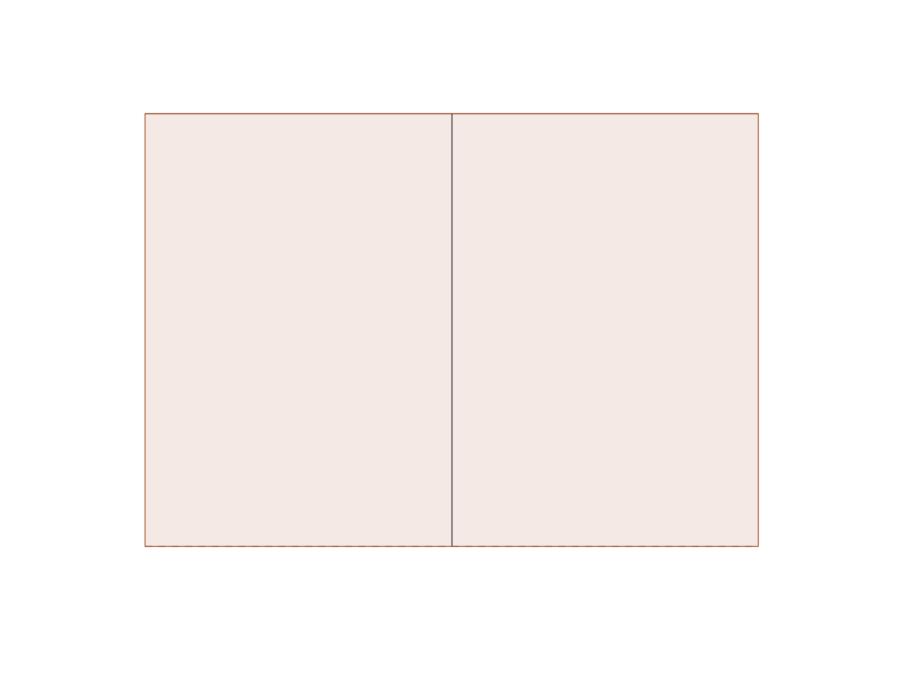

****************************************


[^1]: Sinngemäß lässt sich der Begriff einer *projizierenden Ebene* unter einer Projektion definieren.

[^2]: Ist die Projektion eine Zentralprojektion, so verlaufen alle Projektionsgeraden durch $Z$, Wird $Z\not\in\Phi$ vorausgesetzt, bilden die Projektionsgeraden in den Konturpunkten $X\in u$ einen Kegel, der die Fläche $\Phi$ entlang der Kontur $u$ berührt. Bei Parallelprojektionen bilden die Projektionsgeraden in den Konturpunkten einen $\Phi$ berührenden Zylinder. Vergleiche Bemerkung 3 in diesem Abschnitt.


### Parallelprojektionen


In diesem Abschnitt werden speziell Parallelprojektionen analytisch beschrieben. Bezogen auf ein räumliches affines Koordinatensystem lassen sich diese als spezielle affine Abbildungen darstellen.

Entsprechend Definition 2 im Abschnitt [Projektionen](#Projektionen) werden unter Nutzung von Methoden der analytischen Geometrie nachfolgende vektorielle Darstellungen benutzt:

* Für den Ortsvektor des Urbildpunktes $$
  Q(x_1,x_2,x_3)\;\sim\; q=(x_1,x_2,x_3)^\top $$
* Für den Ortsvektor des Bildpunktes $$
  Q^p(x_1^p,x_2^p,x_3^p)\;\sim\; q^p=(x_1^p,x_2^p,x_3^p)^\top $$
* Für die Projektionsgerade $g$ durch $Q$ $$
  y=q+\lambda\cdot r\quad\text{mit}\quad r=(r_1,r_2,r_3)^\top\,,\;\; \lambda\in\mathbb{R}
$$ worin $r$ einen zur festen Geradenrichtung $g$ gehörenden Richtungsvektor bezeichnet
* Für die Bildebene $\Pi$ wird eine Gleichungsdarstellung (lineare Gleichung in den Koordinaten $y_j$ eines Punktes $Y$) verwendet $$
  n\cdot y+d=0\quad\leftrightarrow\quad \sum_{j=1}^3{(n_j\cdot y_j)}+d=0
$$ Vergleiche [Hessesche Normalform](https://de.wikipedia.org/wiki/Hessesche_Normalform) einer Ebenengleichung.

>Zur Bestimmung des Bildpunktes $Q^p\in\Pi$ sind schrittweise zu berechnen:
>
>1. der Parameter $\lambda$, für den der Punkt der Gerade $g$ in $\Pi$ liegt.
>2. nach Einsetzen des Parameterwertes $\lambda$ aus dem ersten Schritt in die Parameterdarstellung der Gerade $g$ den Bildpunkt $Q^p$ als Schnittpunkt $$
  Q^p=g\cap\Pi
$$

**Beispiel 1.** Gegeben sind die nachstehenden Angaben einer Parallelprojektion $$
  z=0\quad\text{bzw.}\quad r=(1,4,-2)^\top
$$ für die Bildebene $\Pi$ beziehungsweise einen Richtungsvektor der projizierenden Geraden $g$.

Entsprechend der oben angegebenen Schritte zur Lösung berechnen sich:

1. $$
  \begin{pmatrix} x_1 \\ x_2 \\ x_3 \end{pmatrix}+
  \textcolor{magenta}{\lambda}\cdot\begin{pmatrix} 1 \\ 4 \\ -2 \end{pmatrix}=
  \begin{pmatrix} \ast \\ \ast \\ 0 \end{pmatrix}\quad\leadsto\quad
  x_3-2\cdot\lambda=0\quad\leftrightarrow\quad \lambda=\frac{x_3}{2}
$$
2. $$
  \begin{pmatrix} x_1^p \\ x_2^p \\ x_3^p \end{pmatrix}=
  \begin{pmatrix} x_1 \\ x_2 \\ x_3 \end{pmatrix}+
  \textcolor{magenta}{\frac{x_3}{2}}\cdot\begin{pmatrix} 1 \\ 4 \\ -2 \end{pmatrix}=
  \begin{pmatrix} x_1+\frac{1}{2}\cdot x_3 \\ x_2+2\cdot x_3 \\ 0 \end{pmatrix}
$$

Die Parallelprojektion $^p:Q\mapsto Q^p$ kann hier als lineare Abbildung, d. h. unter Benutzung eines Matrix-Vektor-Produktes dargestellt werden $$
  ^p:Q\mapsto Q^p:\begin{pmatrix} x_1 \\ x_2 \\ x_3 \end{pmatrix}\mapsto\begin{pmatrix} x_1^p \\ x_2^p \\ x_3^p \end{pmatrix}=
  \begin{pmatrix} 1 & 0 & \frac{1}{2} \\ 0 & 1 & 2 \\ 0 & 0 & 0 \end{pmatrix}\cdot
  \begin{pmatrix} x_1 \\ x_2 \\ x_3 \end{pmatrix}
$$ vergleiche Abschnitt [Definition und allgemeine Eigenschaften](#
Definition-und-allgemeine-Eigenschaften). Für die Transformationsmatrix $A$ gilt hier $\det{A}=0$: Sie ist also eine singuläre Matrix und wird in diesem Zusammenhang auch *Projektionsmatrix* genannt.


Matrixdarstellung einer Parallelprojektion
=====


Entsprechend Beispiel 1 wird nun die Darstellung einer Parallelprojektion zu allgemeinen gegebenen Angaben hergeleitet.

Gegeben sind eine Paramameterdarstellung der Projektionsgerade $g$ durch $Q$ $$
  y=q+\lambda\cdot r\quad\text{mit}\quad r=(r_1,r_2,r_3)^\top\,,\;\; \lambda\in\mathbb{R}
$$ worin $r$ einen zur festen Geradenrichtung $g$ gehörenden Richtungsvektor bezeichnet. Des Weiteren eine lineare Gleichung zur Beschreibung der Bildebene $\Pi$ $$
  y\cdot n+d=0\quad\text{mit}\quad n=(n_1,n_2,n_3)^\top
$$ als Normalenvektor der Ebene.

Entsprechend der oben angegebenen Schritte zur Lösung berechnen sich:

1. $$
  q^p\cdot n+d=(q+\lambda\cdot r)\cdot n+d=0\quad\leftrightarrow\quad
  \textcolor{magenta}{\lambda}=-\frac{q\cdot n+d}{r\cdot n}
$$ unter der Voraussetzung, dass $r$ nicht parallel zu $\Pi$ gewählt ist, d. h. $r\cdot n\not=0$.
2. $$
  q^p=q\textcolor{magenta}{-\frac{q\cdot n+d}{r\cdot n}}\cdot r
$$

Die vorstehende Formel beschreibt eine Möglichkeit der Berechnung des Parallelbildes $Q^p$. Durch direktes Berechnen der darin enthaltenen Skalarprodukte ergibt sich unmittelbar der nachstehende Satz.

>**Satz 1.** Die Parallelprojektion $^p$ lässt sich bezogen auf die Bildebene $\Pi$ und die Projektionsrichtung $r$ darstellen als affine Abbildung $$
  ^p:Q\mapsto Q^p:\begin{pmatrix} x_1 \\ x_2 \\ x_3 \end{pmatrix}\mapsto\begin{pmatrix} x_1^p \\ x_2^p \\ x_3^p \end{pmatrix}=
  \frac{1}{c}\cdot\begin{pmatrix}
    c-r_1\cdot n_1 & -r_1\cdot n_2 & -r_1\cdot n_3 \\ -r_2\cdot n_1 & c-r_2\cdot n_2 & -r_2\cdot n_3 \\ -r_3\cdot n_1 & -r_3\cdot n_2 & c-r_3\cdot n_3 \end{pmatrix}\cdot
  \begin{pmatrix} x_1 \\ x_2 \\ x_3 \end{pmatrix}-\frac{d}{c}\cdot
  \begin{pmatrix} r_1 \\ r_2 \\ r_3 \end{pmatrix}
$$ worin das Skalarprodukt $c=r\cdot n$ bezeichnet.

**Bemerkung 1.** Aus der Darstellung der Parallelprojektion $^p$ aus Satz 1 lassen sich erkennen:

1. Der Translationsvektor $a$ ist der Parallelriss des Koordinatenursprungs $$
  o^p=-\frac{d}{c}\cdot
  \begin{pmatrix} r_1 \\ r_2 \\ r_3 \end{pmatrix}
$$ Der Vektor ist das $-d/c$-fache des Projektionsvektors $r$. Durch Einsetzen in die Ebenengleichung von $\Pi$ ergibt sich $O^p\in\Pi$.
2. Die Determinante der Transformationsmatrix $A$ berechnet sich $$
  \det{A}=\frac{1}{c^3}\cdot\left[
    \prod_{j=1}^3(c-r_j\cdot n_j)-2\cdot\prod_{j=1}^3{(r_j)}\cdot\prod_{j=1}^3{(n_j)}-
    \sum_{i\not=j\not=k\not= i\,,\; i<j}{\left((r_i\cdot r_j)\cdot(n_i\cdot n_j)\cdot(c-r_k\cdot n_k)\right)}
  \right]=
  \frac{1}{c^3}\cdot\left[c^2\cdot\left(\prod_{j=1}^3{(-r_j\cdot n_j)}\right)+c^3\right]=0
$$ d. h. $A$ ist eine singuläre Matrix. Die Voraussetzung $c\not=0$ entspricht dabei der Forderung, das die Projektionsgeraden von $^p$ nicht parallel zur Bildebene $\Pi$ gewählt werden dürfen $$
  c=r\cdot n\not=0\quad\leftrightarrow\quad |r|\not=0\;\;\wedge\;\; |n|\not=0\;\;\wedge\;\; r\not\perp n
$$

**Beispiel 2.** Berechnet wird die Matrixdarstellung der Normalprojektion auf die $x_1x_2$-Ebene.

Für die Projektionsrichtung kann der Einheitsvektor $$
  r=\begin{pmatrix} 0 \\ 0 \\ 1 \end{pmatrix}
$$ gewählt werden, aus der Ebenengleichung $x_3=0$ für die Bildebene $\Pi$ folgt des Weiteren $$
  n=\begin{pmatrix} 0 \\ 0 \\ 1 \end{pmatrix}=r
$$ Hieraus folgen unmittelbar $c=r\cdot n=1$ und somit für die affine Abbildung in Satz 1 $$
  \begin{pmatrix} x_1^p \\ x_2^p \\ x_3^p \end{pmatrix}=
  \begin{pmatrix}
  1 & 0 & 0 \\ 0 & 1 & 0 \\ 0 & 0 & 0 \end{pmatrix}\cdot
  \begin{pmatrix} x_1 \\ x_2 \\ x_3 \end{pmatrix}=
  \begin{pmatrix} x_1 \\ x_2 \\ 0 \end{pmatrix}
$$

Mit Hilfe der Javascript-Bibliothek [Algebrite](http://algebrite.org/) lässt sich die Berechnung der Transformationsmatrix $A\in\mathbb{R}^{3,3}$ und des Translationsvektors $a\in\mathbb{R}^3$ zu gegebenen Vektoren $r$ und $n$ sowie der reellen Zahl $d$ interaktiv berechnen. Vergleiche Satz 1.

```javascript
r=[0,0,1]
n=[0,0,1]
d=0
c=inner(r,n)
A=1/c*[[c-r[1]*n[1],-r[1]*n[2],-r[1]*n[3]],[-r[2]*n[1],c-r[2]*n[2],-r[2]*n[3]],[-r[3]*n[1],-r[3]*n[2],c-r[3]*n[3]]]
A
a=-d/c*[[r[1]],[r[2]],[r[3]]]
a
```
@Algebrite.eval

Eigenschaften einer Parallelprojektion
=====

Aus der Darstellung einer Parallelprojektion als (spezielle) affine Abbildung erbeben sich unmittelbar die nachstehenden Eigenschaften.

>**Satz 2.** (Eigenschaften von Parallelprojektionen)
>
>1. Das Parallelriss $g^p$ einer Gerade $g$ ist wieder eine Gerade oder ein Punkt.
>2. Die parallele Lage von (nichtprojizierenden) Geraden beziehungsweise Ebenen bleibt unter Parallelprojektionen erhalten.
>3. Das Teilverhältnis von Streckenteilungen aus nichtprojizierenden Geraden bleibt unter Parallelprojektionen erhalten.
>4. Strecken $[A,B]$ parallel zur Bildebene $\Pi$ werden auf längengleiche Bildstrecken $[A^p,B^p]$ abgebildet.

**Hinweis.** Der Beweis der Eigenschaften von Parallelprojektionen ist ähnlich zu führen dem Nachweis entsprechender Eigenschaften von Affinitäten, und soll hier grundständig nicht erneut bewiesen werden. Siehe Abschnitt [Geometrische Eigenschaften](#Geometrische-Eigenschaften).


Parallelbild einer Kurve / Flächen
=====


Im Abschnitt [Erzeugung geometrischer Figuren](#Erzeugung-geometrischer-Figuren) konnten Kurven beziehungsweise Flächen durch Anwendung einer (stetigen) Schar kongruenter Transformationen auf ein geometrisches Objekt erzeugt werden. In gewisser Analogie sollen hier die Parallelbilder von Kurven bzw. Flächen durch Anwendung der entsprechenden affinen Abbildung erzeugt werden.

* *Kurven* $c$ werden im Folgenden in Form einer Parameterdarstellung vorausgesetzt $$
  c:t\mapsto q(t)=(x_1(t),x_2(t),x_3(t))^\top\,,\quad t\in I\subseteq\mathbb{R}
$$ worin $x_j(t)$ die $j$-te Koordinatenfunktion über einem Intervall $I$ bezeichnet. Der Parallelriss von $c$ lässt sich als affines Bild von $c$ darstellen gemäß $$
  c^p:t\mapsto q^p(t)=A\cdot q(t)+a
$$ worin das Paar $(A,a)\in\mathbb{R}^{3,3}\times\mathbb{R}^3$ aus Transformationsmatrix und Translationsvektor die Parallelprojektion $^p$ gemäß Satz 1 beschreibt.

* Entsprechend werden *Flächen* $\Phi$ mithilfe einer Parametrisierung angegeben. Sie hängen von zwei reellen Parametern $(u,v)\in B\subseteq\mathbb{R}^2$ ab, $B$ bezeichnet ein einfach zusammenhängendes Gebiet. $$
  \Phi:(u,v)\mapsto q(u,v)=(x_1(u,v),x_2(u,v),x_3(u,v))^\top\,,\quad t\in B\subseteq\mathbb{R}^2
$$ worin $x_j(u,v)$ die $j$-te Koordinatenfunktion über dem Gebiet $B$ bezeichnet. Der Parallelriss von $\Phi^p$ lässt sich als affines Bild von $\Phi$ darstellen gemäß $$
  \Phi^p:(u,v)\mapsto q^p(u,v)=A\cdot q(u,v)+a
$$ worin das Paar $(A,a)\in\mathbb{R}^{3,3}\times\mathbb{R}^3$ aus Transformationsmatrix und Translationsvektor die Parallelprojektion $^p$ gemäß Satz 1 beschreibt.

**Beispiel 3.** Mittels $$
  c:t\mapsto (\cos{t},\sin{t},p\cdot t)^\top\,,\quad t\in(-4\cdot\pi,4\cdot\pi)
$$ lässt sich eine Schraubenlinie um die dritte Koordinatenachse parametrisieren. In der Grundrissprojektion (siehe Beispiel 2) ergibt sich $$
  c^p:t\mapsto (\cos{t},\sin{t},0)^\top\quad\text{mit}\quad t\in[0,2\cdot\pi)
$$ ein Kreis.

Für eine Visualisierung der Kurve nutzen Sie beispielsweise das im Webbrowser ausführbare Programm [GeoGebra 3D Calculator](https://www.geogebra.org/3d?): Geben Sie dort den Befehl `Curve((cos(t),sin(t),t),t,-12.57,12.57)` ein.

Alternativ können Sie den editierbaren Code in der Programmiersprache Python unter Verwendung des Pakets [PyScript](https://github.com/LiaTemplates/PyScript) für LiaScript ausführen. Ein 'Weglassen' einer Koordinate ('Null' setzen) führt im Sinne von Beispiel 2 zu einer Orthogonalprojektion in eine der Koordinatenebenen.

``` python @PyScript.env
- matplotlib
- numpy
```

``` python @PyScript.repl
import numpy as np
import matplotlib.pyplot as plt

fig = plt.figure()
ax = plt.axes(projection ='3d')

u = np.linspace(0, 2 * np.pi, 100)
v = np.linspace(-np.pi/2, np.pi/2, 10)
u, v = np.meshgrid(u, v)

x = 3 * np.cos(u) * np.cos(v)
y = 3 * np.sin(u) * np.cos(v)
z = 3 * np.sin(v)

ax.contour3D(x, y, z, color ='blue', linewidths = 1.0)
ax.set_title('Sphäre')
plt.show()

fig
```

**Beispiel 4.** Das [Vivianische Fenster](https://de.wikipedia.org/wiki/Vivianisches_Fenster) lässt sich als Schnittkurve zweier Flächen erzeugen

1. Kugeloberfläche (Sphäre) um den Koordinatenursprung $O(0,0,0)$ mit Radius $r>0$ mit der Gleichung $$
  x_1^2+x_2^2+x_3^2=r^2
$$ worin $(x_1,x_2,x_3)$ die kartesischen Koordinaten eines Punktes auf der Fläche bezeichnen
2. eine orthogonal zur $xy$-Ebene stehende Drehzylinderfläche, die die Sphäre im Punkt $P(r,0,0)$ 'innen' berührt, mit der Gleichung $$
  x_1^2+x_2^2-r\cdot x=0
$$ worin $(x_1,x_2,x_3)$ die kartesischen Koordinaten eines Punktes auf der Fläche bezeichnen

Das Vivianische Fenster besitzt gestattet die Parametrisierung unter Benutzung des Parameters $t\in[0,2\cdot\pi)$ $$
  x_1(t)=(\cos{t})^2\,,\quad x_2(t)=-\sin{t}\cdot\cos{t}\quad\text{und}\quad x_3=\sin{t}
$$

Sie können den nachstehenden, editierbaren Code (Programmiersprache Python unter Verwendung des Pakets [PyScript](https://github.com/LiaTemplates/PyScript) für LiaScript) ausführen, um eine dreidimensionale Visualisierung der Kurve und ihrer Projektionen in die Koordinatenebenen anzuzeigen. Ändern Sie hierfür die Parametrisierung entsprechend Beispiel 2 in diesem Abschnitt ab.

``` python @PyScript.env
- matplotlib
- numpy
```

``` python @PyScript.repl
import numpy as np
import matplotlib.pyplot as plt

fig = plt.figure()
ax = plt.axes(projection ='3d')

t = np.linspace(-2 * np.pi, 2 * np.pi, 100)
x = np.cos(t) * np.cos(t)
y = -np.sin(t) * np.cos(t)
z = np.sin(t)

ax.plot3D(x, y, z, 'red')
ax.set_title('Viviani')
plt.show()

fig
```

**Beispiel 5.** Darzustellen ist die Oberfläche einer Kugel $\Phi$ um den Koordinatenursprung $O(0,0,0)$ mit dem Radius $r=3$. Die Fläche $\Phi$ besitzt die Parametrisierung unter Benutzung der Parameter $(u,v)$ $$
  x_1(u,v)=3\cdot\cos{u}\cdot\cos{v}\,,\quad x_2(u,v)=3\cdot\sin{u}\cdot\cos{v}\quad\text{und}\quad x_3=3\cdot\sin{v}
  \quad\text{mit}\quad (u,v)\in\left[0,2\cdot\pi\right)\times\left[-\frac{\pi}{2},\frac{\pi}{2}\right]
$$

Sie können den nachstehenden, editierbaren Code (Programmiersprache Python unter Verwendung des Pakets [PyScript](https://github.com/LiaTemplates/PyScript) für LiaScript) ausführen, um eine dreidimensionale Visualisierung der Fläche und ihrer Projektionen in die Koordinatenebenen anzuzeigen. Ändern Sie hierfür die Parametrisierung entsprechend Beispiel 2 in diesem Abschnitt ab.

Aus Gründen der Übersichtlichkeit ist die Fläche als wireframe geplottet. Alternativ kann der Befehl `ax.plot_wireframe()` durch `ax.contour3D()` ersetzt werden: Dieser Befehl stellt die Fläche $\Phi$ als Schar von Schnitten mit Ebenen parallel zur $xy$-Ebene dar.

``` python @PyScript.env
- matplotlib
- numpy
```

``` python @PyScript.repl
import numpy as np
import matplotlib.pyplot as plt

fig = plt.figure()
ax = plt.axes(projection ='3d')

u = np.linspace(0, 2 * np.pi, 25)
v = np.linspace(-np.pi/2, np.pi/2, 10)
u, v = np.meshgrid(u, v)

x = 3 * np.cos(u) * np.cos(v)
y = 3 * np.sin(u) * np.cos(v)
z = 3 * np.sin(v)

ax.plot_wireframe(x, y, z, color ='blue', linewidths = 1.0)
ax.set_title('Sphäre')
plt.show()

fig
```

Für Tangenten an eine Kurve $k$ im dreidimensionalen Raum gilt der folgende Satz.

>**Satz 3.** Gegeben sind eine Kurve $k\subset\mathbb{R}^3$, ein Kurvenpunkt $Q\in k$ und die Tangente $v_q$ an $k$ in $Q$, des Weiteren eine Parallelprojektion $$
  ^p:x\mapsto x^p=A\cdot x+a
$$ gegeben, worin die Transformationsmatrix $A$ und der Translationsvektor $a$ die Parallelprojektion $^p$ festlegt. Ist die Tangente $v_q$ nichtprojizierend, so ist das Parallelbild $v_q^p$ Tangente an $k^p$ im Parallelbild $Q^p$.

**Beweis.**

1. Die Tangente $v_q$ an einen Punkt $Q\sim q(t)$ der Kurve $k$ besitzt die Parameterdarstellung $$
  y(t,\lambda)=q(t)+\lambda\cdot \dot{q}(t)\,,\quad\lambda\in\mathbb{R}
$$ worin $$
  \dot{q}(t)=\left(\frac{\mathrm{d}x_1}{\mathrm{d}t}(t),\frac{\mathrm{d}x_2}{\mathrm{d}t}(t),\frac{\mathrm{d}x_3}{\mathrm{d}t}(t)\right)^\top\not=(0,0,0)^\top
$$ den aus den ersten Ableitungen der Koordinatenfunktionen $x_j$ gebildeten Richtungsvektor der Tangente bezeichnet.
2. Für das Zentralbild von $v_q$ gilt unter der Annahme, $v_q$ ist ~~nicht~~ projizierend $$
  y^p(t,\lambda)=A\cdot y(t,\lambda)+a=A\cdot(q(t)+\lambda\cdot \dot{q}(t))+a=q^p(t)+\lambda\cdot A\cdot\dot{q}(t)
$$ also wieder eine Gerade, sofern nicht $\lambda\cdot A\cdot\dot{q}(t)=o$ (Nullvektor) ergibt.
3. Anderseits gilt für Tangente $v_q$ an $k^p$ in $Q^p$ $$
  \frac{\mathrm{d}}{\mathrm{d}t}{(q^p(t))}=\frac{\mathrm{d}}{\mathrm{d}t}{(A\cdot q(t)+a)}=A\cdot\dot{q}(t)
$$ d. h. der Vektor bildet den Tangentenvektor von $k^p$ in $Q^p$.

$\square$


Sicher gewusst?
=====

Nutzen Sie die nachfolgenden Fragen, um Ihren Kenntnisstand zu diesem Abschnitt zu testen.

**Frage 1.** Bestimmen Sie die Matrixdarstellung der Normalprojektion auf die $x_1x_3$-Koordinatenebene. Berechnen Sie hierfür das Paar $(A,a)$ von Transformationsmatrix und Translationsvektor der zugehörigen affinen Abbildung.

[( )] $$
  A=\begin{pmatrix} 1 & 0 & 0 \\ 0 & 0 & 0 \\ 0 & 0 & 1 \end{pmatrix}\,,\quad
  a=\begin{pmatrix} 0 \\ 1 \\ 0 \end{pmatrix} $$
[(X)] $$
  A=\begin{pmatrix} 1 & 0 & 0 \\ 0 & 0 & 0 \\ 0 & 0 & 1 \end{pmatrix}\,,\quad
  a=\begin{pmatrix} 0 \\ 0 \\ 0 \end{pmatrix} $$
[( )] $$
  A=\begin{pmatrix} 0 & 0 & 1 \\ 0 & 0 & 0 \\ 1 & 0 & 0 \end{pmatrix}\,,\quad
  a=\begin{pmatrix} 0 \\ 0 \\ 0 \end{pmatrix} $$
[[?]] Wählen Sie die Vektoren $r$ der gewählten Projektionsrichtung und $n$ als Normalenvektor der Bildebene $\Pi$ und , vergleiche Abschnitt 'Matrixdarstellung einer Parallelprojektion' und Satz 1.
****************************************

Berechnet wird die Matrixdarstellung der Normalprojektion auf die $x_1x_3$-Ebene.

Für die Projektionsrichtung kann der Einheitsvektor $$
  r=\begin{pmatrix} 0 \\ 1 \\ 0 \end{pmatrix}
$$ gewählt werden, aus der Ebenengleichung $x_3=0$ für die Bildebene $\Pi$ folgt des Weiteren $$
  n=\begin{pmatrix} 0 \\ 1 \\ 0 \end{pmatrix}=r
$$ Hieraus folgen unmittelbar $c=r\cdot n=1$ und somit für die affine Abbildung in Satz 1 $$
  \begin{pmatrix} x_1^p \\ x_2^p \\ x_3^p \end{pmatrix}=
  \begin{pmatrix}
  1 & 0 & 0 \\ 0 & 0 & 0 \\ 0 & 0 & 1 \end{pmatrix}\cdot
  \begin{pmatrix} x_1 \\ x_2 \\ x_3 \end{pmatrix}=
  \begin{pmatrix} x_1 \\ 0 \\ x_3 \end{pmatrix}
$$ Der Translationsvektor $a$ ist der Nullvektor, da $d=0$ für die gewählte Bildebene gilt.

****************************************

**Frage 2.** Im Beispiel 3 wird eine Helix $k$ bezogen auf die $x_3$-Achse betrachtet, deren Orthogonalprojektion $$
  ^n:X\mapsto X^n
$$ in die $x_1x_2$-Koordinatenebene ein Kreis $k^n$ (als Normalbild unter $^n$) ist.

Kennzeichnen Sie das Normalbild der Menge aller Tangenten an die Helix $k$ unter dieser Orthogonalprojektion $^n$.

[[ ]] Die Tangenten an $k$ sind bezüglich der Orthogonalprojektion $^n$ projizierend, werden daher auf die Punkte von $k^n$ abgebildet.
[[X]] Die Normalbilder der Tangenten an die Helix $k$ sind Tangenten des Kreises $k^n$.
[[X]] Die Menge der Normalbilder aller Tangenten an die Helix unter der Orthogonalprojektion überdeckt die (Bild-) Ebene $\Pi$ mit Ausnahme des Inneren von $k^n$.
[[?]] Nutzen Sie das Wissen über das Normalbild einer Tangente aus Satz 3.
****************************************

Aus Satz 3 leitet sich hier ab, dass die Normalbilder der Tangeneten an $k$ wieder Geraden sind, die das Normalbild $k^n$ berühren, d. h. erneut Tangenten - an $k^n$ - sind. Da das Normalbild $k^n$ von $k$ eine Kreislinie ist,

****************************************


### Projektive Erweiterung


Zentralprojektionen besitzen gegenüber Parallelprojektionen trotz eines ähnlichen Abbildungsprinzips einige grundlegend abweichende Eigenschaften:

1. Die Zentralbilder paralleler Geraden $g\parallel h$ können einen gemeinsamen Punkt besitzen, der *Fluchtpunkt* der Geradenrichtung genannt wird. Siehe beispielsweise nachstehendes Foto.
2. Punkte der Verschwindungsebene besitzen kein (eigentliches) Zentralbild. Siehe Abschnitt [Projektionen](#Projektionen).

")<!-- style="display: block; margin-left: auto; margin-right: auto; max-width: 615px;" -->


Projektive Erweiterung der Ebene
=====


Für die relative Lage zweier Geraden $g$ und $h$ in der Ebene $A^2$ gilt entweder: Beide Geraden

* sind nicht parallel und besitzen eine gemeinsamen Punkt, d. h. $g\cap h=\{S\}$ (einelementig).
* sind parallel und verschieden (und besitzen daher keinen gemeinsamen Punkt), d. h. $$
  g\parallel h\quad\leftrightarrow\quad g\cap h=\{\} $$
* sind parallel und identisch, d. h. $g=h$

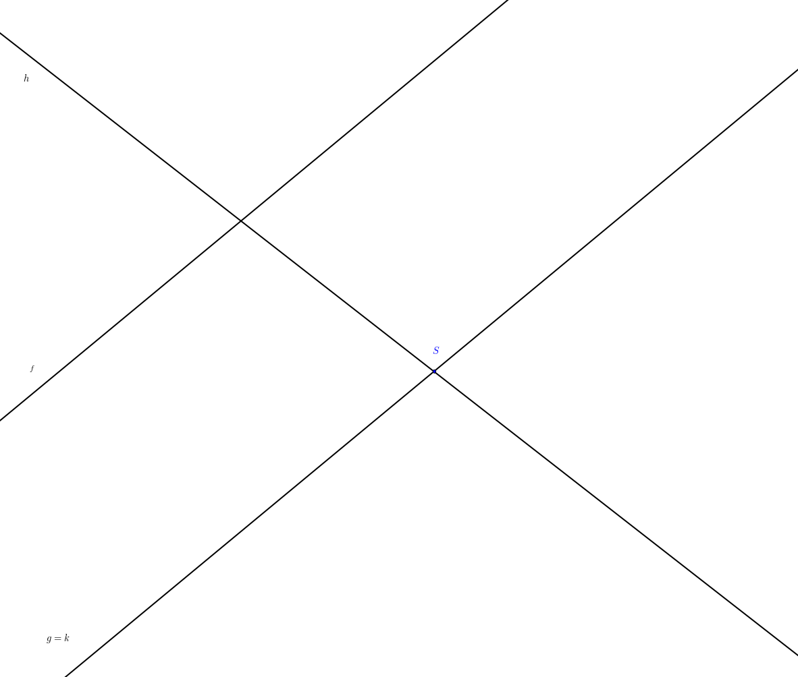<!-- style="display: block; margin-left: auto; margin-right: auto; max-width: 315px;" -->

Um die Ausnahmestellung paralleler Geraden zu beseitigen, sagt man

<!-- style="color: purple" -->
"Zwei parallele Geraden $g\parallel h$ besitzen einen gemeinsamen uneigentlichen Punkt."

und notiert diesen mit einem tiefgestellten Zeiger $u$ (**u**neigentlich). Die parallele Lagebeziehung schreibt sich dann abweichend in der Form $$
  g\parallel h\quad\leftrightarrow\quad g\cap h=\{{\purple S_u}\} $$

>**Forderungen.** (Projektiv erweiterte Ebene)
>
>1. Jede Gerade $g$ in $A^2$ besitzt genau einen uneigentlichen Punkt $G_u$.
>2. Parallele Geraden in $A^2$ besitzen denselben uneigentlichen Punkt.
>3. Alle uneigentlichen Punkte von Geraden in $A^2$ liegen auf einer uneigentlichen Geraden $u$.

>**Definition 1.** Die um alle uneigentlichen Punkte erweiterte Ebene, die den vorstehenden Forderungen 1. - 3. genügt, heißt [projektiv erweiterte Ebene](https://de.wikipedia.org/wiki/Projektiver_Raum) $\bar{A}^2$ bzw. der projektive Abschluss von $A^2$.

**Bemerkung 1.** Die projektive Erweiterung der Ebene $A^2$ besitzt die

1. Punktmenge $\mathcal{P}$ mit $$
  \mathcal{P}=\left\{X\in A^2\right\}\cup\left\{S_u|\{S_u\}=g\cap h\,,\;g\parallel h\right\}
$$ als Vereinigung der Menge aller (eigentlichen) Punkte $X\in A^2$ und der Menge aller uneigentlichen Punkte $S_u$
2. Geradenmenge $\mathcal{G}$ mit $$
  \mathcal{G}=\left\{g\subset A^2\right\}\cup\{u\}
$$ als Vereinigung der Menge aller Geraden $g\subset A^2$ und der einelementigen Menge bestehend aus der (einzigen) uneigentlichen Gerade $u$.

**Bemerkung 2.** Wird - abweichend vom projektiven Abschluss der Ebene $A^2$ - neben der Forderung 1 festgelegt, dass alle Geraden $g\subset A^2$ den gleichen (also auch einzigen) uneigentlichen Punkt besitzen, erhält man den sogenannten **Möbiusabschluss**.

Für eine geometrische Interpretation wird die stereographische Projektion der Punkte der Einheitssphäre $\Phi$ um den Mittelpunkt $O(0,0,0)$ auf die Punkte in der Tangentialebene $\Pi$ im 'Südpol' $S\in\Phi$ betrachtet. Die Projektion ist die Einschränkung der Zentralprojektion aus dem 'Nordpol' $N\in\Phi$ in die Ebene $\Pi$ $$
  ^c:\Phi\setminus{\{N\}}\to\Pi\quad\text{mit}\quad X\mapsto X^c=NX\cap\Pi
$$ Hierin bezeichnen $N$ das Projektionszentrum und $NX$ die Projektionsstrahlen der stereographischen Projektion. Die stereographische Projektion $^c$ ist bijektiv. (Nur das Projektionszentrum wird auf keinen Punkt der Ebene $\Pi$ abgebildet.)

Für eine interaktive Darstellung kann beispielsweise [GeoGebra](https://www.geogebra.org/m/om1ZxX6G) verwendet werden.

Kreise $k\subset\Phi$ werden unter $^c$ auf Kreise beziehungsweise Geraden abgebildet, je nachdem $N\not\in k$ beziehungsweise $N\in k$ gilt. Um die Ausnahmestellung von Geraden als Zentralrisse $k^c$ gegenüber Kreisen $k^c$ zu beseitigen, wird die Bildebene $\Pi$ um ~~genau einen~~ uneigentlichen Punkt $U$ erweitert. Entsprechend der ersten Forderung zur projektiven Erweiterung ist $U$ gemeinsamer Punkt aller Geraden $g\subset\Delta$ mit $N\in g$ der Verschwindungsebene mit parallelen Geraden $h\subset\Pi$ mit $S\in h$ der Bildebene $\Pi$.


Axiomatische Definition einer projektiven Ebene
=====


Aus der projektiven Erweiterung der Ebene $A^2$ folgen zwei strukturelle Aussagen, die sich nur dadurch unterscheiden, dass die Begriffe 'Punkt' beziehungsweise 'Gerade' sowie 'Verbinden' beziehungsweise 'Schneiden' verwendet sind.

>**Eigenschaft 1.** Zu je zwei verschiedenen Geraden $g\not= h$ existiert genau ein gemeinsamer Punkt, der Schnittpunkt $S$.[^1]

In der projektiv erweiterten Ebene treten hierbei die nachstehenden Fälle auf.

1. Für eigentliche Geraden $g\subset A^2$, $h\subset A^2$ mit $g\not\parallel h$ existiert genau ein gemeinsamer Punkt $S$, d. h. $$\{S\}=g\cap h$$
2. Gilt $g\parallel h$ für zwei verschiedene Geraden $g$, $h$, so gilt $$S=S_u$$ für den gemeinsamen Punkt.
3. Ist o. B. d. A. $g=u$ die uneigentliche Gerade der Ebene und $h$ eine eigentliche Geraden mit uneigentlichem Punkt $H_u$, so ist $$S_u=H_u$$

>**Eigenschaft 2.** Zu je zwei verschiedenen Punkten $P\not=Q$ existiert genau eine Gerade $g$, die Verbindungsgerade.[^2]

In der projektiv erweiterten Ebene treten hierbei die nachstehenden Fälle auf.

1. Für zwei Punkte $P\in A^2$, $Q\in A^2$ existiert genau ein Gerade $g$ mit $$
  g=P\vee Q $$
2. Ist einer der beiden Punkte uneigentlich, $P=H_u$, d. h. gehört dieser Punkt $H_u$ zu einer Geradenrichtung $h$, so ist $$
  g=H_u\vee Q\quad\leftrightarrow\quad g\ni Q\;\;\wedge\;\; g\parallel h
$$
3. Sind beide Punkte uneigentlich, so ist nach der dritten Forderung die Verbindungsgerade die uneigentliche Gerade $u$.

Ein axiomatischer Zugang zur projektiven Geometrie der Ebene ist im nachstehenden Video erläutert.

!?[Inzidenz](https://www.youtube.com/watch?v=KSyu-Q4wd7k)

Sätze, die nur mit den Begriffen 'Punkt', 'Gerade' sowie 'Verbinden' und 'Schneiden' formuliert werden können, sind typische Beispiele für Resultate der [projektiven Geometrie](https://de.wikipedia.org/wiki/Projektive_Geometrie#Axiomatische_projektive_Geometrie).

>**Definition 2.** Gegeben sind eine Menge von Punkten $\mathcal{P}$ und eine dazu [disjunkte](https://de.wikipedia.org/wiki/Disjunkt) Menge von Geraden $\mathcal{G}$, zwischen denen eine [Inzidenzrelation](https://de.wikipedia.org/wiki/Inzidenzstruktur) $R\subset\mathcal{P}\times\mathcal{G}$ gegeben ist. Gelten die Eigenschaften 1 und 2 sinngemäß, so heißt $(\mathcal{P},\mathcal{G},R)$ eine projektive Ebene.

**Bemerkung 3.** Nachfolgend wird nicht mehr notwendig zwischen eigentlichen und uneigentlichen Punkten und Geraden in der Ebene unterschieden.

**Beispiel 1.** [Aussage von Pappos](https://de.wikipedia.org/wiki/Satz_von_Pappos)

Gegeben sind zwei verschiedene Geraden $g$, $h$ der Ebene mit den Punkten $$
  \{P_1,P_3,P_5\}\subset g\quad\text{und}\quad
  \{P_2,P_4,P_6\}\subset h
$$ die 'abwechselnd' auf den beiden Geraden liegen. Werden die drei Punkte $$
  P=(P_1\vee P_2)\cap(P_4\vee P_5)\,,\quad
  Q=(P_2\vee P_3)\cap(P_5\vee P_6)\quad\text{und}\quad
  R=(P_3\vee P_4)\cap(P_6\vee P_1)
$$ konstruiert, so liegen diese auf einer Geraden.

Für eine interaktive Visualisierung der Aussage siehe beispielsweise die Darstellung [Pappos](https://www.geogebra.org/m/kawve3yd). Alternativ kann die Konstruktion mit vergleichsweise wenig Aufwand unter [GeoGebra](https://www.geogebra.org/calculator) durchgeführt werden.

>**Satz 1.** ([Dualitätsprinzip in der projektiven Ebene](https://de.wikipedia.org/wiki/Projektive_Geometrie#Dualit%C3%A4tsprinzip)) Das Vertauschen von
>
>1. 'Punkt' $\;\leftrightarrow\;$ 'Gerade'
>2. 'Verbinden' $\;\leftrightarrow\;$ 'Schneiden'
>
>führt eine geometrische Aussage in die zu ihr duale Aussage über. Diese ist genau dann wahr, wenn die erste wahr ist.

**Bemerkung 4.** Typische Begriffe der euklidischen Geometrie wie 'Länge', 'Winkel', 'orthogonal' etc. gehören nicht in die projektive Geometrie. Diese werden beispielsweise unter Projektionen nicht erhalten. Bei euklidischen Sätzen gibt es kein Dualitätsprinzip.

**Beispiel 2.** Unter Nutzung des Dualitätsprinzip in der projektiven Ebene ist die Aussage von Pappos zu dualisieren.

Gegeben sind zwei verschiedene Punkte $G$, $H$ der Ebene mit den Geraden $$
  \{p_1,p_3,p_5\}\ni G\quad\text{und}\quad
  \{p_2,p_4,p_6\}\ni H
$$ die 'abwechselnd' je einen der Punkte enthalten. Werden die drei Geraden $$
  p=(p_1\cap p_2)\vee(p_4\cap p_5)\,,\quad
  q=(p_2\cap p_3)\vee(p_5\cap p_6)\quad\text{und}\quad
  r=(p_3\cap p_4)\vee(p_6\cap p_1)
$$ konstruiert, so enthalten diese einen gemeinsamen Punkt $A$. Siehe nachstehende Abbildung.

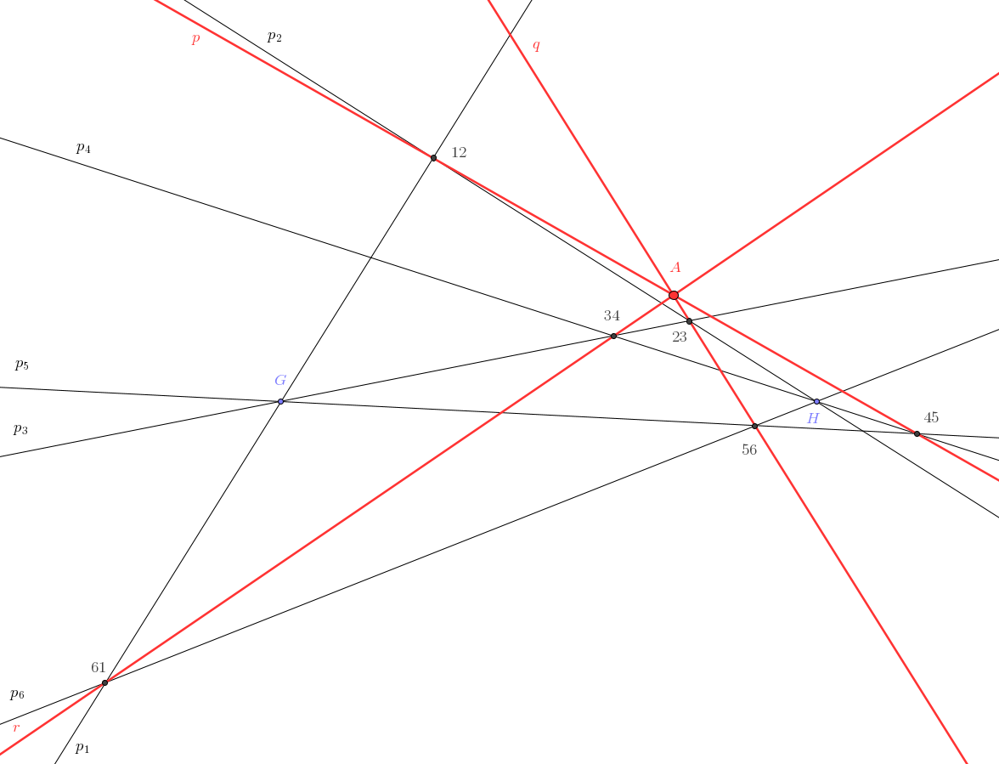


Projektive Erweiterung des dreidimensionalen Raumes
=====


Für die gegenseitige Lage zweier Geraden $g$ und $h$ des dreidimensionalen Raumes gilt genau einer der nachstehenden Fälle:

1. $g$ und $h$ sind identisch, d. h. $g=h$.
2. $g$ und $h$ besitzen genau einen gemeinsamen Punkt $S$, d. h. $g\cap h=S$.
3. $g$ und $h$ sind parallel aber nicht identisch, d. h. $g\parallel h$ und $g\cap h=\emptyset$.
4. $g$ und $h$ sind windschief, d. h. $g\not\parallel h$ und $g\cap h=\emptyset$.

In den Fällen 2 und 3 spannen beide Geraden eine Ebene auf. Im Fall der windschiefen Lage zweier Geraden lassen sich schrittweise konstruieren

* die - eindeutig bestimmte - gemeinsame Normale $n$ beider Geraden $g$ und $h$
* die Schnittpunkte $G=n\cap g$ und $H=n\cap h$ auf beiden Geraden
* die Geraden $\bar{h}$ mit $\bar{h}\parallel h$ und $\bar{h}\ni G$ sowie $\bar{g}$ mit $\bar{g}\parallel g$ und $\bar{g}\ni H$
* die parallelen Ebenen $\Sigma=g\vee \bar{h}$ und $\Delta=h\vee \bar{g}$

Werden die Forderungen zur projektiven Erweiterung der Ebene übertragen, so lässt sich zusätzlich zu den Forderungen zur erweiterten projektiven Ebene gemäß Definition 1 fordern:

>**Forderungen.** (Projektiv erweiterter dreidimensionaler Raum)
>
>4. Parallele Ebenen in $A^3$ besitzen eine gemeinsame uneigentliche Gerade.
>5. Alle uneigentlichen Punkte und Geraden des Raumes liegen in einer einzigen uneigentlichen Ebene $\omega$.

>**Definition 3.** Der um alle uneigentlichen Punkte, uneigentlichen Geraden und die uneigentliche Ebene erweiterte dreidimensionale Raum $A^3$, der den vorstehenden Forderungen 1. - 3. sowie 4. und 5. genügt, heißt [projektiv erweiterter Raum](https://de.wikipedia.org/wiki/Projektiver_Raum) $\bar{A}^3$ bzw. der projektive Abschluss von $A^3$.

**Bemerkung 5.** Entsprechend Satz 1 lässt sich ein Dualitätsprinzip in $\bar{A}^3$ formulieren: Das Vertauschen von

1. 'Punkt' $\;\leftrightarrow\;$ 'Ebene'
2. 'Gerade' $\;\leftrightarrow\;$ 'Gerade'
2. 'Verbinden' $\;\leftrightarrow\;$ 'Schneiden'

führt eine geometrische Aussage in die zu ihr duale Aussage über. Diese ist genau dann wahr, wenn die erste wahr ist. So lässt sich beispielsweise eine Gerade als Verbindungsgerade zweier Punkte und als Schnittgerade zweier Ebenen auffassen.


Sicher gewusst?
=====


Hier können Sie Ihr erworbenes Wissen bei der Beantwortung der folgenden Fragen testen.

**Frage 1.** Gegeben ist ein reguläres [Oktaeder](https://de.wikipedia.org/wiki/Oktaeder) mit den Kanten $p_1$, $p_2$ bis $p_{12}$ gemäß nachstehender Abbildung. Ebenso schematisch die Figur in der uneigentlichen Ebene, bestehend aus:

* den uneigentlichen Punkten $U_{i}$ der Kanten $p_i$ des Tetraeders
* den uneigentlichen Geraden $u_{ijk}$ der zu den Kanten $\{p_i, p_j, p_k\}$ gehörenden Seitenflächen

worin $i\not=j\not=k\not=i$ Werte aus der Indexmenge $I=\{1,...,12\}$ annehmen. Beachten Sie die das Enthaltensein $U\in u$, falls die zugehörigen Geraden- und Ebenen zueinander parallel sind.

 Je zwei parallele Kanten bilden einen gemeinsamen uneigentlichen Punkt, je drei eine Dreiecksfacette begrenzende Kanten bestimmen eine uneigentliche Gerade in der uneigentlichen Ebene (Abbildung rechts unten).")

Bestimmen Sie in der Figur die Lage der uneigentlichen Punkte $U_a$ bzw. $U_b$ und $U_c$ zu den Diagonalen $a$ bzw. $b$ bzw. $c$ des Oktaeders.

[[$U_a$] [$U_b$] [$U_c$]]
[(X) ( ) ( )]  $X$
[( ) ( ) (X)]  $Y$
[( ) (X) ( )]  $Z$
[[?]] Beachten Sie, dass der uneigentliche Punkt $G_u$ einer Gerade $g$ auf der uneigentlichen Gerade $s_u$ einer Ebene $\Sigma$ enthalten ist. Kurz: $$
  g\parallel \Sigma\quad\leftrightarrow G_u\in s_u
$$
****************************************

* Die Diagonale $a$ ist gemeinsame Gerade der durch die Kantenpaare $\{p_1,p_7\}$ beziehungsweise $\{p_5,p_9\}$ aufgespannten Ebenen. Daher ist $$ U_a=(U_1\vee U_7)\cap(U_5\vee U_9) $$
* Die Diagonale $b$ ist gemeinsame Gerade der durch die Kantenpaare $\{p_3,p_{11}\}$ beziehungsweise $\{p_5,p_9\}$ aufgespannten Ebenen. Daher ist $$ U_b=(U_3\vee U_{11})\cap(U_5\vee U_9) $$
* Die Diagonale $c$ ist gemeinsame Gerade der durch die Kantenpaare $\{p_3,p_{11}\}$ beziehungsweise $\{p_1,p_7\}$ aufgespannten Ebenen. Daher ist $$ U_a=(U_3\vee U_{11})\cap(U_1\vee U_7) $$

****************************************


[^1]: Als Schnittpunkt $S=g\cap h$ wird hier jenes Element der Punktmenge bezeichnet, dass sowohl in $g$ als auch in $h$ enthalten ist. Beim Enthaltensein eines Punktes auf einer Geraden spricht man auch von *Inzidenz*.

[^2]: Als Verbindungsgerade $g=P\vee Q$ wird hier jenes Element der Geradenmenge bezeichnet, dass sowohl $P$ als auch $Q$ enthält. Beim Enthaltensein eines Punktes auf einer Geraden spricht man auch von *Inzidenz*.


### Homogene Koordinaten


Affine, insbesondere kartesische Koordinaten sind zur Erfassung von uneigentlichen Punkten ungeeignet. So ergibt sich beispielsweise durch Wahl eines affinen Koordinatensystems auf einer Geraden $g$ $$
  x\in\mathbb{R}\quad\leftrightarrow\quad X\in g
$$ wohingegen für den uneigentlichen Punkt $U$ auf $g$ dann keine reelle Zahl zur Verfügung steht.

Nachfolgend werden schrittweise die Punktmengen einer projektiv abgeschlossenen Gerade, - Ebene und des - dreidimensionalen Raumes koordinatisiert und darin die Mengen der uneigentlichen Elemente gekennzeichnet.


Projektiv erweiterte Gerade
=====


Zunächst wird eine affine Gerade $g$ in einer Ebene $A^2$ eingebettet. Affine Koordinatensysteme in $A^2$ werden so gewählt, dass

* $(O,E)$ ein affines Koordinatensystem auf $g$ ist, worin $O$ den Koordinatenursprung und $E$ den Einheitspunkt auf $g$ bezeichnen
* $(U,E_0,E_1)$ ein weiteres affines Koordinatensystem in $A^2$ ist, worin $U$ den Koordinatenursprung und $E_0$ beziehungsweise $E_1$ die Einheitspunkte auf den Koordinatenachsen bezeichnen.

Die Koordinatensysteme werden so angepasst, dass $E_0=O$ gilt sowie $U$, $E_1$, $E$ und $O$ die Eckpunkte eines Parallelogramms bilden. Siehe nachstehende Abbildung.

$ auf $g$ und $(U,E_0,E_1)$ in $A^2$. Die Punkte $X\in g$ sind durch die affine Koordinate $x_0=1$ bezüglich $(U,E_0,E_1)$ in $A^2$ beschrieben.")

Nun werden zwei [bijektive Abbildungen](https://de.wikipedia.org/wiki/Bijektive_Funktion) beschrieben:

1. Die Menge der Punkte der Geraden $g$ wird umkehrbar eindeutig auf die Menge der Geraden durch $U$ abgebildet. Dies bedeutet $$
  X\in g\quad\leftrightarrow\quad x=UX
$$ sowie für den einzigen uneigentlichen Punkt $G_u$ zur Geraden $g$ $$
  G_u\in\bar{g}\quad\leftrightarrow\quad u\;\;\text{mit}\;\; u\ni U\;\;\text{und}\;\; u\parallel g
$$
2. Nach Einführung eines Ortsvektorraumes bezogen auf $U$ wird die Menge der Geraden durch $U$ umkehrbar eindeutig auf die Menge der eindimensionalen Untervektorräume [^1] durch $U$ abgebildet. Dies bedeutet im Einzelnen $$
  x\ni U\quad\leftrightarrow\quad [v_x]=\left\{\lambda\cdot v_x|\, \lambda\in\mathbb{R}\right\}\subset\mathbb{R}^2
$$

Speziell entsprechen sich durch Hintereinanderausführung beider Bijektionen:

* der Punkt $O\in g$ dem Verhältnis $[\textcolor{blue}{1}:\textcolor{blue}{0}]$ der Koeffizienten auf der rechten Seite der Äquivalenz $$ O\quad\stackrel{1.}{\longleftrightarrow}\quad x_O \quad\stackrel{2.}{\longleftrightarrow}\quad v_O=\lambda\cdot(\textcolor{blue}{1}\cdot e_0+\textcolor{blue}{0}\cdot e_1) \quad\text{mit}\quad \lambda\not=0 $$ worin $e_0$ und $e_1$ die Ortsvektoren der Punkte $E_0$ und $E_1$ bezeichnen (Basis in $\mathbb{R}^2$).
* der Punkt $E\in g$ dem Verhältnis $[\textcolor{magenta}{1}:\textcolor{magenta}{1}]$ der Koeffizienten auf der rechten Seite der Äquivalenz $$ O\quad\stackrel{1.}{\longleftrightarrow}\quad x_E \quad\stackrel{2.}{\longleftrightarrow}\quad v_E=\lambda\cdot(\textcolor{magenta}{1}\cdot e_0+\textcolor{magenta}{1}\cdot e_1) \quad\text{mit}\quad \lambda\not=0 $$

<!-- style="background-color: lightgray;"-->
>**Koordinatenmodell.** Allgemein entsprechen sich durch Hintereinanderausführung beider Bijektionen:
>
>* die Punkte $X$ der affinen Geraden $g$ den Verhältnissen $[1:\mu]$ der Koeffizienten auf der rechten Seite der Äquivalenz $$ X\quad\longleftrightarrow\quad x \quad\longleftrightarrow\quad v=\lambda\cdot(1\cdot e_0+\mu\cdot e_1) \quad\text{mit}\quad \lambda\not=0 $$ worin $\mu=TV(X,E,O)$ das Teilverhältnis von $X$ bezüglich $(O,E)$ bezeichnet.
>* der uneigentliche Punkt $G_u$ der Geradenrichtung $g$ dem Verhältnis $[0:1]$ der Koeffizienten auf der rechten Seite der Äquivalenz $$ G_u\quad\longleftrightarrow\quad x_u \quad\longleftrightarrow\quad v_u=\lambda\cdot(0\cdot e_0+1\cdot e_1) \quad\text{mit}\quad \lambda\not=0 $$
>
>Die Vektoren $e_0$ und $e_1$ sind Ortsvektoren der Punkte $E_0$ und $E_1$ und bilden eine Basis in $\mathbb{R}^2$.

**Bemerkung 1.** Zu beachten ist, dass mit dem Vektor $v$ auch $\frac{1}{\lambda}\cdot v$ und jedes andere von Null verschiedene Skalarfache $\nu\cdot v$ mit $\nu\in\mathbb{R}\setminus\{0\}$ den Richtungsvektor der Geraden $x$ festlegt.

>**Definition 1.** Die Verhältnisse $[\lambda_0:\lambda_1]$ der Koeffizienten in der Linearkombination $$
  v_X=\lambda_0\cdot e_0+\lambda_1\cdot e_1
$$ heißen [homogene Koordinaten](https://de.wikipedia.org/wiki/Homogene_Koordinaten) eines Punktes $X$ auf der projektiv erweiterten Geraden $\bar{g}$.
>
>Die "nullte" Komponente $\lambda_0$ wird *homogenisierende* Koordinate genannt.[^2]

Punkte auf einer Geraden lassen sich unter Angabe ihrer Koordinate/-n schreiben.

* Ein Punkt $P$ mit der affinen Koordinate $x$ wird geschrieben als $P(x)$. Der uneigentliche Punkt einer Gerade besitzt ~~keine~~ affine Koordinate.
* Besitzt ein Punkt die homogenen Koordinaten $(\lambda_0:\lambda_1)$, so schreibt man $$
  P(\lambda_0:\lambda_1)=\left(1:\frac{\lambda_1}{\lambda_0}\right)\quad\text{falls}\quad \lambda_0\not=0
$$ für einen eigentlichen Punkt $P$ beziehungsweise $$
  G_u(\lambda_0:\lambda_1)=\left(0:\lambda_1\right)=(0:1)\quad\text{falls}\quad \lambda_0=0
$$ für den uneigentlichen Punkt $G_u$.

**Bemerkung 2.** Die homogenen Koordinaten eines Punktes der projektiv erweiterte Geraden sind nur bis auf einen gemeinsamen Faktor bestimmt. Das Verhältnis $(\lambda_0:\lambda_1)=(0:0)$ bestimmt in diesem Koordinatenmodell keinen Punkt.

Für den Übergang zwischen affinen - und homogenen Koordinaten nutzt man folgende Rechnung:

1. "affin $\to$ homogen": $P(x) \to P=(1:x)=(\lambda:\lambda\cdot x)$
2. "homogen $\to$ affin": Ist $P$ nicht uneigentlicher Punkt, so ist
  $$P=(\lambda_0:\lambda_1)=\left(1:\frac{\lambda_1}{\lambda_0}\right)=:(1:x) \to P(x)$$


Projektiv erweiterte Ebene
=====


Analog zur Koordinatisierung einer projektiv erweiterten Geraden wird eine affine Ebene $A^2$ eingebettet in einen dreidimensionalen Raum $A^3$. Affine Koordinatensysteme in $A^3$ werden so gewählt, dass

* $(O,E_1,E_2)$ ein affines Koordinatensystem in $A^2$ ist, worin $O$ den Koordinatenursprung und $E_i$ die Einheitspunkte auf den Koordinatenachsen in $A^2$ bezeichnen
* $(U,F_0,F_1,F_2)$ ein weiteres affines Koordinatensystem in $A^3$ ist, worin $U$ den Koordinatenursprung und $F_j$ die Einheitspunkte auf den Koordinatenachsen bezeichnen.

Die Koordinatensysteme werden so angepasst, dass $F_0=O$ gilt sowie $U$, $F_1$, $F_2$ sowie $O$, $E_1$ und $E_2$ die Eckpunkte eines Prismas bilden. Siehe nachstehende Abbildung.

$ in $A^2$ und $(U,F_0,F_1,F_2)$ in $A^3$. Die Punkte $P\in A^2$ sind durch die affine Koordinate $x_0=1$ bezüglich $(U,F_0,F_1,F_2)$ in $A^3$ beschrieben.")

Analog zum eindimensionalen Fall werden zwei bijektive Abbildungen beschrieben:

1. Die Menge der Punkte der Ebene $A^2$ wird umkehrbar eindeutig auf die Menge der Geraden durch $U$ abgebildet. Dies bedeutet $$
  P\in A^2\quad\leftrightarrow\quad p=UP
$$ sowie für die uneigentlichen Punkte $G_u$ auf der uneigentlichen Geraden $u\subset \bar{A}^2$ $$
  G_u\in u\quad\leftrightarrow\quad g\;\;\text{mit}\;\; g\ni U\;\;\text{und}\;\; g\parallel A^2
$$
2. Nach Einführung eines Ortsvektorraumes bezogen auf $U$ wird die Menge der Geraden durch $U$ umkehrbar eindeutig auf die Menge der eindimensionalen Untervektorräume [^1] durch $U$ abgebildet. Dies bedeutet im Einzelnen $$
  p\ni U\quad\leftrightarrow\quad [v_p]=\left\{\lambda\cdot v_p|\, \lambda\in\mathbb{R}\right\}\subset\mathbb{R}^3
$$

Analog zum vorigen Abschnitt ergibt sich hier

<!-- style="background-color: lightgray;"-->
>**Koordinatenmodell.** Allgemein entsprechen sich durch Hintereinanderausführung beider Bijektionen:
>
>* die Punkte $P$ der affinen Ebene $A^2$ den Verhältnissen $[1:\mu:\nu]$ der Koeffizienten auf der rechten Seite der Äquivalenz $$ P\quad\longleftrightarrow\quad p \quad\longleftrightarrow\quad v=\lambda\cdot(1\cdot f_0+\mu\cdot f_1+\nu\cdot f_2) \quad\text{mit}\quad \lambda\not=0 $$ worin $(\mu,\nu)$ das Paar der affinen Koordinaten von $P$ bezüglich $(O,E_1,E_2)$ bezeichnet.
>* ein uneigentlicher Punkt $G_u$ einer Geradenrichtung $g$ dem Verhältnis $[0:\mu:\nu]$ der Koeffizienten auf der rechten Seite der Äquivalenz $$ G_u\quad\longleftrightarrow\quad x_u \quad\longleftrightarrow\quad v_u=\lambda\cdot(0\cdot f_0+\mu\cdot f_1+\nu\cdot f_2) \quad\text{mit}\quad \lambda\not=0 $$
>
>Die Vektoren $f_0$, $f_1$ und $f_2$ sind Ortsvektoren der Punkte $F_0$, $F_1$ und $F_2$ und bilden eine Basis in $\mathbb{R}^3$.

>**Definition 2.** Die Verhältnisse $[\lambda_0:\lambda_1:\lambda_2]$ der Koeffizienten in der Linearkombination $$
  v_P=\lambda_0\cdot f_0+\lambda_1\cdot f_1+\lambda_2\cdot f_2
$$ heißen **homogene Koordinaten** eines Punktes $P$ in der projektiv erweiterten Ebene $\bar{A}^2$.
>
>Die "nullte" Komponente $\lambda_0$ wird *homogenisierende* Koordinate genannt.

Punkte in einer Ebene lassen sich unter Angabe ihrer Koordinaten schreiben.

* Ein Punkt $P$ mit den affinen Koordinaten $(x,y)$ wird geschrieben als $P(x,y)$. Der uneigentliche Punkt einer Geradenrichtung besitzt ~~keine~~ affinen Koordinaten.
* Besitzt ein Punkt die homogenen Koordinaten $(\lambda_0:\lambda_1:\lambda_2)$, so schreibt man $$
  P(\lambda_0:\lambda_1:\lambda_2)=\left(1:\frac{\lambda_1}{\lambda_0}:\frac{\lambda_2}{\lambda_0}\right)\quad\text{falls}\quad \lambda_0\not=0
$$ für einen eigentlichen Punkt $P$ beziehungsweise $$
  G_u(\lambda_0:\lambda_1:\lambda_2)=\left(0:\lambda_1:\lambda_2\right)\quad\text{falls}\quad \lambda_0=0
$$ für einen uneigentlichen Punkt $G_u$. Im Fall eines uneigentlichen Punktes bestimmt das Verhältnis $(\lambda_1:\lambda_2)$ einen Richtungsvektor von Geraden $g=UG_u$ an.

**Bemerkung 3.** Die homogenen Koordinaten eines Punktes der projektiv erweiterten Ebene sind nur bis auf einen gemeinsamen Faktor bestimmt. Das Verhältnis $(\lambda_0:\lambda_1:\lambda_2)=(0:0:0)$ bestimmt in diesem Koordinatenmodell keinen Punkt.

Für den Übergang zwischen affinen - und homogenen Koordinaten nutzt man folgende Rechnung:

1. "affin $\to$ homogen": $P(x,y) \to P=(1:x:y)=(\lambda:\lambda\cdot x:\lambda\cdot y)$
2. "homogen $\to$ affin": Ist $P$ nicht uneigentlicher Punkt, so ist $$
  P=(\lambda_0:\lambda_1:\lambda_2)=\left(1:\frac{\lambda_1}{\lambda_0}:\frac{\lambda_2}{\lambda_0}\right)=:(1:x:y) \to P(x,y)
$$ d. h. die affinen Koordinaten berechnen sich in diesem Fall mittels $$
  x=\frac{\lambda_1}{\lambda_0}\quad\text{bzw.}\quad y=\frac{\lambda_2}{\lambda_0}
$$


Projektiv erweiterter Raum
=====

Analog zu homogenen Koordinaten von Punkten einer projektiv erweiterten Geraden beziehungsweise - Ebene in den Definitionen 1 und 2 lassen sich homogene Koordinaten für Punkte des projektiv erweiterten dreidimensionalen Raum $\bar{A}^3$ einführen.

1. Für Punkte $P(x,y,z)$ bezüglich eines affinen Koordinatensystems im affinen Raum $A^3$ berechnen sich dessen homogene Koordinaten als Verhältnisse $$
  P=\left(\lambda_0:\lambda_1:\lambda_2:\lambda_3\right)\quad\text{mit}\quad\lambda_0\not=0\,,\quad x=\frac{\lambda_1}{\lambda_0}\,,\quad y=\frac{\lambda_2}{\lambda_0}\quad\text{und}\quad z=\frac{\lambda_3}{\lambda_0}
$$
2. Für Punkte der (einzigen) uneigentlichen Ebene gilt abweichend $\lambda_0=0$ und somit $$
  P=\left(0:\lambda_1:\lambda_2:\lambda_3\right)
$$ Das Verhältnis $\left(\lambda_1:\lambda_2:\lambda_3\right)\not=(0:0:0)$ beschreibt eine Geradenrichtung in $A^3$ (Richtungsvektor).

>**Definition 3.** Die Verhältnisse $[\lambda_0:\lambda_1:\lambda_2:\lambda_3]$ der Koeffizienten in der Linearkombination $$
  v_P=\lambda_0\cdot f_0+\lambda_1\cdot f_1+\lambda_2\cdot f_2+\lambda_3\cdot f_3
$$ heißen **homogene Koordinaten** eines Punktes $P$ im projektiv erweiterten dreidimensionalen Raum $\bar{A}^3$.
>
>Die "nullte" Komponente $\lambda_0$ wird *homogenisierende* Koordinate genannt.

Homogene Punktkoordinaten im dreidimensionalen Raum werden im nachstehenden Video erläutert. Beachten Sie, dass hierin im Unterschied zu Definition 3 die letzte Variable die homogenisierende Variable bezeichnet.

!?[homogene Variablen](https://www.youtube.com/watch?v=U3xwsWgzz2M "Edmund Weitz, HAW Hamburg")


Sicher gewußt?
=====


Sie können das in diesem Abschnitt erworbene Wissen bei der Beantwortung der nachstehenden Fragen testen.

**Frage 1.** Gegeben sind die homogenen Koordinaten eines Punktes $P=(2:3:0:-5)$. Hierbei ist $\lambda_0=2$ die homogenisierende Koordinate. Es sind die hieraus die affinen Koordinaten von $P$ zu berechnen.

[( )] $$P(2,3,0)$$
[( )] $$P\left(-\frac{2}{5},-\frac{3}{5},0\right)$$
[( )] $$P(2,3,0,-5)$$
[( )] $$P(3,0,-5)$$
[(X)] $$P\left(\frac{3}{2},0,-\frac{5}{2}\right)$$
[[?]] Die homogenen Koordinaten eines Punktes des projektiv erweiterten dreidimensionalen Raumes sind nur bis auf einen gemeinsamen Faktor bestimmt. Die affinen Koordinaten sind gemäß der oben angeführten Umrechnung zu ermitteln.
****************************************

Es sind $$
  (\lambda_0:\lambda_1:\lambda_2:\lambda_3)=(2:3:0:-5)
$$ woraus sich die affinen Koordinaten von $P$ berechnen gemäß $$
  x=\frac{\lambda_1}{\lambda_0}=\frac{3}{2}\,,\quad y=\frac{\lambda_2}{\lambda_0}=\frac{0}{2}=0\quad\text{und}\quad z=\frac{\lambda_3}{\lambda_0}=-\frac{5}{2}
$$

****************************************

**Frage 2.** Geben Sie einen Richtungsvektor der Geradenrichtung in der Ebene an, die den uneigentlichen Punkt $G_u=(0:1:4)$ enthält. (Die Null im vorgenannten Verhältnis bezeichnet die homogenisierende Koordinate.)

[[X]] $$ r=\begin{pmatrix} 1 & 4 \end{pmatrix}^\top $$
[[ ]] $$ r=\begin{pmatrix} 0 & 1 \end{pmatrix}^\top $$
[[ ]] $$ r=\begin{pmatrix} 1 & : & 4 \end{pmatrix} $$
[[ ]] $$ r=\begin{pmatrix} 4 & 0 \end{pmatrix}^\top $$
[[X]] $$ r=\begin{pmatrix} -2 & -8 \end{pmatrix}^\top $$
[[ ]] $$ r=\begin{pmatrix} 0 & 1 & 4 \end{pmatrix}^\top $$
[[?]] 'Geradenrichtung' wird stellvertretend für eine einparametrige Menge paralleler Geraden der Ebene verwendet. Nutzen Sie Definition 2 für die Bestimmung eines Richtungsvektors der Geradenrichtung / Geradenmenge.
****************************************

Für den gesuchten Richtungsvektor gilt $$ G_u=(0:1:4)\quad \leftrightarrow\quad \lambda\cdot r=\lambda\cdot\begin{pmatrix} 1 & 4 \end{pmatrix}^\top $$
Für $\lambda=1$ beziehungsweise $\lambda=-2$ sind beispielsweise die Vektoren $$
  \begin{pmatrix} 1 & 4 \end{pmatrix}^\top\quad\text{bzw.}\quad \begin{pmatrix} -2 & -8 \end{pmatrix}^\top
$$ möglich.

Die dritte Antwortoption ist ein Verhältnis, jedoch kein Vektor.

****************************************

**Frage 3.** Gegeben ist ein Punkt $P$ des dreidimensionalen Raumes mit den affinen Koordinaten $P(1,-2,3)$. Ermitteln Sie gemäß des obigen Ansatzes (Definition 3) die homogenen Koordinaten von $P$.

[[ ]] $$ P=(0:1:-2:3) $$
[[X]] $$ P=(-2:-2:4:-6) $$
[[X]] $$ P=(1:1:-2:3) $$
[[ ]] $$ P=(1:-2:4:-6) $$
[[ ]] $$ P(1,1,-2,3) $$
[[?]] Die homogenen Koordinaten eines eigentlichen Punktes lassen sich als Verhältnisse $$
  (x,y,z)\quad\leftrightarrow\quad (x_0:x_1:x_2:x_3)\quad\text{mit}\quad x=\frac{x_1}{x_0}\,,\quad y=\frac{x_2}{x_0}\,,\quad z=\frac{x_3}{x_0}
$$ definieren.
****************************************

Es gilt mit obigem Ansatz zur Berechnung der homogenen Koordinaten eines Punktes $$
  (1,-2,3)\quad\leftrightarrow\quad (1:1:-2:3)\quad\text{mit}\quad x=\frac{1}{1}\,,\quad y=\frac{-2}{1}\,,\quad z=\frac{3}{1}
$$ beziehungsweise $$
( 1,-2,3)\quad\leftrightarrow\quad (-2:-2:4:-6)\quad\text{mit}\quad x=\frac{-2}{-2}\,,\quad y=\frac{4}{-2}\,,\quad z=\frac{-6}{-2}
$$ Die letzte Antwortoption beschreibt kein Verältnis, es werden keine homogenen Koordinaten dargestellt.

****************************************


[^1]: Zu einem gegebenen Vektor $v\in\mathbb{R}^2$ mit $v\not= o$ (Nullvektor) ist $$
  [v]=\left\{\lambda\cdot v|\, \lambda\in\mathbb{R}\right\}
$$ der eindimensionale [Untervektorraum](https://de.wikipedia.org/wiki/Untervektorraum) von $v$, d. i. die Menge aller zu $v$ linear abhängigen Vektoren.

[^2]:  Für Punkte des affinen Ausschnittes $g\subset \bar{g}$ kann diese zu Eins normiert werden, für den uneigentlichen Punkt einer Geradenrichtung ist $\lambda_0=0$.


### Geradenkoordinaten


Homogene Geradenkoordinaten
=====

Durch Einbettung der projektiv erweiterten Ebene $\bar{A}^2$ in einen dreidimensionalen affinen Raum $A^3$ mit dem affinen Koordinatensystem $$
  (U,F_1,F_2,F_3)\quad\text{mit}\quad U\not\in A^2
$$ ließen sich homogene Koordinaten für Punkte einführen. Hier soll nun in analoger Weise die Geradenmenge von $\bar{A}^2$ koordinatisiert werden. Das Dualitätsprinzip der projektiven Ebene wird in der Symmetrie der eingeführten Rechenoperationen für homogene Punkt- und Geradenkoordinaten deutlich. Vergleiche hierzu Abschnitt [Projektive Erweiterung](#Projektive-Erweiterung).

Jede Gerade $g\subset\bar{A}^2$ lässt sich mit dem Koordinatenursprung $U$ des affinen Koordinatensystems eindeutig zu einer Ebene $\Gamma$ verbinden; im Koordinatensystem $(U,F_1,F_2,F_3)$ besitzt diese eine Gleichung $$
  \sum_{i=0}^2{\left(u_i\cdot x_i\right)}=u_0\cdot x_0+u_1\cdot x_1+u_2\cdot x_2\quad\text{mit}\quad \sum_{i=0}^2{\left(u_i\right)^2}\not=0
$$ Die Koeffizienten $u_0$, $u_1$ und $u_2$ sind wieder bis auf einen gemeinsamen Faktor eindeutig bestimmt.

>**Definition 1.** Die Verhältnisse $[u_0:u_1:u_2]$ heißen **homogene Geradenkoordinaten** von $g\subset\bar{A}^2$.

**Bemerkung 1.** Sind die Koordinatensysteme $$ (O,E_1,E_2)\quad\text{bzw.}\quad (U,F_0,F_1,F_2) $$ in der Ebene $A^2$ bzw. deren Einbettungsraum $A^3$ kartesisch, so lassen sich die homogenen Geradenkoordinaten als Koordinaten eines Normalenvektors der Ebene $\Gamma$ interpretieren.

**Beispiel 1.** Für die uneigentliche Gerade der projektiv erweiterten Ebene $\bar{A}^2$ ergeben sich mit dem Ansatz aus dem vorangegangenen Abschnitt [Homogene Koordinaten](#Homogene-Koordinaten) die Geradenkoordinaten $$
  u=[1:0:0]\quad\leftrightarrow\quad 1\cdot x_0+0\cdot x_1+0\cdot x_2=x_0=0
$$ Offenbar gilt diese Gleichung für alle uneigentlichen Punkte, die auf der uneigentlichen Geraden $u$ liegen.

<!-- style="background-color: lightgray;"-->
>Mit Hilfe homogener Koordinaten lassen sich **Operationen** zwischen Punkten und Geraden in $\bar{A}^2$ darstellen. Der Übersichtlichkeit wegen werden Geradenkoordinaten unter Verwendung eckiger Klammern geschrieben, während homogene Punktkoordinaten mit runden Klammern notiert werden.
>
>1. Ein Punkt $X=(x_0:x_1:x_2)$ liegt genau dann auf einer Geraden $g=[u_0:u_1:u_2]$, wenn gilt $$
  u_0\cdot x_0 + u_1\cdot x_1 + u_2\cdot x_2 = 0
$$ Man sagt in diesem Fall, dass Punkt und Gerade *inzidieren*.[^1]
>2. Die homogenen Geradenkoordinaten der Verbindungsgerade $g$ zweier Punkte $X=(x_0:x_1:x_2)$ und $Y=(y_0:y_1:y_2)$ berechnen sich gemäß $$
  g=\left[
  \left\vert\begin{array}{cc} x_1 & x_2 \\ y_1 & y_2 \end{array}\right\vert\,:\,
  \left\vert\begin{array}{cc} x_2 & x_0 \\ y_2 & y_0 \end{array}\right\vert\,:\,
  \left\vert\begin{array}{cc} x_0 & x_1 \\ y_0 & y_1 \end{array}\right\vert
  \right]
$$ worin $|\,.\,|$ die zweireihigen Unterdeterminanten der Matrix $$
  \begin{pmatrix} x_0 & x_1 & x_2 \\ y_0 & y_1 & y_2 \end{pmatrix}
$$ bezeichnen.
>3. Die homogenen Punktkoordinaten des Schnittpunktes $S$ zweier Geraden $u=[u_0:u_1:u_2]$ und $v=[v_0:v_1:v_2]$ berechnen sich gemäß $$
  S=\left(
  \left\vert\begin{array}{cc} u_1 & u_2 \\ v_1 & v_2 \end{array}\right\vert\,:\,
  \left\vert\begin{array}{cc} u_2 & u_0 \\ v_2 & v_0 \end{array}\right\vert\,:\,
  \left\vert\begin{array}{cc} u_0 & u_1 \\ v_0 & v_1 \end{array}\right\vert
  \right)
$$ worin $|\,.\,|$ die zweireihigen Unterdeterminanten der Matrix $$
  \begin{pmatrix} u_0 & u_1 & u_2 \\ v_0 & v_1 & v_2 \end{pmatrix}
$$ bezeichnen.

**Bemerkung 2.** In den beiden vorstehenden Formeln zeigt sich das Dualitätsprinzip in $\bar{A}^2$.

Mit Hilfe der Javascript Bibliothek [Algebrite](http://algebrite.org/) können die die homogenen Geradenkoordinaten für Geraden $g\subset\bar{A}^2$ berechnet werden, analog die homogenen Punktkoordinaten des Schnittpunktes aus den Geradenkoordinaten. Die Operation entspricht formal der Bildung des Vektorproduktes zweier Vektoren aus $\mathbb{R}^3$.

``` javascript
X = [x0,x1,x2]
Y = [y0,y1,y2]
G = [X[2]*Y[3]-X[3]*Y[2], X[3]*Y[1]-X[1]*Y[3], X[1]*Y[2]-X[2]*Y[1]]
G
```
@Algebrite.eval

**Beispiel 2.** Gegeben sind zwei Punkte in der Ebene $A^2$ durch ihre affinen Koordinaten $$
  P(-1,2)\quad\text{und}\quad Q(-1,1)
$$ und die durch beide bestimmte Verbindungsgerade $g=PQ$. Siehe nachstehende Abbildung.

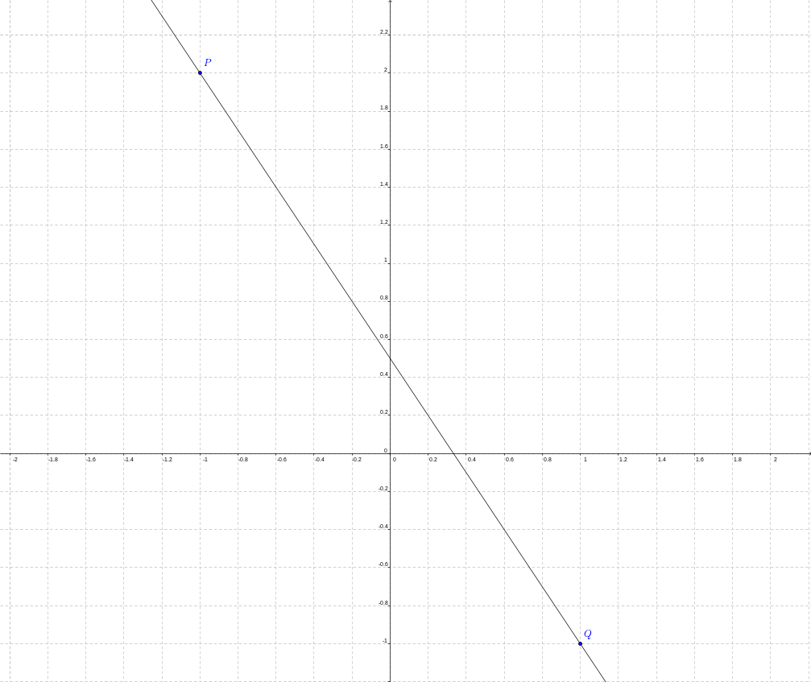

1. Zu bestimmen sind zunächst die homogenen Geradenkoordinaten von $g$. Hierfür sind die homogenen Punktkoordinaten der Punkte $P$ und $Q$ anzugeben. $$
  P=(1:-1:2)\quad\text{und}\quad Q=(1:1:-1)
$$ Hieraus berechnen sich die Geradenkoordinaten vermöge $$
  g=\left[
  \left\vert\begin{array}{cc} p_1 & p_2 \\ q_1 & q_2 \end{array}\right\vert\,:\,
  \left\vert\begin{array}{cc} p_2 & p_0 \\ q_2 & q_0 \end{array}\right\vert\,:\,
  \left\vert\begin{array}{cc} p_0 & p_1 \\ q_0 & q_1 \end{array}\right\vert
  \right]=\left[
  \left\vert\begin{array}{cc} -1 & 2 \\ 1 & -1 \end{array}\right\vert\,:\,
  \left\vert\begin{array}{cc} 2 & 1 \\ -1 & 1 \end{array}\right\vert\,:\,
  \left\vert\begin{array}{cc} 1 & -1 \\ 1 & 1 \end{array}\right\vert
  \right]=[-1:3:2]
$$ In $A^3$ entspricht diesen Koordinaten die Ebenengleichung $$
  -x_0+3\cdot x_1+2\cdot x_2=0
$$ Werden beide Seiten dieser Gleichung durch $x_0$ dividiert (vorausgesetzt $x_0\not=0$), so erhält man im Übergang zu affinen Koordinaten $$
  -1+3\cdot x+2\cdot y=0\quad\leftrightarrow\quad y=-\frac{3}{2}\cdot x+\frac{1}{2}
$$ als Gleichung der Verbindungsgerade $g=PQ$.
2. Unter Benutzung der homogenen Koordinaten lässt sich die Inzidenz $P\in\bar{g}$ beziehungsweise $Q\in\bar{g}$ zeigen $$
  P\in\bar{g}\quad\leftrightarrow\quad -x_0+3\cdot x_1+2\cdot x_2=-1\cdot1+3\cdot (-1)+2\cdot 2=0
$$ beziehungsweise $$
  Q\in\bar{g}\quad\leftrightarrow\quad -x_0+3\cdot x_1+2\cdot x_2=-1\cdot 1+3\cdot 1+2\cdot (-1)=0
$$
3. Der uneigentliche Punkt $G_u\in\bar{g}$ lässt sich als Schnittpunkt von $\bar{g}$ mit der uneigentlichen Geraden $u$ entsprechend obigen Ansatzes berechnet werden $$
  G_u=\left(
  \left\vert\begin{array}{cc} g_1 & g_2 \\ u_1 & u_2 \end{array}\right\vert\,:\,
  \left\vert\begin{array}{cc} g_2 & g_0 \\ u_2 & u_0 \end{array}\right\vert\,:\,
  \left\vert\begin{array}{cc} g_0 & g_1 \\ u_0 & u_1 \end{array}\right\vert
  \right)=\left(
  \left\vert\begin{array}{cc} 3 & 2 \\ 0 & 0 \end{array}\right\vert\,:\,
  \left\vert\begin{array}{cc} 2 & -1 \\ 0 & 1 \end{array}\right\vert\,:\,
  \left\vert\begin{array}{cc} -1 & 3 \\ 1 & 0 \end{array}\right\vert
  \right)=(0:2:-3)
$$ Diese homogenen Punktkoordinaten entsprechen einer Geradenrichtung zum Vektor $$
  r=\begin{pmatrix} 2 \\ -3 \end{pmatrix}
$$

**Bemerkung 3.** Die homogenen Geradenkoordinaten hängen nicht von der Wahl der Punkte auf $\bar{g}$ ab. Beispielsweise lässt sich $\bar{g}$ im zuvor betrachteten Beispiel bestimmen als $$
  \bar{g}=PQ=PG_u=G_uQ
$$ mit $$
  PG_u=\left[
  \left\vert\begin{array}{cc} -1 & 2 \\ 2 & -3 \end{array}\right\vert\,:\,
  \left\vert\begin{array}{cc}  2 & 1 \\ -3 & 0 \end{array}\right\vert\,:\,
  \left\vert\begin{array}{cc} 1 & -1 \\  0 & 2 \end{array}\right\vert
  \right]=[-1:3:2]
$$ und ebenso $$
  G_uQ=\left[
  \left\vert\begin{array}{cc} 2 & -3 \\ 1 & -1 \end{array}\right\vert\,:\,
  \left\vert\begin{array}{cc} -3 & 0 \\ -1 & 1 \end{array}\right\vert\,:\,
  \left\vert\begin{array}{cc}  0 & 2 \\  1 & 1 \end{array}\right\vert
  \right]=[1:-3:-2]\stackrel{\cdot(-1)}{=}[-1:3:2]
$$ Aus den Rechenregeln für Determinanten folgt ebenso, dass sich die homogenen Geradenkoordinaten (als Verhältnisse) nicht ändern, falls die homogenen Punktkoordinaten als Verhältnisse erweitert werden: Sie sind unabhängig von der Wahl des Repräsentanten (-Vektors).


Homogene Ebenenkoordinaten
=====


Analog zu homogenen Koordinaten für die Geradenmenge des $\bar{A}^2$ lassen sich homogene Koordinaten für die Ebenenmenge des projektiv erweiterten dreidimensionalen Raums $\bar{A}^3$ einführen. Vergleiche hierzu das Dualitätsprinzip für $\bar{A}^3$ im Abschnitt [Projektive Erweiterung](#Projektive-Erweiterung).

Eine Ebene in $A^3$ lässt sich mit Hilfe einer linearen Gleichung in den kartesischen Koordinaten $(x,y,z)$ beschreiben $$
  a\cdot x+b\cdot y+c\cdot z+d=0\quad\text{mit}\quad (a,b,c)\in\mathbb{R}^3\setminus(0,0,0)\,,\;d\in\mathbb{R}
$$ Wird zu homogenen Punktkoordinaten $(x_0,x_1,x_2,x_3)$ übergegangen gemäß $$
  x=\frac{x_1}{x_0}\,,\quad y=\frac{x_2}{x_0}\,,\quad z=\frac{x_3}{x_0}\quad\text{für}\quad x_0\not=0
$$ so ergibt sich eine Gleichung der (um die uneigentlichen Elemente erweiterten) Ebene in homogenen Koordinaten $$
  a\cdot \frac{x_1}{x_0}+b\cdot \frac{x_2}{x_0}+c\cdot \frac{x_3}{x_0}+d=0\quad\leftrightarrow\quad a\cdot x_1+b\cdot x_2+c\cdot x_3+d\cdot x_0=0
$$

>**Definition 2.** Die Verhältnisse in einer homogenen linearen Gleichung $$
  [u_0:u_1:u_2:u_3]=[d:a:b:c]
$$ legen eine Ebene in $\bar{A}^3$ eindeutig fest und heißen **homogene Ebenenkoordinaten**.

<!-- style="background-color: lightgray;"-->
>Für die **Inzidenz** eines Punktes $X=(x_0:x_1:x_2:x_3)$ mit einer Ebene $U=[u_0:u_1:u_2:u_3]$ gilt $$
  u_0\cdot x_0 + u_1\cdot x_1 + u_2\cdot x_2 + u_3\cdot x_3 = 0
$$ Man sagt in diesem Fall, dass Punkt und Ebene inzidieren.[^1]

**Beispiel 3.** Aus der Forderung 5 im Abschnitt [Projektive Erweiterung](#Projektive-Erweiterung) ergibt sich aus der Inzidenzbedingung für uneigentliche Punkte $P_u=(0:x_1:x_2:x_3)$ mit einer Ebene $U=[u_0:u_1:u_2:u_3]$ in $\bar{A}^3$ $$
  P_u\in U\quad\leftrightarrow\quad u_0\cdot 0+u_1\cdot x_1+u_2\cdot x_2+u_3\cdot x_3=0
$$ Ist $U$ die uneigentliche Ebene $\omega$, so muss die Inzidenzbedingung für alle uneigentlichen Punkte erfüllt, also unabhängig von der Wahl von $(x_1,x_2,x_3)$ sein. Dies ist nur dann möglich, wenn $u_1=u_2=u_3=0$ gilt. Damit ist dann $u_0\not=0$ zu wählen. Die homogenen Ebenenkoordinaten von $\omega$ sind somit $$
  \omega=[1:0:0:0]
$$

**Bemerkung 4.** Homogene Geradenkoordinaten in $\bar{A}^3$ lassen sich entsprechend dem Vorgehen in $\bar{A}^2$ mithilfe von Determinanten zweiter Ordnung der Matrix $$
  \begin{pmatrix} x_0 & x_1 & x_2 & x_3 \\ y_0 & y_1 & y_2 & y_3 \end{pmatrix}
$$ definieren $$
  g_{01}=\left|\begin{array}{rr} x_0 & x_1 \\ y_0 & y_1 \end{array}\right|\,,\quad
  g_{02}=\left|\begin{array}{rr} x_0 & x_2 \\ y_0 & y_2 \end{array}\right|\,,\quad
  g_{03}=\left|\begin{array}{rr} x_0 & x_3 \\ y_0 & y_3 \end{array}\right|\,,\quad
  g_{23}=\left|\begin{array}{rr} x_2 & x_3 \\ y_2 & y_3 \end{array}\right|\,,\quad
  g_{31}=\left|\begin{array}{rr} x_3 & x_1 \\ y_3 & y_1 \end{array}\right|\,,\quad
  g_{12}=\left|\begin{array}{rr} x_1 & x_2 \\ y_1 & y_2 \end{array}\right|
$$ Dies sind sechs homogene Koordinaten, die jedoch nicht unabhängig voneinander sind: Es gilt für beliebige Punkte $X$ und $Y$ die Identität $$
  g_{01}\cdot g_{23}+g_{02}\cdot g_{31}+g_{03}\cdot g_{12}=0
$$

Mit Hilfe der Javascript Bibliothek [Algebrite](http://algebrite.org/) können die die homogenen Geradenkoordinaten für Geraden $g\subset\bar{A}^3$ berechnet und die Identität geprüft werden.

``` javascript
X = [x0,x1,x2,x3]
Y = [y0,y1,y2,y3]
G1 = [X[1]*Y[2]-X[2]*Y[1], X[1]*Y[3]-X[3]*Y[1], X[1]*Y[4]-X[4]*Y[1]]
G2 = [X[3]*Y[4]-X[4]*Y[3], X[4]*Y[2]-X[2]*Y[4], X[2]*Y[3]-X[3]*Y[2]]
dot(G1,G2)
```
@Algebrite.eval


Sicher gewusst?
=====

Hier können Sie Ihr Wissen durch Beantwortung der nachstehenden Fragen testen.

**Frage 1.** Gegeben sind die beiden (parallelen) Geraden $$
  g_1:\;\;2\cdot x-5\cdot y+3=0\quad\text{und}\quad g_2:\;\;-6\cdot x+15\cdot y=0
$$ Berechnen Sie die homogenen Punktkoordinaten des gemeinsamen (uneigentlichen) Punktes $S=g_1\cap g_2$. Hierbei ist die 'nullte' Koordinate die homogenisierende Koordinate.

[[X]] $$ S=[0:5:2] $$
[[X]] $$ S=[0:-45:-18] $$
[[ ]] $$ S=[0:0:0] $$
[[ ]] $$ S=[5:2:0] $$
[[?]] Bestimmen Sie zu den gegebenen Geraden jeweils die homogenen Geradenkoordinaten und ermitteln Sie aus diesen die homogenen Punktkoordinaten des Schnittpunktes. (Formel siehe grauer Kasten und Bemerkung 2)
****************************************

Die Geraden lassen sich in homogenen Koordinaten darstellen; für $g_1$ gilt $$
  2\cdot x-5\cdot y+3=0\quad\leftrightarrow\quad 2\cdot x_1-5\cdot x_2+3\cdot x_0=0
$$ beziehungsweise $$
-6\cdot x+15\cdot y=0\quad\leftrightarrow\quad -6\cdot x_1+15\cdot x_2=0
$$ Die Koeffizienten zu den Punktkoordinaten $(x_0:x_1:x_2)$ bilden die homogenen Geradenkoordinaten, d. h. $$
  g_1=[3:2:-5]\quad\text{bzw.}\quad g_2=[0:-6:15]
$$ Unter formaler Bildung des Vektorproduktes berchnen sich daraus die homogenen Punktkoordinaten des gemeinsamen (uneigentlichen) Punktes beider Geraden $$
  \begin{pmatrix} 3 \\ 2 \\ -5 \end{pmatrix}\times
  \begin{pmatrix} 0 \\ -6 \\ 15 \end{pmatrix}=
  \begin{pmatrix} 0 \\ -45 \\ -18 \end{pmatrix}\quad\leadsto\quad
  S=(0:-45:-18)=(0:5:2)
$$

****************************************


[^1]: Die Inzidenzbedingung entspricht dem kanonischen Skalarprodukt der zu $X$ und $U$ gehörenden Repräsentantenvektoren.


## Kurven und Flächen

### Kegelschnitte

### Quadriken

### Kanal- und Rohrflächen


Wird eine Kugel mit Mittelpunkt $M$ und Radius $r>0$ stetig entlang einer Leitkurve $u\mapsto k(u)$ geführt, so wird eine **Rohrfläche** eingehüllt. Nachfolgend soll diese mit $\Phi$ gekennzeichnet werden. Siehe nachstehende Abbildung.

 als eingehüllte Fläche einer stetigen Schar von Kugeln mit Mittelpunkten $k(u)$ und gleichem Radius $r>0$.")

Nachfolgend wird vereinbart, dass

1. die Funktion $k:u\mapsto k(u)$ mit $u\in [a,b]$ mindestens zweimal stetig differenzierbar
2. und $k$ hinreichend schwach gekrümmt ist.

Existiert eine Parametrisierung für die Radien der Kugelschar $r:u\mapsto r(u)$, die mindestens einmal stetig differenzierbar ist, so wird die von der Kugelschar eingehüllte Fläche $\Phi$ eine **Kanalfläche** genannt.


Parameterdarstellung
=====


Zur Entwicklung einer Parameterdarstellung der einer Kanalfläche beziehungsweise Rohrfläche ist zunächst eine Parameterdarstellung der Schar von Kugeln anzugeben. Die Kugeln $\Psi(u)$ zum Scharparameter $u\in[a,b]$ sind implizit durch die Kugelgleichung gegeben $$
  f(x,u)=(x-k(u))^2-r(u)^2=0
$$ worin $x\in\mathbb{R^3}$ den Ortsvektor eines Punktes auf $\Psi(u)$ beschreibt, während $k(u)$ den Mittelpunkt beziehungsweise $r(u)$ den Radius der Kugel darstellt.

*Ziel ist es, diejenigen Punkte auf $\Psi(u)$ zu bestimmen, die gleichzeitig Punkte der eingehüllten Rohr- beziehungsweise Kanalfläche $\Phi$ sind.*

Hierfür wird der Übergang $u\mapsto u+\Delta u$ des Scharparameters betrachtet, worin $\Delta u>0$ den Zuwachs des Parameterwertes $u$ bezeichnet. Die gemeinsamen Punkte $$
  X\in(\Psi(u)\cap\Psi(u+\Delta u))
$$ bilden einen Kreis, siehe nachstehende Abbildung.

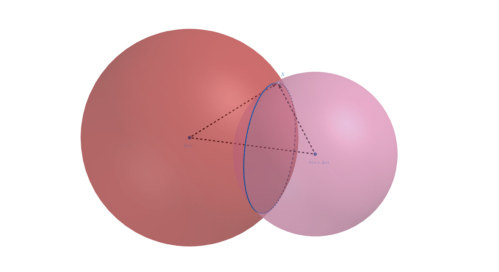

Wird der Grenzübergang $\Delta{u}\to 0$ betrachtet ergibt sich $$
  f_u(x,u)=\lim_{\Delta{u}\to 0}{\frac{f(x,u)-f(x,u+\Delta{u})}{\Delta{u}}}=0 \quad\leadsto\quad
  2\cdot(x-k(u))\cdot \left(-\frac{\mathrm{d}}{\mathrm{d}u}k(u)\right)-2\cdot r(u)\cdot\left(\frac{\mathrm{d}}{\mathrm{d}u}r(u)\right) = 0
$$ d. i. die verschwindende partielle Ableitung der Funktion $f$ nach dem Scharparameter $u$. Zusammen mit der obigen Gleichung $f(x,u)=0$ ergibt sich ein System zur Berechnung von $\Phi$ $$
  f(x,u) = 0\quad\wedge\quad f_u(x,u) = 0
$$ worin die zweite Gleichung eine lineare Gleichung in den Koordinaten von $x=(x_1,x_2,x_3)^\top$ beschreibt - also geometrisch eine Ebene darstellt. In dieser Ebenengleichung bezeichnen

* der aus den Koeffizienten von $x$ gebildete Vektor $$
  n(u)= -\frac{\mathrm{d}}{\mathrm{d}u}k(u)=:-\dot{k}(u)
$$ einen Normalenvektor der Ebene und
* der Ausdruck $$
  2\cdot\left(k(u)\cdot\dot{k}(u)-r(u)\cdot\dot{r}(u)\right)
$$ das Absolutglied.

Die gesuchten Punkte sind demnach im Schnitt der Kugel $\Psi(u)$ mit einer Ebene $\Sigma(u)$ enthalten, die orthogonal zum Richtungsvektor der Leitkurve in $k(u)$ ist. Durch Bilden der Hesseschen Normalform der Ebenengleichung lässt sich der Abstand des Mittelpunktes der Kugel von der Ebene ermitteln $$
  d(u)=\frac{r(u)\cdot \dot{r}(u)}{\Vert\dot{k}(u)\Vert}
$$ Der Radius des Schnittkreises berechnet sich einsichtig unter Verwendung des Kugelradius nach $$
  \tilde{r}(u)=\sqrt{r(u)^2-d^2}=\sqrt{r(u)^2-\left(\frac{r(u)\cdot \dot{r}(u)}{\Vert\dot{k}(u)\Vert}\right)^2}=\frac{r(u)}{\Vert\dot{k}(u)\Vert}\cdot\sqrt{\Vert\dot{k}(u)\Vert^2-\dot{r}(u)^2}
$$ Siehe nachstehende Abbildung.

$. Der Schnittkreis ist geometrischer Ort der Punkte von $\Psi(u)$, die gleichzeitig Punkte von $\Phi$ sind. In der Darstellung ist dieser als Kreissehne projiziert.")

>Die zum Paar aus Leitkurve und Radien $$ u\mapsto (k(u),r(u)) $$ gebildete **Kanalfläche** $\Phi$ ist parametrisierbar als Vereinigung der Kreise $\Psi(u)\cap\Sigma(u)$ $$
  (u,v)\mapsto x(u,v)=k(u)-\frac{r(u)\cdot \dot{r}(u)}{\Vert\dot{k}(u)\Vert^2}\cdot\dot{k}(u)+
  \frac{r(u)}{\Vert\dot{k}(u)\Vert}\cdot\sqrt{\Vert\dot{k}(u)\Vert^2-\dot{r}(u)^2}\cdot(b_1(u)\cdot\cos{v}+b_2(u)\cdot\sin{v})
$$ worin $u\in[a,b]$ den gemeinsamen Parameter der Leitkurve und der Radien bezeichnet und $v\in[0,2\pi)$ zur Parametrisierung der Kreise $\Psi(u)\cap\Sigma(u)$ verwendet wird. Das System $$ \left[\dot{k}(u),b_1(u),b_2(u)\right] $$ stellt eine von $u$ abhängige Orthonormalbasis dar.

> Für $r(u)=r=\mathrm{const.}$ folgt hieraus speziell die Parametrisierung einer **Rohrfläche** $$
  (u,v)\mapsto x(u,v)=k(u)+r\cdot(b_1(u)\cdot\cos{v}+b_2(u)\cdot\sin{v})
$$

**Beispiel 1.** Eine Kugel mit Mittelpunkt $M(1,0,0)$ und Radius $r=1/2$ soll entlang einer Schraublinie um die $z$-Achse eines kartesischen Koordinatensystems stetig geschraubt werden. Die Schraublinie besitzt die Parameterdarstellung $$
  k(u)=\begin{pmatrix} \cos{u} \\ \sin{u} \\ \frac{1}{3}\cdot u \end{pmatrix}\,,\quad u\in[0,2\pi]
$$ Für den Ableitungsvektor gilt $$
  \dot{k}(u)=\begin{pmatrix} -\sin{u} \\ \cos{u} \\ \frac{1}{3} \end{pmatrix}
$$ womit $$
  \left| \dot{k}(u) \right|^2=(-\sin{u})^2+(\cos{u})^2+\frac{1}{9}=\frac{10}{9}\not=0\quad\forall\; u\quad\leadsto\quad \dot{k}(u)\not=o
$$ Aus diesem Vektor lässt sich schrittweise eine Orthonormalbasis konstruieren: $$
  b_1(u)=\begin{pmatrix} \cos{u} \\ \sin{u} \\ 0 \end{pmatrix}\quad\text{mit}\quad b_1(u)\cdot \dot{k}(u)=0\quad\text{und}\quad |b_1(u)|=1
$$ sowie $$
  b_2(u)=\lambda\cdot\dot{k}(u)\times b_1(u)=\lambda\cdot\begin{pmatrix} -\sin{u} \\ \cos{u} \\ \frac{1}{3} \end{pmatrix}\times\begin{pmatrix} \cos{u} \\ \sin{u} \\ 0 \end{pmatrix}=\frac{\lambda}{3}\begin{pmatrix} -\sin{u} \\ \cos{u} \\ -3 \end{pmatrix}
$$ mit dem Parameterwert $$
  |b_2(u)|^2=\frac{\lambda^2}{9}+\lambda^2=\frac{10}{9}\cdot\lambda^2=1\quad\leadsto\quad \lambda=\frac{3}{10}\cdot\sqrt{10}
$$ also $$
  b_2(u)=\frac{\sqrt{10}}{10}\begin{pmatrix} -\sin{u} \\ \cos{u} \\ -3 \end{pmatrix}
$$ Schließlich lässt sich die Parameterdarstellung der hieraus gebildeten Rohrlfläche angeben $$
  x(u,v)=\begin{pmatrix} \cos{u} \\ \sin{u} \\ \frac{1}{3}\cdot u \end{pmatrix}+
  \frac{1}{2}\cdot\left(\begin{pmatrix} \cos{u} \\ \sin{u} \\ 0 \end{pmatrix}\cdot\cos{v}+\frac{\sqrt{10}}{10}\begin{pmatrix} -\sin{u} \\ \cos{u} \\ -3 \end{pmatrix}\cdot\sin{v}\right)
$$

Eine Abbildung der Rohrfläche mithilfe der zuvor erzeugten Parametrisierung lässt sich nachfolgend unter unter Verwendung des Pakets [PyScript](https://github.com/LiaTemplates/PyScript) für LiaScript erzeugen.

``` python @PyScript.env
- matplotlib
- numpy
```

``` python @PyScript.repl
import matplotlib.pyplot as plt
from matplotlib import cm
import numpy as np

fig, ax = plt.subplots(subplot_kw={'projection': '3d'})

# unabhängige Variablen u and v
u = np.linspace(0, 2.0 * np.pi, num=100)
v = np.linspace(0, 2.0 * np.pi, num=100)
U, V = np.meshgrid(u, v)

# Parametrisierung der Rohrfläche
X = np.cos(U) + 0.5 * (np.cos(U) * np.cos(V) + np.sqrt(10)/10 * (-np.sin(U)) * np.sin(V))
Y = np.sin(U) + 0.5 * (np.sin(U) * np.cos(V) + np.sqrt(10)/10 * ( np.cos(U)) * np.sin(V))
Z = 1/3 * U + 0.5 * (0 * np.cos(V) + np.sqrt(10)/10 * ( -3) * np.sin(V))

# Erzeugung der Fläche
surf = ax.plot_surface(X, Y, Z, cmap=cm.twilight)

plt.show()

fig
```

**Bemerkung 1.** Einfache Flächen, die sich wie im vorgestellten Beispiel als Rohr- beziehungsweise Kanalflächen modellieren lassen, sind beispielsweise Drehzylinder- und Drehkegelflächen. Eine begehbare Umsetzung einer Rohrfläche ist der [Krabbelknoten](https://www.tsd.de/ls/mm/dauerausstellung/erlebnisland-mathematik), der im Erlebnisland Mathematik in Dresden ausgestellt ist.

**Beispiel 2.** [Dupinsche Zykliden](https://de.wikipedia.org/wiki/Dupinsche_Zyklide) lassen sich als Hüllflächen von einparametrigen Scharen von Kugeln erzeugen, die zwei vorgegebene Kugeln in stetiger Weise berühren und deren Mittelpunkte in einer Ebene liegen, welche die Verbindungsgerade der Mittelpunkte beider Kugeln enthält. Siehe nachstehende Abbildungen.

 innen beziehungsweise außen berührt werden. Die Mittelpunkte aller solcher Lagen $\Psi$ liegen auf einer Ellipse (strichliert).")

 außen berührt werden. Die Mittelpunkte aller solcher Lagen $\Psi$ liegen auf einer Hyperbel (strichliert).")

Eine Parameterdarstellung einer Dupinschen Zyklide ist nachfolgend angegeben. Mit dieser lassen sich unter unter Verwendung des Pakets [PyScript](https://github.com/LiaTemplates/PyScript) für LiaScript graphische Darstellungen dieser Flächen erzeugen. Die Parameter $a>0$, $b>$ und $d>c$ lassen sich variieren. Untersuchen Sie die Wirkung der Parameter auf die Gestalt der Fläche.

``` python @PyScript.env
- matplotlib
- numpy
```

``` python @PyScript.repl
import matplotlib.pyplot as plt
from matplotlib import cm
import numpy as np

fig, ax = plt.subplots(subplot_kw={'projection': '3d'})

# unabhängige Variablen u and v
u = np.linspace(0, 2.0 * np.pi, num=100)
v = np.linspace(0, 2.0 * np.pi, num=100)
U, V = np.meshgrid(u, v)

# Parametrisierung der Rohrfläche
a = 3
b = 2
c = np.sqrt(a ** 2 - b ** 2)
d = 3
X = 1/(a - c * np.cos(U) * np.cos(V)) * (d * (c - a * np.cos(U) * np.cos(V)) + b ** 2 * np.cos(U))
Y = 1/(a - c * np.cos(U) * np.cos(V)) * (b * np.sin(U) * (a - d * np.cos(V)))
Z = 1/(a - c * np.cos(U) * np.cos(V)) * (b * np.sin(V) * (c * np.cos(U) - d))

# Erzeugung der Fläche
surf = ax.plot_surface(X, Y, Z, cmap=cm.twilight)

plt.show()

fig
```
Das Museum der Zukunft in Dubai hat die Form einer Dupinschen Zyklide.


Sicher gewusst?
=====


Hier können Sie Ihr erworbenes Wissen bei der Beantwortung der folgenden Fragen testen.

**Frage 1.** Anstelle der gesamten Rohrfläche aus Beispiel 1 soll ein "halber Murmellauf" entlang der Schraublinie erzeugt werden. Geben Sie an, welcher der Parameter in der Darstellung abzuändern ist.

[( )] $u\in[0,\pi]$
[(X)] $v\in[0,\pi]$
[( )] $v\in[0,\pi/2]$
[( )] $u\in[0,\pi/2]$
[[?]] Mit dem Parameter $u$ wird die Leitlinie parametrisiert, mit $v$ die gemeinsame Kreislinie benachbarter Kugeln.
****************************************

Für den gesamten Kreis ist $v\in[0,2\pi]$ zu wählen, für den halben Kreis $v\in[0,\pi]$. Die vorletzte Antwortoption erzeugt nur einen Viertelkreisbogen. [[?]] Mit dem Parameter $u$ wird die Leitlinie parametrisiert.

****************************************
